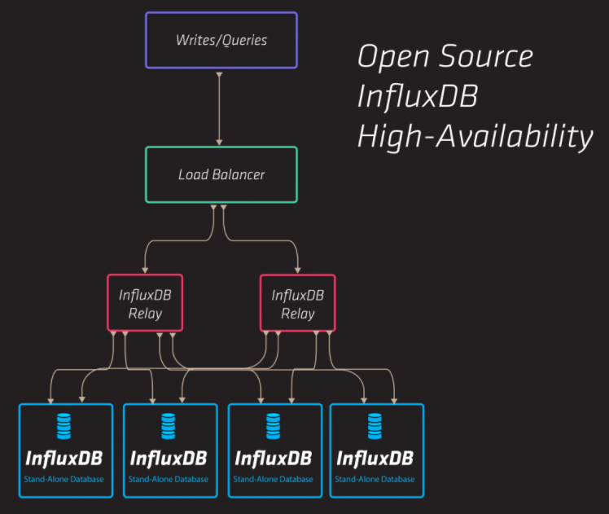

.. _HA_InfluxDB_as_an_external_strorage_for_Prometheus:

**************************************************
HA InfluxDB as an external storage for Prometheus
**************************************************

:Abstract:

  This document describes a way to provide high-available InfluxDB storage
  based on Influx-relay and Nginx.

Prometheus storage issue and solutions
======================================

`Prometheus`_ native storage was designed only for short period data and needs
to be shortened in order to stay responsible and operational. For us to store
persistent data for longer periods the 'external storage' mechanism was
used. In this mode Prometheus duplicating its own data to external storage,
only external writes are available. Several options were possible but we
chose InfluxDB high-available solution. InfluxDB is a reliable and robust
storage with many features. Also, it's perfect in supplying monitoring data to
`Grafana`_ dashboard.

.. table:: Monitoring software version

  +-------------+--------------------+
  |Software     |Version             |
  +-------------+--------------------+
  |Prometheus   | 1.4.0              |
  +-------------+--------------------+
  |Grafana      | 4.0.1              |
  +-------------+--------------------+

InfluxDB installation overview
==============================

During our deployment we were following `Influx-Relay Offical Documentation`_.
The installation comprises three nodes:
 - first and second are InfluxDB instances with running Influx-relay daemon
 - third is a load-balancer node with running Nginx

Influx-Relay working scheme taken from InfluxDB web site describes 5-nodes
installation (four InfluxDB instances + Loadbalancer node), but three nodes
were sufficient for our working load.

Ubuntu Xenial were used on each node. See software version table below:

.. table::

  +--------------------+-----------------------------------------+
  |Software            |Version                                  |
  +--------------------+-----------------------------------------+
  |Ubuntu              |Ubuntu 16.04.1 LTS                       |
  +--------------------+-----------------------------------------+
  |Kernel              |4.4.0-47-generic                         |
  +--------------------+-----------------------------------------+
  |`InfluxDB`_         |1.2.0-17                                 |
  +--------------------+-----------------------------------------+
  |`Influx-Relay`_     |adaa2ea7bf97af592884fcfa57df1a2a77adb571 |
  +--------------------+-----------------------------------------+
  |`Nginx`_            |nginx/1.10.0 (Ubuntu)                    |
  +--------------------+-----------------------------------------+

In order to deploy InfluxDB HA deployment `InfluxdbHA deployment script`_
was used.

InfluxDB HA mechanism realization
=================================

Native HA mechanisms were moved away from InfluxDB (since version 1.x.x) and
now provided only as an enterprise option. Open-source third-party software
Influx-relay is considered as one of the available substitutions for previous
native replication mechanisms.

Influx-Relay
------------

Influx-relay is written in Golang and its operation boils down to
proxying incoming write queries to multiple destinations (InfluxDB
instances).
Influx-Relay runs on every InfluxDB node, thus any writes requests coming
to any InfluxDB instance are mirrored across all other nodes.
Influx-Relay is light and robust and it doesn't consume much of the system
resources.
See Influx-Relay configuration in the `Influx-Relay configuration`_ section.

Nginx
-----

Nginx daemon runs on a separate node and acts as load-balancer (upstream proxy mode).
It redirects '/query' queries directly to an each InfluxDB instance and '/write' queries
to an each Influx-relay daemon. Round-robin algorithm is scheduled for both query and write.
This way, incoming reads and writes are balanced equally across the whole InfluxDB cluster.
See Nginx configuration in the `Nginx configuration`_ section.

InfluxDB Monitoring
===================

InfluxDB HA installation was tested with Prometheus that polls 200-nodes environment
and generates huge data flows towards its external storage. In order to test InfluxDB
performance '_internal' database counters were used and visualized with the help of
Grafana. We figured out that 3-nodes InfluxDB HA installation can handle 200-nodes
Prometheus load and total performance doesn't degrade.
Grafana dashboards for InfluxDB monitoring can be found at `Grafana InfluxDB dashboard`_
section.

InfluxDB HA performance data
============================

InfluxDB database performance data
----------------------------------

These graphs were built with Grafana based on the metrics that are natively stored
inside the InfluxDB '_internal' database. To create the visualization we used
`Grafana InfluxDB dashboard`_.

+---------------------------------------+----------------------------------------+
|InfluxDB node1 database performance    |InfluxDB node2 database performance     |
|                                       |                                        |
+=======================================+========================================+
|.. image:: images/db/1_heap_usage.png  |.. image:: images/db/2_heap_usage.png   |
|   :alt: heap_usage(gb)                |   :alt: heap_usage(gb)                 |
|   :scale: 32                          |   :scale: 32                           |
+---------------------------------------+----------------------------------------+
|.. image:: images/db/1_point_intake.png|.. image:: images/db/2_point_intake.png |
|   :alt: point_intake(ops/sec)         |   :alt: point_intake(ops/sec)          |
|   :scale: 32                          |   :scale: 32                           |
+---------------------------------------+----------------------------------------+
|.. image:: images/db/1_http_errors.png |.. image:: images/db/2_http_errors.png  |
|   :alt: http_errors((ops/sec)         |   :alt: http_errors((ops/sec)          |
|   :scale: 32                          |   :scale: 32                           |
+---------------------------------------+----------------------------------------+

OS performance data
-------------------

Operation System performance metrics were gathered using Telegraf agent
that was started on each cluster node with appropriate plugins. See the `Telegraf system`_
configuration file from `Containerized Openstack Monitoring`_ documentation.

InfluxDB node1 OS performance
^^^^^^^^^^^^^^^^^^^^^^^^^^^^^

+-----------------------------------------------------------------------------------------+
|.. image:: images/sys/node1/la.png          |.. image:: images/sys/node1/mem_free.png    |
|   :alt: load_average(%)                    |   :alt: mem_free(GB)                       |
|   :scale: 32                               |   :scale: 32                               |
+--------------------------------------------+--------------------------------------------+
|.. image:: images/sys/node1/cpu_user.png    |.. image:: images/sys/node1/mem_used.png    |
|   :alt: cpu_user(%)                        |   :alt: mem_used(GB)                       |
|   :scale: 32                               |   :scale: 32                               |
+--------------------------------------------+--------------------------------------------+
|.. image:: images/sys/node1/cpu_system.png  |.. image:: images/sys/node1/disk_rate.png   |
|   :alt: cpu_system(%)                      |   :alt: disk_rate(MBps)                    |
|   :scale: 32                               |   :scale: 32                               |
+--------------------------------------------+--------------------------------------------+
|.. image:: images/sys/node1/cpu_idle.png    |.. image:: images/sys/node1/network_load.png|
|   :alt: cpu_idle(%)                        |   :alt: network_load(Mbps)                 |
|   :scale: 32                               |   :scale: 32                               |
+--------------------------------------------+--------------------------------------------+

InfluxDB node2 OS performance
^^^^^^^^^^^^^^^^^^^^^^^^^^^^^

+-----------------------------------------------------------------------------------------+
|.. image:: images/sys/node2/la.png          |.. image:: images/sys/node2/mem_free.png    |
|   :alt: load_average(%)                    |   :alt: mem_free(GB)                       |
|   :scale: 32                               |   :scale: 32                               |
+--------------------------------------------+--------------------------------------------+
|.. image:: images/sys/node2/cpu_user.png    |.. image:: images/sys/node2/mem_used.png    |
|   :alt: cpu_user(%)                        |   :alt: mem_used(GB)                       |
|   :scale: 32                               |   :scale: 32                               |
+--------------------------------------------+--------------------------------------------+
|.. image:: images/sys/node2/cpu_system.png  |.. image:: images/sys/node2/disk_rate.png   |
|   :alt: cpu_system(%)                      |   :alt: disk_rate(MBps)                    |
|   :scale: 32                               |   :scale: 32                               |
+--------------------------------------------+--------------------------------------------+
|.. image:: images/sys/node2/cpu_idle.png    |.. image:: images/sys/node2/network_load.png|
|   :alt: cpu_idle(%)                        |   :alt: network_load(Mbps)                 |
|   :scale: 32                               |   :scale: 32                               |
+--------------------------------------------+--------------------------------------------+

Load-balancer node OS performance
^^^^^^^^^^^^^^^^^^^^^^^^^^^^^^^^^

+------------------------------------------------------------------------------------+
|.. image:: images/sys/lb/la.png        |.. image:: images/sys/lb/mem_free.png       |
|   :alt: load_average(%)               |   :alt: mem_free(GB)                       |
|   :scale: 32                          |   :scale: 32                               |
+---------------------------------------+--------------------------------------------+
|.. image:: images/sys/lb/cpu_user.png  |.. image:: images/sys/lb/mem_used.png       |
|   :alt: cpu_user(%)                   |   :alt: mem_used(GB)                       |
|   :scale: 32                          |   :scale: 32                               |
+---------------------------------------+--------------------------------------------+
|.. image:: images/sys/lb/cpu_system.png|.. image:: images/sys/lb/disk_rate.png      |
|   :alt: cpu_system(%)                 |   :alt: disk_rate(MBps)                    |
|   :scale: 32                          |   :scale: 32                               |
+---------------------------------------+--------------------------------------------+
|.. image:: images/sys/lb/cpu_idle.png  |.. image:: images/sys/lb/network_load.png   |
|   :alt: cpu_idle(%)                   |   :alt: network_load(Mbps)                 |
|   :scale: 32                          |   :scale: 32                               |
+---------------------------------------+--------------------------------------------+

How to deploy
=============

 - Prepare three Ubuntu Xenial nodes with working network and Internet access
 - Temporarily allow ssh access for root user
 - Untar influx_ha_deployment.tar
 - Set appropriate SSH_PASSWORD variable in the influx_ha/deploy_influx_ha.sh
 - Start deployment script preceding it with node ip variables, e.g.

.. code:: bash

  INFLUX1=172.20.9.29 INFLUX2=172.20.9.19 BALANCER=172.20.9.27 bash -xe influx_ha/deploy_influx_ha.sh

Applications
============

InfluxdbHA deployment script
----------------------------

.. literalinclude:: influx_ha/deploy_influx_ha.sh
    :language: bash

Configuration tarball (for deployment script)
^^^^^^^^^^^^^^^^^^^^^^^^^^^^^^^^^^^^^^^^^^^^^

:download:`influx_ha_deployment.tar <influx_ha/influx_ha_deployment.tar>`

InfluxDB configuration
----------------------

.. literalinclude:: influx_ha/conf/influxdb.conf
    :language: bash

Influx-Relay configuration
--------------------------

first instance
^^^^^^^^^^^^^^

.. literalinclude:: influx_ha/conf/relay_1.toml
    :language: bash

second instance
^^^^^^^^^^^^^^^

.. literalinclude:: influx_ha/conf/relay_2.toml
    :language: bash

Nginx configuration
-------------------

.. literalinclude:: influx_ha/conf/influx-loadbalancer.conf
    :language: bash

Grafana InfluxDB dashboard
-------------------------

:download:`InfluxDB_Dashboard.json <influx_ha/InfluxDB_Dashboard.json>`

.. references:

.. _Prometheus: https://prometheus.io/
.. _Grafana: http://grafana.org/
.. _InfluxDB: https://www.influxdata.com/open-source/#influxdb
.. _Influx-Relay Offical Documentation: https://github.com/influxdata/influxdb-relay/blob/master/README.md
.. _Influx-Relay: https://github.com/influxdata/influxdb-relay
.. _Nginx: https://www.nginx.com/
.. _Telegraf system: https://docs.openstack.org/developer/performance-docs/methodologies/monitoring/index.html#telegraf-sys-conf
.. _Containerized Openstack Monitoring: https://docs.openstack.org/developer/performance-docs/methodologies/monitoring/index.html

