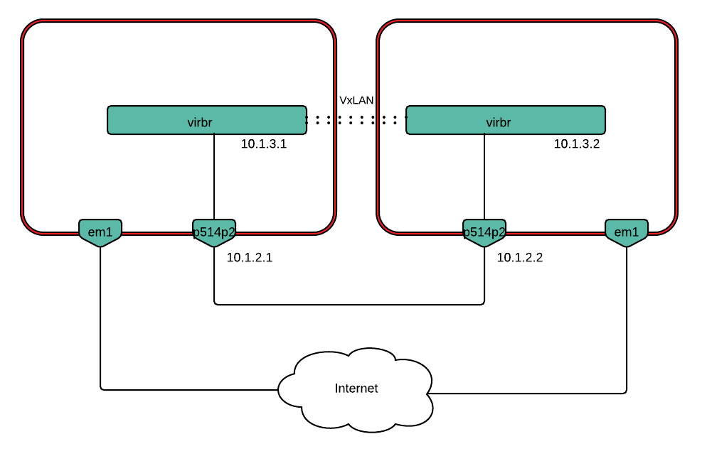
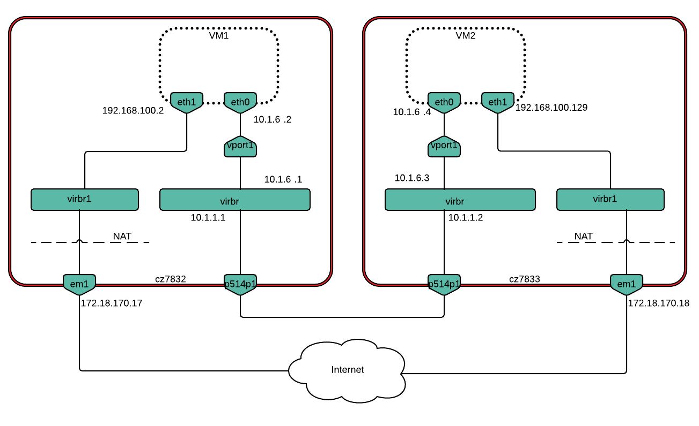
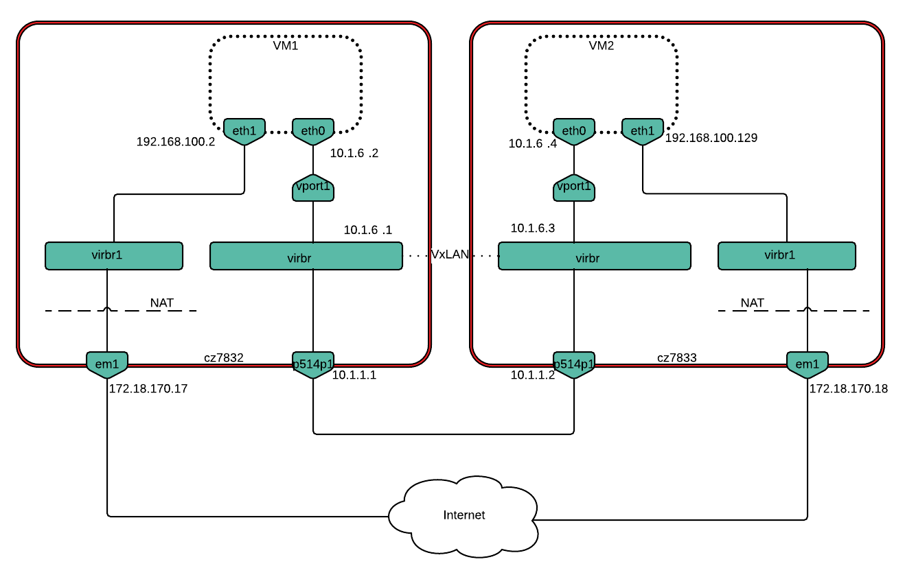

.. _hardware_offloads_performance_analysis:

====================================================
Hardware Offloads - Comparative performance analysis
====================================================

:status: **ready**
:version: 1.0

:Abstract:

    The aim of this document is to present scenarios for a comparative
    performance analysis of various hardware offloads. We examine differences
    in throughput as well as the effect on CPU utilization when these hardware
    offloads are enabled.

    The end goal is to provide documentation that a deployer of OpenStack
    can use to answer a number of common questions when constructing their
    environments:

    -  Enabling which hardware offloads will give me the biggest "bang for
       the buck" when it comes to increased network throughput?

    -  What impact on CPU utilization does disabling certain hardware
       offloads have?

:Conventions:

  - **VxLAN:** Virtual eXtensible LAN

  - **NIC:** Network Interface Card

  - **TX:** Transmit (packets transmitted out the interface)

  - **RX:** Receive (packets received on the interface)

  - **TSO:** TCP Segmentation Offload

  - **GRO:** Generic Receive Offload

  - **GSO:** Generic Segmentation Offload

  - **MTU:** Maximum Transmission Unit

  - **OVS:** Open vSwitch

Test Plan
=========

The following hardware offloads were examined in this performance
comparison:

-  Tx checksumming

-  TCP segmentation offload (TSO)

-  Generic segmentation offload (GSO)

-  Tx UDP tunneling segmentation

-  Rx checksumming

-  Generic receive offload (GRO)

The performance analysis is based on the results of running test
scenarios in a lab consisting of two hardware nodes.

-  Scenario #1: Baseline physical

-  Scenario #2: Baseline physical over VxLAN tunnel

-  Scenario #3: VM-to-VM on different hardware nodes

-  Scenario #4: VM-to-VM on different nodes over VxLAN tunnel

For each of the above scenarios, we used `netperf` to measure the network
throughput and the `sar` utility to measure CPU usage.

One node was used as the transmitter and the other node served as a
receiver and had a `netserver` daemon running on it.

Performance validation involved running both TCP and UDP stream tests
with all offloads on and then turning each one of the offloads off, one
by one.

For the transmit side the following offloads were triggered:

-  TSO

-  Tx checksumming

-  GSO (no VxLAN tunneling)

-  Tx-udp\_tnl-segmentation (VxLAN tunneling only)

For the receive side:

-  GRO

-  Rx checksumming

Base physical tests involved turning offloads on and off for the `p514p2`
physical interface on both transmitter and receiver.

Some hardware offloads require certain other offloads to be enabled or
disabled in order to make any effect. For example, TSO can not be
enabled without Tx checksumming being turned on while GSO only kicks in
when TSO is disabled. Due to that the following order of turning off
offloads was chosen for the tests:

+-------------------+--------------------------------+--------------------------------+--------------------------------+------------------------------------+
| **Transmitter**   | All on                         | TSO off                        | Tx checksumming off            | GSO/tx-udp\_tnl-segmentation off   |
+===================+================================+================================+================================+====================================+
| Active offloads   | TSO,                           | tx checksumming,               | GSO/tx-udp\_tnl-segmentation   | All off                            |
|                   |                                |                                |                                |                                    |
|                   | tx checksumming                | GSO/tx-udp\_tnl-segmentation   |                                |                                    |
+-------------------+--------------------------------+--------------------------------+--------------------------------+------------------------------------+
| Offloads on       | TSO,                           | tx checksumming,               | GSO/tx-udp\_tnl-segmentation   | All off                            |
|                   |                                |                                |                                |                                    |
|                   | tx checksumming,               | GSO/tx-udp\_tnl-segmentation   |                                |                                    |
|                   |                                |                                |                                |                                    |
|                   | GSO/tx-udp\_tnl-segmentation   |                                |                                |                                    |
+-------------------+--------------------------------+--------------------------------+--------------------------------+------------------------------------+

+-------------------+-------------------+-------------------+-----------------------+
| **Receiver**      | All on            | GRO off           | Rx checksumming off   |
+===================+===================+===================+=======================+
| Active offloads   | GRO,              | Rx checksumming   | All off               |
|                   |                   |                   |                       |
|                   | Rx checksumming   |                   |                       |
+-------------------+-------------------+-------------------+-----------------------+
| Offloads on       | GRO,              | Rx checksumming   | All off               |
|                   |                   |                   |                       |
|                   | Rx checksumming   |                   |                       |
+-------------------+-------------------+-------------------+-----------------------+

Test Environment
----------------

Preparation
^^^^^^^^^^^

Baseline physical host setup
++++++++++++++++++++++++++++

We force the physical device to use only one queue. This allows us to
obtain consistent results between test runs as we can avoid the
possibility of RSS assigning the flows to a different queue, and as a
result a different CPU core:

``$ sudo ethtool -L p514p2 combined 1``

where `p514p2` is the physical interface name.

Pin that queue to CPU0 either using `set\_irq\_affinity` script or by
running

``$ sudo echo 1 > /proc/irq/<irq_num>/smp_affinity``

This guarantees that all interrupts related to the `p514p2` interface are
processed on a designated CPU (CPU0 in our case) which allows to isolate
the tests.

At the same time, any traffic generators, like `netperf`, were manually
made to use CPU1 using `taskset`.

``$ sudo taskset -c 1 netperf -H <peer_ip> -cC [-t UDP_STREAM]``

Next, it is important to prevent CPUs from switching frequencies and
power states (or C-states) as this can affect CPU utilization and thus
affect test results.

Make the processors keep the C0 C-state by writing 0 to
`/dev/cpu\_dma\_latency` file. This will prevent any other C-states with
from being used, as long as the file `/dev/cpu\_dma\_latency` is kept
open. It can be easily done with `this helper
program <https://github.com/gtcasl/hpc-benchmarks/blob/master/setcpulatency.c>`__:

``$ make setcpulatency``

``$ sudo ./setcpulatency 0 &``

We made the CPUs run at max frequency by choosing the `“performance”`
scaling governor:

.. code-block:: bash

    $ echo "performance" | sudo tee
    /sys/devices/system/cpu/cpu*/cpufreq/scaling_governor

In order to set up a VxLAN tunnel, an OVS bridge (`virbr`) was created:

``$ sudo ovs-vsctl add-br virbr``

Next, we created a VxLAN port, specifying the corresponding remote ip:

.. code-block:: bash

    $ sudo ovs-vsctl add-port virbr vxlan -- set interface vxlan type=vxlan
    options:remote_ip=10.1.2.2 options:local_ip=10.1.2.1

VM-to-VM on different nodes setup
+++++++++++++++++++++++++++++++++

Scenarios 3 and 4 assess the performance impact of hardware offloads in
a deployment with two VMs running on separate hardware nodes. The
scenarios measure VM-to-VM TCP/UDP traffic throughput, with and without
VxLAN encapsulation.

In order to get more accurate CPU consumption metrics, the CPUs on which
VMs would be running should be isolated from the kernel scheduler. This
prevents any other processes from running on those CPUs. In this
installation, half of the CPUs are isolated by adding the following to
the end of the ``/etc/default/grub`` file:

``GRUB_CMDLINE_LINUX=”$GRUB_CMDLINE_LINUX isolcpus=6-11”``

These settings were applied and the nodes rebooted:

``$ sudo update-grub``

``$ sudo reboot``

libvirt was installed and the default storage pool appropriately
configured:

``$ sudo apt-get install qemu-kvm libvirt-bin virtinst virt-manager``

``$ sudo virsh -c qemu:///system pool-define-as store dir --target /home/elena/store``

``$ sudo virsh -c qemu:///system pool-autostart store``

``$ sudo virsh -c qemu:///system pool-start store``

An OVS bridge (`virbr`) was created next:

``$ sudo ovs-vsctl add-br virbr``

Then, we added physical interface `p514p1` as a port to `virbr` and cleaned
all IP addresses from it:

``$ sudo ovs-vsctl add-port virbr p514p1``

``$ sudo ifconfig p514p1 0``

An IP address from the same subnet as the VMs was then added to `virbr`.
In this case 10.1.6.0/24 was the subnet used for VM-to-VM communication.

``$ sudo ip addr add 10.1.6.1/24 dev virbr``

From that point, virbr had two IP addresses: 10.1.1.1 and 10.1.6.1
(10.1.1.2 and 10.1.6.3 on Host 2). Finally, we created a tap port vport1
that will be used to connect the VM to `virbr`:

``$ sudo ip tuntap add mode tap vport1``

``$ sudo ovs-vsctl add-port virbr vport1``

**Guest setup**

In scenarios 3 and 4, an Ubuntu Trusty cloud image is being used. The
VMs were defined from an XML domain file. Each VM was pinned to a pair
of CPUs that were isolated from the kernel scheduler in the following
way in the `libvirt.xml` files:

.. code-block:: xml

    <vcpu placement='static' cpuset='7-8'>2</vcpu>
    <cputune>
        <vcpupin vcpu='0' cpuset='7'/>
        <vcpupin vcpu='1' cpuset='8'/>
    </cputune>

Each VM has two interfaces: `eth0` connects through a tap device (`vport1`)
to an OVS bridge (`virbr`) from which there is a link to another host,
`eth1` is connected to em1 through a virtual network (with a NAT) which
allows VM to access the Internet. Interface configuration was done as
follows:

.. code-block:: xml

    <interface type='bridge'>
        <source bridge='virbr'/>
        <virtualport type='openvswitch'/>
        <target dev='vport1'/>
        <model type='virtio'/>
        <alias name='net0'/>
    </interface>
    <interface type='network'>
        <source network='net1'/>
        <target dev='vnet0'/>
        <model type='rtl8139'/>
        <alias name='net1'/>
    </interface>

Interface configuration for VM1 was done in the following way:

/etc/network/interfaces.d/eth0.cfg

.. code-block:: bash

    # The primary network interface

    auto eth0
    iface eth0 inet static
    address 10.1.6.2
    netmask 255.255.255.0
    network 10.1.6.0
    nexthop 10.1.6.1
    broadscast 10.1.6.255

/etc/network/interfaces.d/eth1.cfg

.. code-block:: bash

    auto eth1
    iface eth1 inet static
    address 192.168.100.2
    netmask 255.255.255.0
    network 192.168.100.0
    gateway 192.168.100.1
    broadscast 192.168.100.255
    dns-nameservers 8.8.8.8 8.8.4.4

And on VM2:

/etc/network/interfaces.d/eth0.cfg

.. code-block:: bash

    # The primary network interface

    auto eth0
    iface eth0 inet static
    address 10.1.6.4
    netmask 255.255.255.0
    network 10.1.6.0
    nexthop 10.1.6.3
    broadscast 10.1.6.255

/etc/network/interfaces.d/eth1.cfg

.. code-block:: bash

    auto eth1
    iface eth1 inet static
    address 192.168.100.129
    netmask 255.255.255.0
    network 192.168.100.0
    gateway 192.168.100.1
    broadscast 192.168.100.255
    dns-nameservers 8.8.8.8 8.8.4.4

For scenario 4, the `p514p1` port was removed from `virbr` and its IP
address restored:

``$ sudo ovs-vsctl del-port virbr p514p1``

``$ sudo ip addr add 10.1.1.1/24 dev p514p1``

For setting up a VxLAN tunnel we added a `vxlan` type port to the `virbr`
bridge:

# Host1

.. code-block:: bash

    $ sudo ovs-vsctl add-port virbr vxlan1 -- set interface vxlan1
    type=vxlan options:remote_ip=10.1.1.2 options:local_ip=10.1.1.1

# Host2

.. code-block:: bash

    $ sudo ovs-vsctl add-port virbr vxlan1 -- set interface vxlan1
    type=vxlan options:remote_ip=10.1.1.1 options:local_ip=10.1.1.2

Environment description
^^^^^^^^^^^^^^^^^^^^^^^

Hardware
++++++++

The environment consists of two hardware nodes with the following
configuration:

.. table::

    +-------------+-------+-----------------------------------------------------------------------------------------------------------------------+
    | Parameter   | Value | Comments                                                                                                              |
    +-------------+-------+-----------------------------------------------------------------------------------------------------------------------+
    | Server      |       | Supermicro SYS-5018R-WR, 1U, 1xCPU, 4/6 FAN, 4x 3,5" SAS/SATA Hotswap, 2x PS                                          |
    +-------------+-------+-----------------------------------------------------------------------------------------------------------------------+
    | Motherboard |       | Supermicro X10SRW-F, 1xCPU(LGA 2011), Intel C612, 8xDIMM Up To 512GB RAM, 10xSATA3, IPMI, 2xGbE LAN,,sn: NM15BS004776 |
    +-------------+-------+-----------------------------------------------------------------------------------------------------------------------+
    | CPU         |       | Intel Xeon E5-2620v3, 2.4GHz, Socket 2011, 15MB Cache, 6 core, 85W                                                    |
    +-------------+-------+-----------------------------------------------------------------------------------------------------------------------+
    | RAM         |       | 4x 16GB Samsung M393A2G40DB0-CPB DDR-IV PC4-2133P ECC Reg. CL13                                                       |
    +-------------+-------+-----------------------------------------------------------------------------------------------------------------------+
    | Storage     |       | HDD: 2x 1TB Seagate Constellation ES.3, ST1000NM0033, SATA,6.0Gb/s,7200 RPM,128MB Cache, 3.5”                         |
    +-------------+-------+-----------------------------------------------------------------------------------------------------------------------+
    | NIC         |       | AOC-STG-i4S, PCI Express 3.0, STD 4-port 10 Gigabit Ethernet SFP+ (`Intel XL710 controller`_)                         |
    +-------------+-------+-----------------------------------------------------------------------------------------------------------------------+

Software
++++++++

This section describes installed software.

+--------------+-------+------------------+
| Parameter    | Value | Comment          |
+--------------+-------+------------------+
| OS           |       | Ubuntu 14.04     |
+--------------+-------+------------------+
| Kernel       |       | 4.2.0-27-generic |
+--------------+-------+------------------+
| QEMU         |       | 2.0.0            |
+--------------+-------+------------------+
| Libvirt      |       | 1.2.2            |
+--------------+-------+------------------+
| Open vSwitch |       | 2.0.2            |
+--------------+-------+------------------+
| Netperf      |       | 2.7.0            |
+--------------+-------+------------------+

Test Case 1: Baseline physical scenario
---------------------------------------

Description
^^^^^^^^^^^

This test measures network performance with hardware offloads on/off for two
hardware nodes when sending non-encapsulated traffic.

List of performance metrics
^^^^^^^^^^^^^^^^^^^^^^^^^^^

========  ===============  =================  =====================================================
Priority  Value            Measurement Units  Description
========  ===============  =================  =====================================================
1         TCP throughput   10^6 bits/sec      Average throughput for TCP traffic
1         UDP throughput   10^6 bits/sec      Average throughput for UDP traffic
1         CPU consumption  %                  Average utilization of CPU used for packet processing
========  ===============  =================  =====================================================

Test Case 2: Baseline physical over VxLAN scenario
--------------------------------------------------

Description
^^^^^^^^^^^

This test measures network performance with hardware offloads on/off for two
hardware nodes when sending VxLAN-encapsulated traffic.

List of performance metrics
^^^^^^^^^^^^^^^^^^^^^^^^^^^

========  ===============  =================  =====================================================
Priority  Value            Measurement Units  Description
========  ===============  =================  =====================================================
1         TCP throughput   10^6 bits/sec      Average throughput for TCP traffic
1         UDP throughput   10^6 bits/sec      Average throughput for UDP traffic
1         CPU consumption  %                  Average utilization of CPU used for packet processing
========  ===============  =================  =====================================================

Test Case 3: VM-to-VM on different nodes scenario
-------------------------------------------------

Description
^^^^^^^^^^^

This test assesses the performance impact of hardware offloads in
a deployment with two VMs running on separate hardware nodes. The
scenarios measure VM-to-VM TCP/UDP traffic throughput as well as host
CPU consumption.

List of performance metrics
^^^^^^^^^^^^^^^^^^^^^^^^^^^

========  ===============  =================  =====================================================
Priority  Value            Measurement Units  Description
========  ===============  =================  =====================================================
1         TCP throughput   10^6 bits/sec      Average throughput for TCP traffic
1         UDP throughput   10^6 bits/sec      Average throughput for UDP traffic
1         CPU consumption  %                  Average utilization of CPU used for packet processing
========  ===============  =================  =====================================================

Test Case 4: VM-to-VM on different nodes over VxLAN scenario
------------------------------------------------------------

Description
^^^^^^^^^^^

This test assesses the performance impact of hardware offloads in
a deployment with two VMs running on separate hardware nodes. The
scenarios measure VM-to-VM TCP/UDP traffic throughput as well as host
CPU consumption in case VxLAN encapsulation is used.

List of performance metrics
^^^^^^^^^^^^^^^^^^^^^^^^^^^

========  ===============  =================  =====================================================
Priority  Value            Measurement Units  Description
========  ===============  =================  =====================================================
1         TCP throughput   10^6 bits/sec      Average throughput for TCP traffic
1         UDP throughput   10^6 bits/sec      Average throughput for UDP traffic
1         CPU consumption  %                  Average utilization of CPU used for packet processing
========  ===============  =================  =====================================================

.. _Intel XL710 controller: http://www.intel.com/content/www/us/en/embedded/products/networking/xl710-10-40-gbe-controller-brief.html

Reports
=======

Test plan execution reports:
 * :ref:`hw_features_offloads`
