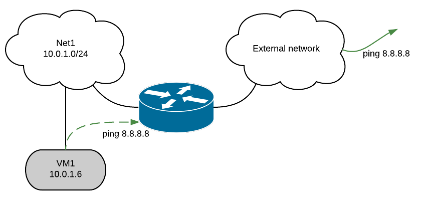
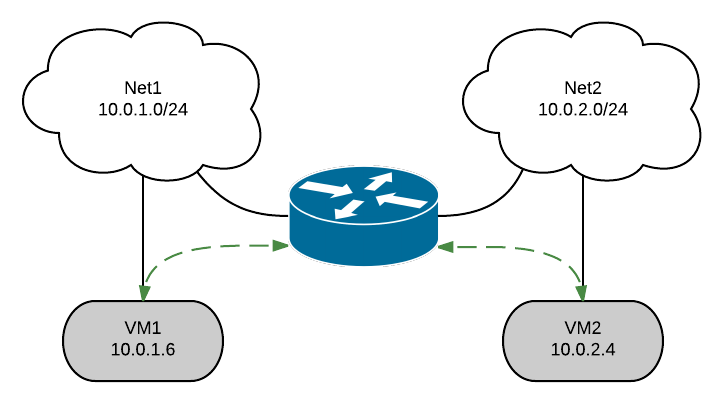

.. _neutron_l3_ha_test_plan:

=================================
OpenStack Neutron L3 HA Test Plan
=================================

:status: **draft**
:version: 1.0

:Abstract:

    We are able to spawn many L3 agents, however each L3 agent is a SPOF.
    If an L3 agent fails, all virtual routers scheduled to this agent will be lost,
    and consequently all VMs connected to these virtual routers will be isolated
    from external networks and possibly from other tenant networks.

    The main purpose of L3 HA is to address this issue by adding a new type of
    router (HA router), which will be spawned twice on two different agents.
    One agent will be in charge of the master version of this router, and another
    l3 agent will be in charge of the slave router.

    L3 HA functionality in Neutron was implemented in Juno, however detailed
    testing on scale for it was not performed. The purpose of this document is to
    describe the scenarios for its testing.

    .. image:: L3HA.png
        :width: 650px

:Conventions:

    - **VRRP** - Virtual Router Redundancy Protocol
    - **Keepalived** - Routing software based on VRRP protocol
    - **Rally** - Benchmarking tool for OpenStack
    - **Shaker** - Data plane performance testing tool
    - **iperf** - Commonly-used network testing tool

Test Plan
=========

The purpose of this section is to describe scenarios for testing L3 HA.
The most important aspect is the number of packets that will be lost during
restart of the L3 agent or controller as a whole. The second aspect is the
number of routers that can move from one agent to another without
it falling into unmanaged state.

Test Environment
----------------

Preparation
^^^^^^^^^^^

This test plan is performed against existing OpenStack cloud.

Environment description
^^^^^^^^^^^^^^^^^^^^^^^

The environment description includes hardware specification of servers,
network parameters, operation system and OpenStack deployment characteristics.

Hardware
~~~~~~~~

This section contains list of all types of hardware nodes.

+-----------+-------+----------------------------------------------------+
| Parameter | Value | Comments                                           |
+-----------+-------+----------------------------------------------------+
| model     |       | e.g. Supermicro X9SRD-F                            |
+-----------+-------+----------------------------------------------------+
| CPU       |       | e.g. 6 x Intel(R) Xeon(R) CPU E5-2620 v2 @ 2.10GHz |
+-----------+-------+----------------------------------------------------+
| role      |       | e.g. compute or network                            |
+-----------+-------+----------------------------------------------------+

Network
~~~~~~~

This section contains list of interfaces and network parameters.
For complicated cases this section may include topology diagram and switch
parameters.

+------------------+-------+-------------------------+
| Parameter        | Value | Comments                |
+------------------+-------+-------------------------+
| network role     |       | e.g. provider or public |
+------------------+-------+-------------------------+
| card model       |       | e.g. Intel              |
+------------------+-------+-------------------------+
| driver           |       | e.g. ixgbe              |
+------------------+-------+-------------------------+
| speed            |       | e.g. 10G or 1G          |
+------------------+-------+-------------------------+
| MTU              |       | e.g. 9000               |
+------------------+-------+-------------------------+
| offloading modes |       | e.g. default            |
+------------------+-------+-------------------------+

Software
~~~~~~~~

This section describes installed software.

+-----------------+-------+---------------------------+
| Parameter       | Value | Comments                  |
+-----------------+-------+---------------------------+
| OS              |       | e.g. Ubuntu 14.04.3       |
+-----------------+-------+---------------------------+
| OpenStack       |       | e.g. Liberty              |
+-----------------+-------+---------------------------+
| Hypervisor      |       | e.g. KVM                  |
+-----------------+-------+---------------------------+
| Neutron plugin  |       | e.g. ML2 + OVS            |
+-----------------+-------+---------------------------+
| L2 segmentation |       | e.g. VLAN or VxLAN or GRE |
+-----------------+-------+---------------------------+
| virtual routers |       | HA                        |
+-----------------+-------+---------------------------+

Test Case 1: Comparative analysis of metrics with and without L3 agents restart
-------------------------------------------------------------------------------

Description
^^^^^^^^^^^

`Shaker <http://pyshaker.readthedocs.org/en/latest/index.html>`__ is
able to deploy OpenStack instances and networks in different topologies.
For L3 HA, the most important scenarios are those that check connection
between VMs in different networks (`L3 east-west
<http://pyshaker.readthedocs.org/en/latest/examples/full_l3_east_west.html>`__)
and connection via floating ip (`L3 north-south
<http://pyshaker.readthedocs.org/en/latest/examples/full_l3_north_south.html>`__).

The following tests should be executed:

1. OpenStack L3 East-West

   -  This scenario launches pairs of VMs in different networks
      connected to one router (L3 east-west)

2. OpenStack L3 East-West Performance

   -  This scenario launches 1 pair of VMs in different networks
      connected to one router (L3 east-west). VMs are hosted on
      different compute nodes.

3. OpenStack L3 North-South

   -  This scenario launches pairs of VMs on different compute nodes.
      VMs are in the different networks connected via different
      routers, master accesses slave by floating ip.

4. OpenStack L3 North-South UDP

5. OpenStack L3 North-South Performance

6. OpenStack L3 North-South Dense

   -  This scenario launches pairs of VMs on one compute node. VMs are
      in the different networks connected via different routers,
      master accesses slave by floating ip.

For scenarios 1,2,3 and 6, results were also collected for L3 agent restart
with L3 HA option disabled and standard router rescheduling enabled.

While running shaker tests, scripts restart.sh and restart_not_ha.sh were executed.

List of performance metrics
^^^^^^^^^^^^^^^^^^^^^^^^^^^
.. table:: Shaker metrics
========  ===============  =================  ======================================
Priority  Value            Measurement Units  Description
========  ===============  =================  ======================================
1         Latency          ms                 The network latency
1         TCP bandwidth    Mbits/s            TCP network bandwidth
2         UDP bandwidth    packets per sec    Number of UDP packets of 32 bytes size
2         TCP retransmits  packets per sec    Number of retransmitted TCP packets
========  ===============  =================  ======================================

Test Case 2: Rally tests execution
----------------------------------

Description
^^^^^^^^^^^
Rally allows to check the ability of OpenStack to perform simple operations
like create-delete, create-update, etc on scale.

L3 HA has a restriction of 255 routers per HA network per tenant. At this moment
we do not have the ability to create new HA network per tenant if the number of
VIPs exceed this limit. Based on this, for some tests, the number of tenants
was increased (NeutronNetworks.create_and_list_router).
The most important results are provided by  test_create_delete_routers test,
as it allows to catch possible race conditions during creation/deletion of
HA routers, HA networks and HA interfaces. There are already several known bugs
related to this which have been fixed in upstream.
To find out more possible issues test_create_delete_routers has been run multiple
times with different concurrency.

List of performance metrics
^^^^^^^^^^^^^^^^^^^^^^^^^^^
.. table:: Shaker metrics

========  ======================  ========================================================
Priority  Measurement Units       Description
========  ======================  ========================================================
1         Number of failed tests  Number of tests that failed during Rally tests execution
2         Concurrency             Number of tests that executed in parallel
========  ======================  ========================================================

Test Case 3: Manual destruction test: Ping to external network from VM during reset of primary(non-primary) controller
----------------------------------------------------------------------------------------------------------------------

Description
^^^^^^^^^^^

Scenario steps:

1. create router
    ``neutron router-create routerHA --ha True``
2. set gateway for external network and add interface
    ``neutron router-gateway-set routerHA <ext_net_id>``
    ``neutron router-interface-add routerHA <private_subnet_id>``
3. boot an instance in private net
    ``nova boot --image <image_id> --flavor <flavor_id> --nic net_id=<private_net_id> vm1``
4. Login to VM using ssh or VNC console
5. Start ping 8.8.8.8 and check that packets are not lost
6. Check which agent is active with
    ``neutron l3-agent-list-hosting-router <router_id>``
7. Restart node on which l3-agent is active
    ``sudo shutdown -r now`` or ``sudo reboot``
8. Wait until another agent becomes active and restarted node recover
    ``neutron l3-agent-list-hosting-router <router_id>``
9. Stop ping and check the number of packets that was lost.
10. Increase number of routers and repeat steps 5-10

List of performance metrics
^^^^^^^^^^^^^^^^^^^^^^^^^^^
========  =======================  =========================================================
Priority  Measurement Units        Description
========  =======================  =========================================================
1         Number of loss packets   Number of packets that was lost when L3 agent was banned
2         Number of routers        Number of existing router of the environment
========  =======================  =========================================================

Test Case 4: Manual destruction test: Ping from one VM to another VM in different network during ban L3 agent
-------------------------------------------------------------------------------------------------------------

Description
^^^^^^^^^^^

Scenario steps:

1. create router
    ``neutron router-create routerHA--ha True``
2. add interface for two internal networks
    ``router-interface-add routerHA <private_subnet1_id>``
    ``router-interface-add routerHA <private_subnet2_id>``
3. boot an instance in private net1  and net2
    ``nova boot --image <image_id> --flavor <flavor_id> --nic net_id=<private_net_id> vm1``
4. Login into VM1 using ssh or VNC console
5. Start ping vm2_ip and check that packets are not lost
6. Check which agent is active with
    ``neutron l3-agent-list-hosting-router <router_id>``
7. ban active l3 agent  run:
    ``pcs resource ban p_neutron-l3-agent node-<id>``
8. Wait until another agent become active in neutron l3-agent-list-hosting-router <router_id>
9. Clear banned agent
    ``pcs resource clear p_neutron-l3-agent node-<id>``
10. Stop ping and check the number of packets that was lost.
11. Increase number of routers and repeat steps 5-10

List of performance metrics
^^^^^^^^^^^^^^^^^^^^^^^^^^^
========  =======================  ===========================================================
Priority  Measurement Units        Description
========  =======================  ===========================================================
1         Number of loss packets   Number of packets that was lost during restart of the node
2         Number of routers        Number of existing router of the environment
========  =======================  ===========================================================

Test Case 5: Manual destruction test: Iperf UPD testing between VMs in different networks ban L3 agent
------------------------------------------------------------------------------------------------------

Description
^^^^^^^^^^^
.. image:: iperf_addresses.png
    :width: 650px

Scenario steps:

1. Create vms.
2. Login to VM1 using ssh or VNC console and run
    ``iperf -s -u``
3. Login to VM2 using ssh or VNC console and run
    ``iperf -c vm1_ip -p 5001 -t 60 -i 10 --bandwidth 30M --len 64 -u``
4. Check that loss is less than 1%
5. Check which agent is active with
    ``neutron l3-agent-list-hosting-router <router_id>``
6. Run command from step 3 again
7. ban active l3 agent  run:
    ``pcs resource ban p_neutron-l3-agent node-<id>``
8. Check the results of iperf command and clear banned L3 agent.
    ``pcs resource clear p_neutron-l3-agent node-<id>``
9. Increase number of routers and repeat steps 3-8

List of performance metrics
^^^^^^^^^^^^^^^^^^^^^^^^^^^

========  ===============  =================  ====================================
Priority  Value            Measurement Units  Description
========  ===============  =================  ====================================
1         UDP bandwidth    %                  Loss of UDP packets of 64 bytes size
========  ===============  =================  ====================================