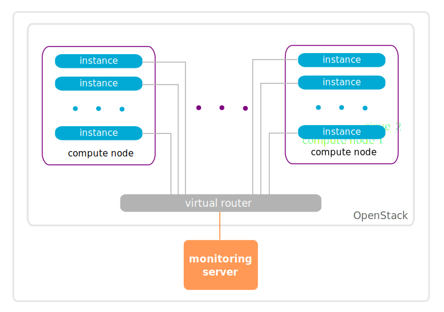
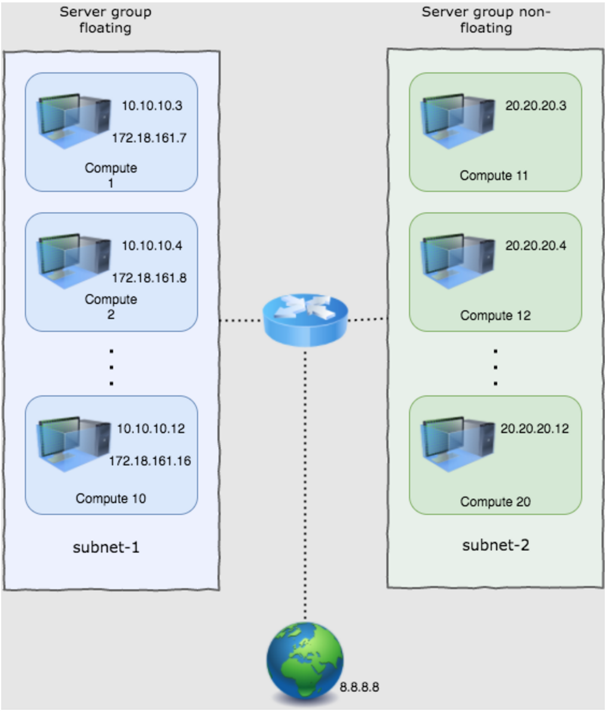
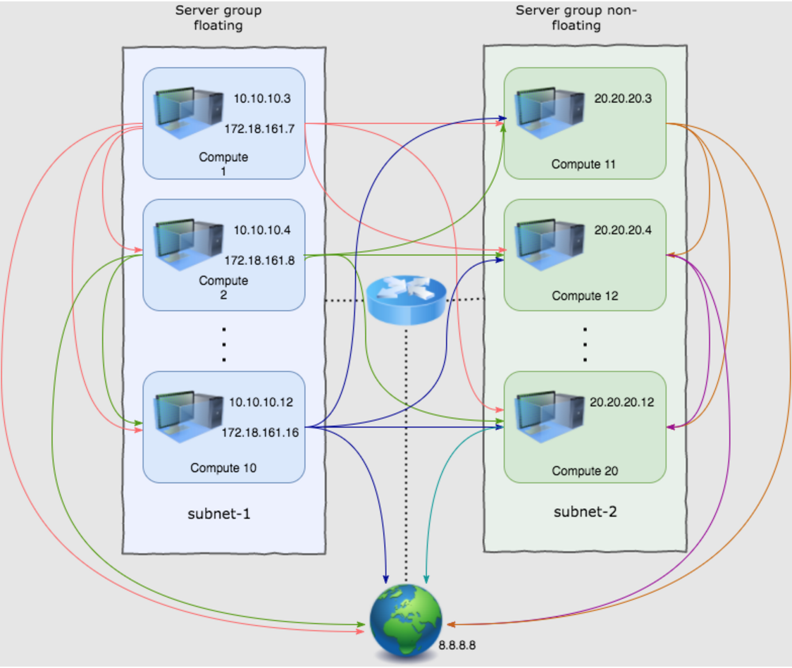
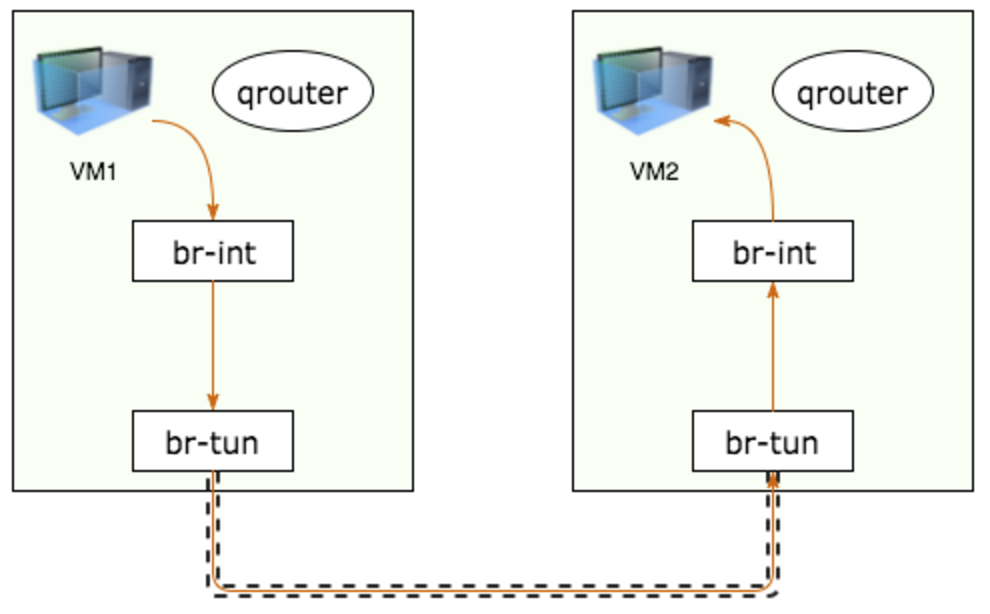
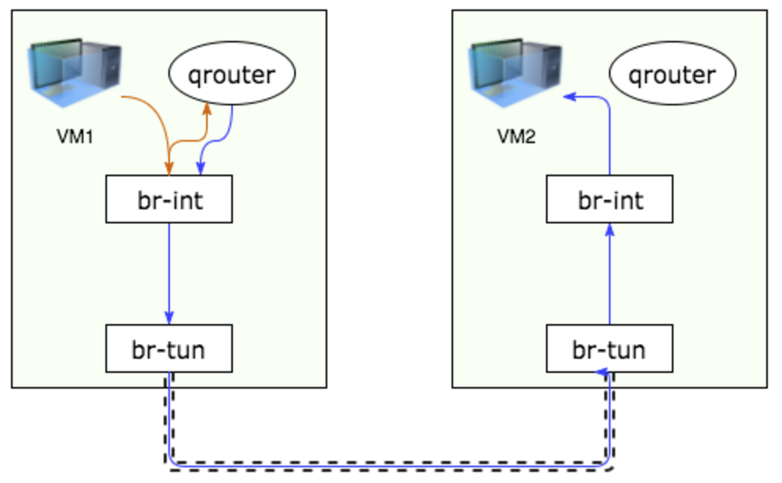
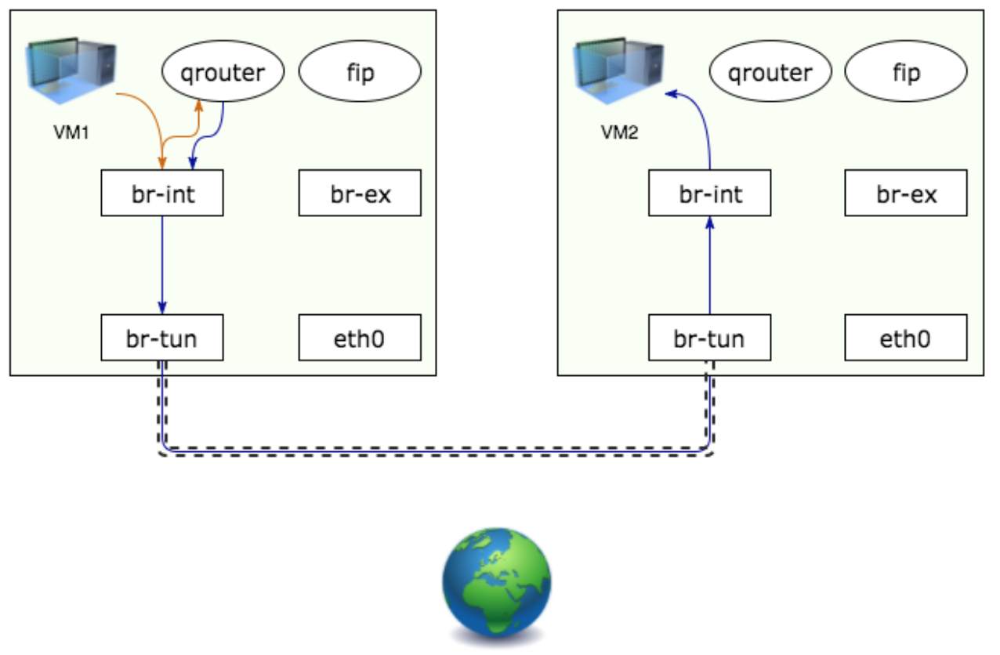
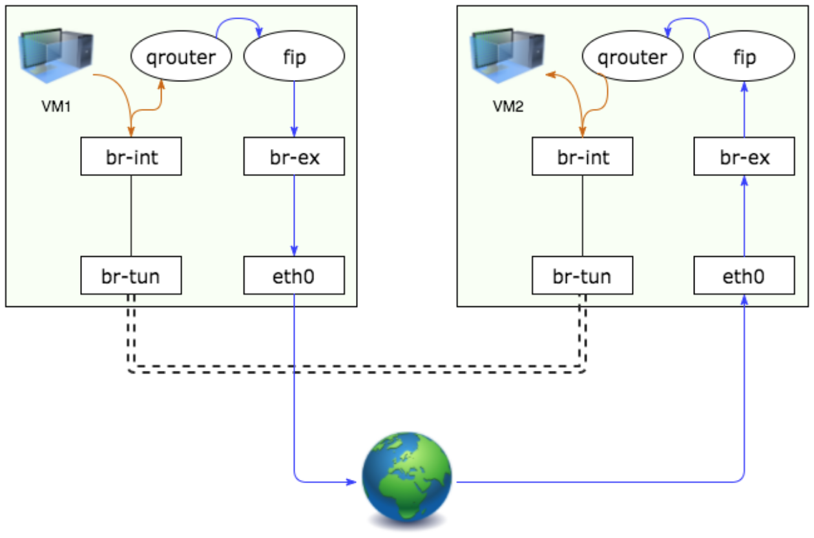
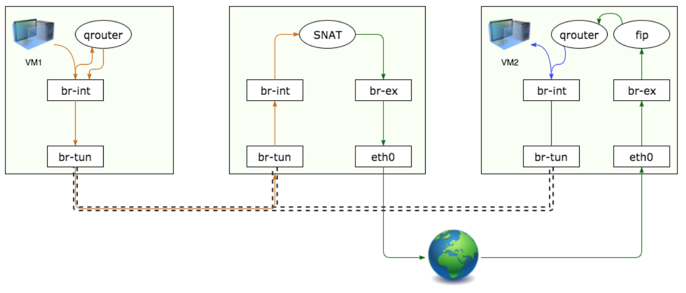

.. _neutron_vm_density_test_plan:

=================================
OpenStack Neutron Density Testing
=================================

:status: **ready**
:version: 1.0

:Abstract:

    With density testing we are able to launch many instances on a single
    OpenStack cluster. But except obtaining high numbers we also would like to
    ensure that all instances are properly wired into the network and,
    which is more important, have connectivity with public network.

Test Plan
=========

The goal of this test is to launch as many as possible instances in the
OpenStack cloud and verify that all of them have correct connectivity with
public network. Upon start each instance reports itself to the external
monitoring server. On success server logs should contain instances' IPs and a
number of attempts to get IP from metadata and send it to the server.

Test Environment
----------------

Preparation
^^^^^^^^^^^

This test plan is performed against existing OpenStack cloud. The monitoring
server is deployed on a machine outside of the cloud.

During each iteration instances are created and connected to the same Neutron
network, which is plugged into Neutron router that connects OpenStack with
external network. The case with multiple Neutron networks being used may also
be considered.

Environment description
^^^^^^^^^^^^^^^^^^^^^^^

The environment description includes hardware specification of servers,
network parameters, operation system and OpenStack deployment characteristics.

Hardware
~~~~~~~~

This section contains list of all types of hardware nodes.

+-----------+-------+----------------------------------------------------+
| Parameter | Value | Comments                                           |
+-----------+-------+----------------------------------------------------+
| model     |       | e.g. Supermicro X9SRD-F                            |
+-----------+-------+----------------------------------------------------+
| CPU       |       | e.g. 6 x Intel(R) Xeon(R) CPU E5-2620 v2 @ 2.10GHz |
+-----------+-------+----------------------------------------------------+
| role      |       | e.g. compute or network                            |
+-----------+-------+----------------------------------------------------+

Network
~~~~~~~

This section contains list of interfaces and network parameters.
For complicated cases this section may include topology diagram and switch
parameters.

+------------------+-------+-------------------------+
| Parameter        | Value | Comments                |
+------------------+-------+-------------------------+
| network role     |       | e.g. provider or public |
+------------------+-------+-------------------------+
| card model       |       | e.g. Intel              |
+------------------+-------+-------------------------+
| driver           |       | e.g. ixgbe              |
+------------------+-------+-------------------------+
| speed            |       | e.g. 10G or 1G          |
+------------------+-------+-------------------------+
| MTU              |       | e.g. 9000               |
+------------------+-------+-------------------------+
| offloading modes |       | e.g. default            |
+------------------+-------+-------------------------+

Software
~~~~~~~~

This section describes installed software.

+-----------------+-------+---------------------------+
| Parameter       | Value | Comments                  |
+-----------------+-------+---------------------------+
| OS              |       | e.g. Ubuntu 14.04.3       |
+-----------------+-------+---------------------------+
| OpenStack       |       | e.g. Mitaka               |
+-----------------+-------+---------------------------+
| Hypervisor      |       | e.g. KVM                  |
+-----------------+-------+---------------------------+
| Neutron plugin  |       | e.g. ML2 + OVS            |
+-----------------+-------+---------------------------+
| L2 segmentation |       | e.g. VxLAN                |
+-----------------+-------+---------------------------+
| virtual routers |       | e.g. DVR                  |
+-----------------+-------+---------------------------+

Test Case 1: VM density check
-----------------------------

Description
^^^^^^^^^^^

The goal of this test is to launch as many as possible instances in the
OpenStack cloud and verify that all of them have correct connectivity with
public network. Instances can be launched in batches (i.e. via Heat). When
instance starts it sends IP to monitoring server located outside of the
cloud.

The test is treated as successful if all instances report their status. As an
extension for this test plan reverted test case might be taken into account:
when external resource is trying to connect to each VM using floating IP
address. This should be treated as a separate test case.

List of performance metrics
^^^^^^^^^^^^^^^^^^^^^^^^^^^

========  ===============  ======================  ======================================
Priority  Value            Measurement Units       Description
========  ===============  ======================  ======================================
1         Total            count                   Total number of instances
1         Density          count per compute node  Max instances per compute node
========  ===============  ======================  ======================================

Tools
-----

To execute the test plan:

1. Disable quotas in OpenStack cloud (since we are going far beyond limits that
   are usually allowed):

  .. literalinclude:: scripts/unset_quotas.sh
    :language: bash

2. Configure a machine for monitoring server. Copy the script into it:

  .. literalinclude:: scripts/server.py
    :language: python

  Copy Heat teamplate:

  .. literalinclude:: scripts/instance_metadata.hot
    :language: yaml

3. Start the server:

  .. code-block:: shell

    python server.py -p <PORT> -l <LOG_DIR>

  The server writes logs about incoming connections into
  ``/tmp/instance_<timestamp>.txt`` file. Each line contains instance's IP
  identifying which instance sent the report.

    .. note:: If the server is restarted, it will create a new
              "instance_<timestamp>.txt" file with new timestamp

4. Provision VM instances:

  #. Define number of compute nodes you have in the cluster. Let's say this
     number is ``NUM_COMPUTES``.
  #. Make sure that ``IMAGE_ID`` and ``FLAVOR`` exist.
  #. Put address of monitoring server into ``SERVER_ADDRESS``.
  #. Run Heat stack using the template from above:

     .. code-block:: shell

        heat stack-create -f instance_metadata.hot \
          -P "image=IMAGE_ID;flavor=FLAVOR;instance_count=NUM_COMPUTES;\
          server_endpoint=SERVER_ADDRESS" STACK_NAME

  #. Repeat step 4 as many times as you need.
  #. Each step monitor ``instances_<timestamp>.txt`` using ``wc -l`` to
     validate that all instances are booted and connected to the HTTP server.

Test Case 2: Additional integrity check
---------------------------------------

As an option, one more test can be run between density
`Test Case 1: VM density check`_ and other researches on the environment (or
between multiple density tests if they are run against the same OpenStack
environment). The idea of this test is to create a group of resources and
verify that it stays persistent no matter what other operations are performed
on the environment (resources creation/deletion, heavy workloads, etc.).

Testing workflow
^^^^^^^^^^^^^^^^

Create 20 instances in two server groups `server-group-floating` and
`server-group-non-floating` in proportion 10:10, with each server group having
the anti-affinity policy. Instances from different server groups are located in
different subnets plugged into a router. Instances from `server-group-floating`
have assigned floating IPs while instances from `server-group-non-floating`
have only fixed IPs.

For each of the instances the following connectivity checks are made:

1. SSH into an instance.
2. Ping an external resource (eg. 8.8.8.8)
3. Ping other VMs (by fixed or floating IPs)

Lists of IPs to ping from VM are formed in a way to check all possible
combinations with minimum redundancy. Having VMs from different subnets with
and without floating IPs ping each other and external resource (8.8.8.8) allows
to check that all possible traffic routes are working, i.e.:

From fixed IP to fixed IP in the same subnet:

From fixed IP to fixed IP in different subnets:

From floating IP to fixed IP (same path as in 2):

From floating IP to floating IP:

From fixed IP to floating IP:

Test steps
^^^^^^^^^^

* Create integrity stack using the following Heat template:

  .. literalinclude:: scripts/integrity_vm.hot
    :language: yaml

  Use this command to create a Heat stack:

  .. code:: bash

    heat stack-create -f integrity_check/integrity_vm.hot -P "image=IMAGE_ID;flavor=m1.micro;instance_count_floating=10;instance_count_non_floating=10" integrity_stack

* Assign floating IPs to instances

  .. code:: bash

    assign_floatingips --sg-floating nova_server_group_floating

* Run connectivity check

  .. code:: bash

    connectivity_check -s ~/ips.json

.. note:: ``~/ips.json`` is a path to file used to store instances' IPs.

.. note:: Make sure to run this check only on controller with qdhcp namespace
          of integrity_network.

* At the very end of the testing please cleaunup an integrity stack:

  .. code:: bash

    assign_floatingips --sg-floating nova_server_group_floating --cleanup
    heat stack-delete integrity_stack
    rm ~/ips.json

Reports
=======

Test plan execution reports:
 * :ref:`neutron_vm_density_test_report`
