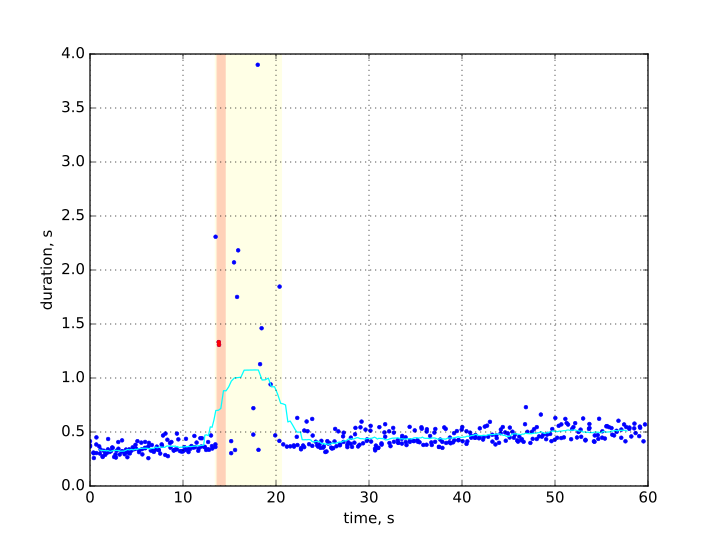

.. _reliability_testing_version_2:

==========================================
OpenStack reliability testing. Version 2.0
==========================================

:status: **draft**
:version: 2.0

:Abstract:

  This test plan describes methodology for reliability testing of OpenStack.

:Conventions:

  - **Recovery period** - the period of time after the fault when service
    performance degrades

  - **MTTR** - mean time to recover service performance after the fault.

  - **Service Downtime** - the time when service was not available.

  - **Absolute performance degradation** - is an absolute difference between
    the mean of operation duration during recovery period and the baseline's.

  - **Relative performance degradation** - is the ratio between the mean
    of operation duration during recovery period and the baseline's.

  - **Fault injection** - the function that emulates failure in software or
    hardware.

  - **Service hang** - fault that emulates hanging service by
    sending `SIGSTOP` and `SIGCONT` POSIX signals to service process(es).

  - **Service crash** - fault that emulates abnormal program termination
    by sending `SIGKILL` signal to service process(es).

  - **Node crash** - fault that emulates unexpected power outage of hardware.

  - **Network partition** - fault that result in connectivity loss between
    service components running on different hardware nodes; used to toggle
    split-brain conditions in HA service.

  - **Network flapping** - fault that emulates disconnection of network
    interface on hardware node or switch.

Test Plan
=========

Test Environment
----------------

Preparation
^^^^^^^^^^^

This test plan is executed against existing OpenStack cloud.

Measurements can be done with the tool that:
 * is able to inject faults into existing OpenStack cloud at specified moment
   of execution;
 * collects duration of single operations and errors;
 * calculates metrics specified in the test plan (e.g. MTTR, Service Downtime).

Environment description
^^^^^^^^^^^^^^^^^^^^^^^

The environment description includes hardware specification of servers,
network parameters, operation system and OpenStack deployment characteristics.

Hardware
~~~~~~~~

This section contains list of all types of hardware nodes.

+-----------+-------+----------------------------------------------------+
| Parameter | Value | Comments                                           |
+-----------+-------+----------------------------------------------------+
| model     |       | e.g. Supermicro X9SRD-F                            |
+-----------+-------+----------------------------------------------------+
| CPU       |       | e.g. 6 x Intel(R) Xeon(R) CPU E5-2620 v2 @ 2.10GHz |
+-----------+-------+----------------------------------------------------+
| role      |       | e.g. compute or network                            |
+-----------+-------+----------------------------------------------------+

Network
~~~~~~~

This section contains list of interfaces and network parameters.
For complicated cases this section may include topology diagram and switch
parameters.

+------------------+-------+-------------------------+
| Parameter        | Value | Comments                |
+------------------+-------+-------------------------+
| network role     |       | e.g. provider or public |
+------------------+-------+-------------------------+
| card model       |       | e.g. Intel              |
+------------------+-------+-------------------------+
| driver           |       | e.g. ixgbe              |
+------------------+-------+-------------------------+
| speed            |       | e.g. 10G or 1G          |
+------------------+-------+-------------------------+
| MTU              |       | e.g. 9000               |
+------------------+-------+-------------------------+
| offloading modes |       | e.g. default            |
+------------------+-------+-------------------------+

Software
~~~~~~~~

This section describes installed software.

+-----------------+-------+---------------------------+
| Parameter       | Value | Comments                  |
+-----------------+-------+---------------------------+
| OS              |       | e.g. Ubuntu 14.04.3       |
+-----------------+-------+---------------------------+
| OpenStack       |       | e.g. Liberty              |
+-----------------+-------+---------------------------+
| Hypervisor      |       | e.g. KVM                  |
+-----------------+-------+---------------------------+
| Neutron plugin  |       | e.g. ML2 + OVS            |
+-----------------+-------+---------------------------+
| L2 segmentation |       | e.g. VLAN or VxLAN or GRE |
+-----------------+-------+---------------------------+
| virtual routers |       | e.g. legacy or HA or DVR  |
+-----------------+-------+---------------------------+

Test Case: Reliability Metrics Calculation
------------------------------------------

Description
^^^^^^^^^^^

The test case is performed by running a specific OpenStack operation with
injected fault. Every test is executed several times to collect more reliable
statistical data.

Parameters
^^^^^^^^^^

The test case is configured with:
  * OpenStack operation that is tested (e.g. *network creation*);
  * fault that is injected into execution pipeline (e.g. *service restart*);

Types of faults:
  * Service-related:

    * restart - service is stopped gracefully and then started;
    * kill - service is terminated abruptly by OS;
    * unplug/plug - service network partitioning.

  * Node-related:

    * reboot - node is rebooted gracefully;
    * reset - cold restart of the node with potential data loss;
    * poweroff/poweron - node is switched off and on;
    * connect/disconnect - node's network interface is flapped.

List of performance metrics
^^^^^^^^^^^^^^^^^^^^^^^^^^^

A particular fault may affect operations in different ways. Operations
may fail with error and we can count such errors and estimate how long the
downtime was. Operations may degrade in performance and we can compare
performance with base numbers. Also we can estimate time while the
performance was degraded.

If both errors and performance degradation are observed the image could
look like the following:

Here the light blue line shows the mean operation duration, orange area is
where errors are observed and yellow where the performance is low.

Overall the following metrics need to be collected:

.. list-table::
   :header-rows: 1

   *
     - Priority
     - Value
     - Measurement Unit
     - Description
   *
     - 1
     - Service downtime
     - sec
     - How long the service was not available and operations were in error
       state.
   *
     - 1
     - MTTR
     - sec
     - How long does it takes to recover service performance after the failure.
   *
     - 1
     - Absolute performance degradation
     - sec
     - the mean of difference in operation performance during recovery period
       and operation performance when service operates normally.
   *
     - 1
     - Relative performance degradation
     - ratio
     - the ratio between operation performance during recovery period and
       operation performance when service operates normally.

The final report may also contain one or more charts that show operation
behavior during the test.

Tools
=====

Rally + os-faults
-----------------

This test plan can be executed with `Rally`_ tool. Rally can report
duration of individual operations and report errors. Rally `Hooks` features
allows to call external code at specified moments of scenario execution.

`os-faults`_ library provides a generic way to inject faults into OpenStack
cloud. It supports both service and node based operations.

The integration between Rally and os-faults is implemented as Rally hooks
plugin: :download:`fault_injection.py <code/rally_plugins/fault_injection.py>`

Calculations
^^^^^^^^^^^^

Metrics calculations are based on raw data collected from Rally (Rally json
output). The raw data contains list of iterations with duration of each
iteration. If some operation failed the iteration contains error field. Also
raw data contains hook information, when it was started and its execution
status.

The period of scenario execution before the hook is interpreted as the
baseline. It is used to measure operation's baseline mean and deviation.

`Service downtime` is calculated as time interval between the first and the
last errors. The precision of calculation is average distance between the
last succeed operation and the first error, and the last error and the next
succeed operation.

To find the recovery period we first calculate the mean duration of
consequent operations with sliding window. The period is treated as
`Recovery period` when mean operation duration is significantly more than
the mean operation duration in the baseline. The average duration of Recovery
period is `MTTR` value. `Absolute performance degradatio` is calculated as
difference between mean of operation duration during Recovery period and
the baseline's. `Relative performance degradation` is the ratio between
mean of operation duration during Recovery period and the baseline's.

How to run
^^^^^^^^^^

Prerequisites:
 * Install `Rally` tool and configure deployment parameters

   * Verify that Rally is properly installed by running ``rally show flavors``

 * Install `os-faults` library: ``pip install os-faults``

   * Configure cloud and power management parameters, refer to `os-faults-cfg`
   * Verify parameters by running ``os-inject-fault -v``

 * Install `RallyRunners` tool: ``pip install rally-runners``

Run scenarios:
 ``rally-reliability -s SCENARIO -o OUTPUT -b BOOK``

To show full list of scenarios:
 ``rally-reliability -h``

Reports
=======

Test plan execution reports:
 * :ref:`reliability_test_results_version_2`
 * :ref:`reliability_test_results_version_2_containerized`

.. references:

.. _Rally: https://rally.readthedocs.io/
.. _os-faults: https://os-faults.readthedocs.io/
.. _os-faults-cfg: http://os-faults.readthedocs.io/en/latest/readme.html#usage
.. _RallyRunners: https://github.com/shakhat/rally-runners
