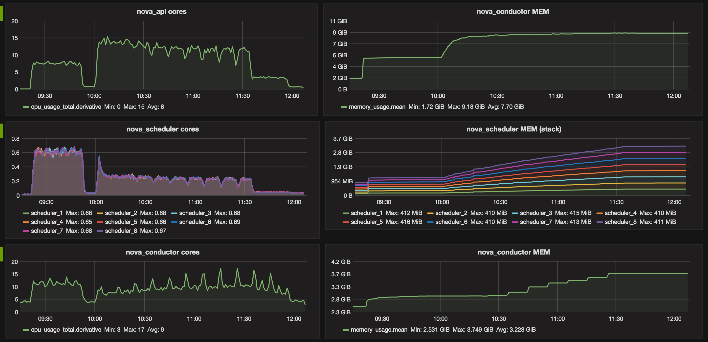
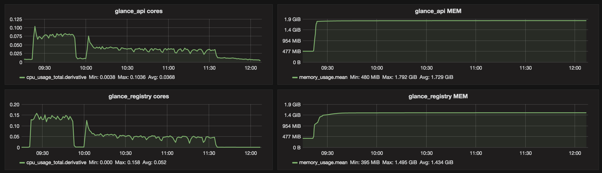
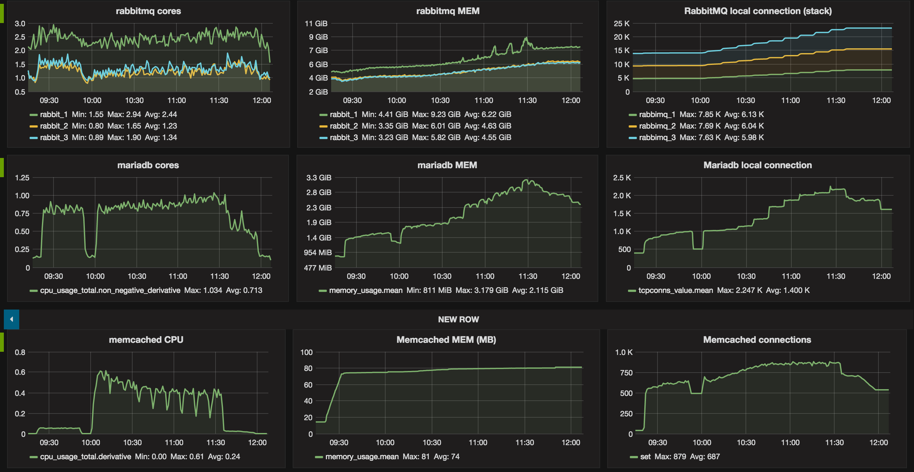
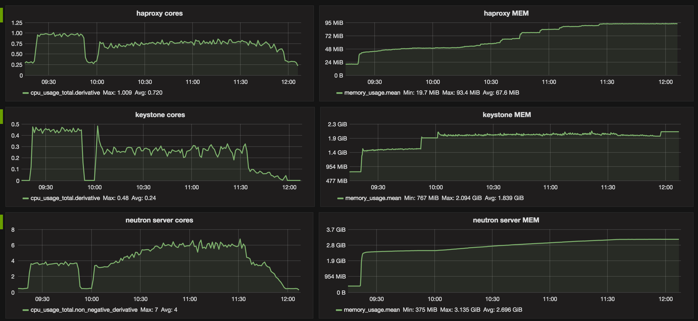

.. raw:: pdf

    PageBreak oneColumn

.. _1000_nodes_fake_driver_report:

1000 Compute nodes fake driver resource scalability testing
===========================================================

This report is generated for :ref:`1000_nodes` test plan.

Environment setup
-----------------

The results presented in this study are based on experiments made with the
OpenStack Mitaka release. The system has been deployed leveraging a dedicated
set of scripts [#]_ built on top of Kolla framework [#]_.  Each service is
encapsulated in a dedicated container and have been started across 26 physical
servers. Note that we are only interested in evaluating the scalability of the
control plane, for this purpose we use the nova fake drivers at the compute
level.

The OpenStack services placement is described (numbers in
parenthesis indicate the number of instances/containers) in the following listing :

- control (1 physical server)

  - neutron_server (1)
  - nova_novncproxy (1)
  - nova_consoleauth (1)
  - nova_api (1)
  - glance_api (1)
  - glance_registry (1)
  - keystone (1)
  - memcached (1)

- network (1 physical server)

  - neutron_metadata_agent (1)
  - neutron_l3_agent (1)
  - neutron_dhcp_agent (1)
  - neutron_openvswitch_agent (1)
  - neutron_openvswitch_agent (1)
  - openvswitch_db (1)
  - keepalived (1)
  - haproxy (1)

- compute (20 physical servers)

  - nova_ssh (1)
  - nova_libvirt (1)
  - nova_compute (50)
  - openvswitch_db (1)
  - openvswitch_vswitchd (1)
  - neutron_openvswitch_agent (1)

- rabbitmq-node (3 physical servers)

  - rabbitmq (1)

- scheduler (1 physical server)

  - nova_scheduler(8)

Additional information
----------------------

The experiment was run on the Grid'5000 [#]_ platform using the following hardware and network.

Hardware
~~~~~~~~~

+-----------+-----------------------------------------------------+
| Parameter |  Comments                                           |
+-----------+-----------------------------------------------------+
| model     |  Dell PowerEdge R630                                |
+-----------+-----------------------------------------------------+
| CPU       |  26  x Intel(R) Xeon(R) CPU E5-2630 v3  2.40 GHz    |
+-----------+-----------------------------------------------------+

Network
~~~~~~~

+------------------+--------------------------+
| Parameter        |  Comments                |
+------------------+--------------------------+
| card model       |   Intel                  |
+------------------+--------------------------+
| driver           |   ixgbe                  |
+------------------+--------------------------+
| speed            |   10G                    |
+------------------+--------------------------+

Methodology
-----------

For the sake of simplicity the experiments have been limited to the  “boot and
delete VM” and “boot and list VM” scenarios in Rally with the following
relevant parameters:

- Total number of instances: 10000
- Total number of workers: 50
- Total number of tenants: 2
- Total number of users: 3

First OpenStack has been deployed following the described topology of services.
The deployment took approximately 40 min. The OpenStack deployment is
instrumented to gather various metrics from the experiment.  For this purpose,
monitoring agents, cadvisor and collectd, have been used together with InfluxDB
to collect metrics. In order to mitigate the monitoring traffic overhead,
metrics have been gathered every 5s for the following roles : control, network,
rabbitmq and only one node from the compute role.

HAproxy is used in front of all the OpenStack APIs and MariaDB. To avoid
possible penalties, *maxconn* has been set at a high value globally and on
each frontend respectively. We use 100000 and 20000 respectively. Keystone and
neutron workers number has been increased to 50 respectively. Other parameters
was those given by Kolla (2.0.2) at the time of the experiment.

Findings
--------

Table 1. Services top watermarks in terms of CPU and RAM.

+-----------------+---------+----------+
| Service         | CORES   |    RAM   |
+=================+=========+==========+
| nova-api        |  15     |  7.49 GB |
+-----------------+---------+----------+
| nova-scheduler* |  0.6    | 410 MB   |
+-----------------+---------+----------+
| nova-conductor  | 17      |   3.7 GB |
+-----------------+---------+----------+
| glance-api      | 0.1     |   1.6 GB |
+-----------------+---------+----------+
| glance-registry | 0.15    |   1.4 GB |
+-----------------+---------+----------+
| neutron-server  |  7      |  2.6 GB  |
+-----------------+---------+----------+
| keystone        |  0.5    |   1.8 GB |
+-----------------+---------+----------+
| rabbitmq**      |  2      |     6 GB |
+-----------------+---------+----------+
| mysqld          | 1       |  3.1 GB  |
+-----------------+---------+----------+
| memcached       | 0.6     |    80 MB |
+-----------------+---------+----------+

Table 2. Top number of connections

+-----------------+------------+
| Service         | Connections|
+=================+============+
| rabbitmq **     |  7.6 K     |
+-----------------+------------+
| mariadb         |  2.245 K   |
+-----------------+------------+
| memcached       |  879       |
+-----------------+------------+

| * approx. each of eight nova-scheduler processes (see below)
| ** approx. each of the three rabbitmq nodes (see below)

Figures below show two distincts phases corresponding to the two benchmarks.  In
addition to the previous report :ref:`1000_nodes_report`, it appears that the
number of connections that rabbitmq has to manage is a critical metric.
Especially when running in a non-clustered setup as it may result in hitting
the limitation of the system (e.g open files).

The rally report is available :

:download:`reports/rally_report.html <./reports/rally_report.html>`

Graphs:

References
~~~~~~~~~~~

.. [#] https://github.com/openstack/kolla
.. [#] https://github.com/BeyondTheClouds/kolla-g5k
.. [#] https://www.grid5000.fr/mediawiki/index.php/Grid5000:Home

