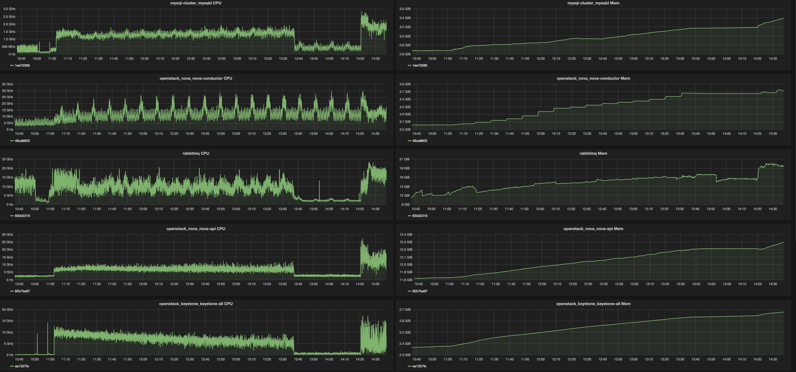
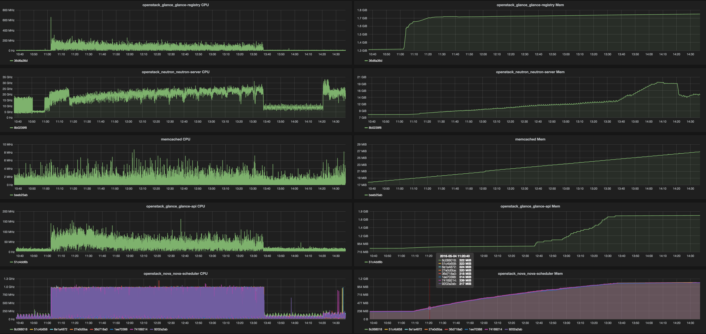

1000 Compute nodes resource scalability testing
===============================================

Environment setup
-----------------

Each and every service of OpenStack was placed into the container. Containers
were placed mostly across 17 nodes. “Mostly” means some of them were placed on
separate nodes to be able to get more resources if needed without limitations
from other services. So after some initial assumptions these privileges was
given to the following containers: rabbitmq, mysql, keystone, nova-api and
neutron. Later after some observations only rabbitmq, mysql and keystone has
kept these privileges. All other containers were places with some higher
priorities but without dedicating additional hosts for them.

List of OpenStack and Core services which were used in testing environment (in
parentheses represents number of instances/containers):

- nova-api(1)
- nova-scheduler(8)
- nova-conductor(1)
- nova-compute(1000)
- glance-api(1)
- glance-registry(1)
- neutron-server(1)
- neutron-dhcp-agent(1)
- neutron-ovs-agent(1000)
- keystone-all(1)
- rabbitmq(1)
- mysqld(1)
- memcached(1)
- horizon(1)
- libvirtd(1000)
- openvswitch-vswitch(1000)

Additional information
----------------------

We have 8 instances of nova-scheduler because it’s known as non-scalable inside
of service (there is no workers/threads/etc inside of nova-scheduler).
All other OpenStack services were run in quantity of 1.
Each and every “Compute node” container has neutron-ovs-agent, libvirtd,
nova-compute and openvswitch-vswitch inside. So we have 1000 of “Compute”
containers across ~13 nodes.

Prime aim of this simple testing is to check scalability of OpenStack control 
and data plane services. Because of that RabbitMQ and MySQL were run in single
node mode just to verify “essential load” and confirm that there is no issues
with standalone nodes. Later we will run tests with Galera cluster and
clustered RabbitMQ.

We have used Mirantis MOS 8.0 (OpenStack Liberty release) official repo for
creating containers with OpenStack services.

There is set of tests run with fake compute driver for preliminary checks
and overall load and placement verification. Later we modified original libvirt
driver to only skip actual VM booting (spawn of qemu-kvm process). All other
things related to the instance spawning are actually done.

Glance was used with local file storage as a backend. CirrOS images were used
for VM booting(~13Mb). Local disks of nodes/containers were used as a storage
for VMs.

Methodology
-----------

For simplicity we chose “boot and list VM” scenario in Rally with the
following important parameters:

- Total number of instances: 20000
- Total number of workers: 50
- Total number of networks: 200
- Total number of tenants: 200
- Total number of users: 400

In 2-3 years probability of 1000 compute hosts to be added at the same
moment (all of them in 10-15 seconds) is close to 0% therefore it's necessary
to start all Compute containers and wait for ~5-10 minutes to provide neutron
DVR with enough time to update all the agents to know each other.

After that we start Rally test scenario. Because of nature of changes in
nova-compute driver starting of a VM would be considered succeeded before
security groups get applied to it (like vif_plugging_is_fatal=False). So this
will lead to the increased Neutron server load and possibility of not all the
rules got applied at the end of the testing. Although in our case it will
create bigger load on Neutron which makes this test much heavier.
Anyway we plan to do this test later excluding this particular  behavior and
compare the results.

In folder with this report you’ll find additional files with the test
scenario, results and usage patterns observations.

Here we would like to just point out some findings about resources consumptions
by each and every service which could help with servers capacity planning. All
servers had 2x Intel Xeon E5-2680v3.
Here is top watermarks from different services under mentioned test load.

Table 1. Services top watermarks

+-----------------+---------+----------+
| Service         | CPU     |    RAM   |
+=================+=========+==========+
| nova-api        |  13 GHz |  12.4 Gb |
+-----------------+---------+----------+
| nova-scheduler* |  1 GHz  |   1.1 Gb |
+-----------------+---------+----------+
| nova-conductor  |  30 GHz |   4.8 Gb |
+-----------------+---------+----------+
| glance-api      | 160 MHz |   1.8 Gb |
+-----------------+---------+----------+
| glance-registry | 300 MHz |   1.8 Gb |
+-----------------+---------+----------+
| neutron-server  |  30 GHz |    20 Gb |
+-----------------+---------+----------+
| keystone-all    |  14 GHz |   2.7 Gb |
+-----------------+---------+----------+
| rabbitmq        |  21 GHz |    17 Gb |
+-----------------+---------+----------+
| mysqld          | 1.9 GHz |   3.5 Gb |
+-----------------+---------+----------+
| memcached       |  10 MHz |    27 Mb |
+-----------------+---------+----------+

| * each of eight nova-scheduler processes.

Very first assumptions on scale of 1000 nodes will be the following: it would
be good to have 2 dedicated servers per component. Here is a list of components
whose would require that: nova-conductor,nova-api, neutron-server, keystone.
RabbitMQ and MySQL servers worked in standalone mode so clustering overhead
will be added and they will consume much more resources than we already
metered.

Graphs:

