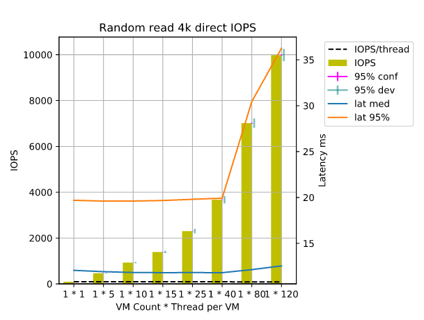
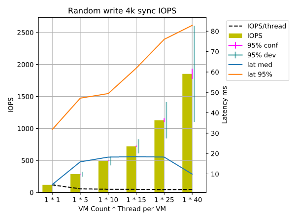
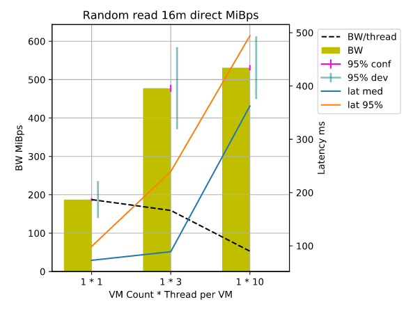
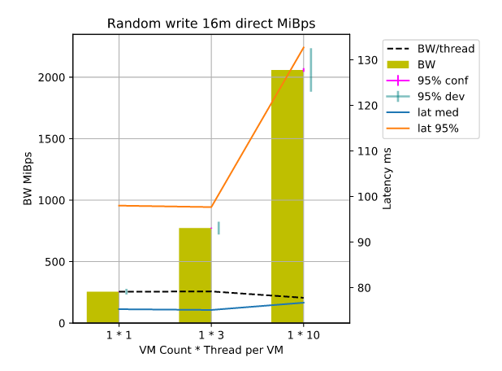

.. _ceph_rbd_performance_results_50_osd:

***************************
Ceph RBD performance report
***************************

:Abstract:

  This document includes Ceph RBD performance test results for 40 OSD nodes.
  Test cluster contain 40 OSD servers and forms 581TiB ceph cluster.

Environment description
=======================

Environment contains 3 types of servers:

- ceph-mon node
- ceph-osd node
- compute node

.. table:: Amount of servers each role

   +------------+--------------+------+
   |Role        |Servers count |Type  |
   +============+==============+======+
   |compute     |1             |1     |
   +------------+--------------+------+
   |ceph-mon    |3             |1     |
   +------------+--------------+------+
   |ceph-osd    |40            |2     |
   +------------+--------------+------+

Hardware configuration of each server
-------------------------------------

All servers have 2 types of configuration describing in table below

.. table:: Description of servers hardware type 1

   +-------+----------------+---------------------------------+
   |server |vendor,model    |Dell PowerEdge R630              |
   +-------+----------------+---------------------------------+
   |CPU    |vendor,model    |Intel,E5-2680 v3                 |
   |       +----------------+---------------------------------+
   |       |processor_count |2                                |
   |       +----------------+---------------------------------+
   |       |core_count      |12                               |
   |       +----------------+---------------------------------+
   |       |frequency_MHz   |2500                             |
   +-------+----------------+---------------------------------+
   |RAM    |vendor,model    |Samsung, M393A2G40DB0-CPB        |
   |       +----------------+---------------------------------+
   |       |amount_MB       |262144                           |
   +-------+----------------+---------------------------------+
   |NETWORK|interface_name s|eno1, eno2                       |
   |       +----------------+---------------------------------+
   |       |vendor,model    |Intel,X710 Dual Port             |
   |       +----------------+---------------------------------+
   |       |bandwidth       |10G                              |
   |       +----------------+---------------------------------+
   |       |interface_names |enp3s0f0, enp3s0f1               |
   |       +----------------+---------------------------------+
   |       |vendor,model    |Intel,X710 Dual Port             |
   |       +----------------+---------------------------------+
   |       |bandwidth       |10G                              |
   +-------+----------------+---------------------------------+
   |STORAGE|dev_name        |/dev/sda                         |
   |       +----------------+---------------------------------+
   |       |vendor,model    | | raid1 - Dell, PERC H730P Mini |
   |       |                | | 2 disks Intel S3610           |
   |       +----------------+---------------------------------+
   |       |SSD/HDD         |SSD                              |
   |       +----------------+---------------------------------+
   |       |size            | 3,6TB                           |
   +-------+----------------+---------------------------------+

.. table:: Description of servers hardware type 2

   +-------+----------------+-------------------------------+
   |server |vendor,model    |Lenovo ThinkServer RD650       |
   +-------+----------------+-------------------------------+
   |CPU    |vendor,model    |Intel,E5-2670 v3               |
   |       +----------------+-------------------------------+
   |       |processor_count |2                              |
   |       +----------------+-------------------------------+
   |       |core_count      |12                             |
   |       +----------------+-------------------------------+
   |       |frequency_MHz   |2500                           |
   +-------+----------------+-------------------------------+
   |RAM    |vendor,model    |Samsung, M393A2G40DB0-CPB      |
   |       +----------------+-------------------------------+
   |       |amount_MB       |131916                         |
   +-------+----------------+-------------------------------+
   |NETWORK|interface_names |enp3s0f0, enp3s0f1             |
   |       +----------------+-------------------------------+
   |       |vendor,model    |Intel,X710 Dual Port           |
   |       +----------------+-------------------------------+
   |       |bandwidth       |10G                            |
   |       +----------------+-------------------------------+
   |       |interface_names |ens2f0,  ens2f1                |
   |       +----------------+-------------------------------+
   |       |vendor,model    |Intel,X710 Dual Port           |
   |       +----------------+-------------------------------+
   |       |bandwidth       |10G                            |
   +-------+----------------+-------------------------------+
   |STORAGE|vendor,model    |2 disks Intel S3610            |
   |       +----------------+-------------------------------+
   |       |SSD/HDD         |SSD                            |
   |       +----------------+-------------------------------+
   |       |size            |799GB                          |
   |       +----------------+-------------------------------+
   |       |vendor,model    |10 disks 2T                    |
   |       +----------------+-------------------------------+
   |       |SSD/HDD         |HDD                            |
   |       +----------------+-------------------------------+
   |       |size            |2TB                            |
   +-------+----------------+-------------------------------+

Network configuration of each server
------------------------------------

All servers have same network configuration:

.. image:: configs/Network_Scheme.png
   :alt: Network Scheme of the environment

Software configuration on servers with controller, compute and compute-osd roles
--------------------------------------------------------------------------------

Ceph was deployed by Decapod tool. Cluster config for decapod:
:download:`ceph_config.yaml <configs/ceph_config.yaml>`

.. table:: Software version on servers

   +------------+-------------------+
   |Software    |Version            |
   +============+===================+
   |Ceph        |Jewel              |
   +------------+-------------------+
   |Ubuntu      |Ubuntu 16.04 LTS   |
   +------------+-------------------+

You can find outputs of some commands and /etc folder in the following archives:

| :download:`ceph-osd-1.tar.gz <configs/ceph-osd-1.tar.gz>`

Testing process
===============

1. Run virtual machine on compute node with attached RBD disk.
2. SSH into VM operation system
3. Clone Wally repository.
4. Create :download:`ceph_raw.yaml <configs/ceph_raw.yaml>` file in cloned
   repository
5. Run command python -m wally test ceph_rbd_2 ./ceph_raw.yaml

As a result we got the following HTML file:

:download:`Report.html <configs/Report.html>`

Test results
============

