.. _Kubernetes_density_test_report:

******************************
Kubernetes density test report
******************************

:Abstract:

  This document is the report for :ref:`Kubernetes_density_test_plan`

Environment description
=======================

This report is collected on the hardware described in
:ref:`intel_mirantis_performance_lab_1`.

Software
~~~~~~~~

Kubernetes is installed using :ref:`Kargo` deployment tool on Ubuntu 16.04.1.

Node roles:
 - node1: minion+master+etcd
 - node2: minion+master+etcd
 - node3: minion+etcd
 - node4: minion

Software versions (test case #1):
 - OS: Ubuntu 16.04.1 LTS (Xenial Xerus)
 - Kernel: 4.4.0-47
 - Docker: 1.12.1
 - Kubernetes: 1.4.3

Software versions (test case #2):
 - OS: Ubuntu 16.04.1 LTS (Xenial Xerus)
 - Kernel: 4.4.0-36
 - Docker: 1.13.1
 - Kubernetes: 1.5.3

Reports
=======

Test Case #1: Maximum pods per node
~~~~~~~~~~~~~~~~~~~~~~~~~~~~~~~~~~~

Pod startup time is measured with help of
`MMM(MySQL/Master/Minions) testing suite`_. To schedule all pods on a single
node the original replication controller for minions is updated with scheduler
hint. To do this add the following lines into template's spec section:

.. code-block:: yaml

      nodeSelector:
        kubernetes.io/hostname: node4

Pod status from Kubernetes point of view is retrieved from kubectl tool.
The process is automated with
:download:`kubectl_mon.py <kubectl-mon/kubectl_mon.py>`, which produces
output in CSV format. Charts are created by
:download:`pod_stats.py <kubectl-mon/pod_stats.py>` script.

Every measurement starts with empty namespace. Then Kubernetes replication
controller is created with specified number of pods. We collect pod's report
time and kubectl stats. The summary data is presented below.

.. image:: summary.png

.. list-table:: POD stats
    :header-rows: 1

    *
      - POD_COUNT
      - POD_FIRST_REPORT, s
      - KUBECTL_RUN, s
      - KUBECTL_TERMINATE, s
    *
      - 50
      - 12
      - 44
      - 30
    *
      - 100
      - 27
      - 131
      - 87
    *
      - 200
      - 61
      - 450
      - 153
    *
      - 400
      - 208
      - ∞ (not finished)
      - 390

Detailed Stats
--------------

50 pods
^^^^^^^

Start replication controller with 50 pods

.. image:: 50-start.svg
    :width: 100%

Terminate replication controller with 50 pods

.. image:: 50-term.svg
    :width: 100%

100 pods
^^^^^^^^

Start replication controller with 100 pods

.. image:: 100-start.svg
    :width: 100%

Terminate replication controller with 100 pods

.. image:: 100-term.svg
    :width: 100%

200 pods
^^^^^^^^

Start replication controller with 200 pods

.. image:: 200-start.svg
    :width: 100%

Terminate replication controller with 200 pods

.. image:: 200-term.svg
    :width: 100%

400 pods
^^^^^^^^

Start replication controller with 400 pods.

Note: In this experiment all pods successfully reported, however from Kubernetes API
point of view less than 60 pods were in running state. The number of pods
reported as running was slowly increasing over the time, but the speed was very
low to treat the process as succeed.

.. image:: 400-start.svg
    :width: 100%

Terminate replication controller with 400 pods.

.. image:: 400-term.svg
    :width: 100%

Scale by 100 pods steps
^^^^^^^^^^^^^^^^^^^^^^^

In this experiment we scale replication controller up by steps of 100 pods.
Scaling process is invoked after all pods are reported as running. On step 3
(201-300 pods) the process has become significantly slower and we've started
scaling replication controller down. The full cycle is visualized below.

.. image:: N-start-term.svg
    :width: 100%

System metrics from API nodes and minion are below

.. image:: N-cpu-user.png

.. image:: N-cpu-system.png

.. image:: N-mem-used.png

.. image:: N-disk-io.png

Full `Kubernetes stats`_ are available online.

Test Case #2: Measure Kubelet capacity
~~~~~~~~~~~~~~~~~~~~~~~~~~~~~~~~~~~~~~

Pod startup time is measured with help of
`MMM(MySQL/Master/Minions) testing suite`_. Original code was updated. We added
automatic creation of charts with pod's status, when pod startup (or down). To
schedule all pods on a single node the original replication controller for
minions is updated with scheduler hint. To do this add the following lines
into template's spec section:

.. code-block:: yaml

      nodeSelector:
        kubernetes.io/hostname: <node>

Pod status from Kubernetes point of view is retrieved from kubectl tool.
The process is automated with
:download:`kubectl_mon_v2.py <kubectl-mon/kubectl_mon_v2.py>`, which collects
information about pod's status and sends to database. Charts are created by
updated `MMM(MySQL/Master/Minions) testing suite`_.

Every measurement starts with empty namespace. Then Kubernetes replication
controller is created with specified number of pods. We collect pod's report
time and kubectl stats. The summary data is presented below.

.. list-table:: POD stats
    :header-rows: 1

    *
      - POD_COUNT
      - NODE_COUNT
      - POD_FIRST_REPORT, s
      - KUBECTL_RUN, s
      - KUBECTL_TERMINATE, s
    *
      - 50
      - 50
      - 197
      - 290
      - 289
    *
      - 100
      - 50
      - 415
      - 597
      - 577
    *
      - 200
      - 50
      - 952
      - 1218
      - 1154
    *
      - 50
      - 100
      - 381
      - 425
      - 536
    *
      - 100
      - 100
      - 788
      - 2093 (with errors)
      - 1076
    *
      - 200
      - 100
      - 2653
      - 3838 (not finished)
      - 3001 (not finished)
    *
      - 50
      - 200
      - 970
      - 1256
      - 1032
    *
      - 100
      - 200
      - 1632
      - 3225
      - 2248
    *
      - 200
      - 200
      - 7098 (6.5% lost)
      - 8075 (not finished)
      - ∞ (not finished)
    *
      - 50
      - 400
      - 1823
      - 2667 (with errors)
      - 2038
    *
      - 100
      - 400
      - 7582
      - 8262 (with errors)
      - 5200
    *
      - 400
      - 50
      - 9607
      - ∞ (not finished)
      - ∞ (not finished)

Detailed Stats
--------------

Note: You can download these reports in HTML format
:download:`here <data/reports.tar.bz2>`

50 pods (~1 pod per core) on 50 nodes
^^^^^^^^^^^^^^^^^^^^^^^^^^^^^^^^^^^^^

Start replication controller with 50 pods on 50 nodes

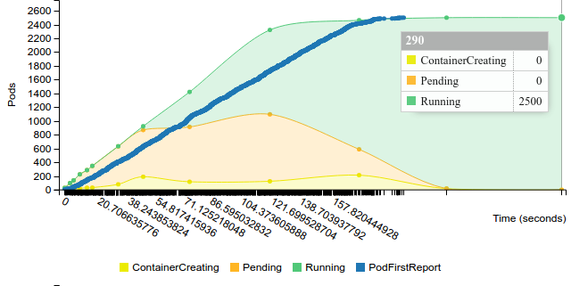

Terminate replication controller with 50 pods on 50 nodes

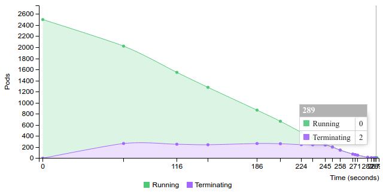

100 pods (~2 pod per core) on 50 nodes
^^^^^^^^^^^^^^^^^^^^^^^^^^^^^^^^^^^^^^

Start replication controller with 100 pods on 50 nodes

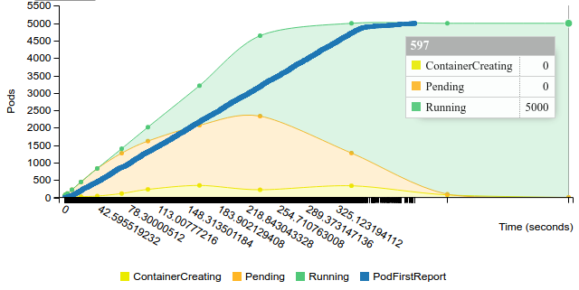

Terminate replication controller with 100 pods on 50 nodes

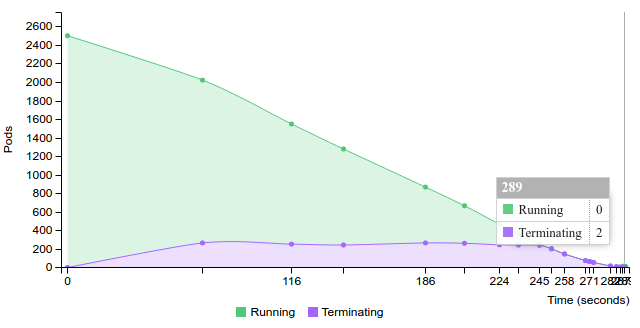

200 pods (~4 pod per core) on 50 nodes
^^^^^^^^^^^^^^^^^^^^^^^^^^^^^^^^^^^^^^

Start replication controller with 200 pods on 50 nodes

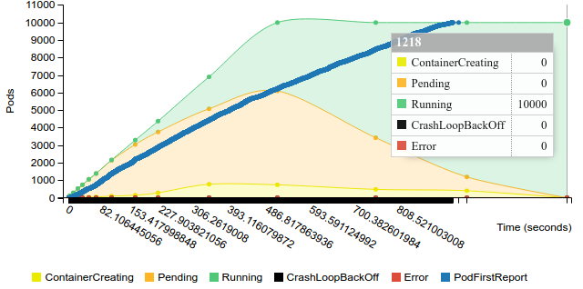

Terminate replication controller with 200 pods on 50 nodes

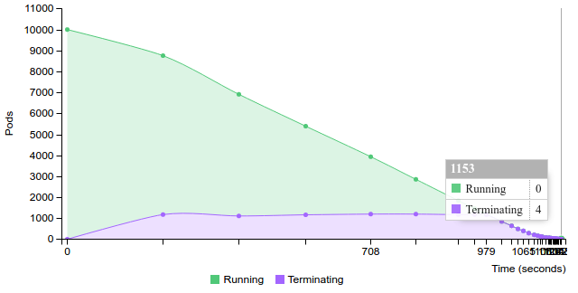

50 pods (~1 pod per core) on 100 nodes
^^^^^^^^^^^^^^^^^^^^^^^^^^^^^^^^^^^^^^

Start replication controller with 50 pods on 100 nodes

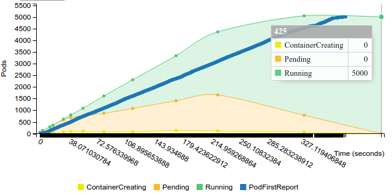

Terminate replication controller with 50 pods on 100 nodes

.. image:: 100x50_term.png
    :width: 100%

100 pods (~2 pod per core) on 100 nodes
^^^^^^^^^^^^^^^^^^^^^^^^^^^^^^^^^^^^^^^

Start replication controller with 100 pods on 100 nodes

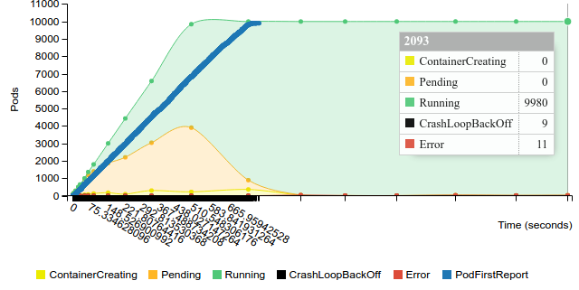

Terminate replication controller with 100 pods on 100 nodes

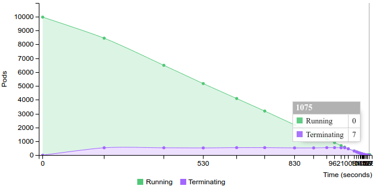

200 pods (~4 pod per core) on 100 nodes
^^^^^^^^^^^^^^^^^^^^^^^^^^^^^^^^^^^^^^^

Start replication controller with 200 pods on 100 nodes

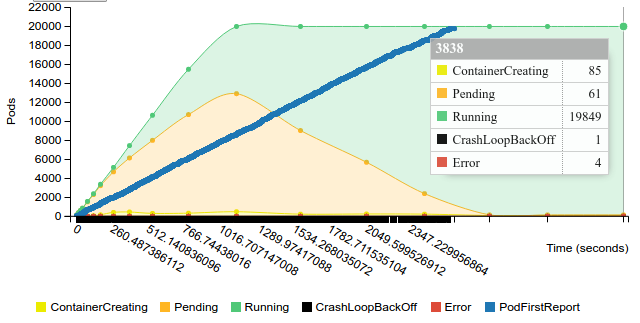

Terminate replication controller with 200 pods on 100 nodes

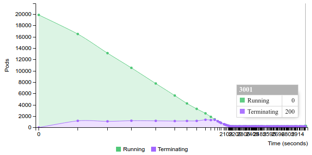

50 pods (~1 pod per core) on 200 nodes
^^^^^^^^^^^^^^^^^^^^^^^^^^^^^^^^^^^^^^

Start replication controller with 50 pods on 100 nodes

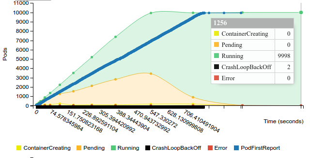

Terminate replication controller with 50 pods on 100 nodes

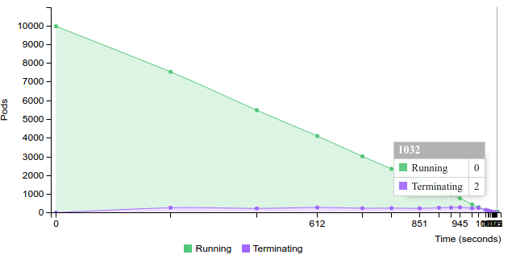

100 pods (~2 pod per core) on 200 nodes
^^^^^^^^^^^^^^^^^^^^^^^^^^^^^^^^^^^^^^^

Start replication controller with 100 pods on 200 nodes

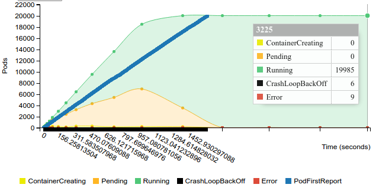

Terminate replication controller with 100 pods on 200 nodes

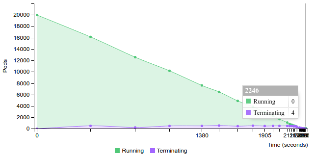

200 pods (~4 pod per core) on 200 nodes
^^^^^^^^^^^^^^^^^^^^^^^^^^^^^^^^^^^^^^^

Start replication controller with 200 pods on 200 nodes

Note: Docker service is frozen on 27 nodes

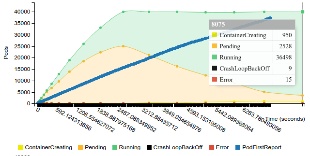

Terminate replication controller with 200 pods on 200 nodes

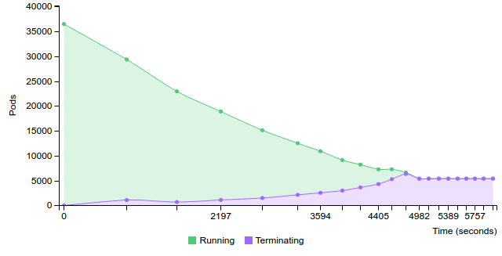

400 pods (~8 pod per core) on 50 nodes
^^^^^^^^^^^^^^^^^^^^^^^^^^^^^^^^^^^^^^

Start replication controller with 400 pods on 50 nodes

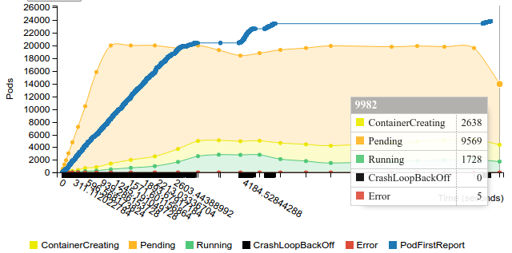

Terminate replication controller with 400 pods on 50 nodes

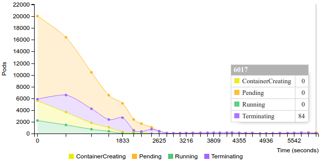

.. references:

.. _Kargo: https://github.com/kubespray/kargo
.. _MMM(MySQL/Master/Minions) testing suite: https://github.com/AleksandrNull/MMM
.. _Kubernetes stats: https://snapshot.raintank.io/dashboard/snapshot/YCtAh7jHhYpmWk8nsfda0EAIRRnG4TV9