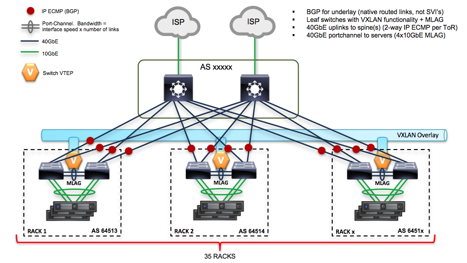

.. _Results_of_measuring_performance_of_Kargo:

*******************************************
Results of measuring performance of Kargo
*******************************************

:Abstract:

  This document includes performance test results of Kargo_
  as for Kubernetes deployment solution. All tests have been performed
  regarding :ref:`Measuring_performance_of_Kargo`.

  Kargo sets up Kubernetes in the following way:

  - master: Calico, Kubernetes API services
  - minion: Calico, Kubernetes minion services
  - etcd: etcd service

  Kargo deploys Kubernetes cluster with the following matching hostnames and
  roles:

  - node1: minion+master+etcd
  - node2: minion+master+etcd
  - node3: minion+etcd
  - all other nodes: minion

Environment description
=======================
Hardware configuration of each server
-------------------------------------

.. table:: Description of servers hardware

  +-------+----------------+------------------------+------------------------+
  |server |name            |node-{1..500}           |node-{1..500}           |
  |       +----------------+------------------------+------------------------+
  |       |role            |kubernetes cluster      |     kubernetes cluster |
  |       +----------------+------------------------+------------------------+
  |       |vendor,model    |Dell, R630              |Lenovo, RD550-1U        |
  |       +----------------+------------------------+------------------------+
  |       |operating_system| | 4.4.0-36-generic     | | 4.4.0-36-generic     |
  |       |                | | Ubuntu-xenial        | | Ubuntu-xenial        |
  |       |                | | x86_64               | | x86_64               |
  +-------+----------------+------------------------+------------------------+
  |CPU    |vendor,model    |Intel, E5-2680v3        |Intel, E5-2680 v3       |
  |       +----------------+------------------------+------------------------+
  |       |processor_count |2                       |2                       |
  |       +----------------+------------------------+------------------------+
  |       |core_count      |12                      |12                      |
  |       +----------------+------------------------+------------------------+
  |       |frequency_MHz   |2500                    |2500                    |
  +-------+----------------+------------------------+------------------------+
  |RAM    |vendor,model    |Hynix HMA42GR7MFR4N-TF  |Samsung M393A2G40DB0-CPB|
  |       +----------------+------------------------+------------------------+
  |       |amount_MB       |262144                  |262144                  |
  +-------+----------------+------------------------+------------------------+
  |NETWORK|interface_name  |bond0                   |bond0                   |
  |       +----------------+------------------------+------------------------+
  |       |vendor,model    |Intel, X710 Dual Port   |Intel, X710 Dual Port   |
  |       +----------------+------------------------+------------------------+
  |       |interfaces_count|2                       |2                       |
  |       +----------------+------------------------+------------------------+
  |       |bandwidth       |10G                     |10G                     |
  +-------+----------------+------------------------+------------------------+
  |STORAGE|dev_name        |/dev/sda                |/dev/sda                |
  |       +----------------+------------------------+------------------------+
  |       |vendor,model    | | raid1 PERC H730P Mini| | raid1 MegaRAID 3108  |
  |       |                | | 2 disks Intel S3610  | | 2 disks Intel S3610  |
  |       +----------------+------------------------+------------------------+
  |       |SSD/HDD         |SSD                     |SSD                     |
  |       +----------------+------------------------+------------------------+
  |       |size            | 800GB                  | 800GB                  |
  +-------+----------------+------------------------+------------------------+

Network scheme and part of configuration of hardware network switches
---------------------------------------------------------------------
Network scheme of the environment:

Here is the piece of switch configuration for each switch port which is a part of
bond0 interface of a server:

.. code:: bash

show run int et1
interface Ethernet1
   description - r02r13c33
   switchport trunk native vlan 4
   switchport trunk allowed vlan 4
   switchport mode trunk
   channel-group 133 mode active
   lacp port-priority 16384
   spanning-tree portfast

show run int po1
interface Port-Channel1
   description osscr02r13c21
   switchport trunk native vlan 131
   switchport trunk allowed vlan 130-159
   switchport mode trunk
   port-channel lacp fallback static
   port-channel lacp fallback timeout 30
   mlag 1

Software configuration of Kargo
-----------------------------------------
Setting up Kargo:
^^^^^^^^^^^^^^^^^^^^^^^^

Kargo installation was performed on the bare metal Ubuntu Xenial servers. Kargo requires dedicated user (not root) to exist on the target nodes.
To configure and launch Kargo section
`Launcher script`_ has been used.

.. table:: Versions of some software

  +--------------------+-----------------------------------------+
  |Software            |Version                                  |
  +--------------------+-----------------------------------------+
  |Ubuntu              |Ubuntu 16.04.1 LTS                       |
  +--------------------+-----------------------------------------+
  |fuel-ccp-installer  |6b26170f70e523fb04bda8d6f15077d461fba9de |
  |                    |                                         |
  +--------------------+-----------------------------------------+
  |kargo               |016b7893c64fede07269c01cac31e96c8ee0d257 |
  +--------------------+-----------------------------------------+

Test tool:
^^^^^^^^^^
We were using `Dstat`_ utility as main tool for collecting timing and system performarce durring tests. 
`Script for parsing collected metrics`_ was used to parse performance metrics after installation tests.

Operating system configuration:
^^^^^^^^^^^^^^^^^^^^^^^^^^^^^^^
You can find /etc folder contents from the one of the target servers where K8S cluster was deployed:
:download:`etc_tarball_of_node1 <configs/node1.tar.gz>`

Testing process
===============

1.
  Kargo launcher script was set up and executed on node1 server as described in
  `Setting up Kargo:`_ section.

2.
  During Kargo run dstat tool was launched on the node1 with the following options:

.. code:: bash

  root@node1:~# dstat --nocolor --time --cpu --mem --net -N bond0 --io --output /root/dstat.csv

3.
  After finishing of Kargo run we parsed resulted "dstat.csv" files with `Script for parsing collected metrics`_.

The above steps were repeated with the following numbers of nodes: 50,150,350

As a result of this part we got the following CSV files:

:download:`METRICS(NUMBER_OF_NODES=50) <./results/50_node1.csv>`

:download:`METRICS(NUMBER_OF_NODES=150) <./results/150_node1.csv>`

:download:`METRICS(NUMBER_OF_NODES=350) <./results/350_node1.csv>`

Results
=======
After simple processing results the following plots for performance metrics
collected during provisioning of the nodes in depend on time created (click to
expand an image):

CPU(TIME), RAM(TIME)
^^^^^^^^^^^^^^^^^^^^

+---------+---------------------------------------+---------------------------------------+
|Number of|Plot CPU(TIME)                         |Plot RAM(TIME)                         |
|nodes    |                                       |                                       |
+=========+=======================================+=======================================+
|50       |.. image:: images/50_nodes_-_CPU.png   |.. image:: images/50_nodes_-_RAM.png   |
|         |   :alt: CPU_USAGE(TIME, NODES=50)     |   :alt: RAM_USAGE(TIME, NODES=50)     |
|         |   :scale: 6                           |   :scale: 6                           |
+---------+---------------------------------------+---------------------------------------+
|150      |.. image:: images/150_nodes_-_CPU.png  |.. image:: images/150_nodes_-_RAM.png  |
|         |   :scale: 6                           |   :scale: 6                           |
+---------+---------------------------------------+---------------------------------------+
|350      |.. image:: images/350_nodes_-_CPU.png  |.. image:: images/350_nodes_-_RAM.png  |
|         |   :scale: 6                           |   :scale: 6                           |
+---------+---------------------------------------+---------------------------------------+

NET(TIME), DISK(TIME)
^^^^^^^^^^^^^^^^^^^^^

+---------+---------------------------------------+---------------------------------------+
|Number of|Plot NET(TIME)                         |Plot DISK(TIME)                        |
|nodes    |                                       |                                       |
+=========+=======================================+=======================================+
|50       |.. image:: images/50_nodes_-_net.png   |.. image:: images/50_nodes_-_disk.png  |
|         |   :alt: CPU_USAGE(TIME, NODES=50)     |   :alt: RAM_USAGE(TIME, NODES=50)     |
|         |   :scale: 6                           |   :scale: 6                           |
+---------+---------------------------------------+---------------------------------------+
|150      |.. image:: images/150_nodes_-_net.png  |.. image:: images/150_nodes_-_disk.png |
|         |   :scale: 6                           |   :scale: 6                           |
+---------+---------------------------------------+---------------------------------------+
|350      |.. image:: images/350_nodes_-_net.png  |.. image:: images/350_nodes_-_disk.png |
|         |   :scale: 6                           |   :scale: 6                           |
+---------+---------------------------------------+---------------------------------------+

The following table shows how performance metrics and deployment
time parameters depend on a number of nodes.

+----------------------+---------------+---------------+---------------+
|number of nodes       |50             |150            |350            |
+======================+===============+===============+===============+
|deployment time       |2049.00        |3922.00        |13065.00       |
+----------------------+---------------+---------------+---------------+
|cpu_usage_max	       |99.0210        |99.56          |99.06          |
+----------------------+---------------+---------------+---------------+
|cpu_usage_min	       |0              |0              |0              |
+----------------------+---------------+---------------+---------------+
|cpu_usage_average     |7.2920         |10.03          |12.63          |
+----------------------+---------------+---------------+---------------+
|cpu_usage_percentile  |19.6495        |24.92          |29.12          |
|90%                   |               |               |               |
+----------------------+---------------+---------------+---------------+
|ram_usage_max         |4466.10        |13859.56       |112079.57      |
+----------------------+---------------+---------------+---------------+
|ram_usage_min	       |1061.51        |1033.32        |1075.16        |
+----------------------+---------------+---------------+---------------+
|ram_usage_average     |2121.20        |4335.69        |31288.94       |
+----------------------+---------------+---------------+---------------+
|ram_usage_percentile  |2876.33        |8570.32        |79915.96       |
|90%                   |               |               |               |
+----------------------+---------------+---------------+---------------+
|net_all_max           |3864760.75     |20996615.75    |60130883.88    |
+----------------------+---------------+---------------+---------------+
|net_all_min           |0              |0              |0              |
+----------------------+---------------+---------------+---------------+
|net_all_average       |70602.55       |102913.32      |177943.40      |
+----------------------+---------------+---------------+---------------+
|net_all_percentile    |253590.90      |263933.25      |180409.81      |
|90%                   |               |               |               |
+----------------------+---------------+---------------+---------------+
|dsk_io_all_max        |3503           |3196           |3470           |
+----------------------+---------------+---------------+---------------+
|dsk_io_all_min        |0              |0              |0              |
+----------------------+---------------+---------------+---------------+
|dsk_io_all_average    |26             |37             |56             |
+----------------------+---------------+---------------+---------------+
|dsk_io_all_percentile |58             |14             |8              |
|90%                   |               |               |               |
+----------------------+---------------+---------------+---------------+

Issues that have been found during the tests
=============================================

During the testing we've found several issues that prevented us from
achieving test results at scale:

+---------------------------------------+-----------------------------------------------+
|Issue                                  |Link                                           |
+=======================================+===============================================+
|etcd list sometimes hangs              | https://github.com/kubespray/kargo/pull/448   |
+---------------------------------------+-----------------------------------------------+
|K8S DNS services not working correctly | https://github.com/kubespray/kargo/pull/458   |
+---------------------------------------+-----------------------------------------------+
|Calico creates extra pool during run   | https://github.com/kubespray/kargo/pull/462   |
+---------------------------------------+-----------------------------------------------+
|Timeout to quay.io to fetch etcd image | https://github.com/kubespray/kargo/pull/481   |
+---------------------------------------+-----------------------------------------------+
|Downloading images doesn't scale well  | https://github.com/kubespray/kargo/pull/488   |
+---------------------------------------+-----------------------------------------------+
|Kargo is too slow on scale             | https://github.com/kubespray/kargo/issues/478 |
+---------------------------------------+-----------------------------------------------+

Applications
============
Launcher script
------------------------------------
.. literalinclude:: scripts/create_kargo_env.sh
    :language: bash

Script for parsing collected metrics
------------------------------------------------

.. literalinclude:: scripts/parse_dstat.sh
   :language: bash

.. references:

.. _Fuel-ccp-installer: https://github.com/openstack/fuel-ccp-installer
.. _Kargo: https://github.com/kubespray/kargo
.. _Dstat: http://dag.wiee.rs/home-made/dstat/
