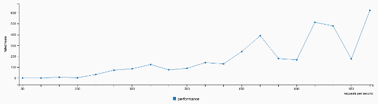
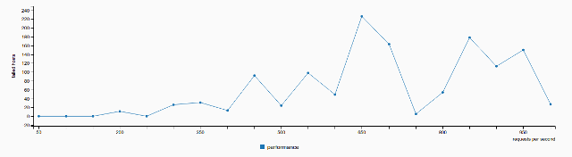
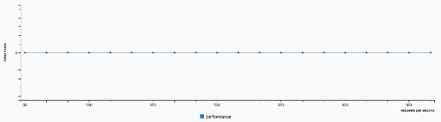

.. _Kubernetes_dns_performance_test_report:

**************************************
Kubernetes dns performance test report
**************************************

:Abstract:

  This document is the report for :ref:`Kubernetes_dns_performance_test_plan`

Environment description
=======================

This report is collected on the hardware described in
:ref:`intel_mirantis_performance_lab_1`.

Software
~~~~~~~~

Kubernetes is installed using :ref:`Kargo` deployment tool on Ubuntu 16.04.1.

Node roles:
 - node1: minion+master+etcd
 - node2: minion+master+etcd
 - node3: minion+etcd
 - node4: minion
 - node5: minion
 - node6: minion

Software versions:
 - OS: Ubuntu 16.04.1 LTS (Xenial Xerus)
 - Kernel: 4.4.0-47-generic
 - Docker: 1.13.0
 - Kubernetes: v1.5.1+coreos.0 and v1.5.3+coreos.0

Reports
=======

Test Case #1: Performing DNS queries
~~~~~~~~~~~~~~~~~~~~~~~~~~~~~~~~~~~~

Launched script where every next run uses parameters from previous one, but
number of req/sec increases on 50.

Detailed Stats
--------------

3 replicas of kubedns (v1.5.1)
^^^^^^^^^^^^^^^^^^^^^^^^^^^^^^

.. table:: Summary table performing DNS queries (v1.5.1)

  +----+--------------------+---------------------+----------+--------------+--------------+
  | #  | Number of services | Requests per second | Attempts | Failed hosts | Success rate |
  +-------------------------+---------------------+----------+--------------+--------------+
  | 1  | 1000               | 50                  | 1000     | 0            | 100%         |
  +-------------------------+---------------------+----------+--------------+--------------+
  | 2  | 1000               | 100                 | 1000     | 0            | 100%         |
  +-------------------------+---------------------+----------+--------------+--------------+
  | 3  | 1000               | 150                 | 1000     | 7            | 99.3%        |
  +-------------------------+---------------------+----------+--------------+--------------+
  | 4  | 1000               | 200                 | 1000     | 2            | 99.8%        |
  +-------------------------+---------------------+----------+--------------+--------------+
  | 5  | 1000               | 250                 | 1000     | 32           | 96.8%        |
  +-------------------------+---------------------+----------+--------------+--------------+
  | 6  | 1000               | 300                 | 1000     | 72           | 92.8%        |
  +-------------------------+---------------------+----------+--------------+--------------+
  | 7  | 1000               | 350                 | 1000     | 85           | 91.5%        |
  +-------------------------+---------------------+----------+--------------+--------------+
  | 8  | 1000               | 400                 | 1000     | 124          | 87.6%        |
  +-------------------------+---------------------+----------+--------------+--------------+
  | 9  | 1000               | 450                 | 1000     | 75           | 92.5%        |
  +-------------------------+---------------------+----------+--------------+--------------+
  | 10 | 1000               | 500                 | 1000     | 89           | 91.1%        |
  +-------------------------+---------------------+----------+--------------+--------------+
  | 11 | 1000               | 550                 | 1000     | 142          | 85.8%        |
  +-------------------------+---------------------+----------+--------------+--------------+
  | 12 | 1000               | 600                 | 1000     | 130          | 87%          |
  +-------------------------+---------------------+----------+--------------+--------------+
  | 13 | 1000               | 650                 | 1000     | 234          | 76.6%        |
  +-------------------------+---------------------+----------+--------------+--------------+
  | 14 | 1000               | 700                 | 1000     | 389          | 61.1%        |
  +-------------------------+---------------------+----------+--------------+--------------+
  | 15 | 1000               | 750                 | 1000     | 179          | 82.1%        |
  +-------------------------+---------------------+----------+--------------+--------------+
  | 16 | 1000               | 800                 | 1000     | 167          | 83.3%        |
  +-------------------------+---------------------+----------+--------------+--------------+
  | 17 | 1000               | 850                 | 1000     | 513          | 48.7%        |
  +-------------------------+---------------------+----------+--------------+--------------+
  | 18 | 1000               | 900                 | 1000     | 479          | 52.1%        |
  +-------------------------+---------------------+----------+--------------+--------------+
  | 19 | 1000               | 950                 | 1000     | 176          | 82.4%        |
  +-------------------------+---------------------+----------+--------------+--------------+
  | 20 | 1000               | 1000                | 1000     | 622          | 37.8%        |
  +-------------------------+---------------------+----------+--------------+--------------+

There was to increase performance for kubedns in new version Kubernetes(v1.5.3),
therefore ran test again.

1 replicas of kubedns (v1.5.3)
^^^^^^^^^^^^^^^^^^^^^^^^^^^^^^

.. table:: Summary table performing DNS queries (v1.5.3)

  +----+--------------------+---------------------+----------+--------------+--------------+
  | #  | Number of services | Requests per second | Attempts | Failed hosts | Success rate |
  +-------------------------+---------------------+----------+--------------+--------------+
  | 1  | 1000               | 50                  | 1000     | 0            | 100%         |
  +-------------------------+---------------------+----------+--------------+--------------+
  | 2  | 1000               | 100                 | 1000     | 0            | 100%         |
  +-------------------------+---------------------+----------+--------------+--------------+
  | 3  | 1000               | 150                 | 1000     | 0            | 100%         |
  +-------------------------+---------------------+----------+--------------+--------------+
  | 4  | 1000               | 200                 | 1000     | 11           | 98.9%        |
  +-------------------------+---------------------+----------+--------------+--------------+
  | 5  | 1000               | 250                 | 1000     | 0            | 100%         |
  +-------------------------+---------------------+----------+--------------+--------------+
  | 6  | 1000               | 300                 | 1000     | 26           | 97.4%        |
  +-------------------------+---------------------+----------+--------------+--------------+
  | 7  | 1000               | 350                 | 1000     | 31           | 96.9%        |
  +-------------------------+---------------------+----------+--------------+--------------+
  | 8  | 1000               | 400                 | 1000     | 13           | 98.7%        |
  +-------------------------+---------------------+----------+--------------+--------------+
  | 9  | 1000               | 450                 | 1000     | 92           | 90.8%        |
  +-------------------------+---------------------+----------+--------------+--------------+
  | 10 | 1000               | 500                 | 1000     | 24           | 97.6%        |
  +-------------------------+---------------------+----------+--------------+--------------+
  | 11 | 1000               | 550                 | 1000     | 98           | 90.2%        |
  +-------------------------+---------------------+----------+--------------+--------------+
  | 12 | 1000               | 600                 | 1000     | 49           | 95.1%        |
  +-------------------------+---------------------+----------+--------------+--------------+
  | 13 | 1000               | 650                 | 1000     | 226          | 77.4%        |
  +-------------------------+---------------------+----------+--------------+--------------+
  | 14 | 1000               | 700                 | 1000     | 163          | 83.7%        |
  +-------------------------+---------------------+----------+--------------+--------------+
  | 15 | 1000               | 750                 | 1000     | 5            | 99.5%        |
  +-------------------------+---------------------+----------+--------------+--------------+
  | 16 | 1000               | 800                 | 1000     | 54           | 94.6%        |
  +-------------------------+---------------------+----------+--------------+--------------+
  | 17 | 1000               | 850                 | 1000     | 178          | 82.2%        |
  +-------------------------+---------------------+----------+--------------+--------------+
  | 18 | 1000               | 900                 | 1000     | 113          | 88.7%        |
  +-------------------------+---------------------+----------+--------------+--------------+
  | 19 | 1000               | 950                 | 1000     | 150          | 85%          |
  +-------------------------+---------------------+----------+--------------+--------------+
  | 20 | 1000               | 1000                | 1000     | 27           | 97.3%        |
  +-------------------------+---------------------+----------+--------------+--------------+

2 replicas of kubedns (v1.5.3)
^^^^^^^^^^^^^^^^^^^^^^^^^^^^^^

.. table:: Summary table performing DNS queries (v1.5.3)

  +----+--------------------+---------------------+----------+--------------+--------------+
  | #  | Number of services | Requests per second | Attempts | Failed hosts | Success rate |
  +-------------------------+---------------------+----------+--------------+--------------+
  | 1  | 1000               | 50                  | 1000     | 0            | 100%         |
  +-------------------------+---------------------+----------+--------------+--------------+
  | 2  | 1000               | 100                 | 1000     | 0            | 100%         |
  +-------------------------+---------------------+----------+--------------+--------------+
  | 3  | 1000               | 150                 | 1000     | 0            | 100%         |
  +-------------------------+---------------------+----------+--------------+--------------+
  | 4  | 1000               | 200                 | 1000     | 0            | 100%         |
  +-------------------------+---------------------+----------+--------------+--------------+
  | 5  | 1000               | 250                 | 1000     | 0            | 100%         |
  +-------------------------+---------------------+----------+--------------+--------------+
  | 6  | 1000               | 300                 | 1000     | 0            | 100%         |
  +-------------------------+---------------------+----------+--------------+--------------+
  | 7  | 1000               | 350                 | 1000     | 0            | 100%         |
  +-------------------------+---------------------+----------+--------------+--------------+
  | 8  | 1000               | 400                 | 1000     | 0            | 100%         |
  +-------------------------+---------------------+----------+--------------+--------------+
  | 9  | 1000               | 450                 | 1000     | 0            | 100%         |
  +-------------------------+---------------------+----------+--------------+--------------+
  | 10 | 1000               | 500                 | 1000     | 0            | 100%         |
  +-------------------------+---------------------+----------+--------------+--------------+
  | 11 | 1000               | 550                 | 1000     | 0            | 100%         |
  +-------------------------+---------------------+----------+--------------+--------------+
  | 12 | 1000               | 600                 | 1000     | 0            | 100%         |
  +-------------------------+---------------------+----------+--------------+--------------+
  | 13 | 1000               | 650                 | 1000     | 0            | 100%         |
  +-------------------------+---------------------+----------+--------------+--------------+
  | 14 | 1000               | 700                 | 1000     | 0            | 100%         |
  +-------------------------+---------------------+----------+--------------+--------------+
  | 15 | 1000               | 750                 | 1000     | 0            | 100%         |
  +-------------------------+---------------------+----------+--------------+--------------+
  | 16 | 1000               | 800                 | 1000     | 0            | 100%         |
  +-------------------------+---------------------+----------+--------------+--------------+
  | 17 | 1000               | 850                 | 1000     | 0            | 100%         |
  +-------------------------+---------------------+----------+--------------+--------------+
  | 18 | 1000               | 900                 | 1000     | 0            | 100%         |
  +-------------------------+---------------------+----------+--------------+--------------+
  | 19 | 1000               | 950                 | 1000     | 0            | 100%         |
  +-------------------------+---------------------+----------+--------------+--------------+
  | 20 | 1000               | 1000                | 1000     | 0            | 100%         |
  +-------------------------+---------------------+----------+--------------+--------------+

3 replicas of kubedns (v1.5.3)
^^^^^^^^^^^^^^^^^^^^^^^^^^^^^^

.. table:: Summary table performing DNS queries (v1.5.3)

  +----+--------------------+---------------------+----------+--------------+--------------+
  | #  | Number of services | Requests per second | Attempts | Failed hosts | Success rate |
  +-------------------------+---------------------+----------+--------------+--------------+
  | 1  | 1000               | 50                  | 1000     | 0            | 100%         |
  +-------------------------+---------------------+----------+--------------+--------------+
  | 2  | 1000               | 100                 | 1000     | 0            | 100%         |
  +-------------------------+---------------------+----------+--------------+--------------+
  | 3  | 1000               | 150                 | 1000     | 0            | 100%         |
  +-------------------------+---------------------+----------+--------------+--------------+
  | 4  | 1000               | 200                 | 1000     | 0            | 100%         |
  +-------------------------+---------------------+----------+--------------+--------------+
  | 5  | 1000               | 250                 | 1000     | 0            | 100%         |
  +-------------------------+---------------------+----------+--------------+--------------+
  | 6  | 1000               | 300                 | 1000     | 0            | 100%         |
  +-------------------------+---------------------+----------+--------------+--------------+
  | 7  | 1000               | 350                 | 1000     | 0            | 100%         |
  +-------------------------+---------------------+----------+--------------+--------------+
  | 8  | 1000               | 400                 | 1000     | 0            | 100%         |
  +-------------------------+---------------------+----------+--------------+--------------+
  | 9  | 1000               | 450                 | 1000     | 0            | 100%         |
  +-------------------------+---------------------+----------+--------------+--------------+
  | 10 | 1000               | 500                 | 1000     | 0            | 100%         |
  +-------------------------+---------------------+----------+--------------+--------------+
  | 11 | 1000               | 550                 | 1000     | 0            | 100%         |
  +-------------------------+---------------------+----------+--------------+--------------+
  | 12 | 1000               | 600                 | 1000     | 0            | 100%         |
  +-------------------------+---------------------+----------+--------------+--------------+
  | 13 | 1000               | 650                 | 1000     | 0            | 100%         |
  +-------------------------+---------------------+----------+--------------+--------------+
  | 14 | 1000               | 700                 | 1000     | 0            | 100%         |
  +-------------------------+---------------------+----------+--------------+--------------+
  | 15 | 1000               | 750                 | 1000     | 0            | 100%         |
  +-------------------------+---------------------+----------+--------------+--------------+
  | 16 | 1000               | 800                 | 1000     | 0            | 100%         |
  +-------------------------+---------------------+----------+--------------+--------------+
  | 17 | 1000               | 850                 | 1000     | 0            | 100%         |
  +-------------------------+---------------------+----------+--------------+--------------+
  | 18 | 1000               | 900                 | 1000     | 0            | 100%         |
  +-------------------------+---------------------+----------+--------------+--------------+
  | 19 | 1000               | 950                 | 1000     | 0            | 100%         |
  +-------------------------+---------------------+----------+--------------+--------------+
  | 20 | 1000               | 1000                | 1000     | 0            | 100%         |
  +-------------------------+---------------------+----------+--------------+--------------+
  | 21 | 1000               | 1500                | 1000     | 0            | 100%         |
  +-------------------------+---------------------+----------+--------------+--------------+
  | 22 | 1000               | 2000                | 1000     | 0            | 100%         |
  +-------------------------+---------------------+----------+--------------+--------------+
  | 23 | 1000               | 2500                | 1000     | 0            | 100%         |
  +-------------------------+---------------------+----------+--------------+--------------+
  | 24 | 1000               | 3000                | 1000     | 0            | 100%         |
  +-------------------------+---------------------+----------+--------------+--------------+
  | 25 | 1000               | 3500                | 1000     | 0            | 100%         |
  +-------------------------+---------------------+----------+--------------+--------------+