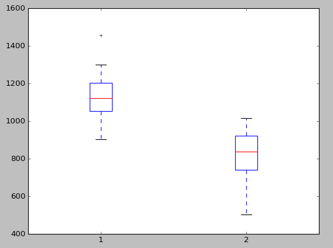

.. _Kubernetes_pod_recovery_test_report:

******************************
Kubernetes density test report
******************************

:Abstract:

  This document is the report for :ref:`Kubernetes_pod_recovery_test_plan`

Environment description
=======================

This report is collected on the hardware described in
:ref:`intel_mirantis_performance_lab_1`.

Software
~~~~~~~~

Kubernetes is installed using :ref:`Kargo` deployment tool on Ubuntu 16.04.1.

Node roles:
 - node1: minion+master+etcd
 - node2: minion+master+etcd
 - node3: minion+etcd
 - node4: minion

Software versions:
 - OS: Ubuntu 16.04.1 LTS (Xenial Xerus)
 - Kernel: 4.4.0-47
 - Docker: 1.12.1
 - Kubernetes: 1.4.3

Reports
=======

Test Case #1: POD restart
-------------------------

With Kubernetes support of gracefully POD restart the service downtime is
minimized and may result in several requests to fail. The following chart is
based on 11 measurements: column 1 - no POD restart, 2 - with POD restart:

.. list-table:: POD stats
    :header-rows: 1

    *
      - RPS_BASE
      - RPS_WHILE_RESCHEDULING
    *
      - 1136 (stddev 162)
      - 818 (stddev 158)
