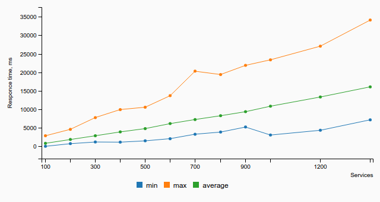
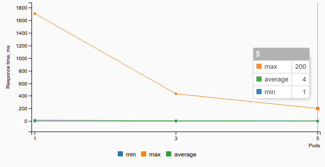
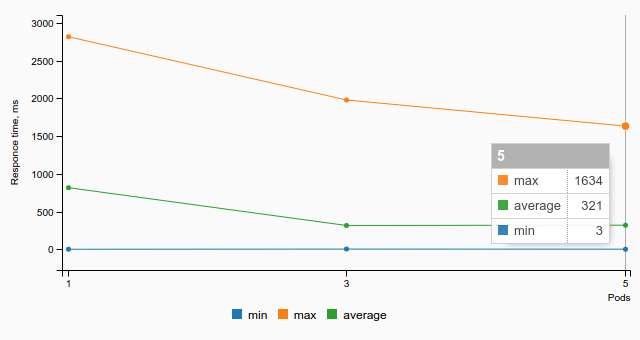

.. _Kubernetes_proxy_performance_test_report:

****************************************
Kubernetes proxy performance test report
****************************************

:Abstract:

  This document is the report for :ref:`Kubernetes_proxy_performance_test_plan`

Environment description
=======================

This report is collected on the hardware described in
:ref:`intel_mirantis_performance_lab_1`.

Software
~~~~~~~~

Kubernetes is installed using :ref:`Kargo` deployment tool on Ubuntu 16.04.1.

Node roles:
 - node1: minion+master+etcd
 - node2: minion+master+etcd
 - node3: minion+etcd
 - node4: minion
 - node5: minion
 - node6: minion

Software versions:
 - OS: Ubuntu 16.04.1 LTS (Xenial Xerus)
 - Kernel: 4.4.0-47-generic
 - Docker: 1.13.0
 - Kubernetes: v1.5.3+coreos.0

Reports
=======

Test Case #1: Performing kube-proxy
~~~~~~~~~~~~~~~~~~~~~~~~~~~~~~~~~~~

Launched script that adds 100 services

Detailed Stats
--------------

Case group 1
^^^^^^^^^^^^

Note: You can download these reports in csv format
:download:`here <reports.tar.gz>`

.. list-table:: Response time stats
    :header-rows: 1

    *
      - SERVICE_COUNT
      - MIN_RESPONCE, ms
      - AVERAGE_RESPONSE, ms
      - MAX_RESPONSE, ms
    *
      - 100
      - 12
      - 821
      - 2854
    *
      - 200
      - 717
      - 1843
      - 4599
    *
      - 300
      - 1173
      - 2859
      - 7773
    *
      - 400
      - 1132
      - 3898
      - 9939
    *
      - 500
      - 1483
      - 4794
      - 10567
    *
      - 600
      - 2077
      - 6139
      - 13680
    *
      - 700
      - 3280
      - 7246
      - 20293
    *
      - 800
      - 3853
      - 8268
      - 19396
    *
      - 900
      - 5216
      - 9357
      - 21877
    *
      - 1000
      - 3056
      - 10844
      - 23374
    *
      - 1200
      - 4339
      - 13327
      - 27060
    *
      - 1400
      - 7168
      - 16072
      - 34114

Case group 2
^^^^^^^^^^^^

Note: The dependence of the time response from number of pods.

.. list-table:: for 10 services
    :header-rows: 1

    *
      - POD_COUNT
      - MIN_RESPONCE, ms
      - AVERAGE_RESPONSE, ms
      - MAX_RESPONSE, ms
    *
      - 1
      - 1
      - 16
      - 1704
    *
      - 3
      - 1
      - 5
      - 434
    *
      - 5
      - 1
      - 4
      - 200

.. list-table:: for 50 services
    :header-rows: 1

    *
      - POD_COUNT
      - MIN_RESPONCE, ms
      - AVERAGE_RESPONSE, ms
      - MAX_RESPONSE, ms
    *
      - 1
      - 2
      - 818
      - 2818
    *
      - 3
      - 4
      - 317
      - 1980
    *
      - 5
      - 3
      - 321
      - 1634
