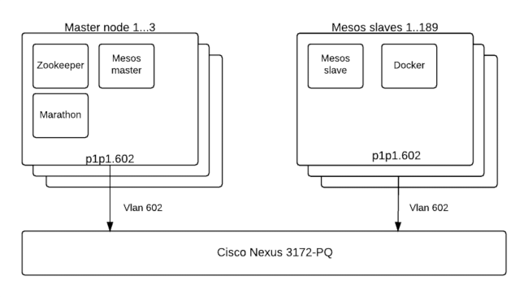

.. _Results_of_measuring_performance_of_Mesos_Marathon:

**************************************************
Results of measuring performance of Mesos Marathon
**************************************************

:Abstract:

  This document includes performance test results for `Mesos`_ as a container
  platform for `Docker`_ with `Marathon`_. All test have been performed
  regarding
  :ref:`Measuring_performance_of_mesos_marathon`

Environment description
=======================
Cluster description
-------------------
* 3 master nodes with Mesos, Marathon and Zookeeper
* 189 mesos slaves nodes

Software versions
-----------------
* Mesos - 0.27.0
* Marathon - 0.15.2
* Zookeeper - 3.4.5
* Docker - 1.10.2

Running options
---------------
* Marathon extra options are "-Xmx2048m --max_tasks_per_offer 20"

Hardware configuration of each server
-------------------------------------

.. table:: Description of servers hardware

  +-------+----------------+------------------------+
  |server |vendor,model    |HP,DL380 Gen9           |
  |       +----------------+------------------------+
  |       |operating_system| | 3.13.0-76-generic    |
  |       |                | | Ubuntu-trusty        |
  |       |                | | x86_64               |
  +-------+----------------+------------------------+
  |CPU    |vendor,model    |Intel,E5-2680 v3        |
  |       +----------------+------------------------+
  |       |processor_count |2                       |
  |       +----------------+------------------------+
  |       |core_count      |12                      |
  |       +----------------+------------------------+
  |       |frequency_MHz   |2500                    |
  +-------+----------------+------------------------+
  |RAM    |vendor,model    |HP,752369-081           |
  |       +----------------+------------------------+
  |       |amount_MB       |262144                  |
  +-------+----------------+------------------------+
  |NETWORK|interface_name  |p1p1                    |
  |       +----------------+------------------------+
  |       |vendor,model    |Intel,X710 Dual Port    |
  |       +----------------+------------------------+
  |       |bandwidth       |10G                     |
  +-------+----------------+------------------------+
  |STORAGE|dev_name        |/dev/sda                |
  |       +----------------+------------------------+
  |       |vendor,model    | | raid10 - HP P840     |
  |       |                | | 12 disks EH0600JEDHE |
  |       +----------------+------------------------+
  |       |SSD/HDD         |HDD                     |
  |       +----------------+------------------------+
  |       |size            | 3,6TB                  |
  +-------+----------------+------------------------+

Network scheme and part of configuration of hardware network switches
---------------------------------------------------------------------
Network scheme of the environment:

Here is the part of switch configuration for each switch port which connected to
p1p1.603 interface of a server:

.. code:: bash

   switchport mode trunk
   switchport trunk native vlan 600
   switchport trunk allowed vlan 600-602,630-649
   spanning-tree port type edge trunk
   spanning-tree bpduguard enable
   no snmp trap link-status

Results
=======

.. include:: results-mesos-marathon.rst

.. references:

.. _Mesos: http://mesos.apache.org
.. _Marathon: https://mesosphere.github.io/marathon
.. _Docker: http://docker.com