Test create
-----------
+-------------+------------------------------+--------+--------+---------+--------+
| CONCURRENCY | NODES_NUMBER_PER_APPLICATION | APPLICATION_OPERATION (sec)        |
|             |                              +--------+--------+---------+--------+
|             |                              |minimum |maximum | average | median |
+=============+==============================+========+========+=========+========+
|1            |50                            |6.15    |6.15    |6.15     |6.15    |
+-------------+------------------------------+--------+--------+---------+--------+
|1            |100                           |6.09    |6.09    |6.09     |6.09    |
+-------------+------------------------------+--------+--------+---------+--------+
|1            |500                           |14.18   |14.18   |14.18    |14.18   |
+-------------+------------------------------+--------+--------+---------+--------+
|2            |50                            |6.08    |6.1     |6.09     |6.09    |
+-------------+------------------------------+--------+--------+---------+--------+
|2            |100                           |6.09    |6.12    |6.11     |6.105   |
+-------------+------------------------------+--------+--------+---------+--------+
|2            |500                           |20.3    |22.27   |21.29    |21.285  |
+-------------+------------------------------+--------+--------+---------+--------+
|4            |50                            |6.15    |16.2    |11.66    |12.155  |
+-------------+------------------------------+--------+--------+---------+--------+
|4            |100                           |6.24    |16.19   |10.24    |9.26    |
+-------------+------------------------------+--------+--------+---------+--------+
|4            |500                           |28.39   |38.42   |33.13    |32.86   |
+-------------+------------------------------+--------+--------+---------+--------+
|8            |50                            |8.11    |12.24   |10.16    |10.16   |
+-------------+------------------------------+--------+--------+---------+--------+
|8            |100                           |6.46    |16.25   |12.08    |13.185  |
+-------------+------------------------------+--------+--------+---------+--------+
|8            |500                           |29.12   |83.03   |58.19    |58.06   |
+-------------+------------------------------+--------+--------+---------+--------+
|16           |50                            |8.12    |20.36   |12.88    |13.22   |
+-------------+------------------------------+--------+--------+---------+--------+
|16           |100                           |9.02    |26.39   |19.3     |20.28   |
+-------------+------------------------------+--------+--------+---------+--------+
|16           |500                           |130.43  |453.85  |296.59   |320.07  |
+-------------+------------------------------+--------+--------+---------+--------+

Graph for test create, concurrency 1

.. image:: create-1.png
   :alt: Graph for test create, concurrency 1

Graph for test create, concurrency 2

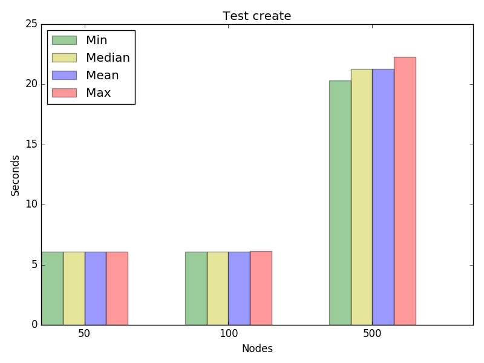

Graph for test create, concurrency 4

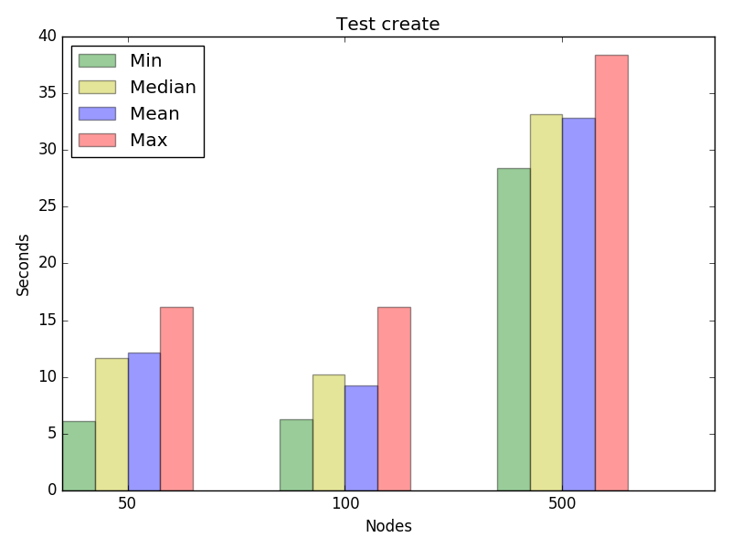

Graph for test create, concurrency 8

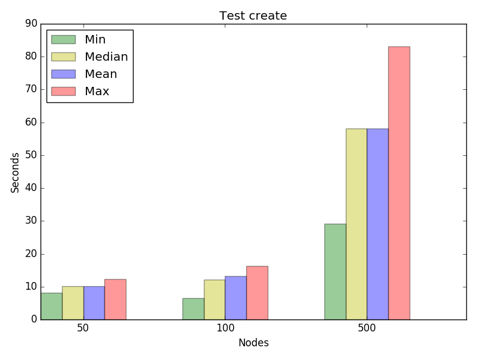

Graph for test create, concurrency 16

.. image:: create-16.png
   :alt: Graph for test create, concurrency 16

Test delete
-----------
+-------------+------------------------------+--------+--------+---------+--------+
| CONCURRENCY | NODES_NUMBER_PER_APPLICATION | APPLICATION_OPERATION (sec)        |
|             |                              +--------+--------+---------+--------+
|             |                              |minimum |maximum | average | median |
+=============+==============================+========+========+=========+========+
|1            |50                            |0.01    |0.01    |0.01     |0.01    |
+-------------+------------------------------+--------+--------+---------+--------+
|1            |100                           |0.01    |0.01    |0.01     |0.01    |
+-------------+------------------------------+--------+--------+---------+--------+
|1            |500                           |0.01    |0.01    |0.01     |0.01    |
+-------------+------------------------------+--------+--------+---------+--------+
|2            |50                            |0.01    |0.02    |0.01     |0.01    |
+-------------+------------------------------+--------+--------+---------+--------+
|2            |100                           |0.02    |0.02    |0.02     |0.02    |
+-------------+------------------------------+--------+--------+---------+--------+
|2            |500                           |0.01    |0.02    |0.01     |0.01    |
+-------------+------------------------------+--------+--------+---------+--------+
|4            |50                            |0.02    |0.03    |0.03     |0.03    |
+-------------+------------------------------+--------+--------+---------+--------+
|4            |100                           |0.02    |0.03    |0.03     |0.03    |
+-------------+------------------------------+--------+--------+---------+--------+
|4            |500                           |0.02    |0.04    |0.03     |0.04    |
+-------------+------------------------------+--------+--------+---------+--------+
|8            |50                            |0.04    |0.05    |0.04     |0.04    |
+-------------+------------------------------+--------+--------+---------+--------+
|8            |100                           |0.04    |0.05    |0.05     |0.05    |
+-------------+------------------------------+--------+--------+---------+--------+
|8            |500                           |0.05    |0.07    |0.06     |0.07    |
+-------------+------------------------------+--------+--------+---------+--------+
|16           |50                            |0.12    |0.13    |0.12     |0.12    |
+-------------+------------------------------+--------+--------+---------+--------+
|16           |100                           |0.09    |0.11    |0.1      |0.1     |
+-------------+------------------------------+--------+--------+---------+--------+
|16           |500                           |0.13    |0.15    |0.14     |0.14    |
+-------------+------------------------------+--------+--------+---------+--------+

Graph for test delete, concurrency 1

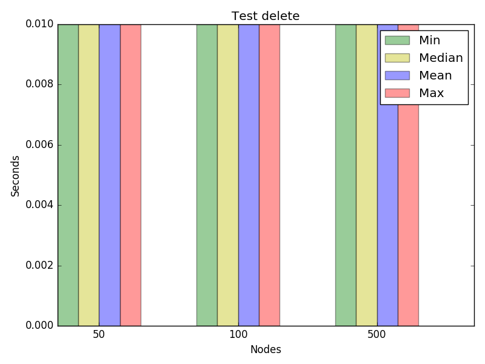

Graph for test delete, concurrency 2

.. image:: delete-2.png
   :alt: Graph for test delete, concurrency 2

Graph for test delete, concurrency 4

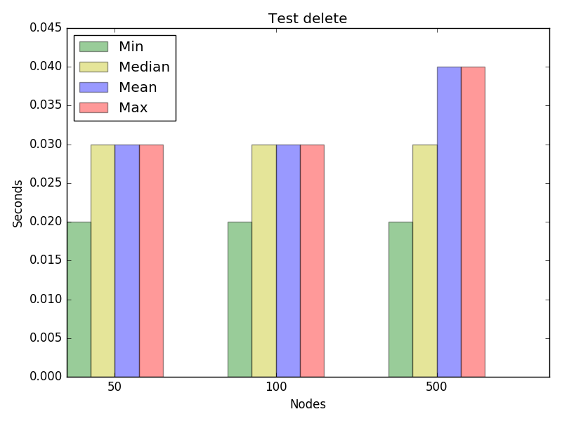

Graph for test delete, concurrency 8

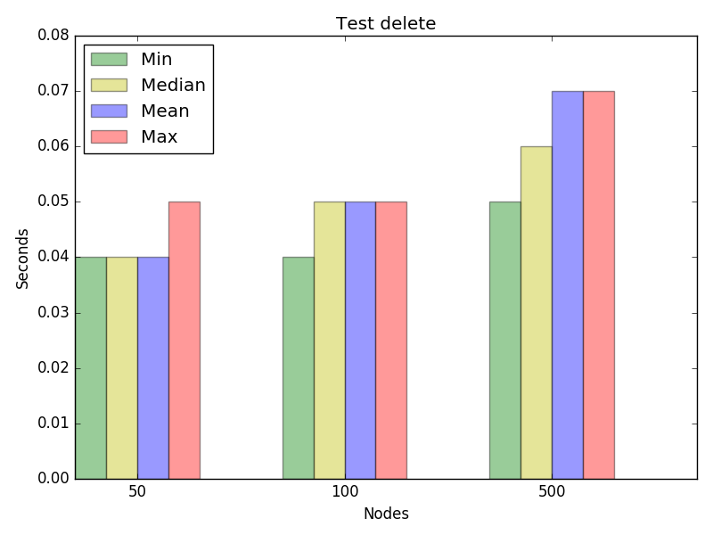

Graph for test delete, concurrency 16

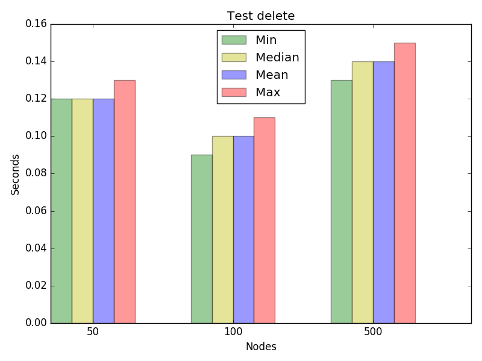

Test restart
------------
+-------------+------------------------------+--------+--------+---------+--------+
| CONCURRENCY | NODES_NUMBER_PER_APPLICATION | APPLICATION_OPERATION (sec)        |
|             |                              +--------+--------+---------+--------+
|             |                              |minimum |maximum | average | median |
+=============+==============================+========+========+=========+========+
|1            |500                           |28.63   |28.63   |28.63    |28.63   |
+-------------+------------------------------+--------+--------+---------+--------+
|2            |50                            |8.51    |8.53    |8.52     |8.52    |
+-------------+------------------------------+--------+--------+---------+--------+
|2            |100                           |14.47   |16.59   |15.53    |15.53   |
+-------------+------------------------------+--------+--------+---------+--------+
|2            |500                           |28.81   |30.83   |29.82    |29.82   |
+-------------+------------------------------+--------+--------+---------+--------+
|4            |50                            |10.56   |12.53   |11.07    |10.59   |
+-------------+------------------------------+--------+--------+---------+--------+
|4            |100                           |12.74   |28.65   |18.19    |15.69   |
+-------------+------------------------------+--------+--------+---------+--------+
|4            |500                           |63.31   |75.2    |68.69    |68.12   |
+-------------+------------------------------+--------+--------+---------+--------+
|8            |50                            |12.75   |22.68   |17.18    |16.64   |
+-------------+------------------------------+--------+--------+---------+--------+
|8            |100                           |26.73   |38.87   |31.54    |30.755  |
+-------------+------------------------------+--------+--------+---------+--------+
|8            |500                           |433.62  |441.69  |439.17   |439.505 |
+-------------+------------------------------+--------+--------+---------+--------+
|16           |50                            |19.36   |30.86   |23.32    |22.73   |
+-------------+------------------------------+--------+--------+---------+--------+
|16           |100                           |45.8    |63.07   |51.96    |51.35   |
+-------------+------------------------------+--------+--------+---------+--------+
|16           |500                           |605.63  |1204.02 |709.46   |646.73  |
+-------------+------------------------------+--------+--------+---------+--------+

Graph for test restart, concurrency 2

.. image:: restart-2.png
   :alt: Graph for test restart, concurrency 2

Graph for test restart, concurrency 4

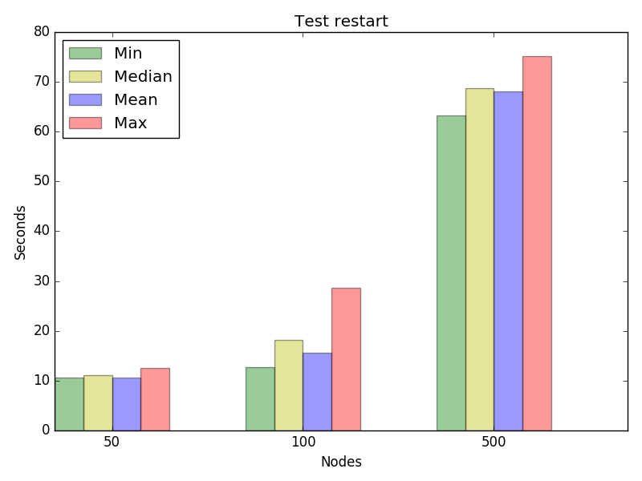

Graph for test restart, concurrency 8

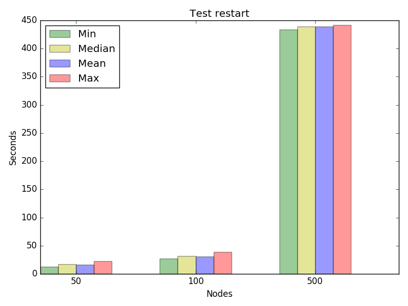

Graph for test restart, concurrency 16

.. image:: restart-16.png
   :alt: Graph for test restart, concurrency 16

Test update_cpu
---------------
+-------------+------------------------------+--------+--------+---------+--------+
| CONCURRENCY | NODES_NUMBER_PER_APPLICATION | APPLICATION_OPERATION (sec)        |
|             |                              +--------+--------+---------+--------+
|             |                              |minimum |maximum | average | median |
+=============+==============================+========+========+=========+========+
|1            |50                            |12.51   |12.51   |12.51    |12.51   |
+-------------+------------------------------+--------+--------+---------+--------+
|1            |100                           |12.56   |12.56   |12.56    |12.56   |
+-------------+------------------------------+--------+--------+---------+--------+
|1            |500                           |22.63   |22.63   |22.63    |22.63   |
+-------------+------------------------------+--------+--------+---------+--------+
|2            |50                            |6.51    |8.49    |7.5      |7.5     |
+-------------+------------------------------+--------+--------+---------+--------+
|2            |100                           |14.53   |16.58   |15.55    |15.555  |
+-------------+------------------------------+--------+--------+---------+--------+
|2            |500                           |20.73   |26.72   |23.73    |23.725  |
+-------------+------------------------------+--------+--------+---------+--------+
|4            |50                            |8.52    |14.56   |11.52    |11.5    |
+-------------+------------------------------+--------+--------+---------+--------+
|4            |100                           |14.6    |71.14   |30.77    |18.67   |
+-------------+------------------------------+--------+--------+---------+--------+
|4            |500                           |47.03   |55.09   |50.56    |50.06   |
+-------------+------------------------------+--------+--------+---------+--------+
|8            |50                            |8.56    |26.71   |16.61    |16.59   |
+-------------+------------------------------+--------+--------+---------+--------+
|8            |100                           |18.65   |32.73   |24.67    |24.655  |
+-------------+------------------------------+--------+--------+---------+--------+
|8            |500                           |219.0   |249.28  |239.4    |243.815 |
+-------------+------------------------------+--------+--------+---------+--------+
|16           |50                            |16.63   |32.78   |22.68    |22.68   |
+-------------+------------------------------+--------+--------+---------+--------+
|16           |100                           |37.56   |44.87   |41.58    |40.95   |
+-------------+------------------------------+--------+--------+---------+--------+
|16           |500                           |610.82  |1205.25 |883.32   |736.29  |
+-------------+------------------------------+--------+--------+---------+--------+

Graph for test update_cpu, concurrency 1

.. image:: update_cpu-1.png
   :alt: Graph for test update_cpu, concurrency 1

Graph for test update_cpu, concurrency 2

.. image:: update_cpu-2.png
   :alt: Graph for test update_cpu, concurrency 2

Graph for test update_cpu, concurrency 4

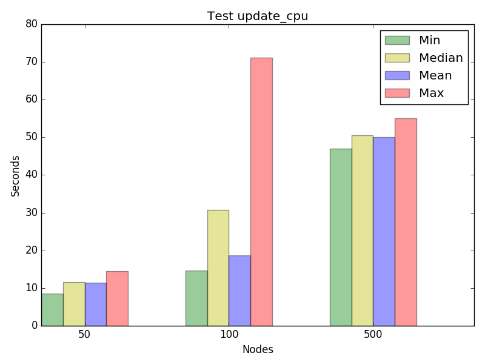

Graph for test update_cpu, concurrency 8

.. image:: update_cpu-8.png
   :alt: Graph for test update_cpu, concurrency 8

Graph for test update_cpu, concurrency 16

.. image:: update_cpu-16.png
   :alt: Graph for test update_cpu, concurrency 16

Test update_disk
----------------
+-------------+------------------------------+--------+--------+---------+--------+
| CONCURRENCY | NODES_NUMBER_PER_APPLICATION | APPLICATION_OPERATION (sec)        |
|             |                              +--------+--------+---------+--------+
|             |                              |minimum |maximum | average | median |
+=============+==============================+========+========+=========+========+
|1            |50                            |10.48   |10.48   |10.48    |10.48   |
+-------------+------------------------------+--------+--------+---------+--------+
|1            |100                           |16.59   |16.59   |16.59    |16.59   |
+-------------+------------------------------+--------+--------+---------+--------+
|1            |500                           |26.65   |26.65   |26.65    |26.65   |
+-------------+------------------------------+--------+--------+---------+--------+
|2            |50                            |8.52    |12.56   |10.54    |10.54   |
+-------------+------------------------------+--------+--------+---------+--------+
|2            |100                           |14.56   |26.61   |20.59    |20.585  |
+-------------+------------------------------+--------+--------+---------+--------+
|2            |500                           |26.67   |28.68   |27.68    |27.675  |
+-------------+------------------------------+--------+--------+---------+--------+
|4            |50                            |10.56   |20.55   |14.05    |12.555  |
+-------------+------------------------------+--------+--------+---------+--------+
|4            |100                           |12.59   |20.63   |17.6     |18.59   |
+-------------+------------------------------+--------+--------+---------+--------+
|4            |500                           |53.01   |55.1    |53.58    |53.1    |
+-------------+------------------------------+--------+--------+---------+--------+
|8            |50                            |10.67   |26.75   |19.66    |19.635  |
+-------------+------------------------------+--------+--------+---------+--------+
|8            |100                           |15.18   |20.68   |17.99    |17.705  |
+-------------+------------------------------+--------+--------+---------+--------+
|8            |500                           |395.82  |441.34  |415.5    |402.97  |
+-------------+------------------------------+--------+--------+---------+--------+
|16           |50                            |15.0    |32.79   |24.62    |24.705  |
+-------------+------------------------------+--------+--------+---------+--------+
|16           |100                           |44.19   |50.94   |47.14    |46.995  |
+-------------+------------------------------+--------+--------+---------+--------+
|16           |500                           |426.87  |1204.53 |731.92   |610.83  |
+-------------+------------------------------+--------+--------+---------+--------+

Graph for test update_disk, concurrency 1

.. image:: update_disk-1.png
   :alt: Graph for test update_disk, concurrency 1

Graph for test update_disk, concurrency 2

.. image:: update_disk-2.png
   :alt: Graph for test update_disk, concurrency 2

Graph for test update_disk, concurrency 4

.. image:: update_disk-4.png
   :alt: Graph for test update_disk, concurrency 4

Graph for test update_disk, concurrency 8

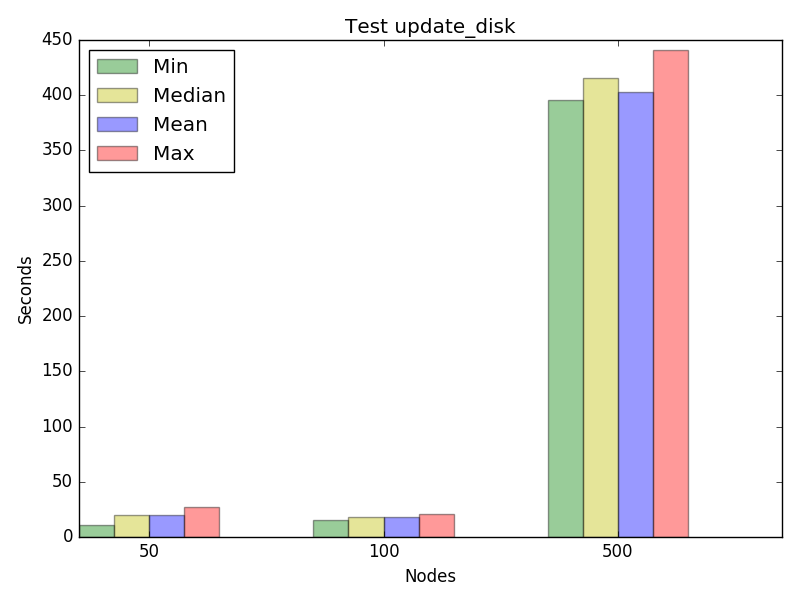

Graph for test update_disk, concurrency 16

.. image:: update_disk-16.png
   :alt: Graph for test update_disk, concurrency 16

Test update_instances
---------------------
+-------------+------------------------------+--------+--------+---------+--------+
| CONCURRENCY | NODES_NUMBER_PER_APPLICATION | APPLICATION_OPERATION (sec)        |
|             |                              +--------+--------+---------+--------+
|             |                              |minimum |maximum | average | median |
+=============+==============================+========+========+=========+========+
|1            |50                            |600.05  |600.05  |600.05   |600.05  |
+-------------+------------------------------+--------+--------+---------+--------+
|1            |100                           |16.17   |16.17   |16.17    |16.17   |
+-------------+------------------------------+--------+--------+---------+--------+
|1            |500                           |600.31  |600.31  |600.31   |600.31  |
+-------------+------------------------------+--------+--------+---------+--------+
|2            |50                            |10.12   |600.11  |305.12   |305.115 |
+-------------+------------------------------+--------+--------+---------+--------+
|2            |100                           |14.16   |600.19  |307.18   |307.175 |
+-------------+------------------------------+--------+--------+---------+--------+
|2            |500                           |600.72  |601.09  |600.9    |600.905 |
+-------------+------------------------------+--------+--------+---------+--------+
|4            |50                            |10.13   |600.17  |452.65   |600.155 |
+-------------+------------------------------+--------+--------+---------+--------+
|4            |100                           |14.18   |600.36  |308.75   |310.225 |
+-------------+------------------------------+--------+--------+---------+--------+
|4            |500                           |39.4    |602.01  |461.02   |601.33  |
+-------------+------------------------------+--------+--------+---------+--------+
|8            |50                            |20.24   |600.4   |323.46   |336.595 |
+-------------+------------------------------+--------+--------+---------+--------+
|8            |100                           |18.23   |600.79  |169.8    |28.68   |
+-------------+------------------------------+--------+--------+---------+--------+
|8            |500                           |150.94  |603.91  |546.72   |603.255 |
+-------------+------------------------------+--------+--------+---------+--------+
|16           |50                            |14.25   |600.72  |276.17   |32.375  |
+-------------+------------------------------+--------+--------+---------+--------+
|16           |100                           |24.24   |601.53  |351.71   |601.0   |
+-------------+------------------------------+--------+--------+---------+--------+
|16           |500                           |603.1   |1206.38 |1016.9   |1203.81 |
+-------------+------------------------------+--------+--------+---------+--------+

Graph for test update_instances, concurrency 1

.. image:: update_instances-1.png
   :alt: Graph for test update_instances, concurrency 1

Graph for test update_instances, concurrency 2

.. image:: update_instances-2.png
   :alt: Graph for test update_instances, concurrency 2

Graph for test update_instances, concurrency 4

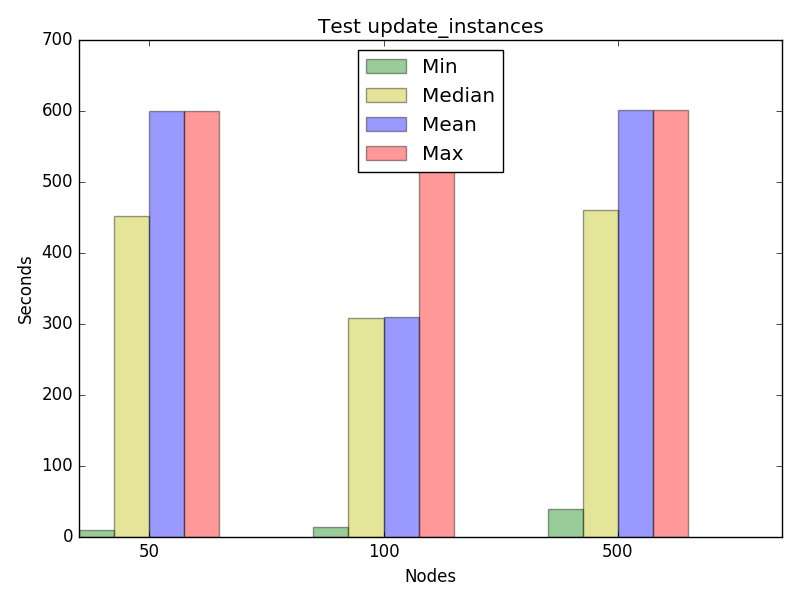

Graph for test update_instances, concurrency 8

.. image:: update_instances-8.png
   :alt: Graph for test update_instances, concurrency 8

Graph for test update_instances, concurrency 16

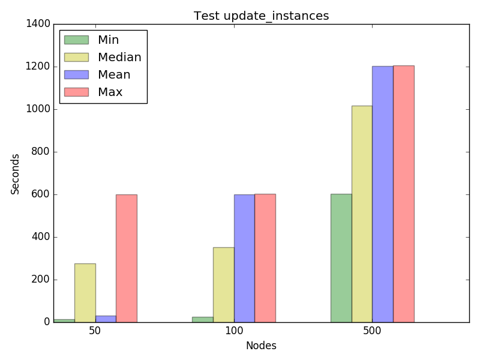

Test update_mem
---------------
+-------------+------------------------------+--------+--------+---------+--------+
| CONCURRENCY | NODES_NUMBER_PER_APPLICATION | APPLICATION_OPERATION (sec)        |
|             |                              +--------+--------+---------+--------+
|             |                              |minimum |maximum | average | median |
+=============+==============================+========+========+=========+========+
|1            |50                            |8.58    |8.58    |8.58     |8.58    |
+-------------+------------------------------+--------+--------+---------+--------+
|1            |100                           |10.55   |10.55   |10.55    |10.55   |
+-------------+------------------------------+--------+--------+---------+--------+
|1            |500                           |22.68   |22.68   |22.68    |22.68   |
+-------------+------------------------------+--------+--------+---------+--------+
|2            |50                            |10.46   |10.48   |10.47    |10.47   |
+-------------+------------------------------+--------+--------+---------+--------+
|2            |100                           |10.54   |14.5    |12.52    |12.52   |
+-------------+------------------------------+--------+--------+---------+--------+
|2            |500                           |26.6    |26.76   |26.68    |26.68   |
+-------------+------------------------------+--------+--------+---------+--------+
|4            |50                            |10.51   |10.55   |10.54    |10.54   |
+-------------+------------------------------+--------+--------+---------+--------+
|4            |100                           |10.57   |18.65   |16.59    |18.575  |
+-------------+------------------------------+--------+--------+---------+--------+
|4            |500                           |56.96   |69.29   |63.66    |64.2    |
+-------------+------------------------------+--------+--------+---------+--------+
|8            |50                            |18.61   |22.74   |21.16    |20.695  |
+-------------+------------------------------+--------+--------+---------+--------+
|8            |100                           |15.1    |26.77   |21.26    |20.7    |
+-------------+------------------------------+--------+--------+---------+--------+
|8            |500                           |294.84  |304.16  |300.42   |300.86  |
+-------------+------------------------------+--------+--------+---------+--------+
|16           |50                            |13.92   |24.67   |19.78    |21.645  |
+-------------+------------------------------+--------+--------+---------+--------+
|16           |100                           |39.57   |49.03   |41.95    |41.24   |
+-------------+------------------------------+--------+--------+---------+--------+
|16           |500                           |498.57  |1204.44 |666.49   |624.195 |
+-------------+------------------------------+--------+--------+---------+--------+

Graph for test update_mem, concurrency 1

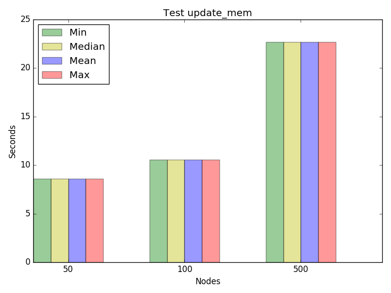

Graph for test update_mem, concurrency 2

.. image:: update_mem-2.png
   :alt: Graph for test update_mem, concurrency 2

Graph for test update_mem, concurrency 4

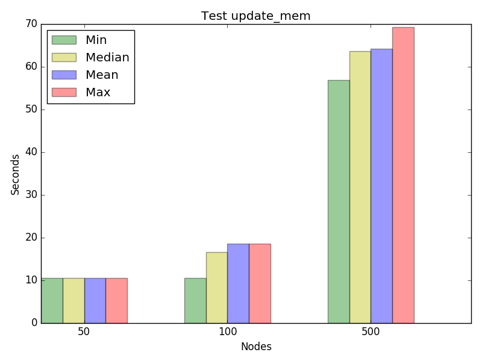

Graph for test update_mem, concurrency 8

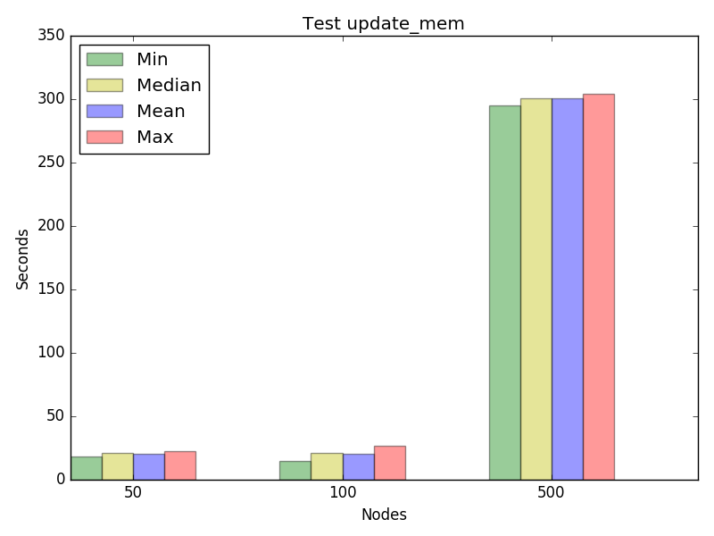

Graph for test update_mem, concurrency 16

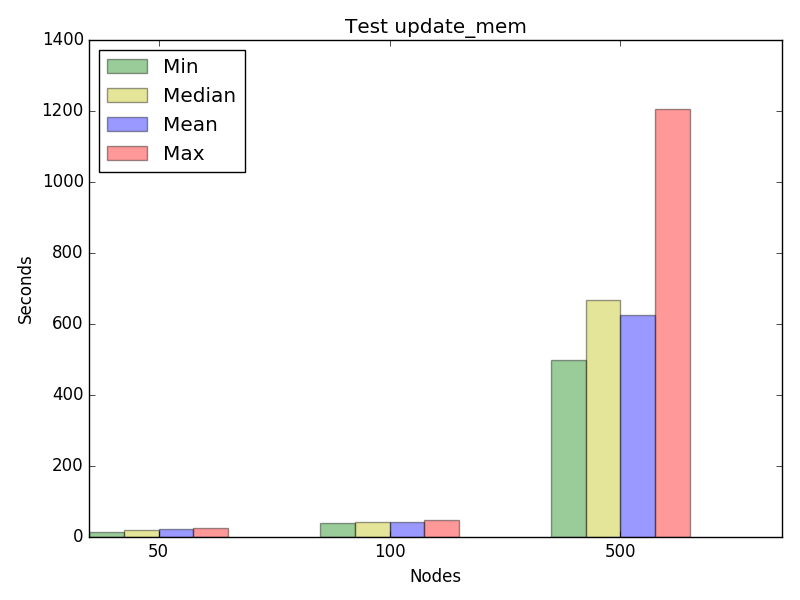

