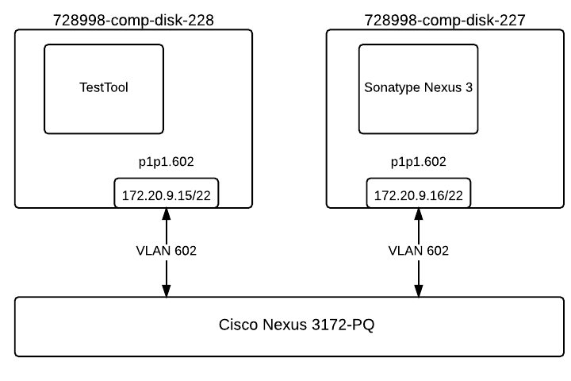
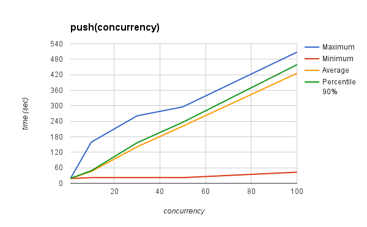
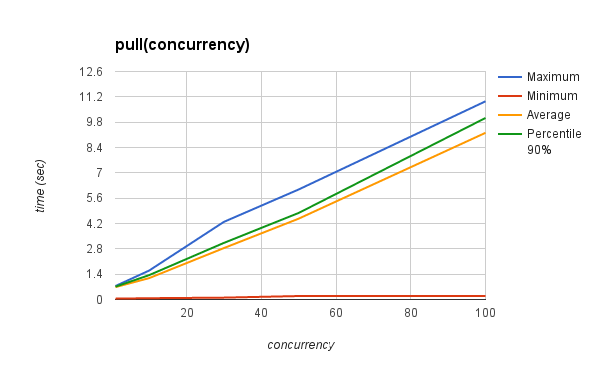

.. _Measuring_performance_of_Sonatype_Nexus:

**************************************************
Results of measuring performance of Sonatype Nexus
**************************************************

:Abstract:

  This document includes performance test results of `Sonatype Nexus`_ service
  as a repository of docker images. All test have been performed regarding
  :ref:`Measuring_performance_of_container_repositories`

Environment description
=======================
Hardware configuration of each server
-------------------------------------

.. table:: Description of servers hardware

  +-------+----------------+------------------------+------------------------+
  |server |name            |728998-comp-disk-228    |728998-comp-disk-227    |
  |       +----------------+------------------------+------------------------+
  |       |role            |test_tool               |Nexus                   |
  |       +----------------+------------------------+------------------------+
  |       |vendor,model    |HP,DL380 Gen9           |HP,DL380 Gen9           |
  |       +----------------+------------------------+------------------------+
  |       |operating_system| | 3.13.0-76-generic    | | 3.13.0-76-generic    |
  |       |                | | Ubuntu-trusty        | | Ubuntu-trusty        |
  |       |                | | x86_64               | | x86_64               |
  +-------+----------------+------------------------+------------------------+
  |CPU    |vendor,model    |Intel,E5-2680 v3        |Intel,E5-2680 v3        |
  |       +----------------+------------------------+------------------------+
  |       |processor_count |2                       |2                       |
  |       +----------------+------------------------+------------------------+
  |       |core_count      |12                      |12                      |
  |       +----------------+------------------------+------------------------+
  |       |frequency_MHz   |2500                    |2500                    |
  +-------+----------------+------------------------+------------------------+
  |RAM    |vendor,model    |HP,752369-081           |HP,752369-081           |
  |       +----------------+------------------------+------------------------+
  |       |amount_MB       |262144                  |262144                  |
  +-------+----------------+------------------------+------------------------+
  |NETWORK|interface_name  |p1p1                    |p1p1                    |
  |       +----------------+------------------------+------------------------+
  |       |vendor,model    |Intel,X710 Dual Port    |Intel,X710 Dual Port    |
  |       +----------------+------------------------+------------------------+
  |       |bandwidth       |10G                     |10G                     |
  +-------+----------------+------------------------+------------------------+
  |STORAGE|dev_name        |/dev/sda                |/dev/sda                |
  |       +----------------+------------------------+------------------------+
  |       |vendor,model    | | raid10 - HP P840     | | raid10 - HP P840     |
  |       |                | | 12 disks EH0600JEDHE | | 12 disks EH0600JEDHE |
  |       +----------------+------------------------+------------------------+
  |       |SSD/HDD         |HDD                     |HDD                     |
  |       +----------------+------------------------+------------------------+
  |       |size            | 3,6TB                  | 3,6TB                  |
  +-------+----------------+------------------------+------------------------+

Network scheme and part of configuration of hardware network switches
---------------------------------------------------------------------
Network scheme of the environment:

Here is the part of switch configuration for each switch port which connected to
p1p1 interface of a server:

.. code:: bash

   switchport mode trunk
   switchport trunk native vlan 600
   switchport trunk allowed vlan 600-602,630-649
   spanning-tree port type edge trunk
   spanning-tree bpduguard enable
   no snmp trap link-status

Software configuration of the Nexus service
----------------------------------------------------
Installation of Nexus:
^^^^^^^^^^^^^^^^^^^^^^
.. code:: bash

  # Install Java
  apt-get install software-properties-common
  sudo add-apt-repository ppa:webupd8team/java
  apt-get update
  sudo apt-get install oracle-java8-installer # Interactive java installer
  # Install Nexus
  wget http://download.sonatype.com/nexus/3/nexus-3.0.0-m7-unix.sh
  chmod +x nexus-3.0.0-m7-unix.sh
  echo "o
  1

  n
  y

  1
  1
  " | ./nexus-3.0.0-m7-unix.sh -c
  service nexus restart
  update-rc.d nexus defaults

After installation all default repositories was removed from Nexus and
"docker-local" hosted repository was created. You can find full configuration of
the Nexus installation in the support file created after configuration:
:download:`support.zip <configs/support.zip>`

.. table:: Versions of some software

  +-----------+------------------+
  |Software   |Version           |
  +===========+==================+
  |Ubuntu     |Ubuntu 14.04.3 LTS|
  +-----------+------------------+
  |NexusOSS   |3m7               |
  +-----------+------------------+

Operating system configuration:
^^^^^^^^^^^^^^^^^^^^^^^^^^^^^^^
You can find outputs of some commands and /etc folder in the following archive:
:download:`server_description_of_728998-comp-disk-227.tar.gz <configs/server_description_of_728998-comp-disk-227.tar.gz>`

Software configuration of the node with test tool
-------------------------------------------------
Test tool:
^^^^^^^^^^
Firstly we need to install docker-engine:

.. code:: bash

  echo "deb https://apt.dockerproject.org/repo ubuntu-trusty main" > /etc/apt/sources.list.d/docker.list
  apt-get update && apt-get -y install docker-engine
  echo DOCKER_OPTS=\"--insecure-registry 172.20.9.16:5000\" >> /etc/default/docker
  service docker restart

We use Python2.7 and
:ref:`Script for collecting performance metrics of docker repository` with
:ref:`Proposed docker file` to perform the tests. The image size is a sum of
layers:

.. code:: bash

  IMAGE               CREATED              CREATED BY                                      SIZE                COMMENT
  93333b8ed564        About a minute ago   /bin/sh -c #(nop) CMD ["/bin/sh" "-c" "/usr/s   0 B
  35d8142196c0        About a minute ago   /bin/sh -c #(nop) EXPOSE 80/tcp                 0 B
  3a63f30ab247        About a minute ago   /bin/sh -c apt-get install -y nginx             18.14 MB
  97434d46f197        2 days ago           /bin/sh -c #(nop) CMD ["/bin/bash"]             0 B
  <missing>           2 days ago           /bin/sh -c sed -i 's/^#\s*\(deb.*universe\)$/   1.895 kB
  <missing>           2 days ago           /bin/sh -c set -xe   && echo '#!/bin/sh' > /u   194.5 kB
  <missing>           2 days ago           /bin/sh -c #(nop) ADD file:e01d51d39ea04c8efb   187.8 MB

It means that DATA_SIZE=206.13 MB

.. table:: Versions of some software

  +-----------+------------------+
  |Software   |Version           |
  +===========+==================+
  |Ubuntu     |Ubuntu 14.04.3 LTS|
  +-----------+------------------+
  |Docker     |1.10              |
  +-----------+------------------+

Operating system:
^^^^^^^^^^^^^^^^^
You can find outputs of some commands and /etc folder in the following archive:
:download:`server_description_of_728997-comp-disk-228.tar.gz <configs/server_description_of_728997-comp-disk-228.tar.gz>`

Testing process
===============
1.
  Nexus was installed on top of 728998-comp-disk-227 server as described in
  `Installation of Nexus:`_ section.

2.
  The values of the variables in test-repo.py script was changed:
  iterations = 1000
  concurrency = 1
  repo_address = "172.20.9.16:5000"

3.
  The following command was executed to perform the tests:

  .. code:: bash

    sudo docker login -u jenkins -p jenkins -e jenkins@example.com
    sudo python test-repo.py

4.
  push_results.csv and pull_results.csv was saved in persistent folder.

5.
  The steps from 1 to 4 was repeated with the following values of the
  concurrency parameters: 1,10,30,50,100

Results
=======
Push action results
-------------------
PUSH_TIME(ITERATION)
^^^^^^^^^^^^^^^^^^^^
After simple processing results the following plots for push action in depend on
iteration number created (click to expand an image):

+----------------+----------------------------------------------------------+
|Function        |Plot                                                      |
+================+==========================================================+
|PUSH_TIME       |.. image:: results/nexus-1000-1/push-1000-1.png           |
|(ITERATION,     |   :alt: PUSH_TIME(ITERATION, CONCURRENCY=1)              |
|CONCURRENCY=1)  |   :scale: 20                                             |
+----------------+----------------------------------------------------------+
|PUSH_TIME       |.. image:: results/nexus-1000-10/push-1000-10.png         |
|(ITERATION,     |   :alt: PUSH_TIME(ITERATION, CONCURRENCY=10)             |
|CONCURRENCY=10) |   :scale: 20                                             |
+----------------+----------------------------------------------------------+
|PUSH_TIME       |.. image:: results/nexus-1000-30/push-1000-30.png         |
|(ITERATION,     |   :alt: PUSH_TIME(ITERATION, CONCURRENCY=30)             |
|CONCURRENCY=30) |   :scale: 20                                             |
+----------------+----------------------------------------------------------+
|PUSH_TIME       |.. image:: results/nexus-1000-50/push-1000-50.png         |
|(ITERATION,     |   :alt: PUSH_TIME(ITERATION, CONCURRENCY=50)             |
|CONCURRENCY=50) |   :scale: 20                                             |
+----------------+----------------------------------------------------------+
|PUSH_TIME       |.. image:: results/nexus-1000-100/push-1000-100.png       |
|(ITERATION,     |   :alt: PUSH_TIME(ITERATION, CONCURRENCY=100)            |
|CONCURRENCY=100)|   :scale: 20                                             |
+----------------+----------------------------------------------------------+
|PUSH_TIME       |.. image:: results/nexus-push-1000-1_10_30_50_100.png     |
|(ITERATION,     |   :alt: PUSH_TIME(ITERATION, CONCURRENCY={1,10,30,50,100}|
|CONCURRENCY={1, |   :scale: 20                                             |
|10,30,50,100}   |                                                          |
+----------------+----------------------------------------------------------+

PUSH_TIME(CONCURRENCY)
^^^^^^^^^^^^^^^^^^^^^^
The following table and graph show how PUSH_TIME parameter depend on CONCURRENCY
parameter.

.. table:: Maximum, Minimum, Average and Percentile 90% of PUSH_TIME values in
           depend on CONCURRENCY parameter.

  +-----------+-----------+-----------+-----------+--------------+
  |Concurrency|Maximum    |Minimum    |Average    |Percentile 90%|
  +===========+===========+===========+===========+==============+
  |1          |19.54624987|18.28802991|18.60292332|18.85230837   |
  +-----------+-----------+-----------+-----------+--------------+
  |10         |158.930537 |21.7508142 |45.62607854|48.32535088   |
  +-----------+-----------+-----------+-----------+--------------+
  |30         |260.8910789|21.95701599|140.7167748|156.5025718   |
  +-----------+-----------+-----------+-----------+--------------+
  |50         |295.4358571|21.76140809|220.7136473|235.8214025   |
  +-----------+-----------+-----------+-----------+--------------+
  |100        |507.6230781|42.87186408|425.6215228|458.9536175   |
  +-----------+-----------+-----------+-----------+--------------+

Pull action results
-------------------
PULL_TIME(ITERATION)
^^^^^^^^^^^^^^^^^^^^
After simple processing results the following plots for pull action in depend on
iteration number created (click to expand an image):

+----------------+----------------------------------------------------------+
|Function        |Plot                                                      |
+================+==========================================================+
|PULL_TIME       |.. image:: results/nexus-1000-1/pull-1000-1.png           |
|(ITERATION,     |   :alt: PULL_TIME(ITERATION, CONCURRENCY=1)              |
|CONCURRENCY=1)  |   :scale: 20                                             |
+----------------+----------------------------------------------------------+
|PULL_TIME       |.. image:: results/nexus-1000-10/pull-1000-10.png         |
|(ITERATION,     |   :alt: PULL_TIME(ITERATION, CONCURRENCY=10)             |
|CONCURRENCY=10) |   :scale: 20                                             |
+----------------+----------------------------------------------------------+
|PULL_TIME       |.. image:: results/nexus-1000-30/pull-1000-30.png         |
|(ITERATION,     |   :alt: PULL_TIME(ITERATION, CONCURRENCY=30)             |
|CONCURRENCY=30) |   :scale: 20                                             |
+----------------+----------------------------------------------------------+
|PULL_TIME       |.. image:: results/nexus-1000-50/pull-1000-50.png         |
|(ITERATION,     |   :alt: PULL_TIME(ITERATION, CONCURRENCY=50)             |
|CONCURRENCY=50) |   :scale: 20                                             |
+----------------+----------------------------------------------------------+
|PULL_TIME       |.. image:: results/nexus-1000-100/pull-1000-100.png       |
|(ITERATION,     |   :alt: PULL_TIME(ITERATION, CONCURRENCY=100)            |
|CONCURRENCY=100)|   :scale: 20                                             |
+----------------+----------------------------------------------------------+
|PULL_TIME       |.. image:: results/nexus-pull-1000-1_10_30_50_100.png     |
|(ITERATION,     |   :alt: PULL_TIME(ITERATION, CONCURRENCY={1,10,30,50,100}|
|CONCURRENCY={1, |   :scale: 20                                             |
|10,30,50,100}   |                                                          |
+----------------+----------------------------------------------------------+

PULL_TIME(CONCURRENCY)
^^^^^^^^^^^^^^^^^^^^^^
The following table and graph show how PUSH_TIME parameter depend on CONCURRENCY
parameter.

.. table:: Maximum, Minimum, Average and Percentile 90% of PULL_TIME values in
           depend on CONCURRENCY parameter.

  +-----------+------------+-------------+------------+--------------+
  |Concurrency|Maximum     |Minimum      |Average     |Percentile 90%|
  +===========+============+=============+============+==============+
  |1          |0.7448480129|0.04781007767|0.6843045886|0.7085263491  |
  +-----------+------------+-------------+------------+--------------+
  |10         |1.598811865 |0.07142710686|1.180489622 |1.346029782   |
  +-----------+------------+-------------+------------+--------------+
  |30         |4.289592028 |0.1032390594 |2.841079599 |3.127129436   |
  +-----------+------------+-------------+------------+--------------+
  |50         |6.079101086 |0.1912419796 |4.465888512 |4.781247687   |
  +-----------+------------+-------------+------------+--------------+
  |100        |10.95208812 |0.194712162  |9.210462797 |10.03164272   |
  +-----------+------------+-------------+------------+--------------+

Issues which have been found during the tests
=============================================

.. table:: Issues which have been found during the tests

  +-------------------------------+---------------------------------------------+
  |Issue description              |Root cause, Link                             |
  +===============================+=============================================+
  || Nexus allows re-pushing      || Docker 1.10 is known not to work with      |
  || existed docker layers instead|| Nexus 3.0m7 (1.10 was released after the   |
  || of answer with               || 3.0m7 release)                             |
  || "already exists" message     ||                                            |
  +-------------------------------+---------------------------------------------+
  || only 5 images can be uploaded|| Root cause of the issue haven't found yet  |
  || to Nexus at the              ||                                            |
  || same time                    ||                                            |
  +-------------------------------+---------------------------------------------+

.. references:

.. _Sonatype Nexus: http://www.sonatype.com/nexus/solution-overview/nexus-repository
