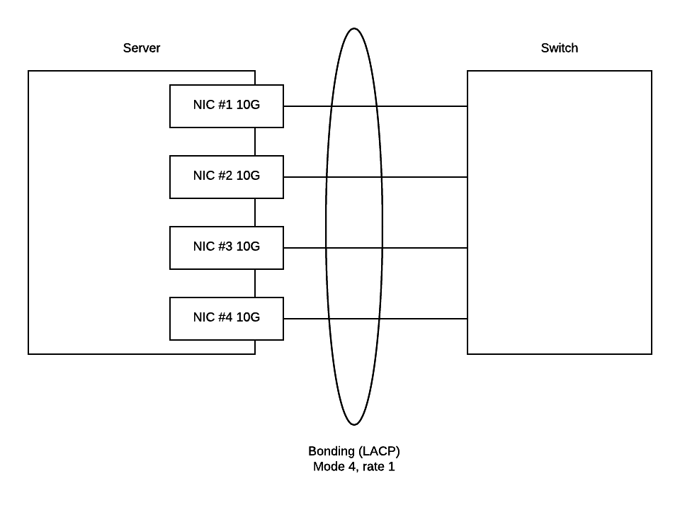

.. _openstack_control_plane_performance_report_400_nodes:

********************************************************
OpenStack control plane performance report for 400 nodes
********************************************************

:Abstract:

  This document includes OpenStack control plane performance test results for
  379 nodes in fact (several more nodes were not able to be added to the cluster
  due to deployment issues).
  All tests have been performed regarding
  :ref:`openstack_control_plane_performance_test_plan`

Environment description
=======================

Environment contains 4 types of servers:

- rally node
- controller node
- compute-osd node
- compute node

.. table:: Amount of servers each role

   +------------+--------------+------+
   |Role        |Servers count |Type  |
   +============+==============+======+
   |rally       |1             |1 or 2|
   +------------+--------------+------+
   |controller  |3             |1 or 2|
   +------------+--------------+------+
   |compute     |291           |1 or 2|
   +------------+--------------+------+
   |compute-osd |34            |3     |
   +------------+--------------+------+
   |compute-osd |49            |1     |
   +------------+--------------+------+

Hardware configuration of each server
-------------------------------------

All servers have 3 types of configuration describing in table below

.. table:: Description of servers hardware type 1

   +-------+----------------+---------------------------------+
   |server |vendor,model    |Dell PowerEdge R630              |
   +-------+----------------+---------------------------------+
   |CPU    |vendor,model    |Intel,E5-2680 v3                 |
   |       +----------------+---------------------------------+
   |       |processor_count |2                                |
   |       +----------------+---------------------------------+
   |       |core_count      |12                               |
   |       +----------------+---------------------------------+
   |       |frequency_MHz   |2500                             |
   +-------+----------------+---------------------------------+
   |RAM    |vendor,model    |Samsung, M393A2G40DB0-CPB        |
   |       +----------------+---------------------------------+
   |       |amount_MB       |262144                           |
   +-------+----------------+---------------------------------+
   |NETWORK|interface_name s|eno1, eno2                       |
   |       +----------------+---------------------------------+
   |       |vendor,model    |Intel,X710 Dual Port             |
   |       +----------------+---------------------------------+
   |       |bandwidth       |10G                              |
   |       +----------------+---------------------------------+
   |       |interface_names |enp3s0f0, enp3s0f1               |
   |       +----------------+---------------------------------+
   |       |vendor,model    |Intel,X710 Dual Port             |
   |       +----------------+---------------------------------+
   |       |bandwidth       |10G                              |
   +-------+----------------+---------------------------------+
   |STORAGE|dev_name        |/dev/sda                         |
   |       +----------------+---------------------------------+
   |       |vendor,model    | | raid1 - Dell, PERC H730P Mini |
   |       |                | | 2 disks Intel S3610           |
   |       +----------------+---------------------------------+
   |       |SSD/HDD         |SSD                              |
   |       +----------------+---------------------------------+
   |       |size            | 3,6TB                           |
   +-------+----------------+---------------------------------+

.. table:: Description of servers hardware type 2

   +-------+----------------+-------------------------------+
   |server |vendor,model    |Lenovo ThinkServer RD550       |
   +-------+----------------+-------------------------------+
   |CPU    |vendor,model    |Intel,E5-2680 v3               |
   |       +----------------+-------------------------------+
   |       |processor_count |2                              |
   |       +----------------+-------------------------------+
   |       |core_count      |12                             |
   |       +----------------+-------------------------------+
   |       |frequency_MHz   |2500                           |
   +-------+----------------+-------------------------------+
   |RAM    |vendor,model    |Samsung, M393A2G40DB0-CPB      |
   |       +----------------+-------------------------------+
   |       |amount_MB       |262144                         |
   +-------+----------------+-------------------------------+
   |NETWORK|interface_name s|enp3s0f0, enp3s0f1             |
   |       +----------------+-------------------------------+
   |       |vendor,model    |Intel,X710 Dual Port           |
   |       +----------------+-------------------------------+
   |       |bandwidth       |10G                            |
   |       +----------------+-------------------------------+
   |       |interface_names |ens2f0,  ens2f1                |
   |       +----------------+-------------------------------+
   |       |vendor,model    |Intel,X710 Dual Port           |
   |       +----------------+-------------------------------+
   |       |bandwidth       |10G                            |
   +-------+----------------+-------------------------------+
   |STORAGE|dev_name        |/dev/sda                       |
   |       +----------------+-------------------------------+
   |       |vendor,model    | | raid1 - Lenovo 720ix        |
   |       |                | | 2 disks Intel S3610         |
   |       +----------------+-------------------------------+
   |       |SSD/HDD         |SSD                            |
   |       +----------------+-------------------------------+
   |       |size            |799GB                          |
   +-------+----------------+-------------------------------+

 .. table:: Description of servers hardware type 3

    +-------+----------------+-------------------------------+
    |server |vendor,model    |Lenovo ThinkServer RD650       |
    +-------+----------------+-------------------------------+
    |CPU    |vendor,model    |Intel,E5-2670 v3               |
    |       +----------------+-------------------------------+
    |       |processor_count |2                              |
    |       +----------------+-------------------------------+
    |       |core_count      |12                             |
    |       +----------------+-------------------------------+
    |       |frequency_MHz   |2500                           |
    +-------+----------------+-------------------------------+
    |RAM    |vendor,model    |Samsung, M393A2G40DB0-CPB      |
    |       +----------------+-------------------------------+
    |       |amount_MB       |131916                         |
    +-------+----------------+-------------------------------+
    |NETWORK|interface_name s|enp3s0f0, enp3s0f1             |
    |       +----------------+-------------------------------+
    |       |vendor,model    |Intel,X710 Dual Port           |
    |       +----------------+-------------------------------+
    |       |bandwidth       |10G                            |
    |       +----------------+-------------------------------+
    |       |interface_names |ens2f0,  ens2f1                |
    |       +----------------+-------------------------------+
    |       |vendor,model    |Intel,X710 Dual Port           |
    |       +----------------+-------------------------------+
    |       |bandwidth       |10G                            |
    +-------+----------------+-------------------------------+
    |STORAGE|dev_name        |/dev/sda                       |
    |       +----------------+-------------------------------+
    |       |vendor,model    | | raid1 - Lenovo 720ix        |
    |       |                | | 2 disks Intel S3610         |
    |       +----------------+-------------------------------+
    |       |SSD/HDD         |SSD                            |
    |       +----------------+-------------------------------+
    |       |size            |799GB                          |
    |       +----------------+-------------------------------+
    |       |dev_name        |/dev/sdb                       |
    |       +----------------+-------------------------------+
    |       |vendor,model    | | raid10 - Lenovo 720ix       |
    |       |                | | 10 disks 2T                 |
    |       +----------------+-------------------------------+
    |       |SSD/HDD         |HDD                            |
    |       +----------------+-------------------------------+
    |       |size            |9999GB                         |
    +-------+----------------+-------------------------------+

Network configuration of each server
------------------------------------

All servers have same network configuration:

Software configuration on servers with controller, compute and compute-osd roles
--------------------------------------------------------------------------------

.. table:: Services on servers by role

   +------------+----------------------------+
   |Role        |Service name                |
   +============+============================+
   |controller  || horizon                   |
   |            || keystone                  |
   |            || nova-api                  |
   |            || nava-scheduler            |
   |            || nova-cert                 |
   |            || nova-conductor            |
   |            || nova-consoleauth          |
   |            || nova-consoleproxy         |
   |            || cinder-api                |
   |            || cinder-backup             |
   |            || cinder-scheduler          |
   |            || cinder-volume             |
   |            || glance-api                |
   |            || glance-glare              |
   |            || glance-registry           |
   |            || neutron-dhcp-agent        |
   |            || neutron-l3-agent          |
   |            || neutron-metadata-agent    |
   |            || neutron-openvswitch-agent |
   |            || neutron-server            |
   |            || heat-api                  |
   |            || heat-api-cfn              |
   |            || heat-api-cloudwatch       |
   |            || ceph-mon                  |
   |            || rados-gw                  |
   |            || memcached                 |
   |            || rabbitmq_server           |
   |            || mysqld                    |
   |            || galera                    |
   |            || corosync                  |
   |            || pacemaker                 |
   |            || haproxy                   |
   +------------+----------------------------+
   |compute     || nova-compute              |
   |            || neutron-l3-agent          |
   |            || neutron-metadata-agent    |
   |            || neutron-openvswitch-agent |
   +------------+----------------------------+
   |compute-osd || nova-compute              |
   |            || neutron-l3-agent          |
   |            || neutron-metadata-agent    |
   |            || neutron-openvswitch-agent |
   |            || ceph-osd                  |
   +------------+----------------------------+

.. table:: Software version on servers with controller, compute and compute-osd roles

   +------------+-------------------+
   |Software    |Version            |
   +============+===================+
   |OpenStack   |Mitaka             |
   +------------+-------------------+
   |Ceph        |Hammer             |
   +------------+-------------------+
   |Ubuntu      |Ubuntu 14.04.3 LTS |
   +------------+-------------------+

You can find outputs of some commands and /etc folder in the following archives:

| :download:`controller-1.tar.gz <configs/controller-1.tar.gz>`
| :download:`controller-2.tar.gz <configs/controller-2.tar.gz>`
| :download:`controller-3.tar.gz <configs/controller-3.tar.gz>`
| :download:`compute-1.tar.gz <configs/compute-1.tar.gz>`
| :download:`compute-osd-1.tar.gz <configs/compute-osd-1.tar.gz>`

Software configuration on servers with rally role
-------------------------------------------------

On this server should be installed Rally. How to do it you can find in
`Rally installation documentation`_

.. table:: Software version on server with rally role

   +------------+-------------------+
   |Software    |Version            |
   +============+===================+
   |Rally       |0.5.0              |
   +------------+-------------------+
   |Ubuntu      |Ubuntu 14.04.3 LTS |
   +------------+-------------------+

Testing process
===============

.. table:: Some test parameters

   +--------------------------------+--------+
   |Name                            |Value   |
   +================================+========+
   |Volume size to create in Cinder |1GB     |
   +--------------------------------+--------+
   |Flavor to create VM from        |m1.tiny |
   +--------------------------------+--------+
   |Image name to create VM from    |cirros  |
   +--------------------------------+--------+

1. Create work directory on server with Rally role. In future we will call that directory as WORK_DIR
2. Create directory "plugins" in WORK_DIR and copy to that directory
   :download:`nova_performance.py <../../test_plans/control_plane/plugins/nova_performance.py>` plugin.
3. Create directory "scenarios" in WORK_DIR and copy to that directory
   :download:`boot_attach_live_migrate_and_delete_server_with_secgroups.json
   <rally_scenarios/boot_attach_live_migrate_and_delete_server_with_secgroups.json>`,
   :download:`create-and-delete-image.json <rally_scenarios/create-and-delete-image.json>`
   and :download:`keystone.json <rally_scenarios/keystone.json>` scenarios.

4. Perform tests:

   .. literalinclude:: configs/run_test_script.sh
      :language: bash

As a result of this part we got the following HTML file:

| :download:`keystone.html <configs/keystone.html>`
| :download:`boot_attach_live_migrate_and_delete_server_with_secgroups.html <configs/boot_attach_live_migrate_and_delete_server_with_secgroups.html>`
| :download:`create-and-delete-image.html <configs/create-and-delete-image.html>`

Test results
============

All values in tables below are in seconds.

Cinder
------

+---------------+---------+----------+----------+---------+---------+
| Operation     |   Mean  |   90%ile |   50%ile |   Max   |   Min   |
|               |   (sec) |   (sec)  |   (sec)  |   (sec) |   (sec) |
+===============+=========+==========+==========+=========+=========+
| create_volume | 2.619   | 2.754    | 2.593    | 2.988   | 2.453   |
+---------------+---------+----------+----------+---------+---------+
| delete_volume | 2.339   | 2.449    | 2.323    | 2.666   | 2.200   |
+---------------+---------+----------+----------+---------+---------+

Glance
------
Iterations: 400   Failures: 17

+--------------+----------+----------+----------+----------+-----------+
| Operation    |    Median|   90%ile |   95%ile |   Max    |   Min     |
|              |    (sec) |   (sec)  |   (sec)  |   (sec)  |   (sec)   |
+==============+==========+==========+==========+==========+===========+
| create_image | 60.573   | 88.944   | 103.642  | 125.492  | 40.852    |
+--------------+----------+----------+----------+----------+-----------+
| delete_image | 6.428    | 9.804    | 12.221   | 28.287   | 1.072     |
+--------------+----------+----------+----------+----------+-----------+

Keystone
--------

+--------------+-----------+----------+-----------+----------+-----------+
| Operation    |     Median|   90%ile |    95%ile |   Max    |   Min     |
|              |     (sec) |   (sec)  |    (sec)  |   (sec)  |   (sec)   |
+==============+===========+==========+===========+==========+===========+
| authenticate | 0.195     | 0.22     | 0.231     | 0.988    | 0.086     |
+--------------+-----------+----------+-----------+----------+-----------+

Neutron
-------

+--------------------------+----------+----------+----------+----------+----------+
| Operation                |   Median |   90%ile |   95%ile |   Max    |   Min    |
|                          |   (sec)  |   (sec)  |   (sec)  |   (sec)  |   (sec)  |
+==========================+==========+==========+==========+==========+==========+
| create_20_rules          | 5.957    | 6.347    | 6.467    | 8.227    | 5.202    |
+--------------------------+----------+----------+----------+----------+----------+
| create_2_security_groups | 0.546    | 0.639    | 0.664    | 0.887    | 0.41     |
+--------------------------+----------+----------+----------+----------+----------+
| delete_2_security_groups | 0.472    | 0.59     | 0.624    | 0.887    | 0.297    |
+--------------------------+----------+----------+----------+----------+----------+

Nova
----

+----------------------+-----------+-----------+-----------+-----------+-----------+
| Operation            |     Median|    90%ile |    95%ile |   Max     |   Min     |
|                      |     (sec) |    (sec)  |    (sec)  |   (sec)   |   (sec)   |
+======================+===========+===========+===========+===========+===========+
| attach_volume        | 3.063     | 3.256     | 3.304     | 5.349     | 2.726     |
+----------------------+-----------+-----------+-----------+-----------+-----------+
| boot_server          | 12.648    | 13.132    | 13.328    | 15.054    | 11.071    |
+----------------------+-----------+-----------+-----------+-----------+-----------+
| delete_server        | 2.622     | 2.862     | 3         | 5.078     | 2.446     |
+----------------------+-----------+-----------+-----------+-----------+-----------+
| detach_volume        | 2.901     | 3.067     | 3.13      | 3.319     | 2.629     |
+----------------------+-----------+-----------+-----------+-----------+-----------+
| find_host_to_migrate | 0.807     | 1.021     | 1.069     | 1.385     | 0.655     |
+----------------------+-----------+-----------+-----------+-----------+-----------+
| live_migrate         | 16.317    | 18.477    | 18.689    | 31.738    | 14.371    |
+----------------------+-----------+-----------+-----------+-----------+-----------+

.. references:

.. _Rally installation documentation: https://rally.readthedocs.io/en/latest/install.html
