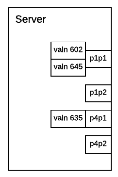

.. _openstack_control_plane_performance_report_ccp_6_nodes:

******************************************************
OpenStack control plane performance report for 6 nodes
******************************************************

:Abstract:

  This document includes Fuel CCP control plane performance test results.
  All tests have been performed regarding
  :ref:`openstack_control_plane_performance_test_plan`

Environment description
=======================

For Kubernetes pre-deployment `Kargo tool`_ was used. More information about
*fuel-ccp* and how it can be installed can be found in
`official documentation`_.

.. _Kargo tool: https://github.com/kubespray/kargo
.. _official documentation: http://fuel-ccp.readthedocs.io/en/latest/

Hardware configuration of each server
-------------------------------------

All servers have same configuration describing in table below

.. table:: Description of servers hardware

   +-------+----------------+-------------------------------+
   |server |vendor,model    |HP,DL380 Gen9                  |
   +-------+----------------+-------------------------------+
   |CPU    |vendor,model    |Intel,E5-2680 v3               |
   |       +----------------+-------------------------------+
   |       |processor_count |2                              |
   |       +----------------+-------------------------------+
   |       |core_count      |12                             |
   |       +----------------+-------------------------------+
   |       |frequency_MHz   |2500                           |
   +-------+----------------+-------------------------------+
   |RAM    |vendor,model    |HP,752369-081                  |
   |       +----------------+-------------------------------+
   |       |amount_MB       |262144                         |
   +-------+----------------+-------------------------------+
   |NETWORK|interface_name  |p1p1                           |
   |       +----------------+-------------------------------+
   |       |vendor,model    |Intel,X710 Dual Port           |
   |       +----------------+-------------------------------+
   |       |bandwidth       |10G                            |
   +-------+----------------+-------------------------------+
   |STORAGE|dev_name        |/dev/sda                       |
   |       +----------------+-------------------------------+
   |       |vendor,model    | | raid10 - HP P840            |
   |       |                | | 12 disks EH0600JEDHE        |
   |       +----------------+-------------------------------+
   |       |SSD/HDD         |HDD                            |
   |       +----------------+-------------------------------+
   |       |size            | 3,6TB                         |
   +-------+----------------+-------------------------------+

Network configuration of each server
------------------------------------

All servers have same network configuration:

Here is the part of switch configuration for each switch port which connected to
ens1f0 interface of a server:

.. code:: bash

   switchport mode trunk
   switchport trunk native vlan 600
   switchport trunk allowed vlan 600-602, 630-649
   spanning-tree port type edge trunk
   spanning-tree bpduguard enable
   no snmp trap link-status

Software configuration on servers with controller, compute and compute-osd roles
--------------------------------------------------------------------------------

CCP cluster configuration files: :download:`config-files.zip <./configs/config-files.zip>`

+-------------------------+------------------------------------------+
| Repository              | Last commit                              |
+=========================+==========================================+
| fuel-ccp                | 992e4ec2a0eb67b3b6c740d3c5cbd98183823587 |
+-------------------------+------------------------------------------+
| fuel-ccp-ceph           | ffcf0bafc357106b0be2071eb336cedd6d58931a |
+-------------------------+------------------------------------------+
| fuel-ccp-cinder         | b57752a6871f96409fce4145e0124dfcb775ee3e |
+-------------------------+------------------------------------------+
| fuel-ccp-debian-base    | e996be07beafa04d0031b1234747e311090e8476 |
+-------------------------+------------------------------------------+
| fuel-ccp-entrypoint     | 5893d2fb44530afb32d0ef7d61454371d29c5fe6 |
+-------------------------+------------------------------------------+
| fuel-ccp-etcd           | 524e64f5436aa05a73c6883700b44572bbb58e4b |
+-------------------------+------------------------------------------+
| fuel-ccp-galera         | 11544bceacb82851a1a1463f7867d9113be8f972 |
+-------------------------+------------------------------------------+
| fuel-ccp-glance         | df5299c2d34a2ca271d1fd5859987c1ff3687595 |
+-------------------------+------------------------------------------+
| fuel-ccp-heat           | bb354f9af029522f9f8e4e551169272e16d56416 |
+-------------------------+------------------------------------------+
| fuel-ccp-horizon        | 2e8fc04b433cca53a04f1ba6ab9e8af8b9a7a659 |
+-------------------------+------------------------------------------+
| fuel-ccp-keystone       | 7e702f06753b872c0b0d61892573859aff8347fb |
+-------------------------+------------------------------------------+
| fuel-ccp-memcached      | 949ba9376ca0eb0f2d11eb89d6da77948a356c97 |
+-------------------------+------------------------------------------+
| fuel-ccp-neutron        | c74e1e559b2e9919319054faf4a33bbcc4c8cc61 |
+-------------------------+------------------------------------------+
| fuel-ccp-nova           | 59d59f4fad91985c5fae47a92f0166c4bf42d852 |
+-------------------------+------------------------------------------+
| fuel-ccp-openstack-base | dba9d5a5e9a0283e2c7d05d6e9479c642c815aa8 |
+-------------------------+------------------------------------------+
| fuel-ccp-rabbitmq       | c4cdedef841be731b757ecaa84a9c10b65b552ca |
+-------------------------+------------------------------------------+

Software configuration of test suite
------------------------------------

Rally should be launched in docker container on one of K8s nodes.
Find how to do it in `Rally installation documentation`_

.. table:: Rally version

   +------------+-------------------+
   |Software    |Version            |
   +============+===================+
   |Rally       |0.7.1.dev198       |
   +------------+-------------------+

Test results
============

All values in tables below are in seconds.

Keystone with uuid tokens
-------------------------

Rally scenario: :download:`report.html <configs/uuid_50rps.html>`.
Load: 50rps

+--------------------------------------------------------------------------------------------------------------------------+
|                                                   Response Times (sec)                                                   |
+-----------------------+-----------+--------------+--------------+--------------+-----------+-----------+---------+-------+
| Action                | Min (sec) | Median (sec) | 90%ile (sec) | 95%ile (sec) | Max (sec) | Avg (sec) | Success | Count |
+-----------------------+-----------+--------------+--------------+--------------+-----------+-----------+---------+-------+
| authenticate.keystone | 0.141     | 0.496        | 0.658        | 0.706        | 1.4       | 0.503     | 100.0%  | 12000 |
| total                 | 0.141     | 0.496        | 0.658        | 0.706        | 1.4       | 0.503     | 100.0%  | 12000 |
+-----------------------+-----------+--------------+--------------+--------------+-----------+-----------+---------+-------+

Rally scenario: :download:`report.html <configs/uuid_60rps.html>`.
Load: 60

+--------------------------------------------------------------------------------------------------------------------------+
|                                                   Response Times (sec)                                                   |
+-----------------------+-----------+--------------+--------------+--------------+-----------+-----------+---------+-------+
| Action                | Min (sec) | Median (sec) | 90%ile (sec) | 95%ile (sec) | Max (sec) | Avg (sec) | Success | Count |
+-----------------------+-----------+--------------+--------------+--------------+-----------+-----------+---------+-------+
| authenticate.keystone | 0.144     | 0.464        | 0.64         | 0.71         | 2.153     | 0.482     | 100.0%  | 12000 |
| total                 | 0.144     | 0.464        | 0.64         | 0.71         | 2.153     | 0.482     | 100.0%  | 12000 |
+-----------------------+-----------+--------------+--------------+--------------+-----------+-----------+---------+-------+

Rally scenario: :download:`report.html <configs/uuid_70rps.html>`.
Load: 70rps

+--------------------------------------------------------------------------------------------------------------------------+
|                                                   Response Times (sec)                                                   |
+-----------------------+-----------+--------------+--------------+--------------+-----------+-----------+---------+-------+
| Action                | Min (sec) | Median (sec) | 90%ile (sec) | 95%ile (sec) | Max (sec) | Avg (sec) | Success | Count |
+-----------------------+-----------+--------------+--------------+--------------+-----------+-----------+---------+-------+
| authenticate.keystone | 0.152     | 0.594        | 0.918        | 1.032        | 2.095     | 0.631     | 100.0%  | 12000 |
| total                 | 0.152     | 0.594        | 0.918        | 1.032        | 2.095     | 0.631     | 100.0%  | 12000 |
+-----------------------+-----------+--------------+--------------+--------------+-----------+-----------+---------+-------+

Rally scenario: :download:`report.html <configs/uuid_80rps.html>`.
Load: 80 rps

+--------------------------------------------------------------------------------------------------------------------------+
|                                                   Response Times (sec)                                                   |
+-----------------------+-----------+--------------+--------------+--------------+-----------+-----------+---------+-------+
| Action                | Min (sec) | Median (sec) | 90%ile (sec) | 95%ile (sec) | Max (sec) | Avg (sec) | Success | Count |
+-----------------------+-----------+--------------+--------------+--------------+-----------+-----------+---------+-------+
| authenticate.keystone | 0.155     | 1.159        | 1.771        | 1.931        | 2.875     | 1.181     | 97.5%   | 12000 |
| total                 | 0.155     | 1.159        | 1.771        | 1.931        | 2.875     | 1.181     | 97.5%   | 12000 |
+-----------------------+-----------+--------------+--------------+--------------+-----------+-----------+---------+-------+

Keystone with fernet tokens
---------------------------

Rally report: :download:`report.html <configs/fernet_50rps.html>`.
Load: 50rps

+--------------------------------------------------------------------------------------------------------------------------+
|                                                   Response Times (sec)                                                   |
+-----------------------+-----------+--------------+--------------+--------------+-----------+-----------+---------+-------+
| Action                | Min (sec) | Median (sec) | 90%ile (sec) | 95%ile (sec) | Max (sec) | Avg (sec) | Success | Count |
+-----------------------+-----------+--------------+--------------+--------------+-----------+-----------+---------+-------+
| authenticate.keystone | 0.121     | 0.441        | 0.72         | 0.823        | 2.81      | 0.486     | 100.0%  | 12000 |
| total                 | 0.121     | 0.442        | 0.721        | 0.823        | 2.81      | 0.486     | 100.0%  | 12000 |
+-----------------------+-----------+--------------+--------------+--------------+-----------+-----------+---------+-------+

Rally report: :download:`report.html <configs/fernet_60rps.html>`.
Load: 60

+--------------------------------------------------------------------------------------------------------------------------+
|                                                   Response Times (sec)                                                   |
+-----------------------+-----------+--------------+--------------+--------------+-----------+-----------+---------+-------+
| Action                | Min (sec) | Median (sec) | 90%ile (sec) | 95%ile (sec) | Max (sec) | Avg (sec) | Success | Count |
+-----------------------+-----------+--------------+--------------+--------------+-----------+-----------+---------+-------+
| authenticate.keystone | 0.108     | 0.405        | 0.695        | 0.839        | 2.536     | 0.451     | 100.0%  | 12000 |
| total                 | 0.108     | 0.405        | 0.695        | 0.839        | 2.536     | 0.451     | 100.0%  | 12000 |
+-----------------------+-----------+--------------+--------------+--------------+-----------+-----------+---------+-------+

Rally report: :download:`report.html <configs/fernet_70rps.html>`.
Load: 70rps

+--------------------------------------------------------------------------------------------------------------------------+
|                                                   Response Times (sec)                                                   |
+-----------------------+-----------+--------------+--------------+--------------+-----------+-----------+---------+-------+
| Action                | Min (sec) | Median (sec) | 90%ile (sec) | 95%ile (sec) | Max (sec) | Avg (sec) | Success | Count |
+-----------------------+-----------+--------------+--------------+--------------+-----------+-----------+---------+-------+
| authenticate.keystone | 0.093     | 0.389        | 0.81         | 1.056        | 3.545     | 0.476     | 99.8%   | 12000 |
| total                 | 0.093     | 0.389        | 0.81         | 1.056        | 3.545     | 0.476     | 99.8%   | 12000 |
+-----------------------+-----------+--------------+--------------+--------------+-----------+-----------+---------+-------+

Rally report: :download:`report.html <configs/fernet_80rps.html>`.
Load: 80 rps

+--------------------------------------------------------------------------------------------------------------------------+
|                                                   Response Times (sec)                                                   |
+-----------------------+-----------+--------------+--------------+--------------+-----------+-----------+---------+-------+
| Action                | Min (sec) | Median (sec) | 90%ile (sec) | 95%ile (sec) | Max (sec) | Avg (sec) | Success | Count |
+-----------------------+-----------+--------------+--------------+--------------+-----------+-----------+---------+-------+
| authenticate.keystone | 0.094     | 0.377        | 0.915        | 1.151        | 3.203     | 0.486     | 99.6%   | 12000 |
| total                 | 0.094     | 0.377        | 0.915        | 1.151        | 3.203     | 0.486     | 99.6%   | 12000 |
+-----------------------+-----------+--------------+--------------+--------------+-----------+-----------+---------+-------+

Glance with filesystem backend
------------------------------

Rally report: :download:`report.html <configs/glance_filesystem_30thread.html>`
Concurrency: 30

+------------------------------------------------------------------------------------------------------------------------+
|                                                  Response Times (sec)                                                  |
+---------------------+-----------+--------------+--------------+--------------+-----------+-----------+---------+-------+
| Action              | Min (sec) | Median (sec) | 90%ile (sec) | 95%ile (sec) | Max (sec) | Avg (sec) | Success | Count |
+---------------------+-----------+--------------+--------------+--------------+-----------+-----------+---------+-------+
| glance.create_image | 12.673    | 26.485       | 35.915       | 44.832       | 58.096    | 27.169    | 100.0%  | 200   |
| glance.delete_image | 0.647     | 1.501        | 2.598        | 2.973        | 3.753     | 1.647     | 100.0%  | 200   |
| total               | 14.101    | 28.194       | 37.415       | 46.33        | 59.518    | 28.816    | 100.0%  | 200   |
+---------------------+-----------+--------------+--------------+--------------+-----------+-----------+---------+-------+

Rally report: :download:`report.html <configs/glance_filesystem_40thread.html>`
Concurrency: 40

+------------------------------------------------------------------------------------------------------------------------+
|                                                  Response Times (sec)                                                  |
+---------------------+-----------+--------------+--------------+--------------+-----------+-----------+---------+-------+
| Action              | Min (sec) | Median (sec) | 90%ile (sec) | 95%ile (sec) | Max (sec) | Avg (sec) | Success | Count |
+---------------------+-----------+--------------+--------------+--------------+-----------+-----------+---------+-------+
| glance.create_image | 17.675    | 35.24        | 42.501       | 44.171       | 49.936    | 34.837    | 100.0%  | 200   |
| glance.delete_image | 0.632     | 1.68         | 2.625        | 3.006        | 4.187     | 1.779     | 100.0%  | 200   |
| total               | 19.599    | 37.248       | 44.954       | 46.028       | 51.585    | 36.616    | 100.0%  | 200   |
+---------------------+-----------+--------------+--------------+--------------+-----------+-----------+---------+-------+

Rally report: :download:`report.html <configs/glance_filesystem_50thread.html>`
Concurrency: 50

+------------------------------------------------------------------------------------------------------------------------+
|                                                  Response Times (sec)                                                  |
+---------------------+-----------+--------------+--------------+--------------+-----------+-----------+---------+-------+
| Action              | Min (sec) | Median (sec) | 90%ile (sec) | 95%ile (sec) | Max (sec) | Avg (sec) | Success | Count |
+---------------------+-----------+--------------+--------------+--------------+-----------+-----------+---------+-------+
| glance.create_image | 21.007    | 43.816       | 52.782       | 54.342       | 74.413    | 43.421    | 99.5%   | 200   |
| glance.delete_image | 0.428     | 1.839        | 3.275        | 3.777        | 7.344     | 2.072     | 100.0%  | 199   |
| total               | 21.904    | 46.044       | 55.508       | 58.492       | 75.921    | 45.493    | 99.5%   | 200   |
+---------------------+-----------+--------------+--------------+--------------+-----------+-----------+---------+-------+

Glance with Ceph backend
------------------------

Rally report: :download:`report.html <configs/glance_ceph_5thread.html>`
Concurrency: 5

+------------------------------------------------------------------------------------------------------------------------+
|                                                  Response Times (sec)                                                  |
+---------------------+-----------+--------------+--------------+--------------+-----------+-----------+---------+-------+
| Action              | Min (sec) | Median (sec) | 90%ile (sec) | 95%ile (sec) | Max (sec) | Avg (sec) | Success | Count |
+---------------------+-----------+--------------+--------------+--------------+-----------+-----------+---------+-------+
| glance.create_image | 25.808    | 31.376       | 53.009       | 75.796       | 94.777    | 37.569    | 100.0%  | 50    |
| glance.delete_image | 0.954     | 2.045        | 2.77         | 3.569        | 4.817     | 2.095     | 100.0%  | 50    |
| total               | 26.815    | 33.725       | 54.874       | 79.312       | 97.546    | 39.664    | 100.0%  | 50    |
+---------------------+-----------+--------------+--------------+--------------+-----------+-----------+---------+-------+

Rally report: :download:`report.html <configs/glance_ceph_10thread.html>`
Concurrency: 10

+------------------------------------------------------------------------------------------------------------------------+
|                                                  Response Times (sec)                                                  |
+---------------------+-----------+--------------+--------------+--------------+-----------+-----------+---------+-------+
| Action              | Min (sec) | Median (sec) | 90%ile (sec) | 95%ile (sec) | Max (sec) | Avg (sec) | Success | Count |
+---------------------+-----------+--------------+--------------+--------------+-----------+-----------+---------+-------+
| glance.create_image | 31.863    | 42.847       | 75.724       | 82.101       | 90.672    | 49.189    | 100.0%  | 50    |
| glance.delete_image | 1.08      | 2.174        | 3.145        | 3.864        | 5.734     | 2.216     | 100.0%  | 50    |
| total               | 34.028    | 44.393       | 77.759       | 83.402       | 93.155    | 51.405    | 100.0%  | 50    |
+---------------------+-----------+--------------+--------------+--------------+-----------+-----------+---------+-------+

Rally report: :download:`report.html <configs/glance_ceph_15thread.html>`
Concurrency: 15

+------------------------------------------------------------------------------------------------------------------------+
|                                                  Response Times (sec)                                                  |
+---------------------+-----------+--------------+--------------+--------------+-----------+-----------+---------+-------+
| Action              | Min (sec) | Median (sec) | 90%ile (sec) | 95%ile (sec) | Max (sec) | Avg (sec) | Success | Count |
+---------------------+-----------+--------------+--------------+--------------+-----------+-----------+---------+-------+
| glance.create_image | 34.229    | 50.424       | 86.381       | 104.125      | 123.598   | 60.244    | 94.0%   | 50    |
| glance.delete_image | 0.691     | 3.091        | 5.865        | 7.617        | 9.908     | 3.517     | 100.0%  | 47    |
| total               | 36.674    | 54.807       | 89.673       | 108.8        | 126.278   | 63.761    | 94.0%   | 50    |
+---------------------+-----------+--------------+--------------+--------------+-----------+-----------+---------+-------+

.. references:

.. _Rally installation documentation: https://rally.readthedocs.io/en/latest/install.html
