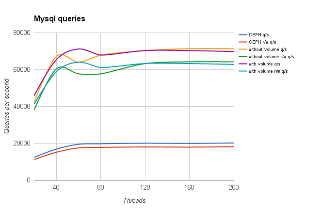
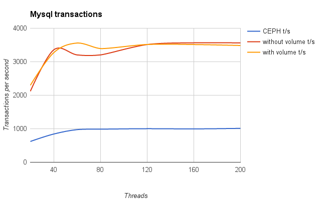

.. raw:: pdf

    PageBreak oneColumn

.. _db_performance_mysql:

=============================================
SQL Database on kubernetes performance report
=============================================

Environment description
^^^^^^^^^^^^^^^^^^^^^^^

This report is generated for :ref:`db_performance` test plan with
`Sysbench`_ tool. The data is collected in
:ref:`intel_mirantis_performance_lab_2`.

Software
~~~~~~~~

+-----------------+--------------------------------------------+
| Parameter       | Value                                      |
+-----------------+--------------------------------------------+
| OS              | Ubuntu 16.04.1                             |
+-----------------+--------------------------------------------+
| DB              | MySQL 5.7                                  |
+-----------------+--------------------------------------------+
| HA              | Kubernetes v1.3.5+coreos.0, 47 nodes       |
+-----------------+--------------------------------------------+
| Storage         | Ceph  0.94.9, 3 nodes                      |
+-----------------+--------------------------------------------+
| Test tool       | Sysbench 1.0                               |
+-----------------+--------------------------------------------+

Reports
^^^^^^^
.. toctree::
    :maxdepth: 2

    mysql-on-ceph/index
    mysql-with-host-volume/index
    mysql-without-volume/index

Common graphs
~~~~~~~~~~~~~

.. references:

.. _Sysbench: https://github.com/akopytov/sysbench
