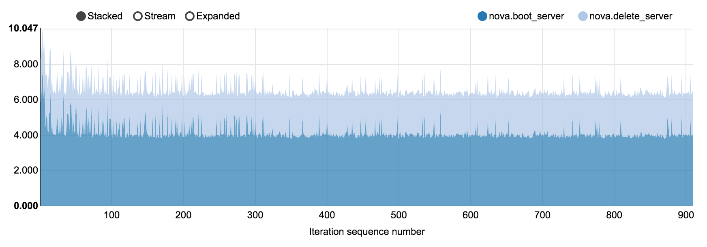
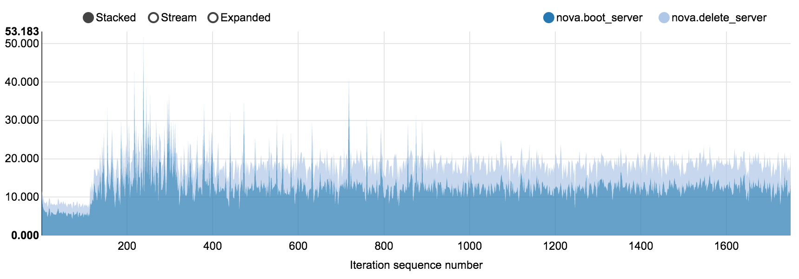
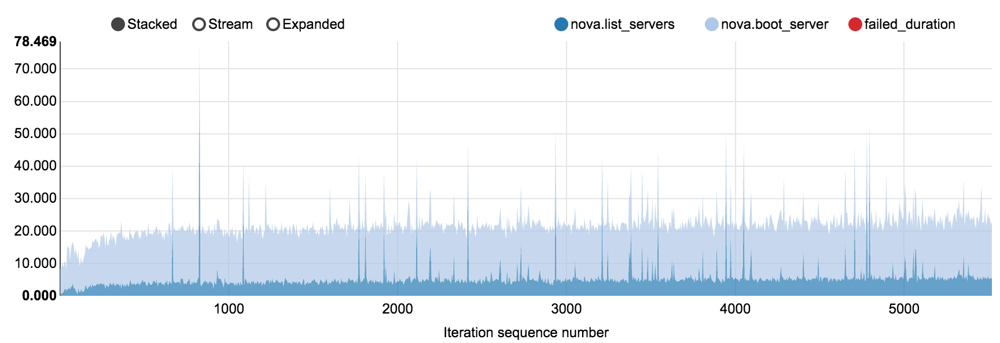
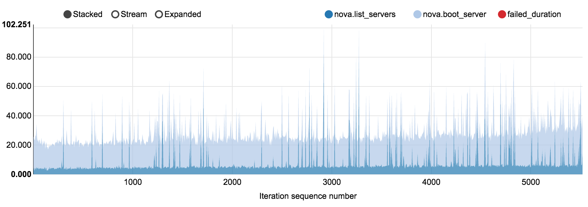
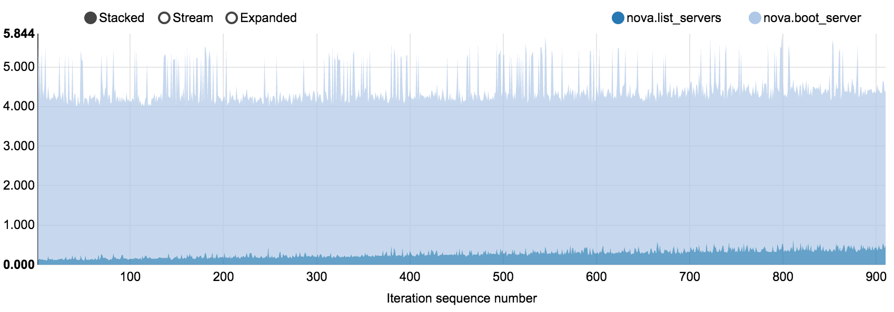
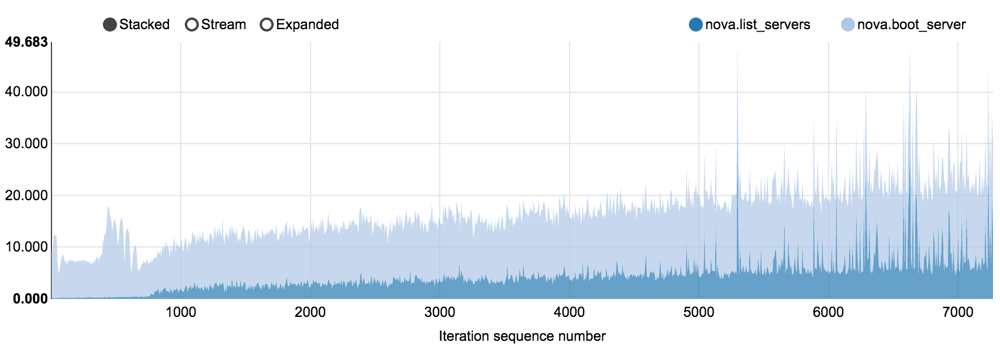

.. _`fuel_ccp_test_report`:

===================================================
Fuel Containerized Control Plane performance report
===================================================

:Abstract:

  This document includes Fuel CCP control plane performance test results for
  various environments (from 50 to 350 nodes). All tests have been performed
  regarding :ref:`fuel_ccp_test_plan`

Environment description
=======================

For Kubernetes pre-deployment `Kargo tool`_ was used. More information about
*fuel-ccp* and how it can be installed can be found in
`official documentation`_.

.. _Kargo tool: https://github.com/kubespray/kargo
.. _official documentation: http://fuel-ccp.readthedocs.io/en/latest/

Hardware configuration of each server
-------------------------------------

All servers have 3 types of configuration describing in table below

.. table:: Description of servers hardware type 1

   +-------+----------------+---------------------------------+
   |server |vendor,model    |Dell PowerEdge R630              |
   +-------+----------------+---------------------------------+
   |CPU    |vendor,model    |Intel,E5-2680 v3                 |
   |       +----------------+---------------------------------+
   |       |processor_count |2                                |
   |       +----------------+---------------------------------+
   |       |core_count      |12                               |
   |       +----------------+---------------------------------+
   |       |frequency_MHz   |2500                             |
   +-------+----------------+---------------------------------+
   |RAM    |vendor,model    |Samsung, M393A2G40DB0-CPB        |
   |       +----------------+---------------------------------+
   |       |amount_MB       |262144                           |
   +-------+----------------+---------------------------------+
   |NETWORK|interface_name s|eno1, eno2                       |
   |       +----------------+---------------------------------+
   |       |vendor,model    |Intel,X710 Dual Port             |
   |       +----------------+---------------------------------+
   |       |bandwidth       |10G                              |
   |       +----------------+---------------------------------+
   |       |interface_names |enp3s0f0, enp3s0f1               |
   |       +----------------+---------------------------------+
   |       |vendor,model    |Intel,X710 Dual Port             |
   |       +----------------+---------------------------------+
   |       |bandwidth       |10G                              |
   +-------+----------------+---------------------------------+
   |STORAGE|dev_name        |/dev/sda                         |
   |       +----------------+---------------------------------+
   |       |vendor,model    | | raid1 - Dell, PERC H730P Mini |
   |       |                | | 2 disks Intel S3610           |
   |       +----------------+---------------------------------+
   |       |SSD/HDD         |SSD                              |
   |       +----------------+---------------------------------+
   |       |size            | 3,6TB                           |
   +-------+----------------+---------------------------------+

.. table:: Description of servers hardware type 2

   +-------+----------------+-------------------------------+
   |server |vendor,model    |Lenovo ThinkServer RD550       |
   +-------+----------------+-------------------------------+
   |CPU    |vendor,model    |Intel,E5-2680 v3               |
   |       +----------------+-------------------------------+
   |       |processor_count |2                              |
   |       +----------------+-------------------------------+
   |       |core_count      |12                             |
   |       +----------------+-------------------------------+
   |       |frequency_MHz   |2500                           |
   +-------+----------------+-------------------------------+
   |RAM    |vendor,model    |Samsung, M393A2G40DB0-CPB      |
   |       +----------------+-------------------------------+
   |       |amount_MB       |262144                         |
   +-------+----------------+-------------------------------+
   |NETWORK|interface_name s|enp3s0f0, enp3s0f1             |
   |       +----------------+-------------------------------+
   |       |vendor,model    |Intel,X710 Dual Port           |
   |       +----------------+-------------------------------+
   |       |bandwidth       |10G                            |
   |       +----------------+-------------------------------+
   |       |interface_names |ens2f0,  ens2f1                |
   |       +----------------+-------------------------------+
   |       |vendor,model    |Intel,X710 Dual Port           |
   |       +----------------+-------------------------------+
   |       |bandwidth       |10G                            |
   +-------+----------------+-------------------------------+
   |STORAGE|dev_name        |/dev/sda                       |
   |       +----------------+-------------------------------+
   |       |vendor,model    | | raid1 - Lenovo 720ix        |
   |       |                | | 2 disks Intel S3610         |
   |       +----------------+-------------------------------+
   |       |SSD/HDD         |SSD                            |
   |       +----------------+-------------------------------+
   |       |size            |799GB                          |
   +-------+----------------+-------------------------------+

 .. table:: Description of servers hardware type 3

    +-------+----------------+-------------------------------+
    |server |vendor,model    |Lenovo ThinkServer RD650       |
    +-------+----------------+-------------------------------+
    |CPU    |vendor,model    |Intel,E5-2670 v3               |
    |       +----------------+-------------------------------+
    |       |processor_count |2                              |
    |       +----------------+-------------------------------+
    |       |core_count      |12                             |
    |       +----------------+-------------------------------+
    |       |frequency_MHz   |2500                           |
    +-------+----------------+-------------------------------+
    |RAM    |vendor,model    |Samsung, M393A2G40DB0-CPB      |
    |       +----------------+-------------------------------+
    |       |amount_MB       |131916                         |
    +-------+----------------+-------------------------------+
    |NETWORK|interface_name s|enp3s0f0, enp3s0f1             |
    |       +----------------+-------------------------------+
    |       |vendor,model    |Intel,X710 Dual Port           |
    |       +----------------+-------------------------------+
    |       |bandwidth       |10G                            |
    |       +----------------+-------------------------------+
    |       |interface_names |ens2f0,  ens2f1                |
    |       +----------------+-------------------------------+
    |       |vendor,model    |Intel,X710 Dual Port           |
    |       +----------------+-------------------------------+
    |       |bandwidth       |10G                            |
    +-------+----------------+-------------------------------+
    |STORAGE|dev_name        |/dev/sda                       |
    |       +----------------+-------------------------------+
    |       |vendor,model    | | raid1 - Lenovo 720ix        |
    |       |                | | 2 disks Intel S3610         |
    |       +----------------+-------------------------------+
    |       |SSD/HDD         |SSD                            |
    |       +----------------+-------------------------------+
    |       |size            |799GB                          |
    |       +----------------+-------------------------------+
    |       |dev_name        |/dev/sdb                       |
    |       +----------------+-------------------------------+
    |       |vendor,model    | | raid10 - Lenovo 720ix       |
    |       |                | | 10 disks 2T                 |
    |       +----------------+-------------------------------+
    |       |SSD/HDD         |HDD                            |
    |       +----------------+-------------------------------+
    |       |size            |9999GB                         |
    +-------+----------------+-------------------------------+

Network configuration of each server
------------------------------------

All servers have same network configuration:

.. image:: configs/Network_Scheme.png
   :alt: Network Scheme of the environment
   :width: 650px

Test results
============

Test Case 1: Boot and delete server
-----------------------------------

The following set of results is dedicated to investigate how Nova installed
against Kubernetes cluster via fuel-ccp tool is behaving on various scale.

200 nodes OpenStack cluster, concurrency 5, 910 iterations
~~~~~~~~~~~~~~~~~~~~~~~~~~~~~~~~~~~~~~~~~~~~~~~~~~~~~~~~~~

NovaServers.boot_and_delete_server scenario in
:download:`nova_200_nodes.html <reports/nova_200_nodes.html>`

+----------------------+-----------+-----------+-----------+-----------+-----------+
| Operation            |     Median|    90%ile |    95%ile |   Max     |   Min     |
|                      |     (sec) |    (sec)  |    (sec)  |   (sec)   |   (sec)   |
+======================+===========+===========+===========+===========+===========+
| boot_server          | 4.001     | 5.001     | 5.135     | 7.686     | 3.785     |
+----------------------+-----------+-----------+-----------+-----------+-----------+
| delete_server        | 2.346     | 2.487     | 2.517     | 3.769     | 2.297     |
+----------------------+-----------+-----------+-----------+-----------+-----------+

350 nodes OpenStack cluster, concurrency 5, 1750 iterations
~~~~~~~~~~~~~~~~~~~~~~~~~~~~~~~~~~~~~~~~~~~~~~~~~~~~~~~~~~~

NovaServers.boot_and_delete_server scenario in
:download:`nova_350_nodes.html <reports/nova_350_nodes.html>`

+----------------------+-----------+-----------+-----------+-----------+-----------+
| Operation            |     Median|    90%ile |    95%ile |   Max     |   Min     |
|                      |     (sec) |    (sec)  |    (sec)  |   (sec)   |   (sec)   |
+======================+===========+===========+===========+===========+===========+
| boot_server          | 12.679    | 16.853    | 18.539    | 71.071    | 3.899     |
+----------------------+-----------+-----------+-----------+-----------+-----------+
| delete_server        | 6.261     | 8.365     | 8.613     | 14.747    | 0.842     |
+----------------------+-----------+-----------+-----------+-----------+-----------+

Test Case 2: Boot and list servers
----------------------------------

The following set of results is dedicated to investigate how Nova installed
against Kubernetes cluster via fuel-ccp tool is behaving on various scale.

150 nodes OpenStack cluster, concurrency 20, 5520 iterations
~~~~~~~~~~~~~~~~~~~~~~~~~~~~~~~~~~~~~~~~~~~~~~~~~~~~~~~~~~~~

Tested density: 40 VMs per compute node

NovaServers.boot_and_list_server scenario in
:download:`nova_150_nodes_20.html <reports/nova_150_nodes_20.html>`

+----------------------+-----------+-----------+-----------+-----------+-----------+
| Operation            |     Median|    90%ile |    95%ile |   Max     |   Min     |
|                      |     (sec) |    (sec)  |    (sec)  |   (sec)   |   (sec)   |
+======================+===========+===========+===========+===========+===========+
| list_servers         | 4.381     | 7.135     | 7.69      | 172.788   | 0.105     |
+----------------------+-----------+-----------+-----------+-----------+-----------+
| boot_server          | 16.931    | 21.05     | 22.203    | 102.507   | 4.717     |
+----------------------+-----------+-----------+-----------+-----------+-----------+

150 nodes OpenStack cluster, concurrency 40, 5520 iterations
~~~~~~~~~~~~~~~~~~~~~~~~~~~~~~~~~~~~~~~~~~~~~~~~~~~~~~~~~~~~

Tested density: 40 VMs per compute node

NovaServers.boot_and_list_server scenario in
:download:`nova_150_nodes_40.html <reports/nova_150_nodes_40.html>`

+----------------------+-----------+-----------+-----------+-----------+-----------+
| Operation            |     Median|    90%ile |    95%ile |   Max     |   Min     |
|                      |     (sec) |    (sec)  |    (sec)  |   (sec)   |   (sec)   |
+======================+===========+===========+===========+===========+===========+
| list_servers         | 4.656     | 7.607     | 7.963     | 166.783   | 0.188     |
+----------------------+-----------+-----------+-----------+-----------+-----------+
| boot_server          | 19.773    | 25.958    | 29.396    | 197.92    | 9.574     |
+----------------------+-----------+-----------+-----------+-----------+-----------+

200 nodes OpenStack cluster, concurrency 5, 910 iterations
~~~~~~~~~~~~~~~~~~~~~~~~~~~~~~~~~~~~~~~~~~~~~~~~~~~~~~~~~~

Tested density: 5 VMs per compute node

NovaServers.boot_and_list_server scenario in
:download:`nova_200_nodes.html <reports/nova_200_nodes.html>`

+----------------------+-----------+-----------+-----------+-----------+-----------+
| Operation            |     Median|    90%ile |    95%ile |   Max     |   Min     |
|                      |     (sec) |    (sec)  |    (sec)  |   (sec)   |   (sec)   |
+======================+===========+===========+===========+===========+===========+
| list_servers         | 0.272     | 0.424     | 0.476     | 0.644     | 0.106     |
+----------------------+-----------+-----------+-----------+-----------+-----------+
| boot_server          | 4.017     | 5.037     | 5.13      | 5.437     | 3.794     |
+----------------------+-----------+-----------+-----------+-----------+-----------+

200 nodes OpenStack cluster, concurrency 40, 7280 iterations
~~~~~~~~~~~~~~~~~~~~~~~~~~~~~~~~~~~~~~~~~~~~~~~~~~~~~~~~~~~~

Tested density: 40 VMs per compute node

NovaServers.boot_and_list_server [2] scenario in
:download:`nova_200_nodes.html <reports/nova_200_nodes.html>`

+----------------------+-----------+-----------+-----------+-----------+-----------+
| Operation            |     Median|    90%ile |    95%ile |   Max     |   Min     |
|                      |     (sec) |    (sec)  |    (sec)  |   (sec)   |   (sec)   |
+======================+===========+===========+===========+===========+===========+
| list_servers         | 4.237     | 5.944     | 7.994     | 130.39    | 0.111     |
+----------------------+-----------+-----------+-----------+-----------+-----------+
| boot_server          | 11.978    | 15.767    | 17.764    | 55.431    | 3.911     |
+----------------------+-----------+-----------+-----------+-----------+-----------+

Test case 3: Keystone authentication
------------------------------------

The following set of results is dedicated to investigate how Keystone installed
against Kubernetes cluster via fuel-ccp tool is behaving under various requests
per second load. For more information the full Rally report can be used:
:download:`keystone.html <reports/keystone_tuning.html>`. Failed scenarios are
related either to the Keystone configuration tuning under Containerized Control
Plane repository or to the huge enough RPS being set for all in one Keystone.

50 nodes OpenStack cluster, 30 RPS, 12000 iterations
~~~~~~~~~~~~~~~~~~~~~~~~~~~~~~~~~~~~~~~~~~~~~~~~~~~~

Authenticate.keystone [4] scenario in
:download:`keystone.html <reports/keystone_tuning.html>`

+--------------+-----------+----------+-----------+----------+-----------+
| Operation    |     Median|   90%ile |    95%ile |   Max    |   Min     |
|              |     (sec) |   (sec)  |    (sec)  |   (sec)  |   (sec)   |
+==============+===========+==========+===========+==========+===========+
| authenticate | 0.08      | 0.102    | 0.113     | 1.015    | 0.06      |
+--------------+-----------+----------+-----------+----------+-----------+

50 nodes OpenStack cluster, 60 RPS, 12000 iterations
~~~~~~~~~~~~~~~~~~~~~~~~~~~~~~~~~~~~~~~~~~~~~~~~~~~~

Authenticate.keystone [6] scenario in
:download:`keystone.html <reports/keystone_tuning.html>`

+--------------+-----------+----------+-----------+----------+-----------+
| Operation    |     Median|   90%ile |    95%ile |   Max    |   Min     |
|              |     (sec) |   (sec)  |    (sec)  |   (sec)  |   (sec)   |
+==============+===========+==========+===========+==========+===========+
| authenticate | 0.097     | 0.132    | 0.147     | 1.113    | 0.073     |
+--------------+-----------+----------+-----------+----------+-----------+

50 nodes OpenStack cluster, 90 RPS, 12000 iterations
~~~~~~~~~~~~~~~~~~~~~~~~~~~~~~~~~~~~~~~~~~~~~~~~~~~~

Authenticate.keystone [5] scenario in
:download:`keystone.html <reports/keystone_tuning.html>`

+--------------+-----------+----------+-----------+----------+-----------+
| Operation    |     Median|   90%ile |    95%ile |   Max    |   Min     |
|              |     (sec) |   (sec)  |    (sec)  |   (sec)  |   (sec)   |
+==============+===========+==========+===========+==========+===========+
| authenticate | 0.128     | 0.179    | 0.199     | 1.111    | 0.082     |
+--------------+-----------+----------+-----------+----------+-----------+

50 nodes OpenStack cluster, 120 RPS, 12000 iterations
~~~~~~~~~~~~~~~~~~~~~~~~~~~~~~~~~~~~~~~~~~~~~~~~~~~~~

Authenticate.keystone [7] scenario in
:download:`keystone.html <reports/keystone_tuning.html>`

+--------------+-----------+----------+-----------+----------+-----------+
| Operation    |     Median|   90%ile |    95%ile |   Max    |   Min     |
|              |     (sec) |   (sec)  |    (sec)  |   (sec)  |   (sec)   |
+==============+===========+==========+===========+==========+===========+
| authenticate | 0.195     | 0.269    | 0.298     | 1.455    | 0.096     |
+--------------+-----------+----------+-----------+----------+-----------+

50 nodes OpenStack cluster, 150 RPS, 12000 iterations
~~~~~~~~~~~~~~~~~~~~~~~~~~~~~~~~~~~~~~~~~~~~~~~~~~~~~

Authenticate.keystone scenario in
:download:`keystone.html <reports/keystone_tuning.html>`

+--------------+-----------+----------+-----------+----------+-----------+
| Operation    |     Median|   90%ile |    95%ile |   Max    |   Min     |
|              |     (sec) |   (sec)  |    (sec)  |   (sec)  |   (sec)   |
+==============+===========+==========+===========+==========+===========+
| authenticate | 0.478     | 0.738    | 0.817     | 2.024    | 0.109     |
+--------------+-----------+----------+-----------+----------+-----------+
