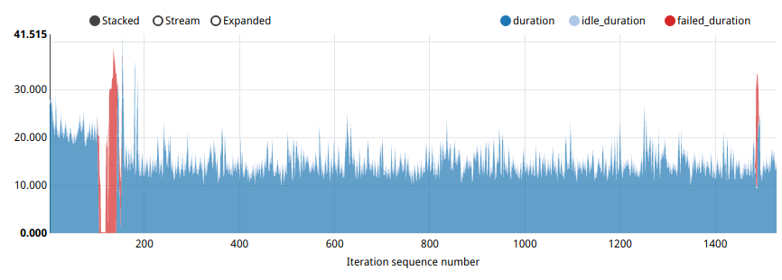

.. _`fuel_ccp_upgrade_test_report`:

==================================================================
Fuel Containerized Control Plane performance report during upgrade
==================================================================

:Abstract:

  This document includes Fuel CCP control plane performance test results for
  various environments (from 50 to 350 nodes). All tests have been performed
  regarding :ref:`fuel_ccp_upgrade_test_plan`

Environment description
=======================

For Kubernetes pre-deployment `Kargo tool`_ was used. More information about
*fuel-ccp* and how it can be installed can be found in
`official documentation`_.

.. _Kargo tool: https://github.com/kubespray/kargo
.. _official documentation: http://fuel-ccp.readthedocs.io/en/latest/

Hardware configuration of each server
-------------------------------------

All servers have configuration describing in table below

.. table:: Description of servers hardware

   +-------+----------------+-------------------------------+
   |server |vendor,model    |HP,DL380 Gen9                  |
   +-------+----------------+-------------------------------+
   |CPU    |vendor,model    |Intel,E5-2680 v3               |
   |       +----------------+-------------------------------+
   |       |processor_count |2                              |
   |       +----------------+-------------------------------+
   |       |core_count      |12                             |
   |       +----------------+-------------------------------+
   |       |frequency_MHz   |2500                           |
   +-------+----------------+-------------------------------+
   |RAM    |vendor,model    |HP,752369-081                  |
   |       +----------------+-------------------------------+
   |       |amount_MB       |262144                         |
   +-------+----------------+-------------------------------+
   |NETWORK|interface_name  |p1p1                           |
   |       +----------------+-------------------------------+
   |       |vendor,model    |Intel,X710 Dual Port           |
   |       +----------------+-------------------------------+
   |       |bandwidth       |10G                            |
   +-------+----------------+-------------------------------+
   |STORAGE|dev_name        |/dev/sda                       |
   |       +----------------+-------------------------------+
   |       |vendor,model    | | raid10 - HP P840            |
   |       |                | | 12 disks EH0600JEDHE        |
   |       +----------------+-------------------------------+
   |       |SSD/HDD         |HDD                            |
   |       +----------------+-------------------------------+
   |       |size            | 3,6TB                         |
   +-------+----------------+-------------------------------+

Network configuration of each server
------------------------------------

All servers have same network configuration:

.. image:: configs/Network_Scheme.png
   :alt: Network Scheme of the environment
   :width: 650px

Fuel CCP configuration
----------------------
CCP main configuration
:download:`ccp.yaml <configs/ccp.yaml>`

CCP Cluster configuration
:download:`configs.yaml <configs/configs.yaml>`

CCP Cluster topology
:download:`topology.yaml <configs/topology.yaml>`

CCP repositories configuration
:download:`repos.yaml <configs/repos.yaml>`

CCP versions configuration for Mitaka
:download:`versions-mitaka.yaml <configs/versions-mitaka.yaml>`

CCP versions configuration for upgrade from Mitaka to Newton
:download:`versions-newton.yaml <configs/versions-newton.yaml>`

Rally configuration and scenario
--------------------------------
Rally deployment
:download:`rally_deployment.json <configs/rally_deployment.json>`

Rally scenario
:download:`create_and_delete.yaml <configs/create_and_delete.yaml>`

Upgrade and tests procedure
---------------------------
* Install fuel-ccp
* Rename ``ccp.yaml`` to ``/root/.ccp.ymal``
* Copy all yaml files to ``/root/``
* Rename ``versions-mitaka.yaml`` to ``versions.yaml``
* Execute ``ccp deploy`` and wait ok status for all services
* Create rally deployment with ``rally_deployment.json``
* Create role for rally ``openstack --insecure role create member``
* Start rally tests ``rally task start --task-args 'gre_enabled: true' ./create_and_delete.yaml``
* Rename ``versions-newton.yaml`` to ``versions.yaml``
* Execute ``ccp deploy`` and wait ok status for all services
* Wait tests results from rally

Test results
============

Test Case 1: Boot and delete server
-----------------------------------

The following set of results is dedicated to investigate how Nova installed
against Kubernetes cluster via fuel-ccp tool is behaving during update from
Mitaka to Newton. Upgrade started on 100 iteration and finished on the 156
iteration.

149 nodes OpenStack cluster, concurrency 5, 1530 iterations
~~~~~~~~~~~~~~~~~~~~~~~~~~~~~~~~~~~~~~~~~~~~~~~~~~~~~~~~~~

NovaServers.boot_and_delete_server scenario in
:download:`upgrade_newton_to_mitaka.html <reports/upgrade_newton_to_mitaka.html>`

+----------------------+-----------+-----------+-----------+-----------+-----------+
| Operation            |     Median|    90%ile |    95%ile |   Max     |   Min     |
|                      |     (sec) |    (sec)  |    (sec)  |   (sec)   |   (sec)   |
+======================+===========+===========+===========+===========+===========+
| boot_server          | 11.879    | 16.753    | 18.708    | 48.84     | 7.563     |
+----------------------+-----------+-----------+-----------+-----------+-----------+
| delete_server        | 2.593     | 4.754     | 4.898     | 6.829     |  2.313    |
+----------------------+-----------+-----------+-----------+-----------+-----------+

The control plane downtime of keystone upgrades will be avoided in the feature
versions of fuel-ccp
