================================
Hardware Offloads - Test results
================================

Baseline physical scenario
--------------------------

In this scenario, hardware offloads provided a significant performance
gain in terms of CPU usage and throughput both for the transmitter and
the receiver. Throughput being was affected in tests with small MTU
(1500) while CPU consumption changes were only visible with jumbo frames
enabled (MTU 9000).

-  Enabling offloads on a transmitter with MTU 1500 gives 60% throughput
   gain for TCP and 5% for UDP with TSO and GSO giving the highest
   boost.

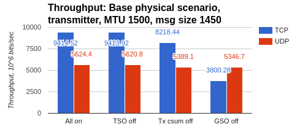

-  Enabling offloads on a transmitter with MTU 9000 gives 55% CPU
   performance gain for TCP and 11.6% for UDP with Tx checksumming
   and GSO giving the highest boost.

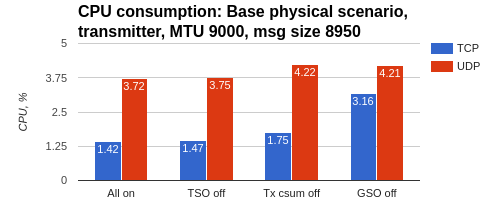

-  Enabling offloads on a receiver with MTU 1500 gives 40% throughput
   gain for TCP and 11.7% for UDP with GRO and Rx checksumming
   giving the highest boost respectively.

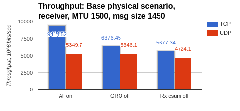

-  Enabling offloads on a receiver with MTU 9000 gives 44% CPU
   performance gain for TCP and 27.3% for UDP with with GRO and Rx
   checksumming giving the highest boost respectively.

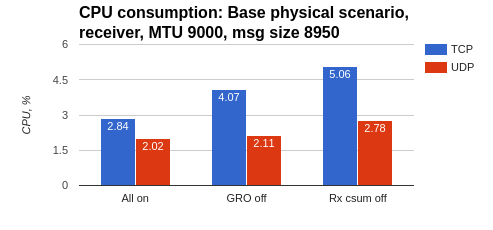

Baseline physical over VxLAN scenario
-------------------------------------

Similarly to baseline physical scenario, hardware offloads introduced a
significant performance gain in terms of CPU usage and throughput both
for the transmitter and the receiver. For TCP tests the effect was most
noticeable on the receiver side while for UDP most significant
improvement were achieved on the transmitter side.

-  Enabling offloads on a transmitter with MTU 1500 gives 23.3%
   throughput gain for TCP and 7.4% for UDP with Tx checksumming and
   Tx UDP tunneling segmentation giving the highest boost.

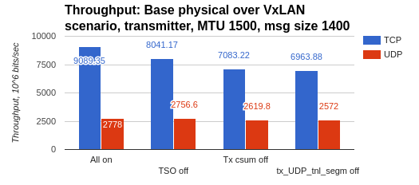

-  Enabling offloads on a transmitter with MTU 9000 gives 25% CPU
   performance gain for TCP and 17.4% for UDP with Tx checksumming
   giving the highest boost.

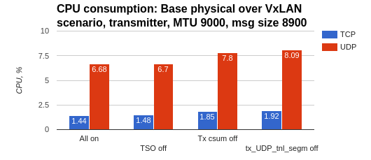

-  Enabling offloads on a receiver with MTU 1500 gives 66% throughput
   gain for TCP and 2.4% for UDP with GRO giving the highest boost
   respectively.

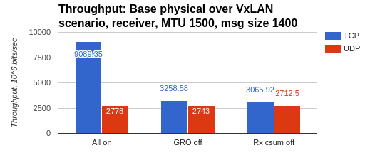

-  Enabling offloads on a receiver with MTU 9000 gives 48% CPU
   performance gain for TCP and 29% for UDP with with GRO and Rx
   checksumming giving the highest boost respectively.

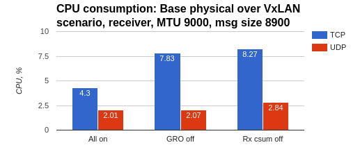

VM-to-VM on different nodes scenario
------------------------------------

-  Enabling Tx and TSO on the transmit side increases throughput by 44%
   for TCP and by 44.7% for UDP respectively.

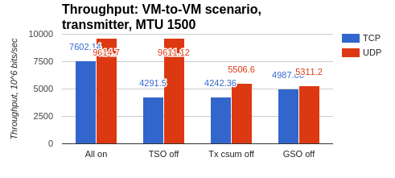

-  Enabling GRO on the receive side increases throughput by 59.7% for
   TCP and by 61.6% for UDP respectively.

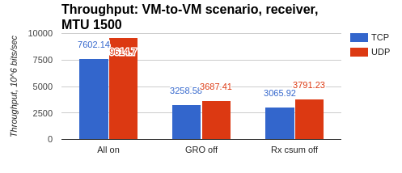

-  CPU performance improvement is mostly visible on the transmitter with
   turning offloads off triggering total CPU consumption rising by
   64.8% and 54.5% for TCP and UDP stream tests
   correspondingly.

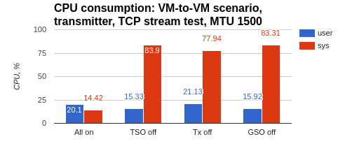
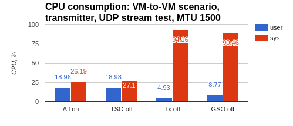

-  Total CPU consumption on the receiver side in TCP stream tests
   does not change significantly, but at the same time turning
   offloads off leads to processes in user space taking more CPU
   time with system time decreasing.

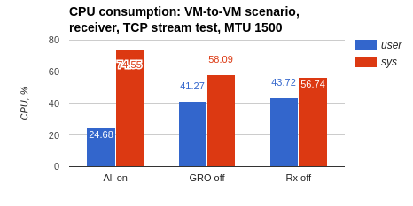

-  In UDP stream tests user part of CPU consumption on the receiver
   drops by 3.5% with offloads on.

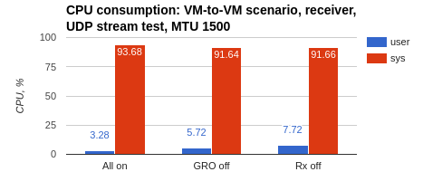

VM-to-VM on different nodes over VxLAN scenario
-----------------------------------------------

-  Enabling Tx and TSO on the transmit side increases throughput by
   35.4% for TCP and by 70% for UDP respectively.

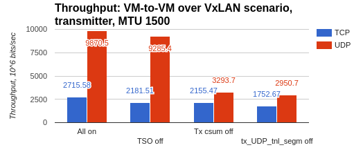

-  Enabling GRO on the receive side increases throughput by 26% for TCP
   and by 4% for UDP respectively.

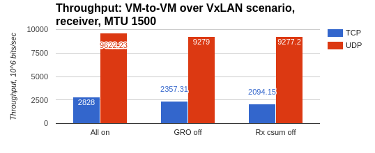

-  CPU performance improvement is mostly visible on the transmitter with
   turning offloads off triggering total CPU consumption rise by
   78.6% and 72.5% for TCP and UDP stream tests correspondingly.

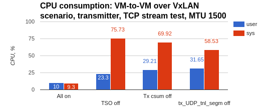

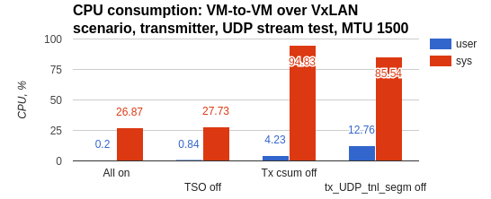

-  Total CPU consumption on the receiver side in TCP stream tests
   does not change significantly, but at the same time turning
   offloads off leads to processes in kernel space taking more CPU
   time with user space time decreasing.

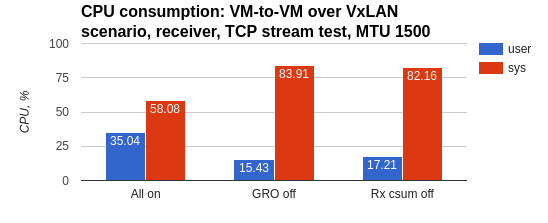

-  In UDP stream tests user part of CPU consumption on the receiver
   drops by 7% with offloads on.

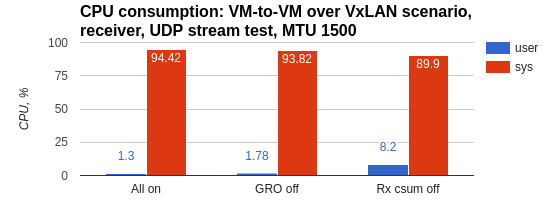

Summary
-------

Network hardware offloads provide significant performance improvement in
terms of CPU usage and throughput on both the transmit and receive side.
This impact in particularly strong in case of VM-to-VM communication.

Based on testing results the following recommendations on using offloads
for improving throughput and CPU performance can be made:

-  To increase TCP throughput:

   -  Enable TSO and GSO (tx-udp\_tnl-segmentation for VxLAN
      encapsulation) on transmitter

   -  Enable GRO on receiver

-  To increase UDP throughput:

   -  Enable Tx checksumming on transmitter

   -  Enable GRO on receiver

-  To improve TCP CPU performance:

   -  Enable TSO on transmitter

   -  Enable GRO on receiver

-  To improve UDP CPU performance:

   -  Enable Tx checksumming on transmitter

   -  Enable Rx checksumming on receiver

Using `kernel ver. 3.19 <http://kernelnewbies.org/Linux_3.19>`__ or
higher and hardware capable of performing offloads for encapsulated
traffic like `Intel XL710
controller <http://www.intel.com/content/www/us/en/embedded/products/networking/xl710-10-40-gbe-controller-brief.html>`__
means that these improvements can be seen in deployments that involve
VxLAN encapsulation.