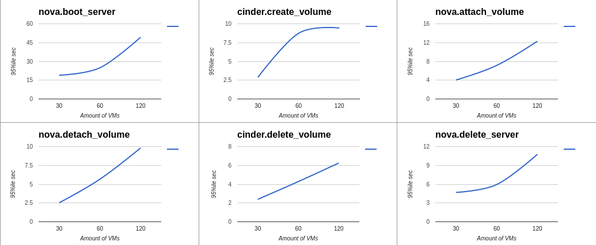
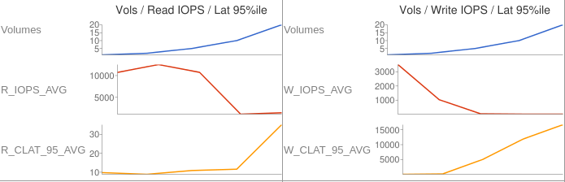
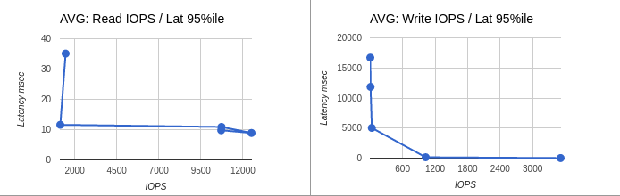
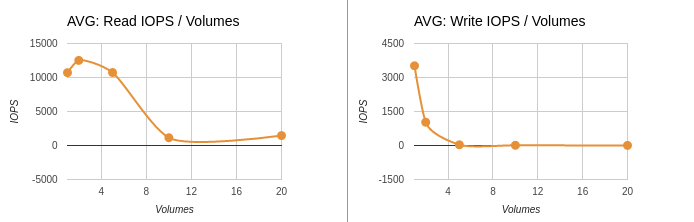
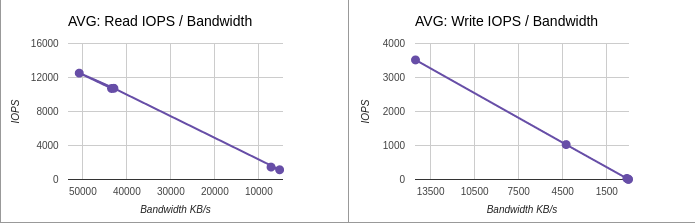
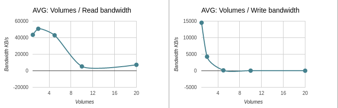
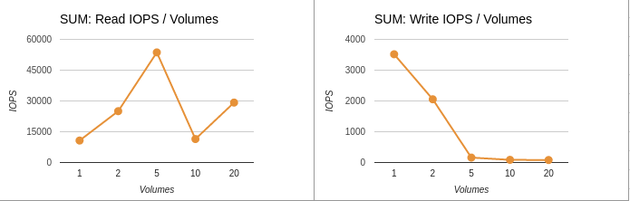
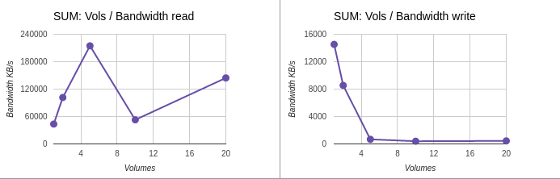

.. _Measuring_performance_of_cinder_ceph:

************************************************************
Results of measuring performance of Cinder with Ceph backend
************************************************************

:Abstract:

  This document includes performance test results of `Cinder`_
  service with `Ceph`_ as storage backend. All tests have been performed
  regarding :ref:`Measuring_performance_of_cinder_with_ceph_backend`

Environment description
=======================
Hardware configuration of each server
-------------------------------------

.. table:: Description of servers hardware

+-------+----------------+-----------------------------+-----------------------------+
|server |name            | --                          | --                          |
|       +----------------+-----------------------------+-----------------------------+
|       |role            | ceph cluster member         | kubernetes cluster member   |
|       +----------------+-----------------------------+-----------------------------+
|       |vendor,model    | HP ProLiant DL380 Gen9      | HP ProLiant DL380 Gen9      |
|       +----------------+-----------------------------+-----------------------------+
|       |operating_system| Ubuntu 16.04.1 LTS x86_64   | Ubuntu 16.04.1 LTS x86_64   |
+-------+----------------+-----------------------------+-----------------------------+
|CPU    |vendor,model    | Intel(R) Xeon(R) E5-2680 v3 | Intel(R) Xeon(R) E5-2680 v3 |
|       +----------------+-----------------------------+-----------------------------+
|       |processor_count | 2                           | 2                           |
|       +----------------+-----------------------------+-----------------------------+
|       |core_count      | 12                          | 12                          |
|       +----------------+-----------------------------+-----------------------------+
|       |frequency_MHz   | 2500                        | 2500                        |
+-------+----------------+-----------------------------+-----------------------------+
|RAM    |vendor,model    | HP DIMM 16Gb 2133 MHz       | HP DIMM 16Gb 2133 MHz       |
|       +----------------+-----------------------------+-----------------------------+
|       |amount_GiB      | 256                         | 256                         |
+-------+----------------+-----------------------------+-----------------------------+
|NETWORK|interface_name  | p1p1                        | p1p1                        |
|       +----------------+-----------------------------+-----------------------------+
|       |vendor,model    | Intel X710 for 10GbE SFP+   | Intel X710 for 10GbE SFP+   |
|       +----------------+-----------------------------+-----------------------------+
|       |bandwidth       | 10Gbit/s                    | 10Gbit/s                    |
+-------+----------------+-----------------------------+-----------------------------+
|STORAGE|dev_name        |  /dev/sd[a-k]               | /dev/sda                    |
|       +----------------+-----------------------------+-----------------------------+
|       |vendor,model    | HP Smart Array Gen9         | HP Smart Array Gen9 RAID10  |
|       |                | 12xHDD SAS 15K  EH0600JEDHE | 12xHDD SAS 15K  EH0600JEDHE |
|       +----------------+-----------------------------+-----------------------------+
|       |SSD/HDD         | HDD                         | HDD                         |
|       +----------------+-----------------------------+-----------------------------+
|       |size            | 600GB x 11                  | 3600GB                      |
+-------+----------------+-----------------------------+-----------------------------+

Configuration of physical network
---------------------------------
All servers connected between themselves with 10G media. Logically environment
network devided into 2 parts at L2 with vlans. First VLAN is for cluster
interconnect and second is serving as a provider network for OpenStack cloud.

Ceph cluster configuration
--------------------------
Ceph cluster contains 3 hardware servers with identical configuration.

- All servers configured in AIO manner - mon, osd & mds roles present on each of
these 3 servers. Each server has 10 x 600Gib volumes used by OSDs - 30 OSD
total.

  - Ceph monitor instances - 3

  - Ceph OSDs - 30, 10 per cluster member, placement groups - 1984

..

root@729346-comp-disk-348:~# ceph status
  cluster 0478bb62-4951-44fc-aecc-e5f1474bd00d
   health HEALTH_WARN
          noscrub,nodeep-scrub,sortbitwise flag(s) set
   monmap e1: 3 mons at {729346-comp-disk-348=172.20.9.137:6789/0,729353-comp-disk-341=172.20.9.144:6789/0,729693-comp-disk-199=172.20.9.242:6789/0}
          election epoch 6, quorum 0,1,2 729346-comp-disk-348,729353-comp-disk-341,729693-comp-disk-199
   osdmap e81: 30 osds: 30 up, 30 in
          flags noscrub,nodeep-scrub,sortbitwise
    pgmap v670470: 1984 pgs, 9 pools, 2291 MB data, 300 objects
          9236 MB used, 16599 GB / 16608 GB avail
              1984 active+clean

:download:`Ceph configuration files <configs/ceph.nodes.tar.gz>`

Kubernetes + Calico configuration
---------------------------------
Kubernetes deployed with `Kargo`_ on 6 hardware nodes.

- Kargo installation topology of k8s by roles:

 - kube-master:

   - node1

   - node2

 - kube-node:

   - node1

   - node2

   - node3

   - node4

   - node5

   - node6

 - etcd:

   - node1

   - node2

   - node3

- Calico k8s cni plugin configuration:
  Calico configured by Kargo and deployed with next configuration:

  - Calico container launched from systemd units as services on each node

  - Calico addressing configuration for k8s:
    ..

    etcdctl --endpoint https://node1:2379 get /calico/v1/ipam/v4/pool/10.240.0.0-12

    {"masquerade": true, "cidr": "10.240.0.0/12"}

:download:`kargo configuration files <configs/kargo.configuration.tar.gz>`

:download:`calico configuration files <configs/calico.tar.gz>`

OpenStack deployment configuration
----------------------------------
OpenStack deployed using `fuel-ccp`_

- OpenStack roles topology:

  - roles:

    - node[1-3]:

      - controller

      - openvswitch

    - node[4-6]:

      - compute

      - openvswitch

- OpenStack Cinder + Ceph configuration:

  .. code-block:: yaml

    ceph:
      fsid: "0478bb62-4951-44fc-aecc-e5f1474bd00d"
      mon_host: "172.20.9.137"
    cinder:
      ceph:
        enable: true
        pool_name: "volumes4"
        backup_pool_name: "backup4"
        username: "cinder4"
        key: "AQAKoUZYmYmDMxAAfD52DuUlghtH6bGSutTfnQ=="
        rbd_secret_uuid: "5d6e0775-c45b-4bf6-b9ac-460a3ccec127"
    glance:
      ceph:
        enable: true
        pool_name: "images4"
        username: "glance4"
        key: "AQAKoUZYlZU6IxAA5B+sixBtz19hrjRwV2kUKA=="
    nova:
      ceph:
        enable: true
        pool_name: "vms4"

More detailed information about services configuration and distribution
across nodes could be obtained from :download:`fuel-ccp configuration files: <configs/fuel-ccp.tar.gz>`.

Test tools:
^^^^^^^^^^
- `rally`_ - OpenStack benchmarking tool

- `fio`_ - tool that able to simulate a given io workload without resorting to
  writing a tailored test case again and again

Testing process
===============

Preparation
-----------

1. `rally container setup`_ - required for 1st test case where we are going to
  test "control plane".

2. `openstackclient install`_ - required for both cases.

3. `openstack rc file preparation`_ - required for both cases.

4. Upload ubuntu xenial cloud image in raw disk format.

5. Create and upload image with random data which will be used
for prefilling of Cinder volumes.

Test Case 1
-----------
Launched 3 rally jobs where every next job uses parameters from previous one
multiplied on two.

- Example of Rally job execution

.. code:: bash

  rally task start cinder30.yaml

Test Case 2
------------
Spawn different amount of vms with cinder volumes attached using heat.
Each next run spawn greater amount of concurrent vms which will produce
concurrent loads.

- Preparation of image with random data

.. code:: bash

  dd if=/dev/urandom of=40g.data bs=1M count=40960 iflag=fullblock status=progress

  openstack image create --container-format=bare --disk-format=raw --public --file 40g.data 40g-urandom

- Prepared custom flavor for VMs

.. code:: bash

  openstack flavor show m1.cinder
  +----------------------------+--------------------------------------+
  | Field                      | Value                                |
  +----------------------------+--------------------------------------+
  | OS-FLV-DISABLED:disabled   | False                                |
  | OS-FLV-EXT-DATA:ephemeral  | 0                                    |
  | access_project_ids         | None                                 |
  | disk                       | 6                                    |
  | id                         | 74eff70b-5f1e-44db-8248-90be0c57a18e |
  | name                       | m1.cinder                            |
  | os-flavor-access:is_public | True                                 |
  | properties                 |                                      |
  | ram                        | 2048                                 |
  | rxtx_factor                | 1.0                                  |
  | swap                       |                                      |
  | vcpus                      | 1                                    |
  +----------------------------+--------------------------------------+

- Example of heat template execution - launch of tests

.. code:: bash

  # 2 VMs R/W
  # write
  openstack stack create --parameter "image=xenial_raw;flavor=m1.cinder;key_name=admkey;volume_size=40;network_name=int-net;vm_count=1;test_iodepth=64;test_filesize=40G;test_mode=time;test_runtime=600;test_rw=randwrite" --template cinder-ceph-io/main.yaml cinderstack0
  +---------------------+--------------------------------------+
  | Field               | Value                                |
  +---------------------+--------------------------------------+
  | id                  | ae834cdc-35d3-4fc2-a0df-c8a4dfd499c9 |
  | stack_name          | cinderstack0                         |
  | description         | No description                       |
  | creation_time       | 2016-12-27T16:15:26Z                 |
  | updated_time        | None                                 |
  | stack_status        | CREATE_IN_PROGRESS                   |
  | stack_status_reason | Stack CREATE started                 |
  +---------------------+--------------------------------------+
  # read
  openstack stack create --parameter "image=xenial_raw;flavor=m1.cinder;key_name=admkey;volume_size=40;network_name=int-net;vm_count=1;test_iodepth=64;test_filesize=40G;test_mode=time;test_runtime=600;test_rw=randread" --template cinder-ceph-io/main.yaml cinderstack1
  +---------------------+--------------------------------------+
  | Field               | Value                                |
  +---------------------+--------------------------------------+
  | id                  | bd9d923d-0571-4219-a639-071cf1d41cd3 |
  | stack_name          | cinderstack1                         |
  | description         | No description                       |
  | creation_time       | 2016-12-27T16:15:28Z                 |
  | updated_time        | None                                 |
  | stack_status        | CREATE_IN_PROGRESS                   |
  | stack_status_reason | Stack CREATE started                 |
  +---------------------+--------------------------------------+

- As a result of this part we got the following CSV files in following format
starttime,stoptime,jobname,
read_iops,read_bandwidth,read_complelatency_mean,read_complelatency_min,read_complelatency_max,read_complelatency_95%ile,read_complelatency_99%ile,read_total_latency_avg,read_bandwidth_avg,
write_iops,write_bandwidth,write_complelatency_mean,write_complelatency_min,write_complelatency_max,write_complelatency_95%ile,write_complelatency_99%ile,write_total_latency_avg,write_bandwidth_avg.

:download:`METRICS(NUMBER_OF_VM_WORKERS=2) <results/cinder_ceph/02/2.csv>`

:download:`METRICS(NUMBER_OF_VM_WORKERS=4) <results/cinder_ceph/04/4.csv>`

:download:`METRICS(NUMBER_OF_VM_WORKERS=10) <results/cinder_ceph/10/10.csv>`

:download:`METRICS(NUMBER_OF_VM_WORKERS=20) <results/cinder_ceph/20/20.csv>`

:download:`METRICS(NUMBER_OF_VM_WORKERS=40) <results/cinder_ceph/40/40.csv>`

Results
=======
Test Case 1
-----------

Summary table for Rally jobs launched with 30, 60 and 120 instances

.. table:: Summary table for Rally jobs

  +-------------------------------------------------------------------------------------------------------------------------+
  |                                                  Response Times (sec)                                                   |
  +----------------------+-----------+--------------+--------------+--------------+-----------+-----------+---------+-------+
  | Action               | Min (sec) | Median (sec) | 90%ile (sec) | 95%ile (sec) | Max (sec) | Avg (sec) | Success | Count |
  +----------------------+-----------+--------------+--------------+--------------+-----------+-----------+---------+-------+
  | nova.boot_server     | 8.867     | 13.971       | 18.19        | 18.953       | 20.078    | 13.967    | 100.0%  | 30    |
  +----------------------+-----------+--------------+--------------+--------------+-----------+-----------+---------+-------+
  | cinder.create_volume | 2.28      | 2.433        | 2.66         | 2.882        | 3.058     | 2.452     | 100.0%  | 30    |
  +----------------------+-----------+--------------+--------------+--------------+-----------+-----------+---------+-------+
  | nova.attach_volume   | 2.354     | 2.666        | 3.41         | 4.036        | 5.24      | 2.844     | 100.0%  | 30    |
  +----------------------+-----------+--------------+--------------+--------------+-----------+-----------+---------+-------+
  | nova.detach_volume   | 2.283     | 2.386        | 2.51         | 2.525        | 2.544     | 2.394     | 100.0%  | 30    |
  +----------------------+-----------+--------------+--------------+--------------+-----------+-----------+---------+-------+
  | cinder.delete_volume | 0.268     | 2.187        | 2.324        | 2.383        | 2.419     | 2.157     | 100.0%  | 30    |
  +----------------------+-----------+--------------+--------------+--------------+-----------+-----------+---------+-------+
  | nova.delete_server   | 2.326     | 2.509        | 4.607        | 4.683        | 4.771     | 2.839     | 100.0%  | 30    |
  +----------------------+-----------+--------------+--------------+--------------+-----------+-----------+---------+-------+
  | total                | 17.362    | 23.35        | 28.268       | 28.455       | 28.987    | 23.654    | 100.0%  | 30    |
  +----------------------+-----------+--------------+--------------+--------------+-----------+-----------+---------+-------+
  | nova.boot_server     | 10.719    | 19.401       | 24.605       | 24.891       | 26.366    | 18.951    | 100.0%  | 60    |
  +----------------------+-----------+--------------+--------------+--------------+-----------+-----------+---------+-------+
  | cinder.create_volume | 2.281     | 3.148        | 8.412        | 8.74         | 8.993     | 4.188     | 100.0%  | 60    |
  +----------------------+-----------+--------------+--------------+--------------+-----------+-----------+---------+-------+
  | nova.attach_volume   | 2.388     | 4.55         | 6.909        | 7.142        | 9.588     | 4.544     | 100.0%  | 60    |
  +----------------------+-----------+--------------+--------------+--------------+-----------+-----------+---------+-------+
  | nova.detach_volume   | 2.308     | 2.603        | 4.842        | 5.663        | 6.485     | 3.304     | 100.0%  | 60    |
  +----------------------+-----------+--------------+--------------+--------------+-----------+-----------+---------+-------+
  | cinder.delete_volume | 2.132     | 2.197        | 2.414        | 4.275        | 6.261     | 2.415     | 100.0%  | 60    |
  +----------------------+-----------+--------------+--------------+--------------+-----------+-----------+---------+-------+
  | nova.delete_server   | 2.38      | 2.798        | 5.11         | 5.937        | 8.817     | 3.802     | 100.0%  | 60    |
  +----------------------+-----------+--------------+--------------+--------------+-----------+-----------+---------+-------+
  | total                | 22.144    | 34.618       | 42.993       | 43.782       | 44.018    | 34.205    | 100.0%  | 60    |
  +----------------------+-----------+--------------+--------------+--------------+-----------+-----------+---------+-------+
  | nova.boot_server     | 16.817    | 29.559       | 39.734       | 49.257       | 78.91     | 31.29     | 100.0%  | 120   |
  +----------------------+-----------+--------------+--------------+--------------+-----------+-----------+---------+-------+
  | cinder.create_volume | 2.377     | 6.364        | 9.192        | 9.441        | 11.667    | 6.66      | 100.0%  | 120   |
  +----------------------+-----------+--------------+--------------+--------------+-----------+-----------+---------+-------+
  | nova.attach_volume   | 2.57      | 7.196        | 11.151       | 12.285       | 17.159    | 7.228     | 100.0%  | 120   |
  +----------------------+-----------+--------------+--------------+--------------+-----------+-----------+---------+-------+
  | nova.detach_volume   | 2.308     | 4.897        | 8.617        | 9.816        | 11.4      | 5.218     | 100.0%  | 120   |
  +----------------------+-----------+--------------+--------------+--------------+-----------+-----------+---------+-------+
  | cinder.delete_volume | 0.359     | 2.3          | 4.563        | 6.25         | 7.456     | 2.928     | 100.0%  | 120   |
  +----------------------+-----------+--------------+--------------+--------------+-----------+-----------+---------+-------+
  | nova.delete_server   | 2.372     | 4.942        | 8.401        | 10.761       | 15.516    | 5.357     | 100.0%  | 120   |
  +----------------------+-----------+--------------+--------------+--------------+-----------+-----------+---------+-------+
  | total                | 31.509    | 53.733       | 68.212       | 73.372       | 109.88    | 55.682    | 100.0%  | 120   |
  +----------------------+-----------+--------------+--------------+--------------+-----------+-----------+---------+-------+

HTML reports generated by Rally
^^^^^^^^^^^^^^^^^^^^^^^^^^^^^^^

- Report for 30 instances :download:`link <results/rally/output30.html>`

- Report for 60 instances :download:`link <results/rally/output60.html>`

- Report for 120 instances :download:`link <results/rally/output120.html>`

Graphs which shows time dependecy from amount of instances
^^^^^^^^^^^^^^^^^^^^^^^^^^^^^^^^^^^^^^^^^^^^^^^^^^^^^^^^^^

Test Case 2
-----------
Simultaneous run of equal amount random read and write operations.
All raw data and graphs could be obtained from - `Tests results spreadsheet`_.

Average data
^^^^^^^^^^^^
Table represents average results of mesurments made inside each consumer.
This means that each row in the table below contains data from equal amount of
consumers which were running at the same time and were producing read and write
operations.

Latency displayed in milliseconds and represents value of 95th percentile.

.. table:: Average values of performance metrics from cinder + ceph

  +-------+----------------+----------+----------+---------+-----------+
  || nodes|| test duration || average || average || average|| average  |
  || count|| time in sec   || IOPS    || IOPS    || latency|| latency  |
  ||      ||               || READ    || WRITE   || READ   || WRITE    |
  +=======+================+==========+==========+=========+===========+
  | 2     | 600            | 10711    | 3517     | 9.792   | 13.76     |
  +-------+----------------+----------+----------+---------+-----------+
  | 4     | 600            | 12512    | 1027     | 8.896   | 143.104   |
  +-------+----------------+----------+----------+---------+-----------+
  | 10    | 600            | 10730    | 32       | 12.582  | 5026.611  |
  +-------+----------------+----------+----------+---------+-----------+
  | 20    | 600            | 1143     | 9        | 11.597  | 11848.909 |
  +-------+----------------+----------+----------+---------+-----------+
  | 40    | 600            | 1460     | 4        | 35.117  | 16711.68  |
  +-------+----------------+----------+----------+---------+-----------+

Graphs for average results
^^^^^^^^^^^^^^^^^^^^^^^^^^

**Average data: Volumes / IOPS / Latency 95%ile**

**Average data: IOPS / Latency 95%ile**

**Average data: IOPS / Volumes**

**Average data: IOPS / Bandwidth**

**Average data: Volumes / Bandwidth**

Summary data
^^^^^^^^^^^^
Here represented data from aggregated values.

.. table:: Summary values of performance metrics from cinder + ceph

  +-------+----------------+----------+----------+
  || nodes|| test duration || SUM     || SUM     |
  || count|| time in sec   || IOPS    || IOPS    |
  ||      ||               || READ    || WRITE   |
  +=======+================+==========+==========+
  | 2     | 600            | 10711    | 3517     |
  +-------+----------------+----------+----------+
  | 4     | 600            | 25024    | 2054     |
  +-------+----------------+----------+----------+
  | 10    | 600            | 53652    | 160      |
  +-------+----------------+----------+----------+
  | 20    | 600            | 11437    | 87       |
  +-------+----------------+----------+----------+
  | 40    | 600            | 29203    | 81       |
  +-------+----------------+----------+----------+

Graphs for summary results
^^^^^^^^^^^^^^^^^^^^^^^^^^

**Summary data: IOPS / Volumes**

**Summary data: Volumes / Bandwidth**

Issues which have been found during the tests
=============================================

Ceph performance degradation due to use of non optimal configuration
--------------------------------------------------------------------
Down below displayed couple of raw data entries as from test results as from Ceph
log files. This data shows that Ceph began to block serving of requests due to
lack of placemnent groups and grown amount of concurrent read/write requests.

  Data from tests::

    2016.12.28-13:48:24	2016.12.28-13:58:37	time-vm-randwrite-16_fio	0	0	0	0	0	0	0	0	0	3	14	18258.5785	60.418	27027.923	16711.68	16711.68	18258.6123	14.723724
    2016.12.28-13:47:34	2016.12.28-13:57:57	time-vm-randwrite-17_fio	0	0	0	0	0	0	0	0	0	4	16	15692.7769	73.15	47574.579	16711.68	16711.68	15692.8036	17.715092
    2016.12.28-13:51:36	2016.12.28-14:01:39	time-vm-randwrite-18_fio	0	0	0	0	0	0	0	0	0	6	27	9373.5427	7.837	27200.956	16711.68	16711.68	9373.5793	35.894502
    2016.12.28-13:50:27	2016.12.28-14:00:28	time-vm-randread-19_fio	347	1391	183.965	0.071	45620.107	21.888	6455.296	183.9819	1791.505108	0	0	0	0	0
    2016.12.28-13:52:05	2016.12.28-14:02:05	time-vm-randread-1_fio	1309	5237	48.8591	0.199	45945.681	18.304	23.68	48.8754	6672.371367	0	0	0	0	0
    2016.12.28-13:52:37	2016.12.28-14:02:37	time-vm-randread-2_fio	1443	5773	44.3222	0.085	42175.723	22.4	25.216	44.3394	7158.120545	0	0	0	0	0

  Data from Ceph logs::

    Wed Dec 28 13:53:47 UTC 2016 cluster 0478bb62-4951-44fc-aecc-e5f1474bd00d health HEALTH_WARN 297 requests are blocked > 32 sec noscrub,nodeep-scrub,sortbitwise flag(s) set monmap e1: 3 mons at {729346-comp-disk-348=172.20.9.137:6789/0,729353-comp-disk-341=172.20.9.144:6789/0,729693-comp-disk-199=172.20.9.242:6789/0} election epoch 6, quorum 0,1,2 729346-comp-disk-348,729353-comp-disk-341,729693-comp-disk-199 osdmap e82: 30 osds: 30 up, 30 in flags noscrub,nodeep-scrub,sortbitwise pgmap v691525: 1984 pgs, 9 pools, 127 GB data, 27911 objects 393 GB used, 16214 GB / 16608 GB avail 1984 active+clean client io 216 MB/s rd, 206 MB/s wr, 1193 op/s rd, 271 op/s wr
    Wed Dec 28 13:54:23 UTC 2016 cluster 0478bb62-4951-44fc-aecc-e5f1474bd00d health HEALTH_WARN 145 requests are blocked > 32 sec noscrub,nodeep-scrub,sortbitwise flag(s) set monmap e1: 3 mons at {729346-comp-disk-348=172.20.9.137:6789/0,729353-comp-disk-341=172.20.9.144:6789/0,729693-comp-disk-199=172.20.9.242:6789/0} election epoch 6, quorum 0,1,2 729346-comp-disk-348,729353-comp-disk-341,729693-comp-disk-199 osdmap e82: 30 osds: 30 up, 30 in flags noscrub,nodeep-scrub,sortbitwise pgmap v691534: 1984 pgs, 9 pools, 136 GB data, 30138 objects 420 GB used, 16187 GB / 16608 GB avail 1984 active+clean client io 233 MB/s rd, 226 MB/s wr, 1407 op/s rd, 295 op/s wr
    Wed Dec 28 13:55:30 UTC 2016 cluster 0478bb62-4951-44fc-aecc-e5f1474bd00d health HEALTH_WARN 280 requests are blocked > 32 sec noscrub,nodeep-scrub,sortbitwise flag(s) set monmap e1: 3 mons at {729346-comp-disk-348=172.20.9.137:6789/0,729353-comp-disk-341=172.20.9.144:6789/0,729693-comp-disk-199=172.20.9.242:6789/0} election epoch 6, quorum 0,1,2 729346-comp-disk-348,729353-comp-disk-341,729693-comp-disk-199 osdmap e82: 30 osds: 30 up, 30 in flags noscrub,nodeep-scrub,sortbitwise pgmap v691547: 1984 pgs, 9 pools, 148 GB data, 33162 objects 454 GB used, 16153 GB / 16608 GB avail 1984 active+clean client io 262 MB/s rd, 248 MB/s wr, 1472 op/s rd, 320 op/s wr
    Wed Dec 28 13:56:14 UTC 2016 cluster 0478bb62-4951-44fc-aecc-e5f1474bd00d health HEALTH_WARN 240 requests are blocked > 32 sec noscrub,nodeep-scrub,sortbitwise flag(s) set monmap e1: 3 mons at {729346-comp-disk-348=172.20.9.137:6789/0,729353-comp-disk-341=172.20.9.144:6789/0,729693-comp-disk-199=172.20.9.242:6789/0} election epoch 6, quorum 0,1,2 729346-comp-disk-348,729353-comp-disk-341,729693-comp-disk-199 osdmap e82: 30 osds: 30 up, 30 in flags noscrub,nodeep-scrub,sortbitwise pgmap v691560: 1984 pgs, 9 pools, 160 GB data, 36160 objects 490 GB used, 16117 GB / 16608 GB avail 1984 active+clean client io 215 MB/s rd, 202 MB/s wr, 1282 op/s rd, 266 op/s wr
    tbitwise pgmap v691562: 1984 pgs, 9 pools, 161 GB data, 36591 objects 495 GB used, 16112 GB / 16608 GB avail 1984 active+clean client io 257 MB/s rd, 246 MB/s wr, 1591 op/s rd, 304 op/s wr

**Explanation of data from above:**

1.Time period got from last test run, where were spawned 40 VMs / consumers.
  20 for read and 20 for write tests running in concurrent mode. Each test cycle
  duration is equals 600 seconds - 10 minutes. From test logs we see that all VMs
  were spawned with small time difference and have about 70% of intersection.
  During this period of time VMs were producing loads on storage subsystem.

2.Amount of IOPS are lowered for both read and write operations. From test logs
  we see that for write they are: *3*, *4*, *6* and for read: *347*, *1309*, *1443*.

3.IOPS values in case of read operations are higher then in case of write operations
  due to RAID controller cache on Ceph cluster nodes and usage of one image for
  all volumes used in all tests.

4.Ceph log files show that during time when tests were running load on Ceph reached
  configuration limitaions and Ceph began to block requests. In log files it
  repsesented with entries containign this - *240 requests are blocked > 32 sec*.

Applications
============
Sofware versions used during tests
----------------------------------

.. table::

  +-----------------+--------------+-------------------------------------------------+
  | software        | version      | source                                          |
  +=================+==============+=================================================+
  | `Ceph`_         | jewell       | Debian jessie ceph package repository v10.2.3   |
  +-----------------+--------------+-------------------------------------------------+
  | `Kargo`_        | master       | From sources                                    |
  |                 |              | commit a62f74259c8df233b177f7853a178bcbb7d9ef43 |
  +-----------------+--------------+-------------------------------------------------+
  | `Kubernetes`_   | 1.4.3        | quay.io/coreos/hyperkube:v1.4.3_coreos.0        |
  +-----------------+--------------+-------------------------------------------------+
  | `Calico`_       | 0.22.0       | docker hub calico/node                          |
  +-----------------+--------------+-------------------------------------------------+
  | `calicoctl`_    | 1.0.0-beta   | docker hub calico/ctl                           |
  +-----------------+--------------+-------------------------------------------------+
  | `fuel-ccp`_     | master       | From sources                                    |
  |                 |              | commit f4afa36d9097c5860fa8ee9c2726236e7de83a27 |
  +-----------------+--------------+-------------------------------------------------+
  | `OpenStack`_    | newton       | From sources                                    |
  +-----------------+--------------+-------------------------------------------------+
  | `Rally`_        | 0.7.1~dev176 | docker hub rallyforge/rally                     |
  +-----------------+--------------+-------------------------------------------------+
  | `fio`_          | 2.2.10       | Ubuntu 16.04 Xenial package repository          |
  +-----------------+--------------+-------------------------------------------------+

.. references:

.. _Ceph: http://ceph.com/
.. _Cinder: https://wiki.openstack.org/wiki/Cinder
.. _Calico: https://github.com/projectcalico/calico-containers/releases/tag/v0.22.0
.. _calicoctl: https://github.com/projectcalico/calico-containers/releases/tag/v1.0.0-beta
.. _Kargo: https://github.com/kubernetes-incubator/kargo
.. _Kubernetes: http://kubernetes.io/
.. _fuel-ccp: http://fuel-ccp.readthedocs.io/
.. _rally container setup: https://rally.readthedocs.io/en/latest/install_and_upgrade/install.html#rally-docker
.. _rally: https://rally.readthedocs.io/en/latest/index.html
.. _openstackclient install: http://docs.openstack.org/cli-reference/common/cli-install-openstack-command-line-clients.html
.. _openstack rc file preparation: http://docs.openstack.org/user-guide/common/cli-set-environment-variables-using-openstack-rc.html
.. _OpenStack: http://www.openstack.org/
.. _fio: https://github.com/axboe/fio
.. _rally: https://rally.readthedocs.io/en/latest/index.html
.. _Tests results spreadsheet: https://docs.google.com/spreadsheets/d/1W08fquemLszmq0WMWq2-RNDt_bvVqeZrGJer1UrmgxA/edit?usp=sharing
