.. _LMA_test_results:

****************
LMA Test Results
****************

:Abstract:

  This document includes results of measuring how many resources LMA service
  needs as a monitoring service during using on a big environment (~200 nodes).
  This document includes results of reliability testing of `LMA`_ services.

Environment description
=======================
Hardware configuration of each server
-------------------------------------

.. table:: Description of servers hardware

  +-------+----------------+------------------------+------------------------+
  |role   |role            |OpenStackController     |OpenStackCompute and LMA|
  +-------+----------------+------------------------+------------------------+
  |CPU    |core_count (+HT)|40                      |12                      |
  |       +----------------+------------------------+------------------------+
  |       |frequency_MHz   |2300                    |2100                    |
  +-------+----------------+------------------------+------------------------+
  |RAM    |amount_MB       |262144                  |32768                   |
  +-------+----------------+------------------------+------------------------+
  |Disk1  |amount_GB       |111.8                   |75                      |
  +       +----------------+------------------------+------------------------+
  |       |SSD/HDD         |SSD                     |SSD                     |
  +-------+----------------+------------------------+------------------------+
  |Disk2  |amount_GB       |111.8                   |1000                    |
  +       +----------------+------------------------+------------------------+
  |       |SSD/HDD         |SSD                     |HDD                     |
  +-------+----------------+------------------------+------------------------+
  |Disk3  |amount_GB       |1800                    |-                       |
  +       +----------------+------------------------+------------------------+
  |       |SSD/HDD         |HDD                     |-                       |
  +-------+----------------+------------------------+------------------------+
  |Disk4  |amount_GB       |1800                    |-                       |
  +       +----------------+------------------------+------------------------+
  |       |SSD/HDD         |HDD                     |-                       |
  +-------+----------------+------------------------+------------------------+

Software configuration of the services
--------------------------------------
Installation of OpenStack and LMA plugins:
^^^^^^^^^^^^^^^^^^^^^^^^^^^^^^^^^^^^^^^^^^
OpenStack has been installed using Fuel version 8.0 and fuel plugins:
3 controllers, 193 computes (20 OSD), 3 Elasticsearch, 3 InfluxDB, 1 Nagios

.. table:: Versions of some software

  +--------------------------------+------------+
  |Software                        |Version     |
  +================================+============+
  |Fuel                            |8.0         |
  +--------------------------------+------------+
  |fuel-plugin-lma-collector       |0.9         |
  +--------------------------------+------------+
  |fuel-plugin-elasticsearch-kibana|0.9         |
  +--------------------------------+------------+
  |fuel-plugin-influxdb-grafana    |0.9         |
  +--------------------------------+------------+

Testing process
===============
1.
  Fuel 8.0, LMA plugins and OpenStack have been installed installed.

2.
  Rally tests have been performed two times. Results are here:
  :download:`rally_report_1.html <./rally_report_1.html>`
  :download:`rally_report_2.html <./rally_report_2.html>`
3. Metrics (cpu, memory, I/O) have been collected using collectd
4. Disbale InfluxDB services in haproxy to prevent Heka to send metrics to
   InfluxDB. The outage time should be equal to 3 hours
5. Enable InfluxDB services in haproxy backends and measure how many resources
   and time InfluxDB needs to get all statistic from Heka after outage.
6. Disbale Elasticsearch services in haproxy to prevent Heka to send metrics to
   Elasticsearch. The outage time should be equal to 3 hours
7. Enable Elasticsearch services in haproxy backends and measure how many
   resources and time Elasticsearch needs to get all statistic from Heka after
   outage.

Usage Results
=============

Collector: Hekad / collectd
---------------------------
The following table describe how many resources was used by Hekad and Collectd
during the test in depend on OpenStack role:

.. table::
   CPU, Memory and Disk consumption in depend on OpenStack role

  +------------------------+----------------+----------------+----------------+
  | role                   |CPU             |Memory          |I/O per second  |
  |                        |(hekad/collectd)|(hekad/collectd)|(hekad/collectd)|
  +========================+================+================+================+
  | controller             | 0.7 cpu        | 223 MB         |730 KB write    |
  |                        |                |                |                |
  |                        | 0.13 cpu       | 45 MB          |730 KB read     |
  |                        |                |                |                |
  |                        |                |                |0 KB write      |
  |                        |                |                |                |
  |                        |                |                |250 KB read     |
  +------------------------+----------------+----------------+----------------+
  || Controller without    | 0.4 cpu        |no impact       |220 KB write    |
  || RabbitMQ queues       |                |                |                |
  || metrics (~4500 queues)|                |                |                |
  || `1549721`_            | 0.06 cpu       |                |280 KB read     |
  |                        |                |                |                |
  |                        |                |                |0 KB write      |
  |                        |                |                |                |
  |                        |                |                |250 KB read     |
  +------------------------+----------------+----------------+----------------+
  | aggregator             | 0.9 cpu        | 285 MB         |830 KB write    |
  |                        |                |                |                |
  |                        | 0.13 cpu       | 50 MB          |830 KB read     |
  |                        |                |                |                |
  |                        |                |                |0 KB write      |
  |                        |                |                |                |
  |                        |                |                |247 KB read     |
  +------------------------+----------------+----------------+----------------+
  | compute                | 0.2 cpu        | 145 MB         |15 KB write     |
  |                        |                |                |                |
  |                        | 0.02 cpu       | 6.1 MB         |40 KB read      |
  |                        |                |                |                |
  |                        |                |                |0 KB write      |
  |                        |                |                |                |
  |                        |                |                |22 KB read      |
  +------------------------+----------------+----------------+----------------+
  | compute/osd            | 0.25 cpu       | 154 MB         |15 KB write     |
  |                        |                |                |                |
  |                        | 0.02 cpu       | 13 MB          |40 KB read      |
  |                        |                |                |                |
  |                        |                |                |0 KB write      |
  |                        |                |                |                |
  |                        |                |                |23 KB read      |
  +------------------------+----------------+----------------+----------------+

Influxdb
--------

InfluxDB consumes manageable amount of CPU (more information in the table
below). The compaction operation is performed regularly which produces spike of
resource consumption (every ~ 6 minutes with the actual load of
200 nodes / 1000 VMs):

|image0|

The average write operation duration is 3ms (SSD drive)

+-------------------------+-----------------+--------+-------+-----------------+
| Conditions              | write/s         | cpu    | memory| I/O             |
|                         |                 |(normal |(normal|(normal/         |
|                         |                 |/spike) |/spike)|spike)           |
+=========================+=================+========+=======+=================+
| normal                  |111 HTTP writes/s|0.38 cpu|1.2GB  |1.3MB(r)/1.7MB(w)|
|                         |                 |        |       |                 |
|                         |(37 w/s per node)|2 cpu   |2.3GB  |1.5MB(r)/7.3MB(w)|
+-------------------------+-----------------+--------+-------+-----------------+
|| Controller without     |75 HTTP writes/s |0.3 cpu |1.2GB  |930KB(r)/1MB(w)  |
|| RabbitMQ queues        |(25 w/s per node)|        |       |                 |
|| metrics (~4500 queues) |                 |        |       |                 |
|| `1549721`_             |(-30% w/o        |1.9 cpu |2.2GB  |1.5MB(r)/7.3MB(w)|
||                        |rabbitmq queues) |        |       |                 |
+-------------------------+-----------------+--------+-------+-----------------+
| w/o rabbitMQ            | 93 HTTP writes/s|0.5 cpu |1.5 GB |1MB(r)/1.4MB(w)  |
|                         |(31 w/s per node)|        |       |                 |
|                         |                 |        |       |                 |
| and 1000 VMs            | (0,018 w/s/vm)  |2.5 cpu |2 GB   |1.2MB(r)/6.6MB(w)|
+-------------------------+-----------------+--------+-------+-----------------+

Disk space usage evolution with 1000 VMs:

~125 MB / hour

~3 GB / day

~90 GB / month

|image1|

Elasticsearch
-------------

The bulk operations takes ~80 ms (mean) on SATA disk (this is the mean
response time from HAProxy log).

The CPU usage depends on the REST API activity (see the extra load in
the graph below) and also seems to depends on the current index size
(CPU utilization increases proportionally while the load is constant):

|image2|

|image3|

Disk space usage evolution with a constant API solicitation (eg, while
true; nova\|cinder\|neutron list); done) and 1000 VMs spawned:

~670 MB / hour

~16 GB / day

~500 GB / month

|image4|

All RabbitMQ queues collection impact
-------------------------------------

The collection of all RabbitMQ queue metrics has a significant impact
on Heka and Collectd CPU utilization and obviously on the InfluxDB load
(HTTP request per second)

Heka

|image5|

Collectd

|image6|

InfluxDB

|image7|

Reliability Results
===================
Backends outage for 2 hours
---------------------------

InfluxDB
~~~~~~~~

After a complete InfluxDB cluster downtime (simulated by a HAProxy
shutdown) the cluster is capable to take over all metrics accumulated by
Heka instances in less than 10 minutes, here is the spike of resource
consumption per node.

+-------------------+------------------------------+--------+-------+---------+
|Conditions         |write/s                       |cpu     |memory | I/O     |
+===================+==============================+========+=======+=========+
|| take over 3 hours|| ~900 w/s                    || 6.1cpu|| 4.8GB|| 22MB(r)|
|| of metrics       || total of 2700 HTTP writes/s ||       ||      || 25MB(w)|
+-------------------+------------------------------+--------+-------+---------+

|image8|\ fuel nodes

|image9|

|image10|

|image11|

Data loss
^^^^^^^^^

A window of less than 40 minutes of metrics are lost on controllers.

Other node roles have no data loss because they have much less metrics
collected than controllers. Hence, the heka buffer size (1GB) for
influxdb queue is filled within ~1h20.

This retention period can be increased drastically by avoiding to
collect all the rabbitmq queues metrics.

The following examples show both controller and compute/osd CPU metric.
The 2 first annotations indicate the downtime (InfluxDB and
Elasticsearch) while the 2 last annotations indicate the recovery
status.

On controller node the CPU metric is lost from 18h52 to 19h29 while the
InfluxDB outage ran from ~17h30 to 19h30:

|image12|

A role with osd/compute roles didn’t lose metrics:

|image13|

Elasticsearch
~~~~~~~~~~~~~

After a complete ES cluster downtime (simulated by an HAProxy shutdown)
the cluster is capable to take over all logs accumulated by Hekad
instances in less than 10 minutes, here the spike resource consumption
per node

+-------------------+-----------+-------+-----------------------+------------+
|Conditions         |HTTP bulk  |cpu    |memory                 |I/O         |
|                   |request/s  |       |                       |            |
|                   |           |       |(normal/spike)         |normal/spike|
+===================+===========+=======+=======================+============+
|| take over 3 hours|| 680 req/s|| 4 cpu|| 16GB (jvm fixed size)|| 26 MB (r) |
|| of logs          ||          ||      ||                      || 25 MB (w) |
+-------------------+-----------+-------+-----------------------+------------+

CPU utilization:

|image14|

I/O

|image15|

Data lost
^^^^^^^^^

We lost some logs (and maybe notification) since heka log has a bunch of
“queue is full”

Apache2/Nagios3
~~~~~~~~~~~~~~~

Apache is flooded and never recover the load

Elasticsearch failover/recovery
-------------------------------

One ES node down
~~~~~~~~~~~~~~~~

The cluster is detected as WARNING (cannot honor the number of replicas)
but there is no downtime observed and no data lost since the cluster
accepts data.

.. code::

    root@node-47:~# curl 192.168.0.4:9200/\_cluster/health?pretty

    {

    "cluster\_name" : "lma",

    **"status" : "yellow",**

    "timed\_out" : false,

    "number\_of\_nodes" : 2,

    "number\_of\_data\_nodes" : 2,

    "active\_primary\_shards" : 25,

    "active\_shards" : 50,

    "relocating\_shards" : 0,

    "initializing\_shards" : 0,

    "unassigned\_shards" : 20,

    "delayed\_unassigned\_shards" : 0,

    "number\_of\_pending\_tasks" : 0,

    "number\_of\_in\_flight\_fetch" : 0

    }

    root@node-47:~# curl 192.168.0.4:9200/\_cat/indices?v

    health status index pri rep docs.count docs.deleted store.size
    pri.store.size

    green open kibana-int 5 1 2 0 52.1kb 26.1kb

    yellow open log-2016.03.08 5 2 5457994 0 2.1gb 1gb

    yellow open log-2016.03.07 5 2 10176926 0 3.7gb 1.8gb

    yellow open notification-2016.03.08 5 2 1786 0 3.5mb 1.9mb

    yellow open notification-2016.03.07 5 2 2103 0 3.7mb 1.8mb

|image16|

|image17|

|image18|

|image19|

|image20|

2 ES down
~~~~~~~~~

The cluster is unavailable, all heka buffersize data until recovery.

    root@node-47:~# curl 192.168.0.4:9200/\_cluster/health?pretty

    {

    "error" : "MasterNotDiscoveredException[waited for [30s]]",

    "status" : 503

    }

*ES logs*

[2016-03-08 09:48:10,758][INFO ][cluster.service ]
[node-47.domain.tld\_es-01] removed
{[node-153.domain.tld\_es-01][bIVAau9SRc-K3lomVAe1\_A][node-153.domain.tld][inet[/192.168.0.163:9

300]]{master=true},}, reason: zen-disco-receive(from master
[[node-204.domain.tld\_es-01][SLMBNAvcRt6DWQdNvFE4Yw][node-204.domain.tld][inet[/192.168.0.138:9300]]{master=true}])

[2016-03-08 09:48:12,375][INFO ][discovery.zen ]
[node-47.domain.tld\_es-01] master\_left
[[node-204.domain.tld\_es-01][SLMBNAvcRt6DWQdNvFE4Yw][node-204.domain.tld][inet[/192.168.0.1

38:9300]]{master=true}], reason [transport disconnected]

[2016-03-08 09:48:12,375][WARN ][discovery.zen ]
[node-47.domain.tld\_es-01] master left (reason = transport
disconnected), current nodes: {[node-47.domain.tld\_es-01][l-UXgVBgSze7g

twc6Lt\_yw][node-47.domain.tld][inet[/192.168.0.108:9300]]{master=true},}

[2016-03-08 09:48:12,375][INFO ][cluster.service ]
[node-47.domain.tld\_es-01] removed
{[node-204.domain.tld\_es-01][SLMBNAvcRt6DWQdNvFE4Yw][node-204.domain.tld][inet[/192.168.0.138:9

300]]{master=true},}, reason: zen-disco-master\_failed
([node-204.domain.tld\_es-01][SLMBNAvcRt6DWQdNvFE4Yw][node-204.domain.tld][inet[/192.168.0.138:9300]]{master=true})

[2016-03-08 09:48:21,385][DEBUG][action.admin.cluster.health]
[node-47.domain.tld\_es-01] no known master node, scheduling a retry

[2016-03-08 09:48:32,482][DEBUG][action.admin.indices.get ]
[node-47.domain.tld\_es-01] no known master node, scheduling a retry

*LMA collector logs:*

2016/03/08 09:54:00 Plugin 'elasticsearch\_output' error: HTTP response
error. Status: 503 Service Unavailable. Body:
{"error":"ClusterBlockException[blocked by: [SERVICE\_UNAVAILABLE/2/no
master];]","status":503}

InfluxDB failover/recovery
--------------------------

1 InfluxDB node is down
~~~~~~~~~~~~~~~~~~~~~~~

no downtime

⅔ nodes are down:
~~~~~~~~~~~~~~~~~

One node is in a bad shape (missing data during and after the outage!)

This is not supported

Apache2 overloaded
------------------

.. note::
   The issue described in this section has been resolved in 0.10 version. You
   can read more here
   https://blueprints.launchpad.net/lma-toolchain/+spec/scalable-nagios-api

All nodes push AFD status to Nagios through the CGI script. This
represent 110 request/s

The server cannot handle the load:

100% CPU (12), load average 190, 125 process fork/s

The CGI script is definitively not scalable.

|image21|

When increasing the AFD interval from 10 to 20 seconds on all nodes and
purging the heka output queue buffer, the load is maintainable by node
(90 forks / second):

|image22|

|image23|

Outcomes
========
InfluxDB
--------
InfluxDB worked correctly only with SSD drives. With SATA drives, it was unable
to cope with the data generated by 200 nodes.

Supported scale-up operations: 1 node -> 3 nodes.

Failover mode: a cluster of 3 nodes supports the loss of 1 node.

Deployment size <= 200 nodes
4 cpu
4 GB RAM
SSD drive
100 GB is required for retention of 30 days

Elasticsearch
-------------
Elasticsearch can handle the load with a dedicated SATA disk, using SSD drives
is obviously a better choice but not mandatory.

Supported scale-up operations:  1 node -> 3 nodes

Failover mode: a cluster of 3 nodes survives after the loss of 1 node. It can
also support the loss of 2 nodes with downtime (when using the default
configuration of number_of_replicas).

.. note::
  When OpenStack services are configured with DEBUG log level and
  relatively high load on the cluster (several API calls for some time) could lead
  to fill up the Heka buffers.

Sizing guide
------------

These guidelines apply for an environment configured to log at the INFO level.
They take info account a high rate of API calls. Using the DEBUG log level
implies much more resource consumption in terms of disk space (~ x5) and
CPU/Memory (~ x2).

Deployment size <= 200 nodes
4 CPU
8 GB RAM
SSD or SATA drive
500 GB is required for retention of 30 days

Apache2/Nagios3

.. note::
   The following issue has been resolved in 0.10 version. Therefore you don't
   need to apply the workaround described bellow.

The default configuration doesn’t allow to handle the load of 200 nodes: the
CGI script introduces a bottleneck. The recommendation for 0.9.0 is not to
deploy the lma_infrastructure_alerting plugin for an environment with more than
50 nodes. With 200 nodes, it required at least 7 cores to handle the incoming
requests.

In the current state, the recommendation to be able to handle 200 nodes is to
perform this operation after the initial deployment:

 - increase all AFD filters interval from 10s to 20s

 - decrease all Nagios outputs buffering size to 500KB, to limit the flooding at
   startup time

 - stop lma_collector on all nodes

 - remove the heka queue buffer (rm -rf /var/log/lma_collector/nagios_output)

 - restart lma_collector on all nodes

Issues which have been found during the tests
=============================================

.. table:: Issues which have been found during the tests

  +---------------------------------------------------------------+------------+
  |Issue description                                              | Link       |
  +===============================================================+============+
  || Kibana dashboards unavailable after an ElasticSearch scale up| `1552258`_ |
  || from 1 to 3 nodes                                            |            |
  +---------------------------------------------------------------+------------+
  || Reduce the monitoring scope of Rabbitmq queues               | `1549721`_ |
  +---------------------------------------------------------------+------------+
  || Nova collectd plugin timeout with a lot of instances         | `1554502`_ |
  +---------------------------------------------------------------+------------+
  || Apache doesn't handle the load to process passive checks with| `1552772`_ |
  || 200 nodes                                                    |            |
  +---------------------------------------------------------------+------------+
  || InfluxDB crash while scaling up from 1 to 2 nodes            | `1552191`_ |
  +---------------------------------------------------------------+------------+

.. references:

.. _LMA: http://fuel-plugin-lma-collector.readthedocs.io/en/latest/intro.html
.. _1549721: https://bugs.launchpad.net/lma-toolchain/+bug/1549721
.. _1552258: https://bugs.launchpad.net/lma-toolchain/+bug/1552258
.. _1554502: https://bugs.launchpad.net/lma-toolchain/+bug/1554502
.. _1552772: https://bugs.launchpad.net/lma-toolchain/+bug/1552772
.. _1552191: https://bugs.launchpad.net/lma-toolchain/+bug/1552191

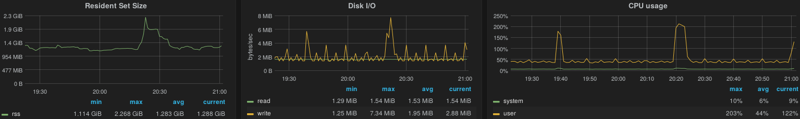
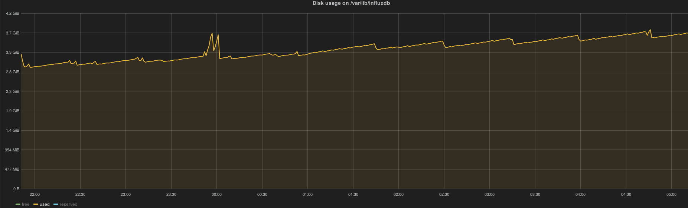
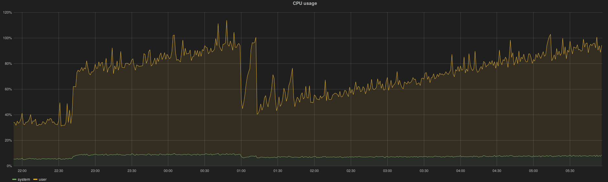
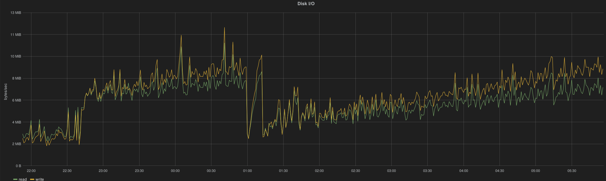
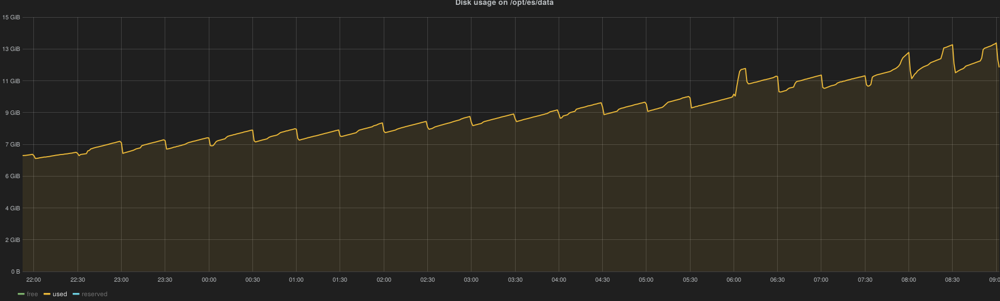
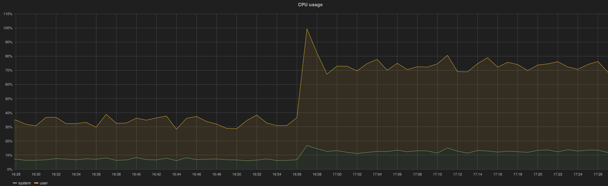
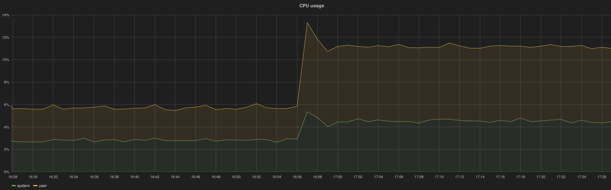
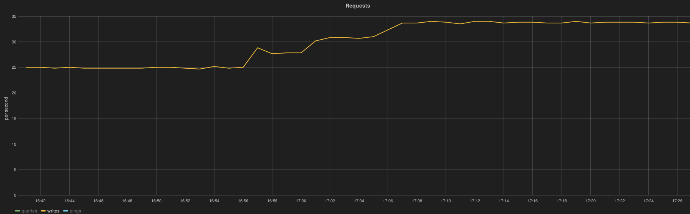
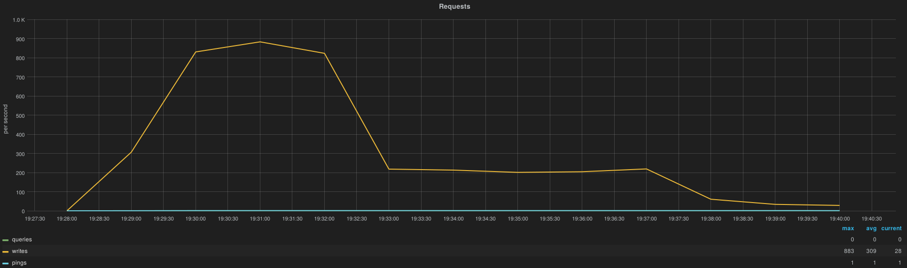
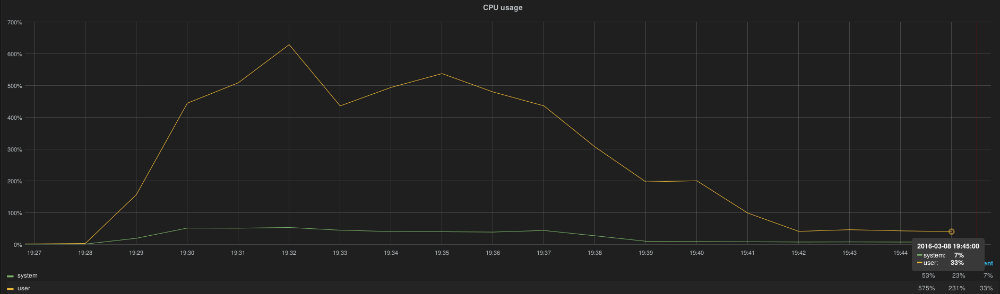
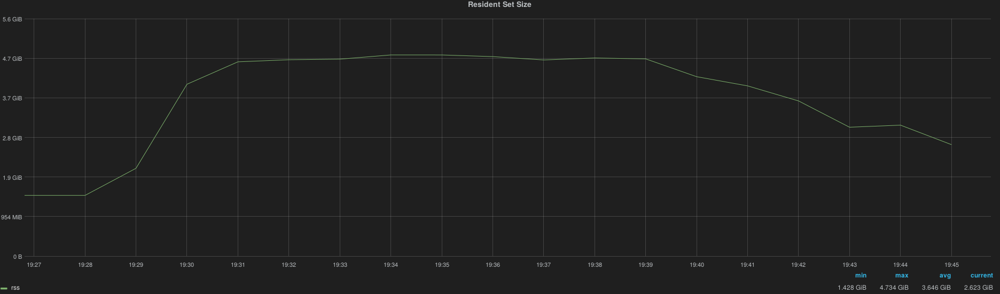
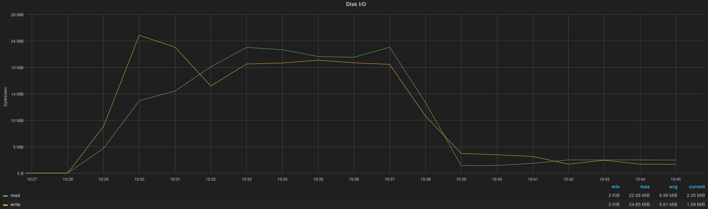
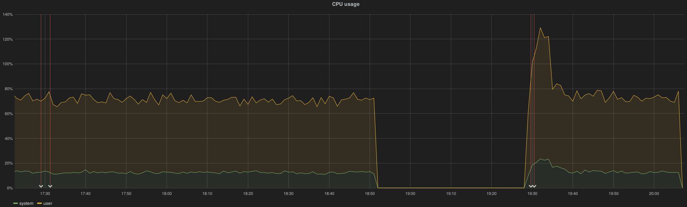
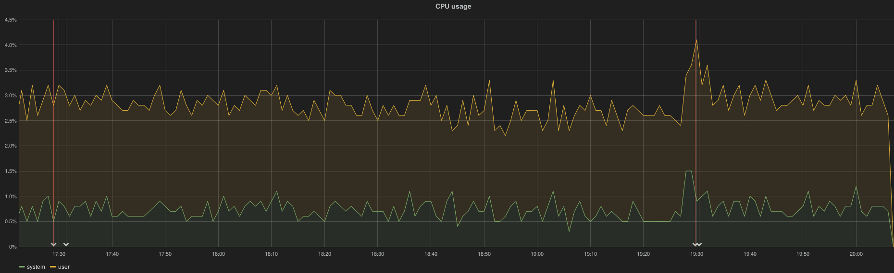
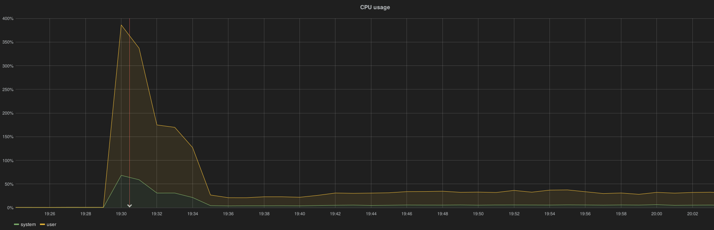
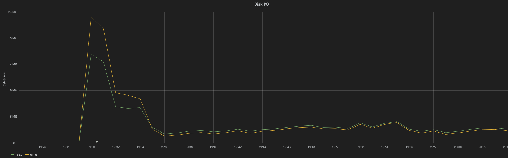
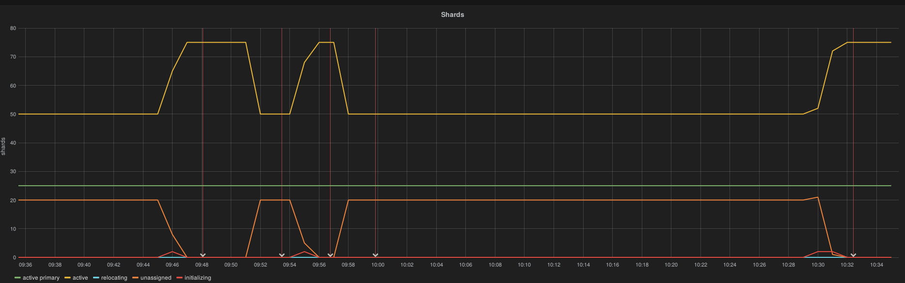
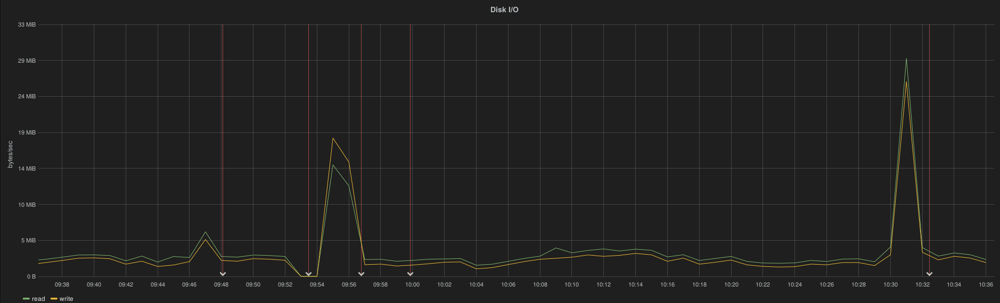
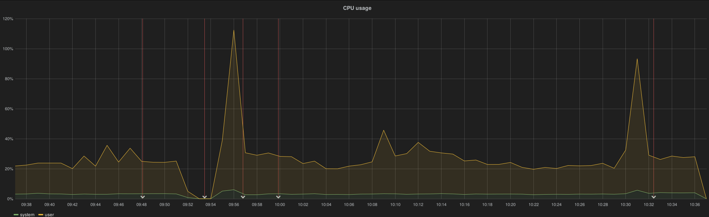
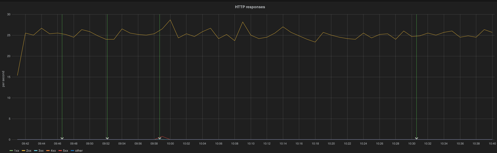
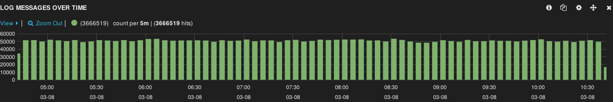
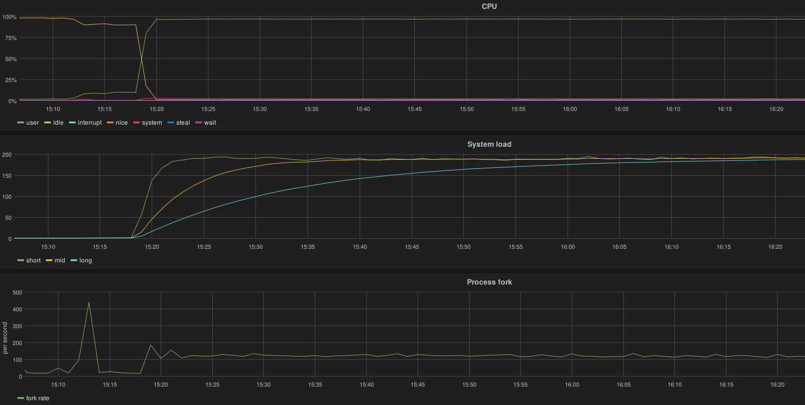
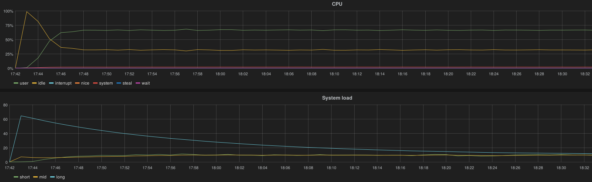
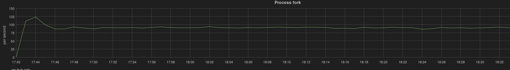
