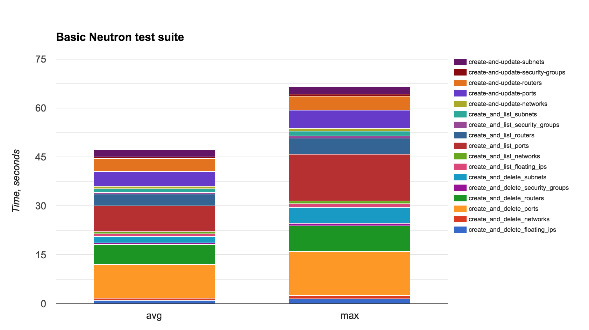
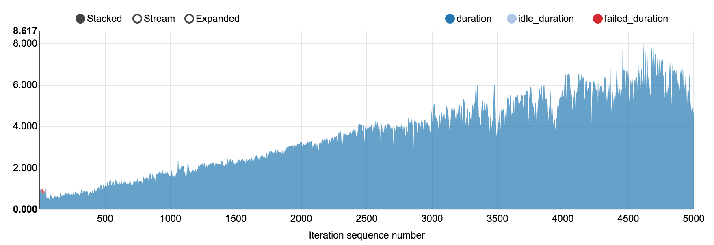
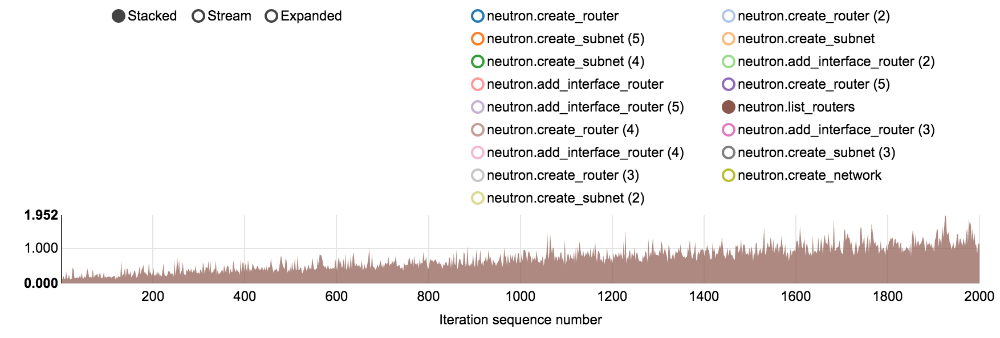
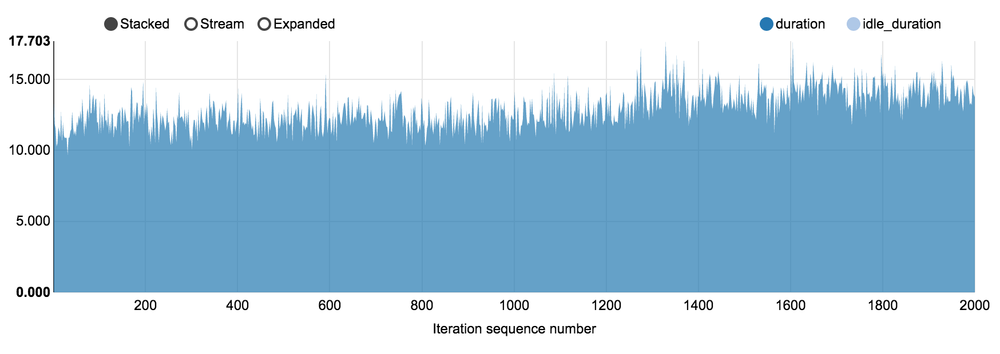
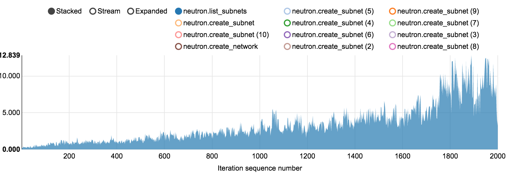
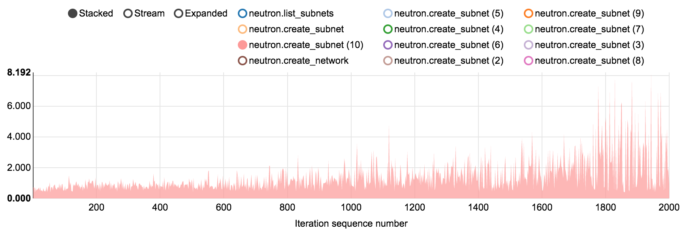
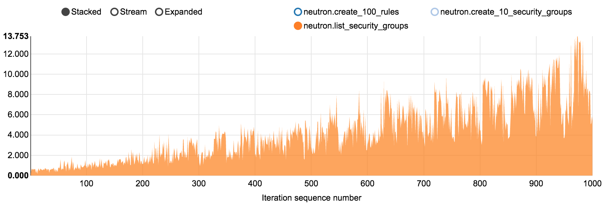
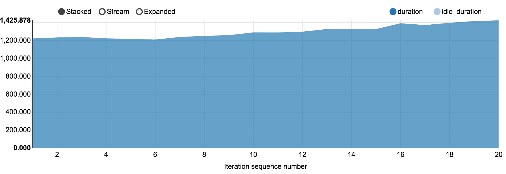
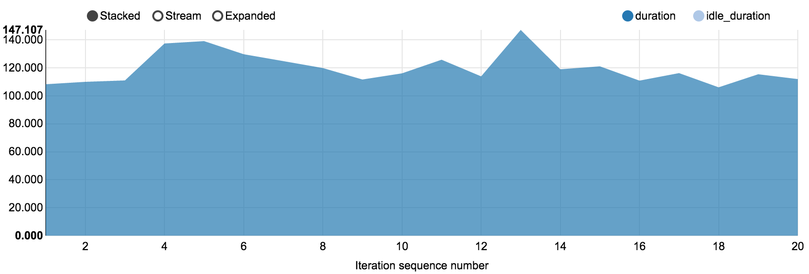

.. _openstack_neutron_control_plane_performance_report:

OpenStack Networking (Neutron) control plane performance report for 400 nodes
*****************************************************************************

:Abstract:

  This document includes OpenStack Networking (aka Neutron) control plane
  performance test results against two OpenStack environments: 200 nodes and
  378 nodes. All tests have been performed regarding
  :ref:`openstack_neutron_control_plane_performance_test_plan`

Environment description
=======================

Lab A (200 nodes)
-----------------

3 controllers, 196 computes, 1 node for Grafana/Prometheus

Hardware configuration of each server
~~~~~~~~~~~~~~~~~~~~~~~~~~~~~~~~~~~~~

.. table:: Description of controller servers

   +-------+----------------+---------------------------------+
   |server |vendor,model    |Supermicro MBD-X10DRI            |
   +-------+----------------+---------------------------------+
   |CPU    |vendor,model    |Intel Xeon E5-2650v3             |
   |       +----------------+---------------------------------+
   |       |processor_count |2                                |
   |       +----------------+---------------------------------+
   |       |core_count      |10                               |
   |       +----------------+---------------------------------+
   |       |frequency_MHz   |2300                             |
   +-------+----------------+---------------------------------+
   |RAM    |vendor,model    |8x Samsung M393A2G40DB0-CPB      |
   |       +----------------+---------------------------------+
   |       |amount_MB       |2097152                          |
   +-------+----------------+---------------------------------+
   |NETWORK|vendor,model    |Intel,I350 Dual Port             |
   |       +----------------+---------------------------------+
   |       |bandwidth       |1G                               |
   |       +----------------+---------------------------------+
   |       |vendor,model    |Intel,82599ES Dual Port          |
   |       +----------------+---------------------------------+
   |       |bandwidth       |10G                              |
   +-------+----------------+---------------------------------+
   |STORAGE|vendor,model    |Intel SSD DC S3500 Series        |
   |       +----------------+---------------------------------+
   |       |SSD/HDD         |SSD                              |
   |       +----------------+---------------------------------+
   |       |size            |240GB                            |
   |       +----------------+---------------------------------+
   |       |vendor,model    |2x WD WD5003AZEX                 |
   |       +----------------+---------------------------------+
   |       |SSD/HDD         |HDD                              |
   |       +----------------+---------------------------------+
   |       |size            |500GB                            |
   +-------+----------------+---------------------------------+

.. table:: Description of compute servers

   +-------+----------------+---------------------------------+
   |server |vendor,model    |SUPERMICRO 5037MR-H8TRF          |
   +-------+----------------+---------------------------------+
   |CPU    |vendor,model    |INTEL XEON Ivy Bridge 6C E5-2620 |
   |       +----------------+---------------------------------+
   |       |processor_count |1                                |
   |       +----------------+---------------------------------+
   |       |core_count      |6                                |
   |       +----------------+---------------------------------+
   |       |frequency_MHz   |2100                             |
   +-------+----------------+---------------------------------+
   |RAM    |vendor,model    |4x Samsung DDRIII 8GB DDR3-1866  |
   |       +----------------+---------------------------------+
   |       |amount_MB       |32768                            |
   +-------+----------------+---------------------------------+
   |NETWORK|vendor,model    |AOC-STGN-i2S - 2-port            |
   |       +----------------+---------------------------------+
   |       |bandwidth       |10G                              |
   +-------+----------------+---------------------------------+
   |STORAGE|vendor,model    |Intel SSD DC S3500 Series        |
   |       +----------------+---------------------------------+
   |       |SSD/HDD         |SSD                              |
   |       +----------------+---------------------------------+
   |       |size            |80GB                             |
   |       +----------------+---------------------------------+
   |       |vendor,model    |1x WD Scorpio Black BP WD7500BPKT|
   |       +----------------+---------------------------------+
   |       |SSD/HDD         |HDD                              |
   |       +----------------+---------------------------------+
   |       |size            |750GB                            |
   +-------+----------------+---------------------------------+

Lab B (378 nodes)
-----------------

Environment contains 4 types of servers:

- rally node
- controller node
- compute-osd node
- compute node

.. table:: Amount of servers each role (node types are listed below)

   +------------+--------------+------+
   |Role        |Servers count |Type  |
   +============+==============+======+
   |rally       |1             |1 or 2|
   +------------+--------------+------+
   |controller  |3             |1 or 2|
   +------------+--------------+------+
   |compute     |291           |1 or 2|
   +------------+--------------+------+
   |compute-osd |34            |3     |
   +------------+--------------+------+
   |compute-osd |49            |1     |
   +------------+--------------+------+

Hardware configuration of each server
~~~~~~~~~~~~~~~~~~~~~~~~~~~~~~~~~~~~~

All servers have 3 types of configuration describing in table below

.. table:: Description of servers hardware type 1

   +-------+----------------+---------------------------------+
   |server |vendor,model    |Dell PowerEdge R630              |
   +-------+----------------+---------------------------------+
   |CPU    |vendor,model    |Intel,E5-2680 v3                 |
   |       +----------------+---------------------------------+
   |       |processor_count |2                                |
   |       +----------------+---------------------------------+
   |       |core_count      |12                               |
   |       +----------------+---------------------------------+
   |       |frequency_MHz   |2500                             |
   +-------+----------------+---------------------------------+
   |RAM    |vendor,model    |Samsung, M393A2G40DB0-CPB        |
   |       +----------------+---------------------------------+
   |       |amount_MB       |262144                           |
   +-------+----------------+---------------------------------+
   |NETWORK|interface_name s|eno1, eno2                       |
   |       +----------------+---------------------------------+
   |       |vendor,model    |Intel,X710 Dual Port             |
   |       +----------------+---------------------------------+
   |       |bandwidth       |10G                              |
   |       +----------------+---------------------------------+
   |       |interface_names |enp3s0f0, enp3s0f1               |
   |       +----------------+---------------------------------+
   |       |vendor,model    |Intel,X710 Dual Port             |
   |       +----------------+---------------------------------+
   |       |bandwidth       |10G                              |
   +-------+----------------+---------------------------------+
   |STORAGE|dev_name        |/dev/sda                         |
   |       +----------------+---------------------------------+
   |       |vendor,model    | | raid1 - Dell, PERC H730P Mini |
   |       |                | | 2 disks Intel S3610           |
   |       +----------------+---------------------------------+
   |       |SSD/HDD         |SSD                              |
   |       +----------------+---------------------------------+
   |       |size            | 3,6TB                           |
   +-------+----------------+---------------------------------+

.. table:: Description of servers hardware type 2

   +-------+----------------+-------------------------------+
   |server |vendor,model    |Lenovo ThinkServer RD550       |
   +-------+----------------+-------------------------------+
   |CPU    |vendor,model    |Intel,E5-2680 v3               |
   |       +----------------+-------------------------------+
   |       |processor_count |2                              |
   |       +----------------+-------------------------------+
   |       |core_count      |12                             |
   |       +----------------+-------------------------------+
   |       |frequency_MHz   |2500                           |
   +-------+----------------+-------------------------------+
   |RAM    |vendor,model    |Samsung, M393A2G40DB0-CPB      |
   |       +----------------+-------------------------------+
   |       |amount_MB       |262144                         |
   +-------+----------------+-------------------------------+
   |NETWORK|interface_name s|enp3s0f0, enp3s0f1             |
   |       +----------------+-------------------------------+
   |       |vendor,model    |Intel,X710 Dual Port           |
   |       +----------------+-------------------------------+
   |       |bandwidth       |10G                            |
   |       +----------------+-------------------------------+
   |       |interface_names |ens2f0,  ens2f1                |
   |       +----------------+-------------------------------+
   |       |vendor,model    |Intel,X710 Dual Port           |
   |       +----------------+-------------------------------+
   |       |bandwidth       |10G                            |
   +-------+----------------+-------------------------------+
   |STORAGE|dev_name        |/dev/sda                       |
   |       +----------------+-------------------------------+
   |       |vendor,model    | | raid1 - Lenovo 720ix        |
   |       |                | | 2 disks Intel S3610         |
   |       +----------------+-------------------------------+
   |       |SSD/HDD         |SSD                            |
   |       +----------------+-------------------------------+
   |       |size            |799GB                          |
   +-------+----------------+-------------------------------+

 .. table:: Description of servers hardware type 3

    +-------+----------------+-------------------------------+
    |server |vendor,model    |Lenovo ThinkServer RD650       |
    +-------+----------------+-------------------------------+
    |CPU    |vendor,model    |Intel,E5-2670 v3               |
    |       +----------------+-------------------------------+
    |       |processor_count |2                              |
    |       +----------------+-------------------------------+
    |       |core_count      |12                             |
    |       +----------------+-------------------------------+
    |       |frequency_MHz   |2500                           |
    +-------+----------------+-------------------------------+
    |RAM    |vendor,model    |Samsung, M393A2G40DB0-CPB      |
    |       +----------------+-------------------------------+
    |       |amount_MB       |131916                         |
    +-------+----------------+-------------------------------+
    |NETWORK|interface_name s|enp3s0f0, enp3s0f1             |
    |       +----------------+-------------------------------+
    |       |vendor,model    |Intel,X710 Dual Port           |
    |       +----------------+-------------------------------+
    |       |bandwidth       |10G                            |
    |       +----------------+-------------------------------+
    |       |interface_names |ens2f0,  ens2f1                |
    |       +----------------+-------------------------------+
    |       |vendor,model    |Intel,X710 Dual Port           |
    |       +----------------+-------------------------------+
    |       |bandwidth       |10G                            |
    +-------+----------------+-------------------------------+
    |STORAGE|dev_name        |/dev/sda                       |
    |       +----------------+-------------------------------+
    |       |vendor,model    | | raid1 - Lenovo 720ix        |
    |       |                | | 2 disks Intel S3610         |
    |       +----------------+-------------------------------+
    |       |SSD/HDD         |SSD                            |
    |       +----------------+-------------------------------+
    |       |size            |799GB                          |
    |       +----------------+-------------------------------+
    |       |dev_name        |/dev/sdb                       |
    |       +----------------+-------------------------------+
    |       |vendor,model    | | raid10 - Lenovo 720ix       |
    |       |                | | 10 disks 2T                 |
    |       +----------------+-------------------------------+
    |       |SSD/HDD         |HDD                            |
    |       +----------------+-------------------------------+
    |       |size            |9999GB                         |
    +-------+----------------+-------------------------------+

Network configuration of each server
~~~~~~~~~~~~~~~~~~~~~~~~~~~~~~~~~~~~

All servers have same network configuration:

.. image:: configs/Network_Scheme.png
   :alt: Network Scheme of the environment
   :width: 650px

Software configuration on servers with controller, compute and compute-osd roles
~~~~~~~~~~~~~~~~~~~~~~~~~~~~~~~~~~~~~~~~~~~~~~~~~~~~~~~~~~~~~~~~~~~~~~~~~~~~~~~~

.. table:: Services on servers by role

   +------------+----------------------------+
   |Role        |Service name                |
   +============+============================+
   |controller  || horizon                   |
   |            || keystone                  |
   |            || nova-api                  |
   |            || nava-scheduler            |
   |            || nova-cert                 |
   |            || nova-conductor            |
   |            || nova-consoleauth          |
   |            || nova-consoleproxy         |
   |            || cinder-api                |
   |            || cinder-backup             |
   |            || cinder-scheduler          |
   |            || cinder-volume             |
   |            || glance-api                |
   |            || glance-glare              |
   |            || glance-registry           |
   |            || neutron-dhcp-agent        |
   |            || neutron-l3-agent          |
   |            || neutron-metadata-agent    |
   |            || neutron-openvswitch-agent |
   |            || neutron-server            |
   |            || heat-api                  |
   |            || heat-api-cfn              |
   |            || heat-api-cloudwatch       |
   |            || ceph-mon                  |
   |            || rados-gw                  |
   |            || memcached                 |
   |            || rabbitmq_server           |
   |            || mysqld                    |
   |            || galera                    |
   |            || corosync                  |
   |            || pacemaker                 |
   |            || haproxy                   |
   +------------+----------------------------+
   |compute     || nova-compute              |
   |            || neutron-l3-agent          |
   |            || neutron-metadata-agent    |
   |            || neutron-openvswitch-agent |
   +------------+----------------------------+
   |compute-osd || nova-compute              |
   |            || neutron-l3-agent          |
   |            || neutron-metadata-agent    |
   |            || neutron-openvswitch-agent |
   |            || ceph-osd                  |
   +------------+----------------------------+

.. table:: Software version on servers with controller, compute and compute-osd roles

   +------------+-------------------+
   |Software    |Version            |
   +============+===================+
   |OpenStack   |Mitaka             |
   +------------+-------------------+
   |Ceph        |Hammer             |
   +------------+-------------------+
   |Ubuntu      |Ubuntu 14.04.3 LTS |
   +------------+-------------------+

You can find outputs of some commands and /etc folder in the following archives:

| :download:`controller-1.tar.gz <configs/controller-1.tar.gz>`
| :download:`controller-2.tar.gz <configs/controller-2.tar.gz>`
| :download:`controller-3.tar.gz <configs/controller-3.tar.gz>`
| :download:`compute-1.tar.gz <configs/compute-1.tar.gz>`
| :download:`compute-osd-1.tar.gz <configs/compute-osd-1.tar.gz>`

Software configuration on servers with Rally role
~~~~~~~~~~~~~~~~~~~~~~~~~~~~~~~~~~~~~~~~~~~~~~~~~

On this server should be installed Rally. How to do it you can find in
`Rally installation documentation`_

.. table:: Software version on server with Rally role

   +------------+-------------------+
   |Software    |Version            |
   +============+===================+
   |Rally       |0.5.0              |
   +------------+-------------------+
   |Ubuntu      |Ubuntu 14.04.3 LTS |
   +------------+-------------------+

Test results
============

Test Case 1: Basic Neutron test suite
-------------------------------------

The following list of tests were run with the `default configuration`_ against
`Lab A (200 nodes)`_:

* create-and-list-floating-ips
* create-and-list-networks
* create-and-list-ports
* create-and-list-routers
* create-and-list-security-groups
* create-and-list-subnets
* create-and-delete-floating-ips
* create-and-delete-networks
* create-and-delete-ports
* create-and-delete-routers
* create-and-delete-security-groups
* create-and-delete-subnets
* create-and-update-networks
* create-and-update-ports
* create-and-update-routers
* create-and-update-security-groups
* create-and-update-subnets

The time needed for each scenario can be comparatively presented using the
following chart:

To overview extended information please download the following report:
:download:`basic_neutron.html <reports/basic_neutron.html>`

.. _default configuration: https://github.com/openstack/rally/tree/master/samples/tasks/scenarios/neutron

Test Case 2: Stressful Neutron test suite
-----------------------------------------

The following list of tests were run against both `Lab A (200 nodes)`_ and
`Lab B (378 nodes)`_:

* create-and-list-networks
* create-and-list-ports
* create-and-list-routers
* create-and-list-security-groups
* create-and-list-subnets
* boot-and-list-server
* boot-and-delete-server-with-secgroups
* boot-runcommand-delete

Here is short representation of the collected results:

+--------------------------------------+-----------------------+-------------------------+---------------------------------------------+
|Scenario                              |Iterations/concurrency |Time, sec                |Errors                                       |
|                                      +-----------+-----------+------------+------------+----------------------+----------------------+
|                                      |Lab A      |Lab B      |Lab A       |Lab B       |Lab A                 |Lab B                 |
+======================================+===========+===========+============+============+======================+======================+
|create-and-list-networks              |3000/50    |5000/50    |avg 2.375   |avg 3.654   |1                     |6                     |
|                                      |           |           |max 7.904   |max 11.669  |Internal server error |Internal server error |
|                                      |           |           |            |            |while processing your |while processing your |
|                                      |           |           |            |            |request               |request               |
+--------------------------------------+-----------+-----------+------------+------------+----------------------+----------------------+
|create-and-list-ports                 |1000/50    |2000/50    |avg 123.97  |avg 99.274  |1                     |0                     |
|                                      |           |           |max 277.977 |max 270.84  |Internal server error |                      |
|                                      |           |           |            |            |while processing your |                      |
|                                      |           |           |            |            |request               |                      |
+--------------------------------------+-----------+-----------+------------+------------+----------------------+----------------------+
|create-and-list-routers               |2000/50    |2000/50    |avg 15.59   |avg 12.94   |0                     |0                     |
|                                      |           |           |max 29.006  |max 19.398  |                      |                      |
+--------------------------------------+-----------+-----------+------------+------------+----------------------+----------------------+
|create-and-list-security-groups       |50/1       |1000/50    |avg 210.706 |avg 68.712  |0                     |0                     |
|                                      |           |           |max 210.706 |max 169.315 |                      |                      |
+--------------------------------------+-----------+-----------+------------+------------+----------------------+----------------------+
|create-and-list-subnets               |2000/50    |2000/50    |avg 25.973  |avg 17.415  |1                     |0                     |
|                                      |           |           |max 64.553  |max 50.415  |Internal server error |                      |
|                                      |           |           |            |            |while processing your |                      |
|                                      |           |           |            |            |request               |                      |
+--------------------------------------+-----------+-----------+------------+------------+----------------------+----------------------+
|boot-and-list-server                  |4975/50    |1000/50    |avg 21.445  |avg 14.375  |0                     |0                     |
|                                      |           |           |max 40.736  |max 25.21   |                      |                      |
+--------------------------------------+-----------+-----------+------------+------------+----------------------+----------------------+
|boot-and-delete-server-with-secgroups |4975/200   |1000/100   |avg 190.772 |avg 65.651  |394                   |0                     |
|                                      |           |           |max 443.518 |max 95.651  |Server has ERROR      |                      |
|                                      |           |           |            |            |status; The server    |                      |
|                                      |           |           |            |            |didn't respond in     |                      |
|                                      |           |           |            |            |time.                 |                      |
+--------------------------------------+-----------+-----------+------------+------------+----------------------+----------------------+
|boot-runcommand-delete                |2000/15    |3000/50    |avg 28.39   |avg 28.587  |34                    |1                     |
|                                      |           |           |max 35.756  |max 85.659  |Rally tired waiting   |Resource <Server:     |
|                                      |           |           |            |            |for Host ip:<ip> to   |s_rally_b58e9bd       |
|                                      |           |           |            |            |become ('ICMP UP'),   |e_Y369JdPf> has ERROR |
|                                      |           |           |            |            |current status        |status. Deadlock      |
|                                      |           |           |            |            |('ICMP DOWN')         |found when trying to  |
|                                      |           |           |            |            |                      |get lock.             |
+--------------------------------------+-----------+-----------+------------+------------+----------------------+----------------------+

During execution of Rally were filed and fixed bugs affecting
`boot-and-delete-server-with-secgroups` and `boot-runcommand-delete` scenarios
on Lab A:

* `Bug LP #1610303 l2pop mech fails to update_port_postcommit on a loaded cluster`_ ,
  fix - https://review.openstack.org/353835
* `Bug LP #1614452 Port create time grows at scale due to dvr arp update`_ ,
  fix - https://review.openstack.org/357052

With these fixes applied on Lab B mentioned Rally scenarios passed
*successfully*.

Other bugs that were faced:

* `Bug LP #1595837 Neutron failed to create network`_
* `Bug LP #1610153 nova list can sometimes return 404`_

Observed trends
~~~~~~~~~~~~~~~

Create and list networks: the total time spent on each iteration grows linearly

Create and list routers: router list operation time gradually grows from 0.12
to 1.5 sec (2000 iterations).

Create and list routers: total load duration remains line-rate

Create and list subnets: subnet list operation time increases ~ after 1750
iterations (4.5 sec at 1700th iteration to 10.48 at 1800th iteration).

Create and list subnets: creating subnets has time peaks after 1750 iterations

Create and list security groups: secgroup list operation exposes the most rapid
growth rate with time increasing from 0.548 sec in first iteration to over 10
sec in last iterations

More details can be found in original Rally report:
:download:`stress_neutron.html <reports/stress_neutron.html>`

Test case 3: Neutron scalability test with many networks
--------------------------------------------------------

In our tests 100 networks (each with a subnet, router and a VM) were created
per each iteration.

+-----------------------+--------------+--------------+-------------------------------+
|Iterations/concurrency |Avg time, sec |Max time, sec |Errors                         |
+=======================+==============+==============+===============================+
|10/1                   |1237.389      |1294.549      |0                              |
+-----------------------+--------------+--------------+-------------------------------+
|20/3                   |1298.611      |1425.878      |1                              |
|                       |              |              |HTTPConnectionPool Read time   |
|                       |              |              |out                            |
+-----------------------+--------------+--------------+-------------------------------+

Load graph for run with 20 iterations/concurrency 3:

More details can be found in original Rally report:
:download:`scale_neutron_networks.html <reports/scale_neutron_networks.html>`

Test case 4: Neutron scalability test with many servers
-------------------------------------------------------

During each iteration this test creates huge number of VMs (100 in our case)
per a single network, hence it is possible to check the case with many number
of ports per subnet.

+-----------------------+--------------+--------------+-------------------------------+
|Iterations/concurrency |Avg time, sec |Max time, sec |Errors                         |
+=======================+==============+==============+===============================+
|10/1                   |100.422       |104.315       |0                              |
+-----------------------+--------------+--------------+-------------------------------+
|20/3                   |119.767       |147.107       |0                              |
+-----------------------+--------------+--------------+-------------------------------+

Load graph for run with 20 iterations/concurrency 3:

More details can be found in original Rally report:
:download:`scale_neutron_servers.html <reports/scale_neutron_servers.html>`

.. references:

.. _Rally installation documentation: https://rally.readthedocs.io/en/latest/install.html
.. _Bug LP #1610303 l2pop mech fails to update_port_postcommit on a loaded cluster: https://bugs.launchpad.net/neutron/+bug/1610303
.. _Bug LP #1614452 Port create time grows at scale due to dvr arp update: https://bugs.launchpad.net/neutron/+bug/1614452
.. _Bug LP #1595837 Neutron failed to create network: https://bugs.launchpad.net/mos/+bug/1595837
.. _Bug LP #1610153 nova list can sometimes return 404: https://bugs.launchpad.net/nova/+bug/1610153