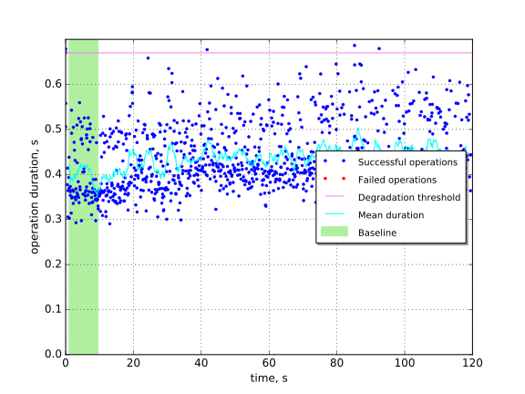

Networks operations and L3-agent restart
========================================

In this scenario we restart all L3 agents while Neutron creates and deletes
networks.

This report is generated on results collected by execution of the following
Rally scenario:

.. code-block:: yaml

    ---
      NeutronNetworks.create_and_delete_networks:
        -
          args:
            network_create_args: {}
          runner:
            type: "constant_for_duration"
            duration: 120
            concurrency: 4
          context:
            users:
              tenants: 1
              users_per_tenant: 1
            quotas:
              neutron:
                network: -1
          hooks:
            -
              name: fault_injection
              args:
                action: restart neutron-l3-agent service
              trigger:
                name: event
                args:
                  unit: iteration
                  at: [100]
    

Summary
-------

No errors nor performance degradation observed.

Details
-------

This section contains individual data for particular scenario runs.

Run #1
^^^^^^

Baseline
~~~~~~~~

Baseline samples are collected before the start of fault injection. They are
used to estimate service performance degradation after the fault.

+-----------+-------------+-----------+-----------+---------------------+
|   Samples |   Median, s |   Mean, s |   Std dev |   95% percentile, s |
+===========+=============+===========+===========+=====================+
|        85 |        0.36 |       0.4 |     0.068 |                0.52 |
+-----------+-------------+-----------+-----------+---------------------+

