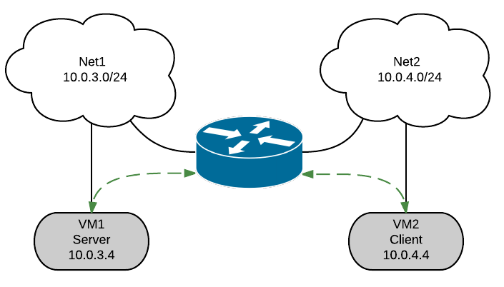

.. _neutron_l3_ha_test_report_liberty:

Neutron L3 HA test results Liberty
----------------------------------

This report is generated for :ref:`neutron_l3_ha_test_plan` test plan.

Environment description
=======================

Cluster description
~~~~~~~~~~~~~~~~~~~
* 3 controllers
* 46 compute nodes

Software versions
~~~~~~~~~~~~~~~~~
MOS 8.0

Hardware configuration of each server
~~~~~~~~~~~~~~~~~~~~~~~~~~~~~~~~~~~~~

Description of servers hardware

**Compute Vendor**:
    1x SUPERMICRO SUPERSERVER 5037MR-H8TRF MICRO-CLOUD	`<http://www.supermicro.com/products/system/3u/5037/sys-5037mr-h8trf.cfm>`_
**CPU**
    1x INTEL XEON Ivy Bridge 6C E5-2620 V2 2.1G 15M 7.2GT/s QPI 80w SOCKET 2011R 1600 `<http://ark.intel.com/products/75789/Intel-Xeon-Processor-E5-2620-v2-15M-Cache-2_10-GHz>`_
**RAM**:
    4x Samsung DDRIII 8GB DDR3-1866 1Rx4 ECC REG RoHS M393B1G70QH0-CMA
**NIC**
    1x AOC-STGN-i2S - 2-port 10 Gigabit Ethernet SFP+

Rally test results
==================

L3 HA has a restriction of 255 routers per HA network per tenant. At this moment
we do not have the ability to create new HA network per tenant if the number of
VIPs exceed this limit. Based on this, for some tests, the number of tenants
was increased (NeutronNetworks.create_and_list_router).

The most important results are provided by  test_create_delete_routers test,
as it allows to catch possible race conditions during creation/deletion of HA
routers, HA networks and HA interfaces. There are already several known bugs
related to this which have been fixed in upstream. To find out more possible
issues test_create_delete_routers has been run multiple times with different
concurrency.

.. list-table:: Results of test_create_delete_routers
    :header-rows: 1

    *
     - Times
     - Concurrency
     - Number of errors
     - Link for rally report
    *
     - 92
     - 20
     - 0
     - `rally report <http://akamyshnikova.github.io/neutron-benchmark-results/rally/create_delete_92_20.html>`_
    *
     - 92
     - 40
     - 0
     - `rally report <http://akamyshnikova.github.io/neutron-benchmark-results/rally/create_delete_92_40.html>`_
    *
     - 150
     - 50
     - 1
     - `rally report <http://akamyshnikova.github.io/neutron-benchmark-results/rally/create_delete_150_50.html>`_
    *
     - 150
     - 50
     - 0
     - `rally report <http://akamyshnikova.github.io/neutron-benchmark-results/rally/create_delete_150_50_2.html>`_
    *
     - 200
     - 60
     - 1
     - `rally report <http://akamyshnikova.github.io/neutron-benchmark-results/rally/create_delete_200_60.html>`_
    *
     - 200
     - 60
     - 1
     - `rally report <http://akamyshnikova.github.io/neutron-benchmark-results/rally/create_delete_200_60_2.html>`_
    *
     - 200
     - 70
     - 2
     - `rally report <http://akamyshnikova.github.io/neutron-benchmark-results/rally/create_delete_200_70.html>`_
    *
     - 200
     - 70
     - 0
     - `rally report <http://akamyshnikova.github.io/neutron-benchmark-results/rally/create_delete_200_70_2.html>`_
    *
     - 200
     - 75
     - 1
     - `rally report <http://akamyshnikova.github.io/neutron-benchmark-results/rally/create_delete_200_75.html>`_
    *
     - 200
     - 75
     - 1
     - `rally report <http://akamyshnikova.github.io/neutron-benchmark-results/rally/create_delete_200_75_2.html>`_
    *
     - 300
     - 100
     - 1
     - `rally report <http://akamyshnikova.github.io/neutron-benchmark-results/rally/create_delete_300_100.html>`_
    *
     - 300
     - 100
     - 0
     - `rally report <http://akamyshnikova.github.io/neutron-benchmark-results/rally/create_delete_300_100_2.html>`_
    *
     - 400
     - 100
     - 1
     - `rally report <http://akamyshnikova.github.io/neutron-benchmark-results/rally/create_delete_400_100.html>`_
    *
     - 400
     - 100
     - 0
     - `rally report <http://akamyshnikova.github.io/neutron-benchmark-results/rally/create_delete_400_100_2.html>`_

Multiple scenarios:

+------------------------------+-------------------+-------+-------------+------------------+--------------------------------------------------------------------------------------------------------------+
| Test                         | Number of tenants | Times | Concurrency | Number of errors | Link for rally report                                                                                        |
+------------------------------+-------------------+-------+-------------+------------------+--------------------------------------------------------------------------------------------------------------+
|``create_and_delete_routers`` | 1                 |92     |10           | 0                |`rally report <http://akamyshnikova.github.io/neutron-benchmark-results/rally/multi.html>`_                   |
+------------------------------+-------------------+-------+-------------+------------------+                                                                                                              |
|``create_and_list_routers``   | 2                 |368    |10           | 272              |                                                                                                              |
+------------------------------+-------------------+-------+-------------+------------------+                                                                                                              |
|``create_and_update_routers`` |1                  |92     |10           |0                 |                                                                                                              |
+------------------------------+-------------------+-------+-------------+------------------+--------------------------------------------------------------------------------------------------------------+
|``create_and_delete_routers`` |1                  |92     |10           |0                 |                                                                                                              |
+------------------------------+-------------------+-------+-------------+------------------+                                                                                                              |
|``create_and_list_routers``   |2                  |100    |10           |6                 |`rally report <http://akamyshnikova.github.io/neutron-benchmark-results/rally/multi_after_patch.html>`_       |
+------------------------------+-------------------+-------+-------------+------------------+                                                                                                              |
|``create_and_update_routers`` |1                  |92     |10           |0                 |                                                                                                              |
+------------------------------+-------------------+-------+-------------+------------------+--------------------------------------------------------------------------------------------------------------+
|``create_and_delete_routers`` |1                  |92     |10           |0                 |                                                                                                              |
+------------------------------+-------------------+-------+-------------+------------------+                                                                                                              |
|``create_and_list_routers``   |10                 |368    |10           |0                 |`rally report <http://akamyshnikova.github.io/neutron-benchmark-results/rally/multi_routers_final.html>`_     |
+------------------------------+-------------------+-------+-------------+------------------+                                                                                                              |
|``create_and_update_routers`` |1                  | 92    |10           |0                 |                                                                                                              |
+------------------------------+-------------------+-------+-------------+------------------+--------------------------------------------------------------------------------------------------------------+
|``create_and_delete_routers`` |1                  |300    |50           |1                 |                                                                                                              |
+------------------------------+-------------------+-------+-------------+------------------+                                                                                                              |
|``create_and_list_routers``   |10                 |368    |50           |0                 |`rally report <http://akamyshnikova.github.io/neutron-benchmark-results/rally/multi_300.html>`_               |
+------------------------------+-------------------+-------+-------------+------------------+                                                                                                              |
|``create_and_update_routers`` |1                  |300    |50           |0                 |                                                                                                              |
+------------------------------+-------------------+-------+-------------+------------------+--------------------------------------------------------------------------------------------------------------+
|``create_and_delete_routers`` |1                  |300    |50           |1                 |                                                                                                              |
+------------------------------+-------------------+-------+-------------+------------------+                                                                                                              |
|``create_and_list_routers``   |10                 |368    |50           |0                 |`rally report <http://akamyshnikova.github.io/neutron-benchmark-results/rally/multi_300_2.html>`_             |
+------------------------------+-------------------+-------+-------------+------------------+                                                                                                              |
|``create_and_update_routers`` |1                  |300    |50           |0                 |                                                                                                              |
+------------------------------+-------------------+-------+-------------+------------------+--------------------------------------------------------------------------------------------------------------+

The errors discovered have been classified as the following bugs:

.. list-table:: Bugs
    :header-rows: 1

    *
     - Short description
     - Trace
     - Upstream bug
     - Status
    *
     - IpAddressGenerationFailure No more IP addresses available on network
     - `trace <http://paste.openstack.org/show/491423/>`_
     - `bug/1562887 <https://bugs.launchpad.net/neutron/+bug/1562887>`_
     - Open (Affects Neutron  without L3 HA enabled, probably Rally bug)
    *
     - Device "tap-<id>" does not exist.
     - `trace <http://paste.openstack.org/show/491408/>`_
     - `bug/1562887 <https://bugs.launchpad.net/neutron/+bug/1562887>`_
     - Open
    *
     - Session rollback
     - `trace <http://paste.openstack.org/show/491548/>`_
     - `bug/1550886 <https://bugs.launchpad.net/neutron/+bug/1550886>`_
     - In progress
    *
     - SubnetInUse: Unable to complete operation on subnet
     - `trace <http://paste.openstack.org/show/491557/>`_
     - `bug/1562878 <https://bugs.launchpad.net/neutron/+bug/1562878>`_
     - Open
    *
     - MessagingTimeout: Timed out waiting for a reply to message
     - `trace <http://paste.openstack.org/show/490011/>`_
     - `bug/1555670 <https://bugs.launchpad.net/neutron/+bug/1555670>`_
     - Open
    *
     - DBDeadlock: ipallocationpools
     - `trace <https://bugs.launchpad.net/neutron/+bug/1555670>`_
     - `bug/1562876 <https://bugs.launchpad.net/neutron/+bug/1555670>`_
     - Open
    *
     - Not all HA networks deleted
     - `not a trace <http://paste.openstack.org/show/491573/>`_
     - `bug/1562892 <https://bugs.launchpad.net/neutron/+bug/1562892>`_
     - Open

Summary:
~~~~~~~~

1. The number of failed tests is less than 1% (exception ``test_create_list_routers``,
   but with increased number of tenants the problem was fixed; automatic creation of new HA
   network after the previous one ran out of virtual ips is more
   like a feature request).

2. All bugs found are Medium or Low priority.

Shaker test results
===================

+---------------------------------------------------------------------------------------------------------------------------------------------------------------------------------------------+---------------------------------------------------------------------------------------------------------------------------------------------+--------------------------------------------------------------------------------------------------------------------------------------------------+
| L3 HA                                                                                                                                                                                       | L3 HA during L3 agents restart                                                                                                              | Router rescheduling (Non L3 HA) during L3 agent restart                                                                                          |
+========================================+==================================+=================================================================================================================+========+==========+=========================================================================================================================+========+===========+=============================================================================================================================+
| Lost                                   | Errors                           | Link for report                                                                                                 | Lost   | Errors   | Link for report                                                                                                         | Lost   | Errors    | Link for report                                                                                                             |
+----------------------------------------+----------------------------------+-----------------------------------------------------------------------------------------------------------------+--------+----------+-------------------------------------------------------------------------------------------------------------------------+--------+-----------+-----------------------------------------------------------------------------------------------------------------------------+
| OpenStack L3 East-West                                                                                                                                                                                                                                                                                                                                                                                                                                                                       |
+----------------------------------------+----------------------------------+-----------------------------------------------------------------------------------------------------------------+--------+----------+-------------------------------------------------------------------------------------------------------------------------+--------+-----------+-----------------------------------------------------------------------------------------------------------------------------+
| 0                                      | 0                                | `report <http://akamyshnikova.github.io/neutron-benchmark-results/shaker/full_l3_east_west.html>`__             | 0      | 0        | `report <http://akamyshnikova.github.io/neutron-benchmark-results/shaker/full_l3_east_west_restart.html>`__             | 50     | 5         | `report <http://akamyshnikova.github.io/neutron-benchmark-results/shaker/full_l3_east_west_restart_not_l3_ha.html>`__       |
+----------------------------------------+----------------------------------+-----------------------------------------------------------------------------------------------------------------+--------+----------+-------------------------------------------------------------------------------------------------------------------------+--------+-----------+-----------------------------------------------------------------------------------------------------------------------------+
| OpenStack L3 East-West Performance                                                                                                                                                                                                                                                                                                                                                                                                                                                           |
+----------------------------------------+----------------------------------+-----------------------------------------------------------------------------------------------------------------+--------+----------+-------------------------------------------------------------------------------------------------------------------------+--------+-----------+-----------------------------------------------------------------------------------------------------------------------------+
| 1                                      | 0                                | `report <http://akamyshnikova.github.io/neutron-benchmark-results/shaker/perf_l3_east_west.html>`__             | 0      | 0        | `report <http://akamyshnikova.github.io/neutron-benchmark-results/shaker/perf_l3_east_west_restart.html>`__             | 0      | 1 (all)   | `report <http://akamyshnikova.github.io/neutron-benchmark-results/shaker/perf_l3_east_west_restart_not_ha.html>`__          |
+----------------------------------------+----------------------------------+-----------------------------------------------------------------------------------------------------------------+--------+----------+-------------------------------------------------------------------------------------------------------------------------+--------+-----------+-----------------------------------------------------------------------------------------------------------------------------+
| OpenStack L3 North-South                                                                                                                                                                                                                                                                                                                                                                                                                                                                     |
+----------------------------------------+----------------------------------+-----------------------------------------------------------------------------------------------------------------+--------+----------+-------------------------------------------------------------------------------------------------------------------------+--------+-----------+-----------------------------------------------------------------------------------------------------------------------------+
| 0                                      | 0                                | `report <http://akamyshnikova.github.io/neutron-benchmark-results/shaker/full_l3_north_south.html>`__           | 8      | 0        | `report <http://akamyshnikova.github.io/neutron-benchmark-results/shaker/full_l3_north_south_restart.html>`__           | 95     | 3         | `report <http://akamyshnikova.github.io/neutron-benchmark-results/shaker/full_l3_north_south_restart_no_l3_ha.html>`__      |
+----------------------------------------+----------------------------------+-----------------------------------------------------------------------------------------------------------------+--------+----------+-------------------------------------------------------------------------------------------------------------------------+--------+-----------+-----------------------------------------------------------------------------------------------------------------------------+
| OpenStack L3 North-South UDP                                                                                                                                                                                                                                                                                                                                                                                                                                                                 |
+----------------------------------------+----------------------------------+-----------------------------------------------------------------------------------------------------------------+--------+----------+-------------------------------------------------------------------------------------------------------------------------+--------+-----------+-----------------------------------------------------------------------------------------------------------------------------+
| 10                                     | 1                                | `report <http://akamyshnikova.github.io/neutron-benchmark-results/shaker/udp_l3_north_south1.html>`__           | 14     | 0        | `report <http://akamyshnikova.github.io/neutron-benchmark-results/shaker/udp_l3_north_south_restart.html>`__            |        |           |                                                                                                                             |
+----------------------------------------+----------------------------------+-----------------------------------------------------------------------------------------------------------------+--------+----------+-------------------------------------------------------------------------------------------------------------------------+--------+-----------+-----------------------------------------------------------------------------------------------------------------------------+
| OpenStack L3 North-South Performance                                                                                                                                                                                                                                                                                                                                                                                                                                                         |
|                                                                                                                                                                                                                                                                                                                                                                                                                                                                                              |
| (concurrency 2)                                                                                                                                                                                                                                                                                                                                                                                                                                                                              |
+----------------------------------------+----------------------------------+-----------------------------------------------------------------------------------------------------------------+--------+----------+-------------------------------------------------------------------------------------------------------------------------+--------+-----------+-----------------------------------------------------------------------------------------------------------------------------+
| 0                                      | 0                                | `report <http://akamyshnikova.github.io/neutron-benchmark-results/shaker/perf_l3_north_south_con_2.html>`__     | 0      | 0        | `report <http://akamyshnikova.github.io/neutron-benchmark-results/shaker/perf_l3_south_north_restart_con_2.html>`__     |        |           |                                                                                                                             |
+----------------------------------------+----------------------------------+-----------------------------------------------------------------------------------------------------------------+--------+----------+-------------------------------------------------------------------------------------------------------------------------+--------+-----------+-----------------------------------------------------------------------------------------------------------------------------+
| OpenStack L3 North-South Performance                                                                                                                                                                                                                                                                                                                                                                                                                                                         |
|                                                                                                                                                                                                                                                                                                                                                                                                                                                                                              |
| (concurrency 5)                                                                                                                                                                                                                                                                                                                                                                                                                                                                              |
+----------------------------------------+----------------------------------+-----------------------------------------------------------------------------------------------------------------+--------+----------+-------------------------------------------------------------------------------------------------------------------------+--------+-----------+-----------------------------------------------------------------------------------------------------------------------------+
| 0                                      | 0                                | `report <http://akamyshnikova.github.io/neutron-benchmark-results/shaker/perf_l3_north_south_con_5.html>`__     | 1      | 0        | `report <http://akamyshnikova.github.io/neutron-benchmark-results/shaker/perf_l3_north_south_restart_con_5.html>`__     |        |           |                                                                                                                             |
+----------------------------------------+----------------------------------+-----------------------------------------------------------------------------------------------------------------+--------+----------+-------------------------------------------------------------------------------------------------------------------------+--------+-----------+-----------------------------------------------------------------------------------------------------------------------------+
| OpenStack L3 North-South Dense                                                                                                                                                                                                                                                                                                                                                                                                                                                               |
+----------------------------------------+----------------------------------+-----------------------------------------------------------------------------------------------------------------+--------+----------+-------------------------------------------------------------------------------------------------------------------------+--------+-----------+-----------------------------------------------------------------------------------------------------------------------------+
| 0                                      | 0                                | `report <http://akamyshnikova.github.io/neutron-benchmark-results/shaker/dense_full_l3_north_south.html>`__     | 41     | 0        | `report <http://akamyshnikova.github.io/neutron-benchmark-results/shaker/dense_l3_north_south_restart.html>`__          | 81     | 1         | `report <http://akamyshnikova.github.io/neutron-benchmark-results/shaker/dense_l3_north_south_restart_no_l3_ha.html>`__     |
+----------------------------------------+----------------------------------+-----------------------------------------------------------------------------------------------------------------+--------+----------+-------------------------------------------------------------------------------------------------------------------------+--------+-----------+-----------------------------------------------------------------------------------------------------------------------------+

Shaker provides statistics about maximum, minimum and mean values of
different connection measurements. For each test was found the maximum
among all maximum values, minimum among all minimum values and counts
the mean value from all mean values. In the table below, these values
are presented.

+-----------------+---------------------------------------------------------------------------------------------------------------------------------------+---------------------------------------------------+-----------------------------------------------------------+
| type            | L3 HA                                                                                                                                 | L3 HA during l3 agents restart                    | Router rescheduling (Non L3 HA) during l3 agent restart   |
+=================+========================================+==================================+===========================================================+================+=================+================+====================+===========+==========================+
|                 | min                                    | mean                             | max                                                       | min            | mean            | max            | min                | mean      | max                      |
+-----------------+----------------------------------------+----------------------------------+-----------------------------------------------------------+----------------+-----------------+----------------+--------------------+-----------+--------------------------+
|                                                                                                                         OpenStack L3 East-West                                                                                                                          |
+-----------------+----------------------------------------+----------------------------------+-----------------------------------------------------------+----------------+-----------------+----------------+--------------------+-----------+--------------------------+
| ping\_icmp,     | 0.05                                   | 2.45                             | 12.39                                                     | **0.07**       | **7.39**        | **18.03**      | 0.41               | 32.84     | 2583.93                  |
|                 |                                        |                                  |                                                           |                |                 |                |                    |           |                          |
| ms              |                                        |                                  |                                                           |                |                 |                |                    |           |                          |
+-----------------+----------------------------------------+----------------------------------+-----------------------------------------------------------+----------------+-----------------+----------------+--------------------+-----------+--------------------------+
| tcp\_download   | 0.02                                   | 874.04                           | 5820.88                                                   | **0.11**       | **957.66**      | **5883.96**    | 77.41              | 896.96    | 3703.83                  |
|                 |                                        |                                  |                                                           |                |                 |                |                    |           |                          |
| Mbits/s         |                                        |                                  |                                                           |                |                 |                |                    |           |                          |
+-----------------+----------------------------------------+----------------------------------+-----------------------------------------------------------+----------------+-----------------+----------------+--------------------+-----------+--------------------------+
| tcp\_upload     | 0.02                                   | 884.25                           | 5649.94                                                   | **0.13**       | **897.11**      | **5963.02**    | 64.11              | 1268.74   | 5111.02                  |
|                 |                                        |                                  |                                                           |                |                 |                |                    |           |                          |
| Mbits/s         |                                        |                                  |                                                           |                |                 |                |                    |           |                          |
+-----------------+----------------------------------------+----------------------------------+-----------------------------------------------------------+----------------+-----------------+----------------+--------------------+-----------+--------------------------+
|                                                                                                                          OpenStack L3 East-West Performance                                                                                                             |
+-----------------+----------------------------------------+----------------------------------+-----------------------------------------------------------+----------------+-----------------+----------------+-----------------------------------------------------------+
| ping\_icmp      | 0.64                                   | 0.81                             | 1.45                                                      | **0.57**       | **0.82**        | **1.79**       | **No statistic**                                          |
| ms              |                                        |                                  |                                                           |                |                 |                |                                                           |
+-----------------+----------------------------------------+----------------------------------+-----------------------------------------------------------+----------------+-----------------+----------------+                                                           |
| Bandwidth       | 839.84                                 | 1876.83                          | 3880.01                                                   | **630.0**      | **1497.19**     | **3020.0**     |                                                           |
| Mbit/s          |                                        |                                  |                                                           |                |                 |                |                                                           |
+-----------------+----------------------------------------+----------------------------------+-----------------------------------------------------------+----------------+-----------------+----------------+                                                           |
| Packets         | 101680.0                               | 129664.2                         | 136880.0                                                  | **89660.0**    | **129515.33**   | **367930.0**   |                                                           |
| pps             |                                        |                                  |                                                           |                |                 |                |                                                           |
+-----------------+----------------------------------------+----------------------------------+-----------------------------------------------------------+----------------+-----------------+----------------+                                                           |
| retransmits     | 0.0                                    | 0.67                             | 25.0                                                      | **0.0**        | **2.5**         | **72.0**       |                                                           |
+-----------------+----------------------------------------+----------------------------------+-----------------------------------------------------------+----------------+-----------------+----------------+-----------------------------------------------------------+
|                                                                                                                          OpenStack L3 North-South                                                                                                                       |
+-----------------+----------------------------------------+----------------------------------+-----------------------------------------------------------+----------------+-----------------+----------------+--------------------+-----------+--------------------------+
| ping\_icmp,     | 0.08                                   | 9.83                             | 27.61                                                     | **0.06**       | **7.11**        | **25.73**      | 0.33               | 0.62      | 2.45                     |
|                 |                                        |                                  |                                                           |                |                 |                |                    |           |                          |
| ms              |                                        |                                  |                                                           |                |                 |                |                    |           |                          |
+-----------------+----------------------------------------+----------------------------------+-----------------------------------------------------------+----------------+-----------------+----------------+--------------------+-----------+--------------------------+
| tcp\_download   | 65.28                                  | 902.35                           | 4454.43                                                   | **72.7**       | **769.61**      | **4494.97**    | 741.95             | 1647.07   | 2776.53                  |
|                 |                                        |                                  |                                                           |                |                 |                |                    |           |                          |
| Mbits/s         |                                        |                                  |                                                           |                |                 |                |                    |           |                          |
+-----------------+----------------------------------------+----------------------------------+-----------------------------------------------------------+----------------+-----------------+----------------+--------------------+-----------+--------------------------+
| tcp\_upload     | 0.13                                   | 815.02                           | 4345.86                                                   | **0.13**       | **867.68**      | **4289.98**    | **No statistic**                                          |
|                 |                                        |                                  |                                                           |                |                 |                |                                                           |
| Mbits/s         |                                        |                                  |                                                           |                |                 |                |                                                           |
+-----------------+----------------------------------------+----------------------------------+-----------------------------------------------------------+----------------+-----------------+----------------+-----------------------------------------------------------+
|                                                                                                                          OpenStack L3 North-South UDP                                                                                                                   |
+-----------------+----------------------------------------+----------------------------------+-----------------------------------------------------------+----------------+-----------------+----------------+-----------------------------------------------------------+
| Packets         | 31218.0                                | 123452.06                        | 476254.0                                                  | **39196.0**    | **122214.76**   | **431108.0**   |                                                           |
| pps             |                                        |                                  |                                                           |                |                 |                |                                                           |
+-----------------+----------------------------------------+----------------------------------+-----------------------------------------------------------+----------------+-----------------+----------------+-----------------------------------------------------------+
|                                                                                                                          OpenStack L3 North-South Performance                                                                                                           |
|                                                                                                                                                                                                                                                                         |
|                                                                                                                                  (concurrency 2)                                                                                                                        |
+-----------------+----------------------------------------+----------------------------------+-----------------------------------------------------------+----------------+-----------------+----------------+-----------------------------------------------------------+
| ping\_icmp      | 0.9                                    | 1.22                             | 2.36                                                      | **0.67**       | **0.93**        | **2.34**       |                                                           |
| ms              |                                        |                                  |                                                           |                |                 |                |                                                           |
+-----------------+----------------------------------------+----------------------------------+-----------------------------------------------------------+----------------+-----------------+----------------+-----------------------------------------------------------+
| Bandwidth       | 439.91                                 | 449.94                           | 525.5                                                     | **0.0**        | **2000.8**      | **3400.5**     |                                                           |
| Mbit/s          |                                        |                                  |                                                           |                |                 |                |                                                           |
+-----------------+----------------------------------------+----------------------------------+-----------------------------------------------------------+----------------+-----------------+----------------+-----------------------------------------------------------+
| Packets         | 126360.0                               | 129349.33                        | 135150.0                                                  | **131700.0**   | **135319.33**   | **140550.0**   |                                                           |
| pps             |                                        |                                  |                                                           |                |                 |                |                                                           |
+-----------------+----------------------------------------+----------------------------------+-----------------------------------------------------------+----------------+-----------------+----------------+-----------------------------------------------------------+
| retransmits     | 0.0                                    | 1.0                              | 83.0                                                      | **0.0**        | **3.0**         | **205.0**      |                                                           |
+-----------------+----------------------------------------+----------------------------------+-----------------------------------------------------------+----------------+-----------------+----------------+-----------------------------------------------------------+
|                                                                                                                           OpenStack L3 North-South Performance                                                                                                          |
|                                                                                                                                                                                                                                                                         |
|                                                                                                                                  (concurrency 5)                                                                                                                        |
+-----------------+----------------------------------------+----------------------------------+-----------------------------------------------------------+----------------+-----------------+----------------+-----------------------------------------------------------+
| ping\_icmp      | 0.74                                   | 0.97                             | 1.72                                                      | **0.2**        | **1.02**        | **3.01**       |                                                           |
| ms              |                                        |                                  |                                                           |                |                 |                |                                                           |
+-----------------+----------------------------------------+----------------------------------+-----------------------------------------------------------+----------------+-----------------+----------------+-----------------------------------------------------------+
| Bandwidth       | 41.99                                  | 181.01                           | 386.43                                                    | **0.0**        | **1720.71**     | **3519.77**    |                                                           |
| Mbit/s          |                                        |                                  |                                                           |                |                 |                |                                                           |
+-----------------+----------------------------------------+----------------------------------+-----------------------------------------------------------+----------------+-----------------+----------------+-----------------------------------------------------------+
| Packets         | 122140.0                               | 131601.17                        | 138220.0                                                  | **103510.0**   | **129021.6**    | **138860.0**   |                                                           |
| pps             |                                        |                                  |                                                           |                |                 |                |                                                           |
+-----------------+----------------------------------------+----------------------------------+-----------------------------------------------------------+----------------+-----------------+----------------+-----------------------------------------------------------+
| retransmits     | 0.0                                    | 1.0                              | 49.0                                                      | **0.0**        | **3.17**        | **231.0**      |                                                           |
+-----------------+----------------------------------------+----------------------------------+-----------------------------------------------------------+----------------+-----------------+----------------+-----------------------------------------------------------+
|                                                                                                                          OpenStack L3 North-South Dense                                                                                                                 |
+-----------------+----------------------------------------+----------------------------------+-----------------------------------------------------------+----------------+-----------------+----------------+--------------------+-----------+--------------------------+
| ping\_icmp,     | 0.56                                   | 18.18                            | 96.42                                                     | **0.38**       | **4.07**        | **56.35**      | 0.45               | 9.79      | 106.52                   |
|                 |                                        |                                  |                                                           |                |                 |                |                    |           |                          |
| ms              |                                        |                                  |                                                           |                |                 |                |                    |           |                          |
+-----------------+----------------------------------------+----------------------------------+-----------------------------------------------------------+----------------+-----------------+----------------+--------------------+-----------+--------------------------+
| tcp\_download   | 1.72                                   | 210.2                            | 862.02                                                    | **322.24**     | **1634.48**     | **4656.44**    | 11.61              | 407.69    | 2235.84                  |
|                 |                                        |                                  |                                                           |                |                 |                |                    |           |                          |
| Mbits/s         |                                        |                                  |                                                           |                |                 |                |                    |           |                          |
+-----------------+----------------------------------------+----------------------------------+-----------------------------------------------------------+----------------+-----------------+----------------+--------------------+-----------+--------------------------+
| tcp\_upload     | 18.88                                  | 209.49                           | 781.86                                                    | **49.96**      | **1590.83**     | **4667.82**    | 18.77              | 1955.41   | 4333.32                  |
|                 |                                        |                                  |                                                           |                |                 |                |                    |           |                          |
| Mbits/s         |                                        |                                  |                                                           |                |                 |                |                    |           |                          |
+-----------------+----------------------------------------+----------------------------------+-----------------------------------------------------------+----------------+-----------------+----------------+--------------------+-----------+--------------------------+

These results show that there is no significant difference between
results during multiple l3 agent restarts and normal test execution.

Average value of difference between these values without and with
restart presented in the next table:

+--------+---------------+-----------------+---------------+-------------+-----------+---------------+
|        | ping\_icmp,   | tcp\_download   | tcp\_upload   | Bandwidth   | Packets   | retransmits   |
|        |               |                 |               | Mbit/s      | pps       |               |
|        | ms            | Mbits/s         | Mbits/s       |             |           |               |
+========+===============+=================+===============+=============+===========+===============+
| min    | 0.17          | -103.34         | -10.39        | 230.58      | 4333      | 0             |
+--------+---------------+-----------------+---------------+-------------+-----------+---------------+
| mean   | 2.02          | -458.39         | -482.39       | -903.64     | -501.07   | -2            |
+--------+---------------+-----------------+---------------+-------------+-----------+---------------+
| max    | 5.78          | -1299.35        | -1381.05      | -1717.11    | -47986    | -117          |
+--------+---------------+-----------------+---------------+-------------+-----------+---------------+

Summary:
~~~~~~~~

1. Results of comparison between L3 HA and standard router rescheduling
   show that L3 HA allows to perform testing uninterrupted without
   huge loss of statistics during L3 agent restarts.

2. Comparing L3 HA results with and without restart show that bandwidth
   and speed do not decrease during agent restart.

Manual tests execution
======================

During manual testing, the following scenarios were tested:

-  Ping to external network from VM during reset of primary(non-primary)
       controller

-  Ping from one VM to another VM in different network during ban L3
       agent

-  Iperf UPD testing between VMs in different networks during ban L3
       agent

All tests were performed with large number of routers.

Ping to external network from VM during reset of primary(non-primary) controller
~~~~~~~~~~~~~~~~~~~~~~~~~~~~~~~~~~~~~~~~~~~~~~~~~~~~~~~~~~~~~~~~~~~~~~~~~~~~~~~~
.. image:: ping_external.png
    :width: 650px

+-------------+---------------------+----------------+---------------------------+
| Iteration   | Number of routers   | Command        | Number of loss packages   |
+=============+=====================+================+===========================+
| 1           | 1                   |                | 3                         |
+-------------+---------------------+----------------+---------------------------+
| 2           | 25                  |                | 3                         |
+-------------+---------------------+----------------+---------------------------+
| 3           | 50                  |                | 3                         |
+-------------+---------------------+----------------+---------------------------+
| 4           | 100                 |                | 3                         |
+-------------+---------------------+----------------+---------------------------+
| 5           | 150                 |                | 3                         |
+-------------+---------------------+----------------+---------------------------+
| 6           | 170                 |  ping 8.8.8.8  | 3                         |
+-------------+---------------------+----------------+---------------------------+
| 7           | 175                 |                | 89                        |
+-------------+---------------------+----------------+---------------------------+
| 8           | 175                 |                | 116                       |
+-------------+---------------------+----------------+---------------------------+
| 9           | 175                 |                | 52                        |
+-------------+---------------------+----------------+---------------------------+
| 10          | 200                 |                | 51                        |
+-------------+---------------------+----------------+---------------------------+
| 11          | 200                 |                | 3                         |
+-------------+---------------------+----------------+---------------------------+

Current result looks unstable and not directly dependent on the number
of routers. The huge loss of packages on iterations 7-10 happened
because agent from recovered controller became “active” (master) while
there was already another active L3 agent. After some time it became the
only “active” L3 agent for router.

This issue needs special attention and will be investigated as
`bug/1563298 <https://bugs.launchpad.net/mos/+bug/1563298>`__.

Ping from one VM to another VM in different network during ban L3 agent
~~~~~~~~~~~~~~~~~~~~~~~~~~~~~~~~~~~~~~~~~~~~~~~~~~~~~~~~~~~~~~~~~~~~~~~

.. image:: ping.png
    :width: 650px

+-------------+---------------------+-----------------+---------------------------+
| Iteration   | Number of routers   | Command         | Number of loss packages   |
+=============+=====================+=================+===========================+
| 1           | 100                 |                 | 4                         |
+-------------+---------------------+-----------------+---------------------------+
| 2           |                     |                 | 4                         |
+-------------+---------------------+-----------------+---------------------------+
| 3           |                     |                 | 3                         |
+-------------+---------------------+-----------------+---------------------------+
| 4           | 200                 |                 | 3                         |
+-------------+---------------------+-----------------+---------------------------+
| 5           |                     |                 | 3                         |
+-------------+---------------------+-----------------+---------------------------+
| 6           |                     |  ping 10.0.1.6  | 103                       |
+-------------+---------------------+-----------------+---------------------------+
| 7           |                     |                 | 26                        |
+-------------+---------------------+-----------------+---------------------------+
| 8           |                     |                 | 3                         |
+-------------+---------------------+-----------------+---------------------------+
| 9           | 250                 |                 | 3                         |
+-------------+---------------------+-----------------+---------------------------+
| 10          |                     |                 | 4                         |
+-------------+---------------------+-----------------+---------------------------+

The loss of packages on iterations 6-7 happend for the similar reason as
for previous manual scenario. L3 agent `status
flapped <http://paste.openstack.org/show/491598/>`__ during loss.

With 250 routers l3 agents started to fail with `unmanaged
state <http://paste.openstack.org/show/491608/>`__.

Iperf UPD testing between VMs in different networks ban L3 agent
~~~~~~~~~~~~~~~~~~~~~~~~~~~~~~~~~~~~~~~~~~~~~~~~~~~~~~~~~~~~~~~~

+---------------------+---------------------------------------------------------------------+------------+
| Number of routers   | Command                                                             | Loss (%)   |
+=====================+=====================================================================+============+
| 10                  |                                                                     | 0.14       |
+---------------------+---------------------------------------------------------------------+------------+
|                     |                                                                     | 4.9        |
+---------------------+---------------------------------------------------------------------+------------+
|                     |                                                                     | 1.3        |
+---------------------+---------------------------------------------------------------------+------------+
|                     |                                                                     | 5.3        |
+---------------------+---------------------------------------------------------------------+------------+
| 24                  |                                                                     | 1.3        |
+---------------------+---------------------------------------------------------------------+------------+
|                     |  iperf -c 10.0.3.4 -p 5001 -t 60 -i 10 --bandwidth 30M --len 64 -u  | 8.9        |
+---------------------+---------------------------------------------------------------------+------------+
|                     |                                                                     | 6.1        |
+---------------------+---------------------------------------------------------------------+------------+
|                     |                                                                     | 2.4        |
+---------------------+---------------------------------------------------------------------+------------+
| 50                  |                                                                     | 1.7        |
+---------------------+---------------------------------------------------------------------+------------+
|                     |                                                                     | 10         |
+---------------------+---------------------------------------------------------------------+------------+
|                     |                                                                     | 40         |
+---------------------+---------------------------------------------------------------------+------------+
|                     |                                                                     | 18         |
+---------------------+---------------------------------------------------------------------+------------+

Summary:
~~~~~~~~

1. For unstable behaviour of L3 HA,
   `bug <https://bugs.launchpad.net/mos/+bug/1563298>`__ was
   filed.

2. With number of routers less than 170, the network can be classified
   as stable for failures.

3. With number of routers more than 240, agent’s recovery leads to
   falling into unmanaged state.