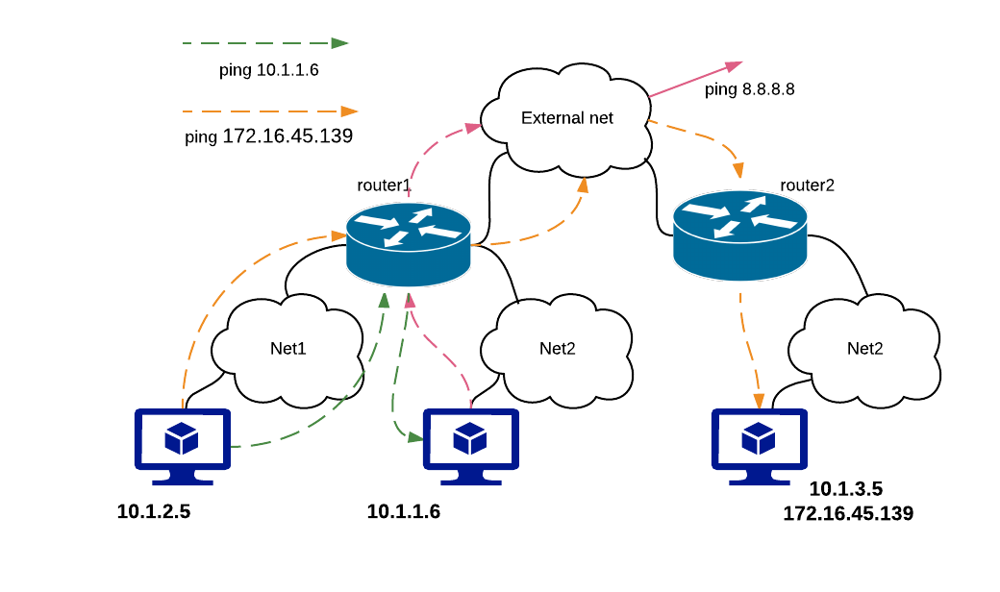

Neutron L3 HA test results Mitaka
---------------------------------

As we have already done initial testing of L3 HA functionality for Liberty,
in this testing load parameters are increased (for example, concurrency for Rally
tests, number of routers for manual tests).

Environment description
=======================

Cluster description
~~~~~~~~~~~~~~~~~~~
* 3 controllers
* 45 compute nodes

Software versions
~~~~~~~~~~~~~~~~~
MOS 9.0

Hardware configuration of each server
~~~~~~~~~~~~~~~~~~~~~~~~~~~~~~~~~~~~~

Description of servers hardware

**Compute Vendor**:
    1x SUPERMICRO SUPERSERVER 5037MR-H8TRF MICRO-CLOUD	`<http://www.supermicro.com/products/system/3u/5037/sys-5037mr-h8trf.cfm>`_
**CPU**
    1x INTEL XEON Ivy Bridge 6C E5-2620 V2 2.1G 15M 7.2GT/s QPI 80w SOCKET 2011R 1600 `<http://ark.intel.com/products/75789/Intel-Xeon-Processor-E5-2620-v2-15M-Cache-2_10-GHz>`_
**RAM**:
    4x Samsung DDRIII 8GB DDR3-1866 1Rx4 ECC REG RoHS M393B1G70QH0-CMA
**NIC**
    1x AOC-STGN-i2S - 2-port 10 Gigabit Ethernet SFP+

Rally test results
==================

L3 HA has a restriction of 255 routers per HA network per tenant. At this moment
we do not have the ability to create new HA network per tenant if the number of
VIPs exceed this limit. Based on this, for some tests, the number of tenants
was increased (NeutronNetworks.create_and_list_router).

The most important results are provided by test_create_delete_routers test,
as it allows to catch possible race conditions during creation/deletion of HA
routers, HA networks and HA interfaces. There are already several known bugs
related to this which have been fixed in upstream. Some of them:

* `bug/1528201 <https://bugs.launchpad.net/neutron/+bug/1528201>`_
* `bug/1499647 <https://bugs.launchpad.net/neutron/+bug/1499647>`_
* `bug/1529037 <https://bugs.launchpad.net/neutron/+bug/1529037>`_
* `bug/1533441 <https://bugs.launchpad.net/neutron/+bug/1533441>`_
* `bug/1533454 <https://bugs.launchpad.net/neutron/+bug/1533454>`_
* `bug/1533457 <https://bugs.launchpad.net/neutron/+bug/1533457>`_
* `bug/1548285 <https://bugs.launchpad.net/neutron/+bug/1548285>`_

To find out more possible
issues test_create_delete_routers has been run multiple times with different
concurrency. Another important aspect is number of users per tenant for tests.
This increases load for tests.

.. list-table:: Results of test_create_delete_routers
    :header-rows: 1

    *
     - Times
     - Concurrency
     - Users per tenant
     - Number of errors
     - Link for rally report
    *
     - 150
     - 50
     - 1
     - 0
     - `rally report <http://akamyshnikova.github.io/neutron-benchmark-results/mitaka/rally/create_delete_150_50_1.html>`_
    *
     - 250
     - 10
     - 3
     - 9
     - `rally report <http://akamyshnikova.github.io/neutron-benchmark-results/mitaka/rally/create_delete_250_10_3.html>`_
    *
     - 300
     - 10
     - 2
     - 1
     - `rally report <http://akamyshnikova.github.io/neutron-benchmark-results/mitaka/rally/create_delete_300_10_2.html>`_
    *
     - 300
     - 30
     - 5
     - 3
     - `rally report <http://akamyshnikova.github.io/neutron-benchmark-results/mitaka/rally/create_delete_300_30_5.html>`_
    *
     - 300
     - 40
     - 1
     - 4
     - `rally report <http://akamyshnikova.github.io/neutron-benchmark-results/mitaka/rally/create_delete_300_40_1.html>`_
    *
     - 300
     - 40
     - 5
     - 4
     - `rally report <http://akamyshnikova.github.io/neutron-benchmark-results/mitaka/rally/create_delete_300_40_5.html>`_
    *
     - 500
     - 50
     - 3
     - 55
     - `rally report <http://akamyshnikova.github.io/neutron-benchmark-results/mitaka/rally/create_delete_500_50_3.html>`_
    *
     - 300
     - 100
     - 1
     - 60
     - `rally report <http://akamyshnikova.github.io/neutron-benchmark-results/mitaka/rally/create_delete_multy.html>`_
    *
     - 300
     - 30
     - 4
     - 0
     - `rally report <http://akamyshnikova.github.io/neutron-benchmark-results/mitaka/rally/create_update_300_30_4.html>`_

In every suit with multiple scenarios ``boot_and_delete_server_with_secgroups``
was executed to show overall performance and validity of environment.

+------------------------------------------+-------------------+-------+-------------+------------------+--------------------------------------------------------------------------------------------------------------+
| Test                                     | Number of tenants | Times | Concurrency | Number of errors | Link for rally report                                                                                        |
+------------------------------------------+-------------------+-------+-------------+------------------+--------------------------------------------------------------------------------------------------------------+
|``create_and_delete_routers``             | 3                 |10     |3            |1                 |`rally report <http://akamyshnikova.github.io/neutron-benchmark-results/mitaka/rally/multy_short.html>`_      |
+------------------------------------------+-------------------+-------+-------------+------------------+                                                                                                              |
|``create_and_list_routers``               | 4                 |10     |3            |0                 |                                                                                                              |
+------------------------------------------+-------------------+-------+-------------+------------------+                                                                                                              |
|``create_and_update_routers``             |3                  |10     |3            |0                 |                                                                                                              |
+------------------------------------------+-------------------+-------+-------------+------------------+                                                                                                              |
|``boot_and_delete_server_with_secgroups`` |1                  |10     |3            |0                 |                                                                                                              |
+------------------------------------------+-------------------+-------+-------------+------------------+--------------------------------------------------------------------------------------------------------------+
|``create_and_delete_routers``             |3                  |300    |50           |4                 |                                                                                                              |
+------------------------------------------+-------------------+-------+-------------+------------------+                                                                                                              |
|``create_and_list_routers``               |4                  |300    |50           |118               |`rally report <http://akamyshnikova.github.io/neutron-benchmark-results/mitaka/rally/multy.html>`_            |
+------------------------------------------+-------------------+-------+-------------+------------------+                                                                                                              |
|``create_and_update_routers``             |3                  |300    |50           |3                 |                                                                                                              |
+------------------------------------------+-------------------+-------+-------------+------------------+                                                                                                              |
|``boot_and_delete_server_with_secgroups`` |5                  |450    |30           |63                |                                                                                                              |
+------------------------------------------+-------------------+-------+-------------+------------------+--------------------------------------------------------------------------------------------------------------+
|``create_and_delete_routers``             |3                  |300    |50           |30                |                                                                                                              |
+------------------------------------------+-------------------+-------+-------------+------------------+                                                                                                              |
|``create_and_list_routers``               |10                 |300    |50           |0                 |`rally report <http://akamyshnikova.github.io/neutron-benchmark-results/mitaka/rally/multu2.html>`_           |
+------------------------------------------+-------------------+-------+-------------+------------------+                                                                                                              |
|``create_and_update_routers``             |3                  |300    |50           |20                |                                                                                                              |
+------------------------------------------+-------------------+-------+-------------+------------------+                                                                                                              |
|``boot_and_delete_server_with_secgroups`` |5                  |450    |30           |180               |                                                                                                              |
+------------------------------------------+-------------------+-------+-------------+------------------+--------------------------------------------------------------------------------------------------------------+

The errors discovered have been classified as the following bugs:

.. list-table:: Bugs
    :header-rows: 1

    *
     - Short description
     - Trace
     - Upstream bug
     - Status
    *https://bugs.launchpad.net/neutron/+bug/1528201
     - IpAddressGenerationFailure No more IP addresses available on network
     - `trace <http://paste.openstack.org/show/491423/>`_
     - `bug/1562887 <https://bugs.launchpad.net/neutron/+bug/1562887>`_
     - Open (Affects Neutron  without L3 HA enabled, probably Rally bug)
    *
     - SubnetInUse: Unable to complete operation on subnet
     - `trace <http://paste.openstack.org/show/491557/>`_
     - `bug/1562878 <https://bugs.launchpad.net/neutron/+bug/1562878>`_
     - Open
    *
     - Not all HA networks deleted
     - `not a trace <http://paste.openstack.org/show/491573/>`_
     - `bug/1562892 <https://bugs.launchpad.net/neutron/+bug/1562892>`_
     - This is result of `bug/1562878 <https://bugs.launchpad.net/neutron/+bug/1562878>`_
    *
     - Race with deleting HA routers
     - `trace on agent side <http://paste.openstack.org/show/525987/>`_ and on server side `trace <http://paste.openstack.org/show/525175/>`_
     - `bug/1605546 <https://bugs.launchpad.net/neutron/+bug/1605546>`_
     - In progress
    *
     - Rollback with creation of default security group
     - `trace <http://paste.openstack.org/show/525215/>`_
     - `bug/1605201 <https://bugs.launchpad.net/neutron/+bug/1605201>`_
     - Open
    *
     - The server didn't respond in time.
     - `trace <http://paste.openstack.org/show/538845/>`_
     - Load is to high that neutron server is not able to respond.
     - Open

Frequency of appearance of the bugs above is shown in the following table:

.. list-table:: Comparative analysis of failures
    :header-rows: 1

    *
     - Test
     - Number of all test of that kind that were executed
     - Number of failed tests
     - Number of tests that failed because of current problem
    *
     - ``create_delete_routers``
     - 2210
     - 248 (11,2 %)
     - 121(5,5 %) - The server didn't respond in time. 11 (0,49 %) - SubnetInUse: Unable to complete operation on subnet
    *
     - ``create_and_update_routers``
     - 910
     - 23 (2,5 %)
     - 20 (2,1 %) - The server didn't respond in time.
    *
     - ``create_and_list_routers``
     - 610
     - 118 (19,3 %)
     - Incorrect test setup. Larger number of tenants was required.
    *
     - ``boot_and_delete_server_with_secgroups``
     - 910
     - 243 (26,7 %)
     - 243 (26,7 %) - TimeoutException: Rally tired waiting for Server to become ('ACTIVE') current status BUILD

Summary:
~~~~~~~~

1. In comparison with results for Liberty neutron-server
does not cope with higher load (a lot of "The server didn't respond in time"
errors)

2. Among races with creation and deletion of HA router remains the race with
HA networks `bug/1562878 <https://bugs.launchpad.net/neutron/+bug/1562878>`_
and race with deleting routers `bug/1605546 <https://bugs.launchpad.net/neutron/+bug/1605546>`_.

Shaker test results
===================

+-------------------------------------------------------------------------------------------------------------------------------------------------------------------+---------------------------------------------------------------------------------------------------------------------------------------------------+
| L3 HA                                                                                                                                                             | L3 HA during L3 agents restart                                                                                                                    |
+----------------------------------------+--------+-----------------------------------------------------------------------------------------------------------------+--------+----------+-------------------------------------------------------------------------------------------------------------------------------+
| Lost                                   | Errors | Link for report                                                                                                 | Lost   | Errors   | Link for report                                                                                                               |
+----------------------------------------+--------+-----------------------------------------------------------------------------------------------------------------+--------+----------+-------------------------------------------------------------------------------------------------------------------------------+
| OpenStack L3 East-West                                                                                                                                                                                                                                                                                                |
+----------------------------------------+--------+-----------------------------------------------------------------------------------------------------------------+--------+----------+-------------------------------------------------------------------------------------------------------------------------------+
| 0                                      | 0      | `report <http://akamyshnikova.github.io/neutron-benchmark-results/mitaka/shaker/full_l3_east_west.html>`__      | 6      | 0        | `report <http://akamyshnikova.github.io/neutron-benchmark-results/mitaka/shaker/full_l3_esat_west_restart.html>`__            |
+----------------------------------------+--------+-----------------------------------------------------------------------------------------------------------------+--------+----------+-------------------------------------------------------------------------------------------------------------------------------+
| OpenStack L3 East-West Performance                                                                                                                                                                                                                                                                                    |
+----------------------------------------+--------+-----------------------------------------------------------------------------------------------------------------+--------+----------+-------------------------------------------------------------------------------------------------------------------------------+
| 0                                      | 0      | `report <http://akamyshnikova.github.io/neutron-benchmark-results/mitaka/shaker/perf_l3_east_west_10.htmll>`__  | 0      | 0        | `report <http://akamyshnikova.github.io/neutron-benchmark-results/mitaka/shaker/perf_l3_east_west_restart.html>`__            |
+----------------------------------------+--------+-----------------------------------------------------------------------------------------------------------------+--------+----------+-------------------------------------------------------------------------------------------------------------------------------+
| OpenStack L3 North-South                                                                                                                                                                                                                                                                                              |
+----------------------------------------+--------+-----------------------------------------------------------------------------------------------------------------+--------+----------+-------------------------------------------------------------------------------------------------------------------------------+
| 0                                      | 0      | `report <http://akamyshnikova.github.io/neutron-benchmark-results/mitaka/shaker/full_l3_north_south.html>`__    | 30     | 0        | `report <http://akamyshnikova.github.io/neutron-benchmark-results/mitaka/shaker/full_l3_north_south_restart.html>`__          |
+----------------------------------------+--------+-----------------------------------------------------------------------------------------------------------------+--------+----------+-------------------------------------------------------------------------------------------------------------------------------+
| OpenStack L3 North-South UDP                                                                                                                                                                                                                                                                                          |
+----------------------------------------+--------+-----------------------------------------------------------------------------------------------------------------+--------+----------+-------------------------------------------------------------------------------------------------------------------------------+
| 0                                      | 1      | `report <http://akamyshnikova.github.io/neutron-benchmark-results/mitaka/shaker/udp_l3_north_south_2.html>`__   | 4      | 0        | `report <http://akamyshnikova.github.io/neutron-benchmark-results/mitaka/shaker/udp_l3_north_south_restart.html>`__           |
+----------------------------------------+--------+-----------------------------------------------------------------------------------------------------------------+--------+----------+-------------------------------------------------------------------------------------------------------------------------------+
| OpenStack L3 North-South Performance                                                                                                                                                                                                                                                                                  |
|                                                                                                                                                                                                                                                                                                                       |
| (concurrency 5)                                                                                                                                                                                                                                                                                                       |
+----------------------------------------+--------+-----------------------------------------------------------------------------------------------------------------+--------+----------+-------------------------------------------------------------------------------------------------------------------------------+
| 0                                      | 0      |`report <http://akamyshnikova.github.io/neutron-benchmark-results/mitaka/shaker/perf_l3_north_south_10.html>`__  | 0      | 0        | `report <http://akamyshnikova.github.io/neutron-benchmark-results/mitaka/shaker/perf_l3_north_south_restart.html>`__          |
+----------------------------------------+--------+-----------------------------------------------------------------------------------------------------------------+--------+----------+-------------------------------------------------------------------------------------------------------------------------------+
| OpenStack L3 North-South Dense                                                                                                                                                                                                                                                                                        |
+----------------------------------------+--------+-----------------------------------------------------------------------------------------------------------------+--------+----------+-------------------------------------------------------------------------------------------------------------------------------+
| 0                                      | 0      | `report <http://akamyshnikova.github.io/neutron-benchmark-results/mitaka/shaker/dense_l3_north_south.html>`__   | 0      | 0        | `report <http://akamyshnikova.github.io/neutron-benchmark-results/mitaka/shaker/dense_l3_north_south_restart.html>`__         |
+----------------------------------------+--------+-----------------------------------------------------------------------------------------------------------------+--------+----------+-------------------------------------------------------------------------------------------------------------------------------+
| OpenStack L3 East-West Dense                                                                                                                                                                                                                                                                                          |
+----------------------------------------+--------+-----------------------------------------------------------------------------------------------------------------+--------+----------+-------------------------------------------------------------------------------------------------------------------------------+
| 0                                      | 0      | `report <http://akamyshnikova.github.io/neutron-benchmark-results/mitaka/shaker/dense_l3_east_west.html>`__     | 29     | 0        | `report <http://akamyshnikova.github.io/neutron-benchmark-results/mitaka/shaker/dense_l3_east_west_restart.html>`__           |
+----------------------------------------+--------+-----------------------------------------------------------------------------------------------------------------+--------+----------+-------------------------------------------------------------------------------------------------------------------------------+

Shaker provides statistics about maximum, minimum and mean values of
different connection measurements. Maximum among all maximum values
and minimum among all minimum values was found for each test as well
as mean value was counted from all mean values. In the table below,
these values are presented.

+-----------------+---------------------------------------------------------------------------------------------------------------------------------------+---------------------------------------------------+
| type            | L3 HA                                                                                                                                 | L3 HA during l3 agents restart                    |
+-----------------+----------------------------------------+----------------------------------+-----------------------------------------------------------+----------------+-----------------+----------------+
|                 | min                                    | mean                             | max                                                       | min            | mean            | max            |
+-----------------+----------------------------------------+----------------------------------+-----------------------------------------------------------+----------------+-----------------+----------------+
|                                                                                                                         OpenStack L3 East-West                                                              |
+-----------------+----------------------------------------+----------------------------------+-----------------------------------------------------------+----------------+-----------------+----------------+
| ping\_icmp,     | 0.29                                   | 9.1                              | 21.08                                                     | **0.04**       | **9.57**        | **972.05**     |
|                 |                                        |                                  |                                                           |                |                 |                |
| ms              |                                        |                                  |                                                           |                |                 |                |
+-----------------+----------------------------------------+----------------------------------+-----------------------------------------------------------+----------------+-----------------+----------------+
| tcp\_download   | 84.5                                   | 789.6                            | 3614.99                                                   | **0.07**       | **886.38**      | **5519.7**     |
|                 |                                        |                                  |                                                           |                |                 |                |
| Mbits/s         |                                        |                                  |                                                           |                |                 |                |
+-----------------+----------------------------------------+----------------------------------+-----------------------------------------------------------+----------------+-----------------+----------------+
| tcp\_upload     | 87.97                                  | 617.14                           | 3364.86                                                   | **85.69**      | **604.72**      | **4898.11**    |
|                 |                                        |                                  |                                                           |                |                 |                |
| Mbits/s         |                                        |                                  |                                                           |                |                 |                |
+-----------------+----------------------------------------+----------------------------------+-----------------------------------------------------------+----------------+-----------------+----------------+
| Bandwidth       | 151.13                                 | 933.28                           | 3232.75                                                   | **0.0**        | **990.99**      | **4340.5**     |
| Mbit/s          |                                        |                                  |                                                           |                |                 |                |
+-----------------+----------------------------------------+----------------------------------+-----------------------------------------------------------+----------------+-----------------+----------------+
|                                                                                                                          OpenStack L3 East-West Performance                                                 |
+-----------------+----------------------------------------+----------------------------------+-----------------------------------------------------------+----------------+-----------------+----------------+
| Bandwidth       | 760.16                                 | 1316.44                          | 2879.94                                                   | **0.0**        | **1220.97**     | **4315.06**    |
| Mbit/s          |                                        |                                  |                                                           |                |                 |                |
+-----------------+----------------------------------------+----------------------------------+-----------------------------------------------------------+----------------+-----------------+----------------+
|                                                                                                                          OpenStack L3 North-South                                                           |
+-----------------+----------------------------------------+----------------------------------+-----------------------------------------------------------+----------------+-----------------+----------------+
| ping\_icmp,     | 0.12                                   | 13.54                            | 130.15                                                    | **0.38**       | **65.64**       | **369.95**     |
|                 |                                        |                                  |                                                           |                |                 |                |
| ms              |                                        |                                  |                                                           |                |                 |                |
+-----------------+----------------------------------------+----------------------------------+-----------------------------------------------------------+----------------+-----------------+----------------+
| tcp\_download   | 0.11                                   | 204.71                           | 771.85                                                    | **11.07**      | **156.67**      | **731.95**     |
|                 |                                        |                                  |                                                           |                |                 |                |
| Mbits/s         |                                        |                                  |                                                           |                |                 |                |
+-----------------+----------------------------------------+----------------------------------+-----------------------------------------------------------+----------------+-----------------+----------------+
| tcp\_upload     | 1.46                                   | 131.58                           | 719.26                                                    | **41.01**      | **240.1**       | **864.65**     |
|                 |                                        |                                  |                                                           |                |                 |                |
| Mbits/s         |                                        |                                  |                                                           |                |                 |                |
+-----------------+----------------------------------------+----------------------------------+-----------------------------------------------------------+----------------+-----------------+----------------+
| Bandwidth       | 4.25                                   |198.02                            | 680.56                                                    | **0.0**        | **184.97**      | **900.81**     |
| Mbit/s          |                                        |                                  |                                                           |                |                 |                |
+-----------------+----------------------------------------+----------------------------------+-----------------------------------------------------------+----------------+-----------------+----------------+
|                                                                                                                          OpenStack L3 North-South Performance                                               |
|                                                                                                                                                                                                             |
|                                                                                                                                  (concurrency 5)                                                            |
+-----------------+----------------------------------------+----------------------------------+-----------------------------------------------------------+----------------+-----------------+----------------+
| Bandwidth       | 52.38                                  | 472.69                           | 768.68                                                    | **0.0**        | **450.13**      | **768.44**     |
| Mbit/s          |                                        |                                  |                                                           |                |                 |                |
+-----------------+----------------------------------------+----------------------------------+-----------------------------------------------------------+----------------+-----------------+----------------+
|                                                                                                                          OpenStack L3 East-West Dense                                                       |
+-----------------+----------------------------------------+----------------------------------+-----------------------------------------------------------+----------------+-----------------+----------------+
| ping\_icmp,     | 0.06                                   | 6.87                             | 53.34                                                     | **0.37**       | **7.51**        | **50.08**      |
|                 |                                        |                                  |                                                           |                |                 |                |
| ms              |                                        |                                  |                                                           |                |                 |                |
+-----------------+----------------------------------------+----------------------------------+-----------------------------------------------------------+----------------+-----------------+----------------+
| Bandwidth       | 497.88                                 | 1832.61                          | 3754.25                                                   | **0.0**        | **1580.26**     | **3386.44**    |
| Mbit/s          |                                        |                                  |                                                           |                |                 |                |
+-----------------+----------------------------------------+----------------------------------+-----------------------------------------------------------+----------------+-----------------+----------------+
| tcp\_download   | 332.42                                 | 1536.71                          | 3771.26                                                   | **63.62**      | **1436.54**     | **3902.18**    |
|                 |                                        |                                  |                                                           |                |                 |                |
| Mbits/s         |                                        |                                  |                                                           |                |                 |                |
+-----------------+----------------------------------------+----------------------------------+-----------------------------------------------------------+----------------+-----------------+----------------+
| tcp\_upload     | 333.37                                 | 1091.59                          | 2692.93                                                   | **8.06**       | **1047.41**     | **3376.56**    |
|                 |                                        |                                  |                                                           |                |                 |                |
| Mbits/s         |                                        |                                  |                                                           |                |                 |                |
+-----------------+----------------------------------------+----------------------------------+-----------------------------------------------------------+----------------+-----------------+----------------+
|                                                                                                                          OpenStack L3 North-South Dense                                                     |
+-----------------+----------------------------------------+----------------------------------+-----------------------------------------------------------+----------------+-----------------+----------------+
| ping\_icmp,     | 0.33                                   | 14.27                            | 78.47                                                     | **0.38**       | **1.0**         | **2.3**        |
|                 |                                        |                                  |                                                           |                |                 |                |
| ms              |                                        |                                  |                                                           |                |                 |                |
+-----------------+----------------------------------------+----------------------------------+-----------------------------------------------------------+----------------+-----------------+----------------+
| Bandwidth       | 106.25                                 | 375.94                           | 721.31                                                    | **0.0**        | **267.31**      | **758.63**     |
| Mbit/s          |                                        |                                  |                                                           |                |                 |                |
+-----------------+----------------------------------------+----------------------------------+-----------------------------------------------------------+----------------+-----------------+----------------+
| tcp\_download   | 66.48                                  | 294.2                            | 668.21                                                    | **493.42**     | **535.22**      | **552.0**      |
|                 |                                        |                                  |                                                           |                |                 |                |
| Mbits/s         |                                        |                                  |                                                           |                |                 |                |
+-----------------+----------------------------------------+----------------------------------+-----------------------------------------------------------+----------------+-----------------+----------------+
| tcp\_upload     | 61.12                                  | 245.19                           | 658.95                                                    | -              | -               | -              |
|                 |                                        |                                  |                                                           |                |                 |                |
| Mbits/s         |                                        |                                  |                                                           |                |                 |                |
+-----------------+----------------------------------------+----------------------------------+-----------------------------------------------------------+----------------+-----------------+----------------+

Average value of difference between these values without and with
restart is presented in the next table:

+--------+---------------+-----------------+---------------+-------------+
|        | ping\_icmp,   | tcp\_download   | tcp\_upload   | Bandwidth   |
|        |               |                 |               | Mbit/s      |
|        | ms            | Mbits/s         | Mbits/s       |             |
+========+===============+=================+===============+=============+
| min    | -0.0925       | -21.1675        | 87.29         | 262         |
+--------+---------------+-----------------+---------------+-------------+
| mean   | -9.985        | -65.68          | -85.4875      | 72.39       |
+--------+---------------+-----------------+---------------+-------------+
| max    | -277.835      | -469.88         | -563.83       | 169.67      |
+--------+---------------+-----------------+---------------+-------------+

Summary:
~~~~~~~~

1. The results show that mean values for metrics do not decrease dramatically
during stop of active L3 agent.

Manual tests execution
======================

During manual testing, the following scenarios were tested:

-  Ping to external network from VM during reset of primary(non-primary)
   controller

-  Ping from one VM to another VM in different network during ban L3 agent

-  Iperf UPD testing between VMs in different networks during ban L3 agent

All tests were performed with large number of routers.

Ping to external network from VM during reset of primary(non-primary) controller
~~~~~~~~~~~~~~~~~~~~~~~~~~~~~~~~~~~~~~~~~~~~~~~~~~~~~~~~~~~~~~~~~~~~~~~~~~~~~~~~
.. image:: ping_external.png
    :width: 650px

+-------------+---------------------+----------------+---------------------------+
| Iteration   | Number of routers   | Command        | Number of loss packages   |
+=============+=====================+================+===========================+
| 1           | 10                  |                | 14                        |
+-------------+---------------------+----------------+---------------------------+
| 1           | 10                  |                |  2                        |
+-------------+---------------------+----------------+---------------------------+
| 2           | 50                  |                | 42                        |
+-------------+---------------------+----------------+---------------------------+
| 3           | 50                  |                | 41                        |
+-------------+---------------------+----------------+---------------------------+
| 4           | 100                 |                | 43                        |
+-------------+---------------------+----------------+---------------------------+
| 5           | 100                 |                | 42                        |
+-------------+---------------------+----------------+---------------------------+
| 6           | 100                 |  ping 8.8.8.8  | 47                        |
+-------------+---------------------+----------------+---------------------------+
| 7           | 150                 |                | 4                         |
+-------------+---------------------+----------------+---------------------------+
| 8           | 150                 |                | 15                        |
+-------------+---------------------+----------------+---------------------------+
| 9           | 150                 |                | 32                        |
+-------------+---------------------+----------------+---------------------------+
| 10          | 200                 |                | 48                        |
+-------------+---------------------+----------------+---------------------------+
| 11          | 200                 |                | 53                        |
+-------------+---------------------+----------------+---------------------------+
| 11          | 200                 |                | 57                        |
+-------------+---------------------+----------------+---------------------------+
| 11          | 225                 |                | 40                        |
+-------------+---------------------+----------------+---------------------------+

After reboot of the controller on which l3 agent was active, another l3 agent
becomes active. When rebooted node recovers, that l3 agent becomes active as well -
this leads to extra loss of external connectivity in tenant network.

After some time only one agent remains to be active - the one from rebooted
node.

The root cause of this behavior is that routers are processed by l3 agent before
openvswitch agent sets up appropriate HA ports, so for some time recovered HA
router is isolated from HA routers on other hosts and becomes active.

This issue needs special attention and will be investigated as
`bug/1597461 <https://bugs.launchpad.net/neutron/+bug/1597461>`__.

Work around for such issue: start l3 agent after openvswitch agent. Results
after applying such fix:

+---------------------+----------------+---------------------------+
| Number of routers   | Command        | Number of loss packages   |
+=====================+================+===========================+
| 50                  | ping 8.8.8.8   | 3                         |
+---------------------+----------------+---------------------------+

Ping from one VM to another VM in different network during ban L3 agent
~~~~~~~~~~~~~~~~~~~~~~~~~~~~~~~~~~~~~~~~~~~~~~~~~~~~~~~~~~~~~~~~~~~~~~~

+-------------+---------------------+-------------------+---------------------------+
| Iteration   | Number of routers   | Command           | Number of loss packages   |
+=============+=====================+===================+===========================+
| 1           | 1                   |                   | 2                         |
+-------------+---------------------+-------------------+---------------------------+
| 2           | 1                   |                   | 3                         |
+-------------+---------------------+-------------------+---------------------------+
| 3           | 1                   |                   | 3                         |
+-------------+---------------------+-------------------+---------------------------+
| 4           | 10                  |                   | 1                         |
+-------------+---------------------+-------------------+---------------------------+
| 5           | 10                  |                   | 5                         |
+-------------+---------------------+-------------------+---------------------------+
| 6           | 10                  |                   | 3                         |
+-------------+---------------------+-------------------+---------------------------+
| 7           | 50                  |                   | 4                         |
+-------------+---------------------+-------------------+---------------------------+
| 8           | 50                  |                   | 3                         |
+-------------+---------------------+-------------------+---------------------------+
| 9           | 50                  |                   | 4                         |
+-------------+---------------------+-------------------+---------------------------+
| 10          | 100                 |                   | 1                         |
+-------------+---------------------+-------------------+---------------------------+
| 11          | 100                 |ping 172.16.45.139 | 3                         |
+-------------+---------------------+-------------------+---------------------------+
| 12          | 150                 |                   | 4                         |
+-------------+---------------------+-------------------+---------------------------+
| 13          | 150                 |                   | 26                        |
+-------------+---------------------+-------------------+---------------------------+
| 14          | 150                 |                   | 3                         |
+-------------+---------------------+-------------------+---------------------------+
| 15          | 200                 |                   | 3                         |
+-------------+---------------------+-------------------+---------------------------+
| 16          | 200                 |                   | 14                        |
+-------------+---------------------+-------------------+---------------------------+
| 17          | 200                 |                   | 3                         |
+-------------+---------------------+-------------------+---------------------------+
| 18          | 225                 |                   | 5                         |
+-------------+---------------------+-------------------+---------------------------+
| 19          | 225                 |                   | 3                         |
+-------------+---------------------+-------------------+---------------------------+
| 20          | 250                 |                   | 6                         |
+-------------+---------------------+-------------------+---------------------------+
| 21          | 250                 |                   | 6                         |
+-------------+---------------------+-------------------+---------------------------+

With 250 routers l3 agents started to fail with `unmanaged
state <http://paste.openstack.org/show/491608/>`__.

Iperf UPD testing between VMs in different networks ban L3 agent
~~~~~~~~~~~~~~~~~~~~~~~~~~~~~~~~~~~~~~~~~~~~~~~~~~~~~~~~~~~~~~~~

.. image:: iperf_addresses.png
    :width: 650px

+---------------------+---------------------------------------------------------------------+---------------------------------------------------------------+
| Number of routers   | Command                                                             | Loss (%)                                                      |
+=====================+=====================================================================+===============================================================+
| 50                  |  iperf -c 10.2.0.4 -p 5001 -t 60 -i 10 --bandwidth 30M --len 64 -u  | 5.8                                                           |
+---------------------+---------------------------------------------------------------------+---------------------------------------------------------------+
|                     |  iperf -c 10.2.0.4 -p 5001 -t 60 -i 10 --bandwidth 30M --len 64 -u  | WARNING: did not receive ack of last datagram after 10 tries. |
+---------------------+---------------------------------------------------------------------+---------------------------------------------------------------+
|                     |  iperf -c 10.2.0.4 -p 5001 -t 60 -i 10 --bandwidth 30M --len 64 -u  | 12                                                            |
+---------------------+---------------------------------------------------------------------+---------------------------------------------------------------+
| 100                 |  iperf -c 10.2.0.4 -p 5001 -t 60 -i 10 --bandwidth 30M --len 64 -u  | 16                                                            |
+---------------------+---------------------------------------------------------------------+---------------------------------------------------------------+
|                     |  iperf -c 10.2.0.4 -p 5001 -t 60 -i 10 --bandwidth 30M --len 64 -u  | 6.1                                                           |
+---------------------+---------------------------------------------------------------------+---------------------------------------------------------------+
| 150                 |  iperf -c 10.2.0.4 -p 5001 -t 120 -i 10 --bandwidth 30M --len 64 -u | 4.3                                                           |
+---------------------+---------------------------------------------------------------------+---------------------------------------------------------------+
|                     |  iperf -c 10.2.0.4 -p 5001 -t 120 -i 10 --bandwidth 30M --len 64 -u | 4.8                                                           |
+---------------------+---------------------------------------------------------------------+---------------------------------------------------------------+
|                     |  iperf -c 10.2.0.4 -p 5001 -t 60 -i 10 --bandwidth 30M --len 64 -u  | 31                                                            |
+---------------------+---------------------------------------------------------------------+---------------------------------------------------------------+
|                     |  iperf -c 10.2.0.4 -p 5001 -t 60 -i 10 --bandwidth 30M --len 64 -u  | 6.9                                                           |
+---------------------+---------------------------------------------------------------------+---------------------------------------------------------------+
|  200                |  iperf -c 10.2.0.4 -p 5001 -t 90 -i 10 --bandwidth 30M --len 64 -u  | 7.5                                                           |
+---------------------+---------------------------------------------------------------------+---------------------------------------------------------------+
|                     |  iperf -c 10.2.0.4 -p 5001 -t 90 -i 10 --bandwidth 30M --len 64 -u  | WARNING: did not receive ack of last datagram after 10 tries. |
+---------------------+---------------------------------------------------------------------+---------------------------------------------------------------+
|  227                |  iperf -c 10.2.0.4 -p 5001 -t 120 -i 10 --bandwidth 30M --len 64 -u | 8.9                                                           |
+---------------------+---------------------------------------------------------------------+---------------------------------------------------------------+
|                     |  iperf -c 10.2.0.4 -p 5001 -t 120 -i 10 --bandwidth 30M --len 64 -u | WARNING: did not receive ack of last datagram after 10 tries. |
+---------------------+---------------------------------------------------------------------+---------------------------------------------------------------+

With 227 routers l3 agents started to fail with `unmanaged
state <http://paste.openstack.org/show/491608/>`__.

Summary:
~~~~~~~~

In comparison with results for MOS 8.0 (Liberty):

1. The root cause of unstable L3 HA behaviour
   `bug/1563298 <https://bugs.launchpad.net/mos/+bug/1563298>`__ was found and filed
   bug `bug/1597461 <https://bugs.launchpad.net/neutron/+bug/1597461>`__

2. For stop/start of L3 agent results become more stable.

3. With number of routers more than 227, agent’s recovery leads to
   falling into unmanaged state.
