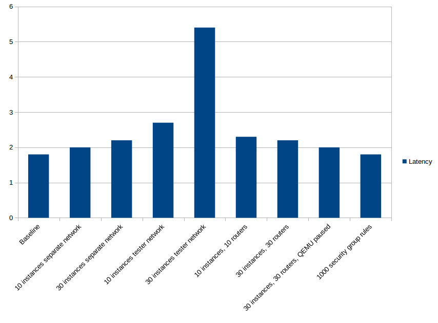
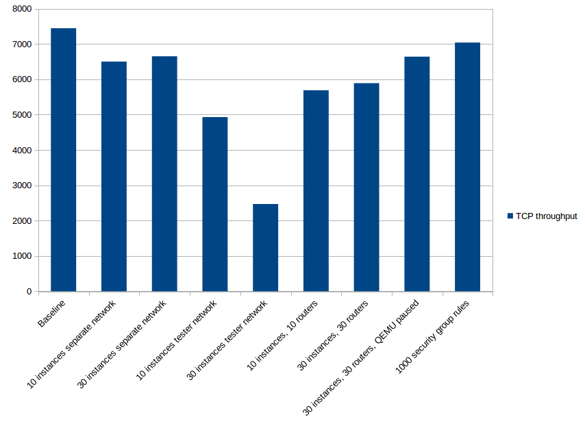
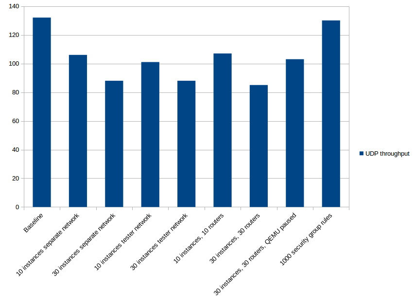

.. _neutron_neutron_resource_test_report:

==============================================
OpenStack Neutron Resource Density Test Report
==============================================

This report is generated for :ref:`neutron_resource_density_test_plan`.

Environment description
=======================

Cluster description
-------------------
* 3 controllers
* 2 compute nodes

Software versions
-----------------

**OpenStack/System**:
  Fuel/MOS 9.0, Ubuntu 14.04, Linux kernel 3.13, OVS 2.4.1
**Networking**
  Neutron ML2 + OVS plugin, DVR, L2pop, MTU 1500

Hardware configuration of each server
-------------------------------------

Description of servers hardware

**Compute Vendor**:
    HP ProLiant DL380 Gen9,
**CPU**
    2 x Intel(R) Xeon(R) CPU E5-2680 v3 @2.50GHz (48 cores)
**RAM**:
    256 Gb
**NIC**
    2 x Intel Corporation Ethernet 10G 2P X710

Report
======

Preparation
-----------

Measurements are performed between 2 instances deployed in L3 east-west
topology. To prepare:
 #. Create new Neutron router. Plug into external network.
 #. Create 2 Neutron networks, e.g. `east` and `west`. Plug them into
    the router.
 #. Boot 2 instances (Ubuntu Cloud Image can be used). Each instance should be
    in its own network and on its own compute node. Public key may be required
    to login into instance (in case of using Ubuntu).
 #. Assign floating IP to one of instances.

The traffic is sent between 2 instances, from the one with floating IP to the
other. Phisically packets will go from one compute node to the other directly.

Measurements
------------

Baseline
^^^^^^^^

We start with measuring baseline numbers. During this test only 2 instances
exist.

 ================= ============================= ==========================
  Latency, ms [σ]   TCP throughput, Mbits/s [σ]   UDP throughput, kpps [σ]
 ================= ============================= ==========================
  1.8 [0.6]         7445 [850]                    132 [6.5]
 ================= ============================= ==========================

10 instances per compute in separate network
^^^^^^^^^^^^^^^^^^^^^^^^^^^^^^^^^^^^^^^^^^^^

There are 20 micro instances (10 per compute node). Each instance is
Cirros-based with 1 VCPU and 64MB RAM. Instances are plugged into separate
network.

 ================= ============================= ==========================
  Latency, ms [σ]   TCP throughput, Mbits/s [σ]   UDP throughput, kpps [σ]
 ================= ============================= ==========================
  2.0 [0.7]         6500 [807]                    106 [4.5]
 ================= ============================= ==========================

30 instances per compute in separate network
^^^^^^^^^^^^^^^^^^^^^^^^^^^^^^^^^^^^^^^^^^^^

There are 60 micro instances (30 per compute node). Each instance is
Cirros-based with 1 VCPU and 64MB RAM. Instances are plugged into separate
network.

 ================= ============================= ==========================
  Latency, ms [σ]   TCP throughput, Mbits/s [σ]   UDP throughput, kpps [σ]
 ================= ============================= ==========================
  2.2 [0.8]         6650 [600]                    88 [3.0]
 ================= ============================= ==========================

10 instances per compute in tester network
^^^^^^^^^^^^^^^^^^^^^^^^^^^^^^^^^^^^^^^^^^

There are 20 micro instances (10 per compute node). Each instance is
Cirros-based with 1 VCPU and 64MB RAM. Instances are plugged into `east`
network.

 ================= ============================= ==========================
  Latency, ms [σ]   TCP throughput, Mbits/s [σ]   UDP throughput, kpps [σ]
 ================= ============================= ==========================
  2.7 [1.0]         4930 [499]                    101 [3.6]
 ================= ============================= ==========================

30 instances per compute in tester network
^^^^^^^^^^^^^^^^^^^^^^^^^^^^^^^^^^^^^^^^^^

There are 60 micro instances (30 per compute node). Each instance is
Cirros-based with 1 VCPU and 64MB RAM. Instances are plugged into `east`
network.

 ================= ============================= ==========================
  Latency, ms [σ]   TCP throughput, Mbits/s [σ]   UDP throughput, kpps [σ]
 ================= ============================= ==========================
  5.4 [2.1]         2470 [130]                    88 [2.3]
 ================= ============================= ==========================

10 instances and 10 routers per compute
^^^^^^^^^^^^^^^^^^^^^^^^^^^^^^^^^^^^^^^

There are 20 micro instances (10 per compute node). Each instance is
Cirros-based with 1 VCPU and 64MB RAM. Each instance is plugged into its own
network, which in turn is plugged into its own router.

 ================= ============================= ==========================
  Latency, ms [σ]   TCP throughput, Mbits/s [σ]   UDP throughput, kpps [σ]
 ================= ============================= ==========================
  2.3 [0.8]         5690 [630]                    107 [5.0]
 ================= ============================= ==========================

30 instances and 30 routers per compute
^^^^^^^^^^^^^^^^^^^^^^^^^^^^^^^^^^^^^^^

There are 60 micro instances (30 per compute node). Each instance is
Cirros-based with 1 VCPU and 64MB RAM. Each instance is plugged into its own
network, which in turn is plugged into its own router.

 ================= ============================= ==========================
  Latency, ms [σ]   TCP throughput, Mbits/s [σ]   UDP throughput, kpps [σ]
 ================= ============================= ==========================
  2.2 [0.8]         5890 [707]                    85 [1.9]
 ================= ============================= ==========================

30 instances and 30 routers per compute, QEMU paused
^^^^^^^^^^^^^^^^^^^^^^^^^^^^^^^^^^^^^^^^^^^^^^^^^^^^

There are 60 micro instances (30 per compute node). Each instance is
Cirros-based with 1 VCPU and 64MB RAM. Each instance is plugged into its own
network, which in turn is plugged into its own router. QEMU processes are
paused to reduce noise load on CPU.

 ================= ============================= ==========================
  Latency, ms [σ]   TCP throughput, Mbits/s [σ]   UDP throughput, kpps [σ]
 ================= ============================= ==========================
  2.0 [0.7]         6640 [623]                    103 [4.6]
 ================= ============================= ==========================

30 instances, 30 routers and 500 SG rules per instance, QEMU paused
^^^^^^^^^^^^^^^^^^^^^^^^^^^^^^^^^^^^^^^^^^^^^^^^^^^^^^^^^^^^^^^^^^^

There are 60 micro instances (30 per compute node). Each instance is
Cirros-based with 1 VCPU and 64MB RAM. Each instance is plugged into its own
network, which in turn is plugged into its own router. QEMU processes are
paused to reduce noise load on CPU. All instances have security group which
contains 500 rules (this results in ~17k iptables rules)

 ================= ============================= ==========================
  Latency, ms [σ]   TCP throughput, Mbits/s [σ]   UDP throughput, kpps [σ]
 ================= ============================= ==========================
  2.0 [0.7]         6658 [576]                    97 [1.0]
 ================= ============================= ==========================

1000 security group rules
^^^^^^^^^^^^^^^^^^^^^^^^^

In this case we assign security group containing 1000 rules to test instances.
There is no measurable difference from the baseline data.

 ================= ============================= ==========================
  Latency, ms [σ]   TCP throughput, Mbits/s [σ]   UDP throughput, kpps [σ]
 ================= ============================= ==========================
  1.8 [0.6]         7039 [653]                    130 [2.0]
 ================= ============================= ==========================

Conclusion
^^^^^^^^^^

It appears that two things have most of impact:
 * neighbours, which produce slight CPU load
 * OVS flows: the more flows, the less performance. Adding 30 instances to
   compute node results in 180 new flows.

The worst case for latency is when instances are co-located in the same network
as the tester. While presence of security group rules have no measurable effect
at all.

The worst case again when instances are co-located in the same network. CPU
noise also affects - the throughput reduces on ~10%.

For UDP metric the most impact is introduced by CPU noise and presence of OVS
rules. With security group rules the numbers are the same as in the baseline.
