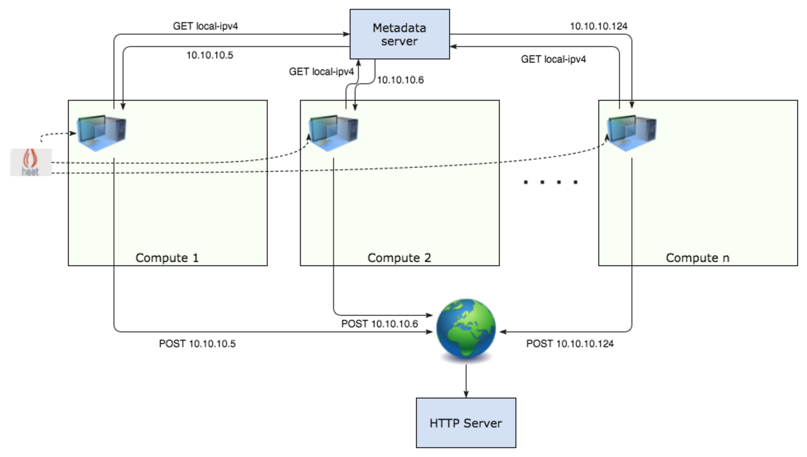
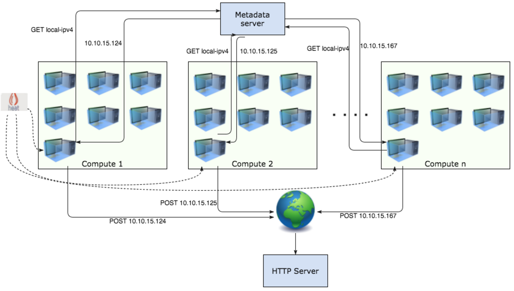
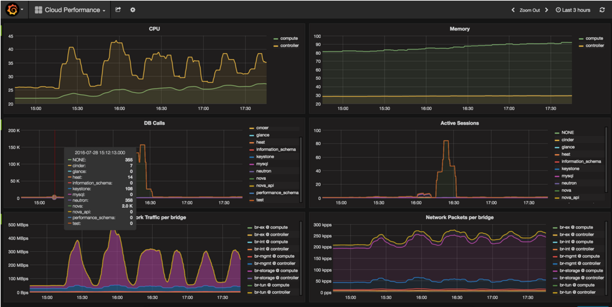

.. _`neutron_vm_density_test_report`:

========================================
OpenStack Neutron Density Testing report
========================================

:Abstract:

  This document includes OpenStack Networking (aka Neutron) density test
  results against 200 nodes OpenStack environment. All tests have been
  performed regarding
  :ref:`neutron_vm_density_test_plan`

Environment description
=======================

Lab A (200 nodes)
-----------------

3 controllers, 196 computes, 1 node for Grafana/Prometheus

Hardware configuration of each server
~~~~~~~~~~~~~~~~~~~~~~~~~~~~~~~~~~~~~

.. table:: Description of controller servers

   +-------+----------------+---------------------------------+
   |server |vendor,model    |Supermicro MBD-X10DRI            |
   +-------+----------------+---------------------------------+
   |CPU    |vendor,model    |Intel Xeon E5-2650v3             |
   |       +----------------+---------------------------------+
   |       |processor_count |2                                |
   |       +----------------+---------------------------------+
   |       |core_count      |10                               |
   |       +----------------+---------------------------------+
   |       |frequency_MHz   |2300                             |
   +-------+----------------+---------------------------------+
   |RAM    |vendor,model    |8x Samsung M393A2G40DB0-CPB      |
   |       +----------------+---------------------------------+
   |       |amount_MB       |2097152                          |
   +-------+----------------+---------------------------------+
   |NETWORK|vendor,model    |Intel,I350 Dual Port             |
   |       +----------------+---------------------------------+
   |       |bandwidth       |1G                               |
   |       +----------------+---------------------------------+
   |       |vendor,model    |Intel,82599ES Dual Port          |
   |       +----------------+---------------------------------+
   |       |bandwidth       |10G                              |
   +-------+----------------+---------------------------------+
   |STORAGE|vendor,model    |Intel SSD DC S3500 Series        |
   |       +----------------+---------------------------------+
   |       |SSD/HDD         |SSD                              |
   |       +----------------+---------------------------------+
   |       |size            |240GB                            |
   |       +----------------+---------------------------------+
   |       |vendor,model    |2x WD WD5003AZEX                 |
   |       +----------------+---------------------------------+
   |       |SSD/HDD         |HDD                              |
   |       +----------------+---------------------------------+
   |       |size            |500GB                            |
   +-------+----------------+---------------------------------+

.. table:: Description of compute servers

   +-------+----------------+---------------------------------+
   |server |vendor,model    |SUPERMICRO 5037MR-H8TRF          |
   +-------+----------------+---------------------------------+
   |CPU    |vendor,model    |INTEL XEON Ivy Bridge 6C E5-2620 |
   |       +----------------+---------------------------------+
   |       |processor_count |1                                |
   |       +----------------+---------------------------------+
   |       |core_count      |6                                |
   |       +----------------+---------------------------------+
   |       |frequency_MHz   |2100                             |
   +-------+----------------+---------------------------------+
   |RAM    |vendor,model    |4x Samsung DDRIII 8GB DDR3-1866  |
   |       +----------------+---------------------------------+
   |       |amount_MB       |32768                            |
   +-------+----------------+---------------------------------+
   |NETWORK|vendor,model    |AOC-STGN-i2S - 2-port            |
   |       +----------------+---------------------------------+
   |       |bandwidth       |10G                              |
   +-------+----------------+---------------------------------+
   |STORAGE|vendor,model    |Intel SSD DC S3500 Series        |
   |       +----------------+---------------------------------+
   |       |SSD/HDD         |SSD                              |
   |       +----------------+---------------------------------+
   |       |size            |80GB                             |
   |       +----------------+---------------------------------+
   |       |vendor,model    |1x WD Scorpio Black BP WD7500BPKT|
   |       +----------------+---------------------------------+
   |       |SSD/HDD         |HDD                              |
   |       +----------------+---------------------------------+
   |       |size            |750GB                            |
   +-------+----------------+---------------------------------+

Test results
============

Test Case: VM density check
---------------------------

The idea was to boot as many VMs as possible (in batches of 200-1000 VMs) and
make sure they are properly wired and have access to the external network.
The test allows to measure the maximum number of VMs which can be deployed
without issues with cloud operability, etc.

The external access was checked by the external server to which VMs connect
upon spawning. The server logs incoming connections from provisioned VMs which
send instance IPs to this server via POST requests. Instances also report a
number of attempts it took to get an IP address from metadata server and send
connect to the HTTP server respectively.

A Heat template was used for creating 1 net with a subnet, 1 DVR router, and a
VM per compute node. Heat stacks were created in batches of 1 to 5 (5 most of
the times), so 1 iteration effectively means 5 new nets/routers and 196 * 5
VMs. During the execution of the test we were constantly monitoring lab’s
status using Grafana dashboard and checking agents’ status.

**As a result we were able to successfully create 125 Heat stacks which gives
us the total of 24500 VMs**.

Iteration 1:

Iteration i:

Example of Grafana dashboard during density test:

Observed issues
---------------

Issues faced during testing:

* `LP #1614452 Port create time grows at scale due to dvr arp update`_

  * Patch: https://review.openstack.org/360732

* `LP #1606844 L3 agent constantly resyncing deleted router`_

  * Patch: https://review.openstack.org/353010

* `LP #1609741 oslo.messaging does not redeclare exchange if it is missing`_

  * Patch: https://review.openstack.org/351162

* `LP #1549311 Unexpected SNAT behavior between instances with DVR+floating ip`_

  * Patch: https://review.openstack.org/349549/
  * Patch: https://review.openstack.org/349884/

* `LP #1610303 l2pop mech fails to update_port_postcommit on a loaded cluster`_

  * Patch: https://review.openstack.org/365051/

* `LP #1606827 Agents might be reported as down for 10 minutes after all controllers restart`_

  * Patch: https://review.openstack.org/349038

* `LP #1528895 Timeouts in update_device_list (too slow with large # of VIFs)`_

  * Patch: https://review.openstack.org/277279/

* `LP #1606825 nova-compute hangs while executing a blocking call to librbd`_

  * Patch: https://review.openstack.org/348492

During testing it was also needed to tune nodes configuration in order to
comply with the growing number of VMs per node, such as:

* Increase ARP table size on compute nodes and controllers
* Raise cpu_allocation_ratio from 8.0 for 12.0 in nova.conf to prevent hitting
  Nova vCPUs limit on computes

At ~16000 VMs we reached ARP table size limit on compute nodes so Heat stack
creation started to fail. Having increased maximum table size we decided to
cleanup failed stacks, in attempt to do so we ran into a following Nova issue
(`LP #1606825 nova-compute hangs while executing a blocking call to librbd`_):
on VM deletion `nova-compute` may hang for a while executing a call to `librbd`
and eventually go down in Nova service-list output. This issue was fixed with
the help of the Mirnatis Nova team and the fix was applied on the lab as a
patch.

After launching ~20000 VMs cluster started experiencing problems with RabbitMQ
and Ceph. When the number of VMs reached 24500 control plane services and
agents started to massively go down: the initial failure might have been
caused by the lack of allowed PIDs per OSD nodes
(https://bugs.launchpad.net/fuel/+bug/1536271) , Ceph failure affected all
services, i.e. MySQL errors in Neutron server that lead to agents going down
and massive resource rescheduling/resync. After Ceph failure the control plane
cluster could not be recovered and due to that density test had to be stopped
before the capacity of compute nodes was exhausted.

Ceph team commented that 3 Ceph monitors aren't enough for over 20000 VMs
(each having 2 drives) and recommended to have at least 1 monitor per ~1000
client connections or move them to dedicated nodes.

.. note:: Connectivity check of Integrity test passed 100% even when control
   plane cluster went crazy. That is a good illustration of control plane
   failures not affecting data plane.

.. note:: Final result - 24500 VMs on a cluster.

.. references:

.. _LP #1614452 Port create time grows at scale due to dvr arp update: https://bugs.launchpad.net/neutron/+bug/1614452
.. _LP #1606844 L3 agent constantly resyncing deleted router: https://bugs.launchpad.net/neutron/+bug/1606844
.. _LP #1609741 oslo.messaging does not redeclare exchange if it is missing: https://bugs.launchpad.net/neutron/+bug/1609741
.. _LP #1549311 Unexpected SNAT behavior between instances with DVR+floating ip: https://bugs.launchpad.net/neutron/+bug/1549311
.. _LP #1610303 l2pop mech fails to update_port_postcommit on a loaded cluster: https://bugs.launchpad.net/neutron/+bug/1610303
.. _LP #1606827 Agents might be reported as down for 10 minutes after all controllers restart: https://bugs.launchpad.net/neutron/+bug/1606827
.. _LP #1528895 Timeouts in update_device_list (too slow with large # of VIFs):https://bugs.launchpad.net/neutron/+bug/1528895
.. _LP #1606825 nova-compute hangs while executing a blocking call to librbd: https://bugs.launchpad.net/neutron/+bug/1606825
