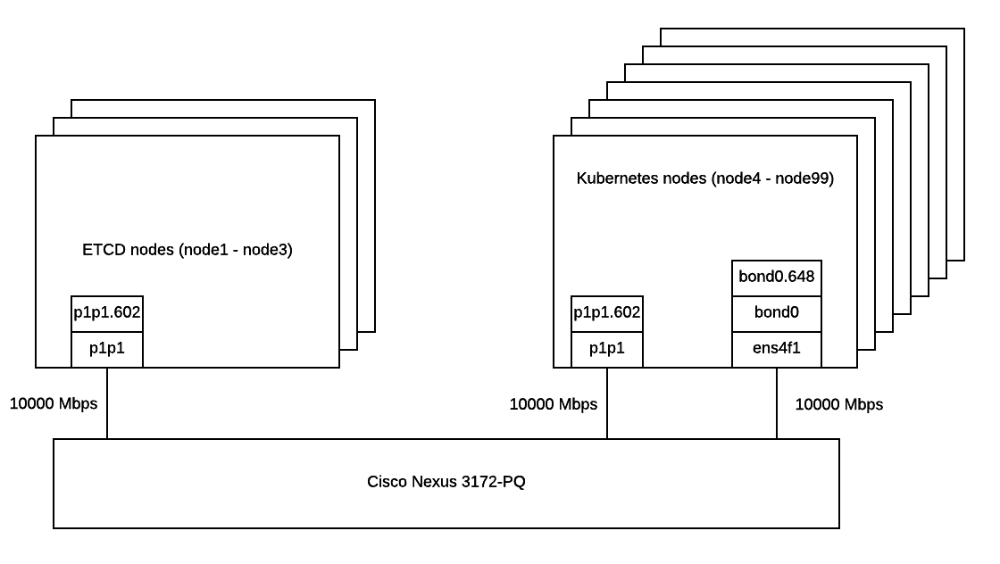

.. _neutron_fuel_ccp_upgrade_report:

==================================================================
Fuel Containerized Control Plane performance report during upgrade
==================================================================

:Abstract:

  This document includes OpenStack Networking (aka Neutron) performance test
  results during upgrade from Mitaka to Newton. All tests have been performed
  regarding
  :ref:`neutron_fuel_ccp_upgrade_test_plans`

Environment description
=======================

For Kubernetes pre-deployment `Kargo tool`_ was used. More information about
*fuel-ccp* and how it can be installed can be found in
`official documentation`_.

.. _Kargo tool: https://github.com/kubespray/kargo
.. _official documentation: http://fuel-ccp.readthedocs.io/en/latest/

Hardware configuration of each server
-------------------------------------

All servers have configuration describing in table below

.. table:: Description of servers hardware

   +-------+----------------+-------------------------------+
   |server |vendor,model    |HP,DL380 Gen9                  |
   +-------+----------------+-------------------------------+
   |CPU    |vendor,model    |Intel,E5-2680 v3               |
   |       +----------------+-------------------------------+
   |       |processor_count |2                              |
   |       +----------------+-------------------------------+
   |       |core_count      |12                             |
   |       +----------------+-------------------------------+
   |       |frequency_MHz   |2500                           |
   +-------+----------------+-------------------------------+
   |RAM    |vendor,model    |HP,752369-081                  |
   |       +----------------+-------------------------------+
   |       |amount_MB       |262144                         |
   +-------+----------------+-------------------------------+
   |NETWORK|interface_name  |ens4f1                         |
   |       +----------------+-------------------------------+
   |       |vendor,model    |Intel,X710 Dual Port           |
   |       +----------------+-------------------------------+
   |       |bandwidth       |10G                            |
   |       +----------------+-------------------------------+
   |       |interface_name  |p1p1                           |
   |       +----------------+-------------------------------+
   |       |vendor,model    |Intel,X710 Dual Port           |
   |       +----------------+-------------------------------+
   |       |bandwidth       |10G                            |
   +-------+----------------+-------------------------------+
   |STORAGE|dev_name        |/dev/sda                       |
   |       +----------------+-------------------------------+
   |       |vendor,model    | | raid10 - HP P840            |
   |       |                | | 12 disks EH0600JEDHE        |
   |       +----------------+-------------------------------+
   |       |SSD/HDD         |HDD                            |
   |       +----------------+-------------------------------+
   |       |size            | 3,6TB                         |
   +-------+----------------+-------------------------------+

Network configuration of each server
------------------------------------

All servers have same network configuration:

Fuel CCP configuration
----------------------
CCP main configuration
:download:`ccp.yaml <configs/ccp.yaml>`

CCP Cluster configuration
:download:`configs.yaml <configs/configs.yaml>`

CCP Cluster topology
:download:`topology.yaml <configs/topology.yaml>`

CCP repositories configuration
:download:`repos.yaml <configs/repos.yaml>`

CCP versions configuration for Mitaka
:download:`versions-mitaka.yaml <configs/versions-mitaka.yaml>`

CCP versions configuration for upgrade from Mitaka to Newton
:download:`versions-newton.yaml <configs/versions-newton.yaml>`

Upgrade and tests procedure
---------------------------
* Install fuel-ccp
* Rename ``ccp.yaml`` to ``/root/.ccp.ymal``
* Copy all yaml files to ``/root/``
* Rename ``versions-mitaka.yaml`` to ``versions.yaml``
* Execute ``ccp deploy`` and wait ok status for all services
* Install shaker
* On the node 172.20.9.40 execute ``shaker --scenario openstack/full_l2 --os-insecure --report full-l2.html --server-endpoint 172.20.9.40:31998``
* Wait message ``INFO shaker.engine.quorum [-] Finished processing operation: <shaker.engine.quorum.JoinOperation...`` from shaker
* Rename ``versions-newton.yaml`` to ``versions.yaml``
* Execute ``ccp deploy`` and wait ok status for all services
* Wait tests results from shaker

Test results
============
Shaker provides statistics about maximum, minimum and mean values of different
connection measurements. For each test was found the maximum among all maximum
values, minimum among all minimum values and counts the mean value from all
mean values.

Test Case 1: Analysis of L2 metrics during Open Stack upgrade
-------------------------------------------------------------
.. table:: Full L2 test results

   +-------+----------------+---------------------------------------------------------+
   |Losts  |Errors          |Full report                                              |
   +-------+----------------+---------------------------------------------------------+
   |10     |0               |:download:`L2 Full tests report <reports/full-l2.html>`  |
   +-------+----------------+---------------------------------------------------------+

Test Case 2: Analysis of L3 metrics during Open Stack upgrade
-------------------------------------------------------------
.. table:: Full L3 East West test results

   +-------+----------------+-----------------------------------------------------------------------------+
   |Losts  |Errors          |Full report                                                                  |
   +-------+----------------+-----------------------------------------------------------------------------+
   |0      |11              |:download:`L3 East West Full tests report <reports/full-l3-east-west.html>`  |
   +-------+----------------+-----------------------------------------------------------------------------+

