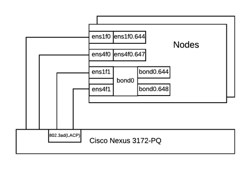
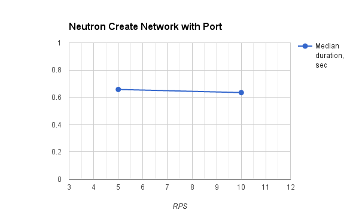
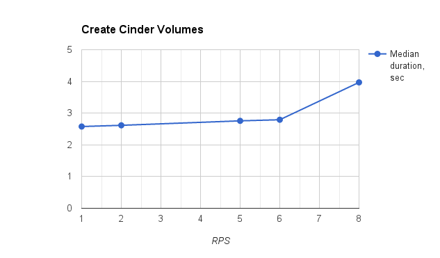
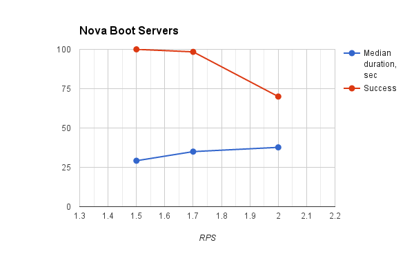

.. _openstack_load_report:

*****************************
OpenStack load testing report
*****************************

:Abstract:

  This document contains OpenStack load testing results collected for
  :ref:`openstack_load_test_plan`

Environment description
=======================
Environment contains servers of the following roles:

- rally node
- controller node
- compute-osd node
- compute node

.. table:: Amount of servers each role

   +------------+--------------+
   |Role        |Servers count |
   +============+==============+
   |rally       |1             |
   +------------+--------------+
   |controller  |3             |
   +------------+--------------+
   |compute     |176           |
   +------------+--------------+
   |compute-osd |20            |
   +------------+--------------+

Hardware configuration of each server
-------------------------------------
All servers have same configuration describing in table below

.. table:: Description of servers hardware

   +-------+----------------+-------------------------------+
   |server |vendor,model    |HP,DL380 Gen9                  |
   +-------+----------------+-------------------------------+
   |CPU    |vendor,model    |Intel,E5-2680 v3               |
   |       +----------------+-------------------------------+
   |       |processor_count |2                              |
   |       +----------------+-------------------------------+
   |       |core_count      |12                             |
   |       +----------------+-------------------------------+
   |       |frequency_MHz   |2500                           |
   +-------+----------------+-------------------------------+
   |RAM    |vendor,model    |HP,752369-081                  |
   |       +----------------+-------------------------------+
   |       |amount_MB       |262144                         |
   +-------+----------------+-------------------------------+
   |NETWORK|interface_name  |p1p1                           |
   |       +----------------+-------------------------------+
   |       |vendor,model    |Intel,X710 Dual Port           |
   |       +----------------+-------------------------------+
   |       |bandwidth       |10G                            |
   +-------+----------------+-------------------------------+
   |STORAGE|dev_name        |/dev/sda                       |
   |       +----------------+-------------------------------+
   |       |vendor,model    | | raid10 - HP P840            |
   |       |                | | 12 disks EH0600JEDHE        |
   |       +----------------+-------------------------------+
   |       |SSD/HDD         |HDD                            |
   |       +----------------+-------------------------------+
   |       |size            | 3,6TB                         |
   +-------+----------------+-------------------------------+

Network configuration of each server
------------------------------------
All servers have same network configuration:

Here is the part of switch configuration for each switch port which connected to
ens1f0 interface of a server:

.. code:: bash

   switchport mode trunk
   switchport trunk native vlan 600
   switchport trunk allowed vlan 600-602,630-649
   spanning-tree port type edge trunk
   spanning-tree bpduguard enable
   no snmp trap link-status

Software configuration on environment servers
---------------------------------------------
.. table:: Services on servers by role

   +------------+----------------------------+
   |Role        |Service name                |
   +============+============================+
   |controller  || horizon                   |
   |            || keystone                  |
   |            || nova-api                  |
   |            || nava-scheduler            |
   |            || nova-cert                 |
   |            || nova-conductor            |
   |            || nova-consoleauth          |
   |            || nova-consoleproxy         |
   |            || cinder-api                |
   |            || cinder-backup             |
   |            || cinder-scheduler          |
   |            || cinder-volume             |
   |            || glance-api                |
   |            || glance-glare              |
   |            || glance-registry           |
   |            || neutron-dhcp-agent        |
   |            || neutron-l3-agent          |
   |            || neutron-metadata-agent    |
   |            || neutron-openvswitch-agent |
   |            || neutron-server            |
   |            || heat-api                  |
   |            || heat-api-cfn              |
   |            || heat-api-cloudwatch       |
   |            || ceph-mon                  |
   |            || rados-gw                  |
   |            || heat-engine               |
   |            || memcached                 |
   |            || rabbitmq-server           |
   |            || mysqld                    |
   |            || galera                    |
   |            || corosync                  |
   |            || pacemaker                 |
   |            || haproxy                   |
   +------------+----------------------------+
   |compute     || nova-compute              |
   |            || neutron-l3-agent          |
   |            || neutron-metadata-agent    |
   |            || neutron-openvswitch-agent |
   +------------+----------------------------+
   |compute-osd || nova-compute              |
   |            || neutron-l3-agent          |
   |            || neutron-metadata-agent    |
   |            || neutron-openvswitch-agent |
   |            || ceph-osd                  |
   +------------+----------------------------+
   |osd         |ceph-osd                    |
   +------------+----------------------------+

.. table:: Software version of OpenStack nodes

   +------------+-------------------+
   |Software    |Version            |
   +============+===================+
   |OpenStack   |Mitaka             |
   +------------+-------------------+
   |Ceph        |Hammer             |
   +------------+-------------------+
   |Ubuntu      |Ubuntu 14.04.3 LTS |
   +------------+-------------------+

Software configuration on servers with rally role
-------------------------------------------------

On this server should be installed Rally. How to do it you can find in
`Rally installation documentation`_

.. table:: Software version of Rally server

   +------------+-------------------+
   |Software    |Version            |
   +============+===================+
   |Rally       |0.4.0              |
   +------------+-------------------+
   |Ubuntu      |Ubuntu 14.04.3 LTS |
   +------------+-------------------+

Test results
============

Create Neutron networks
-----------------------

In this test case Rally creates Neutron networks at constant rate. Achieved
maximum rate: **5 RPS**.

+---------------------------------------------------------------------------------------------------------------------------+
|                                                   Response Times (sec)                                                    |
+------------------------+-----------+--------------+--------------+--------------+-----------+-----------+---------+-------+
| Action                 | Min (sec) | Median (sec) | 90%ile (sec) | 95%ile (sec) | Max (sec) | Avg (sec) | Success | Count |
+------------------------+-----------+--------------+--------------+--------------+-----------+-----------+---------+-------+
| neutron.create_network | 0.165     | 0.197        | 0.277        | 0.295        | 0.462     | 0.211     | 100.0%  | 1000  |
| total                  | 0.166     | 0.197        | 0.277        | 0.295        | 0.462     | 0.211     | 100.0%  | 1000  |
+------------------------+-----------+--------------+--------------+--------------+-----------+-----------+---------+-------+

Rally report: :download:`rally_neutron_create_port.html <rally_reports/neutron_create_networks.html>`

Create Neutron network with port
--------------------------------

In this test case Rally creates Neutron network with one Neutron port at
constant rate. The summary duration time is measured and dependency on number
of requests per second is shown.

===== =========== ============== =========== ===========
 RPS   Min (sec)   Median (sec)   Max (sec)   Avg (sec)
===== =========== ============== =========== ===========
 5     0.505       0.658          4.712       0.795
 10    0.468       0.635          2.789       0.712
===== =========== ============== =========== ===========

Rally reports:

  * :download:`Create Neutron network with port 5 rps <rally_reports/neutron_create_network_with_port_5rps.html>`
  * :download:`Create Neutron network with port 10 rps <rally_reports/neutron_create_network_with_port_10rps.html>`

Create and list Neutron ports
-----------------------------

In this test case Rally creates Neutron network with 20 ports and lists them.
Operations are requested at constant rate. Achieved maximum rate: **0.1 RPS**.

+-----------------------------------------------------------------------------------------------------------------------------+
|                                                    Response Times (sec)                                                     |
+--------------------------+-----------+--------------+--------------+--------------+-----------+-----------+---------+-------+
| Action                   | Min (sec) | Median (sec) | 90%ile (sec) | 95%ile (sec) | Max (sec) | Avg (sec) | Success | Count |
+--------------------------+-----------+--------------+--------------+--------------+-----------+-----------+---------+-------+
| neutron.create_port      | 0.257     | 0.370        | 0.994        | 1.405        | 1.81      | 0.452     | 100.0%  | 50    |
| neutron.list_ports       | 0.045     | 0.108        | 0.222        | 0.236        | 0.256     | 0.129     | 100.0%  | 50    |
| neutron.create_network   | 0.221     | 0.311        | 0.418        | 0.44         | 0.525     | 0.312     | 100.0%  | 50    |
| total                    | 8.243     | 9.487        | 10.213       | 10.686       | 12.259    | 9.485     | 100.0%  | 50    |
+--------------------------+-----------+--------------+--------------+--------------+-----------+-----------+---------+-------+

Rally report: :download:`rally_neutron_create_port.html <rally_reports/neutron_create_and_list_ports.html>`

Create Cinder volumes
---------------------

The following chart and table show how operation duration depends on number
of requests per second. The median grows, at 8 RPS one of request falls out
of 1 minute.

===== =========== ============== =========== ===========
 RPS   Min (sec)   Median (sec)   Max (sec)   Avg (sec)
===== =========== ============== =========== ===========
 1     2.462       2.578          3.158       2.607
 2     2.474       2.616          3.029       2.644
 5     2.52        2.757          7.701       2.788
 6     2.565       2.792          3.975       2.83
 8     2.654       3.97           73.869      16.608
===== =========== ============== =========== ===========

Rally reports:

  * :download:`Create Cinder volumes 1 rps <rally_reports/cinder_create_volumes_1rps.html>`
  * :download:`Create Cinder volumes 2 rps <rally_reports/cinder_create_volumes_2rps.html>`
  * :download:`Create Cinder volumes 5 rps <rally_reports/cinder_create_volumes_5rps.html>`
  * :download:`Create Cinder volumes 6 rps <rally_reports/cinder_create_volumes_6rps.html>`
  * :download:`Create Cinder volumes 8 rps <rally_reports/cinder_create_volumes_8rps.html>`

Boot Nova Server
----------------

The following chart and table show how operation duration depends on number
of requests per second. Success rate falls beyond 100% as some of operations
take longer than the timeout limit.

===== =========== ============== =========== =========== =============
 RPS   Min (sec)   Median (sec)   Max (sec)   Avg (sec)   Success (%)
===== =========== ============== =========== =========== =============
 1.5   12.234      29.197         118.353     34.074      100
 1.7   12.626      34.993         182.083     48.736      98.4
 2     13.426      37.698         298.564     50.021      70
===== =========== ============== =========== =========== =============

Rally reports:

  * :download:`Nova Boot server 1.5 rps <rally_reports/nova_boot_server_1_5rps.html>`
  * :download:`Nova Boot server 1.7 rps <rally_reports/nova_boot_server_1_7rps.html>`
  * :download:`Nova Boot server 2 rps <rally_reports/nova_boot_server_2rps.html>`

.. references:
.. _Rally installation documentation: https://rally.readthedocs.io/en/latest/install.html
