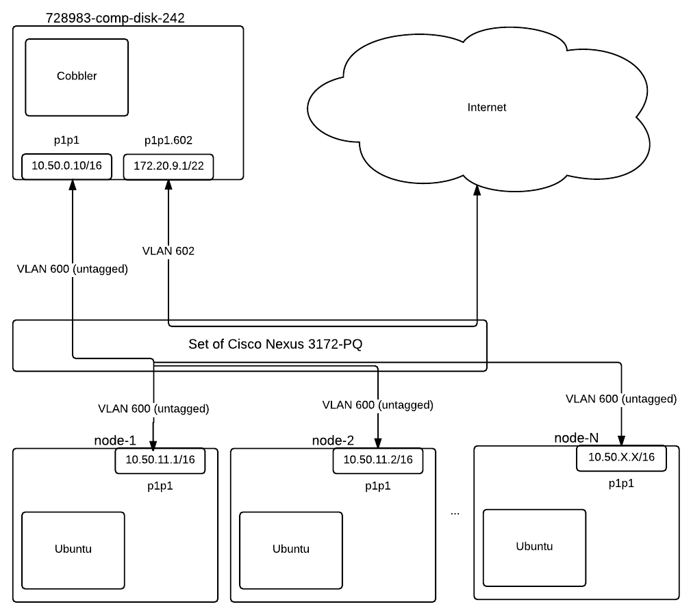
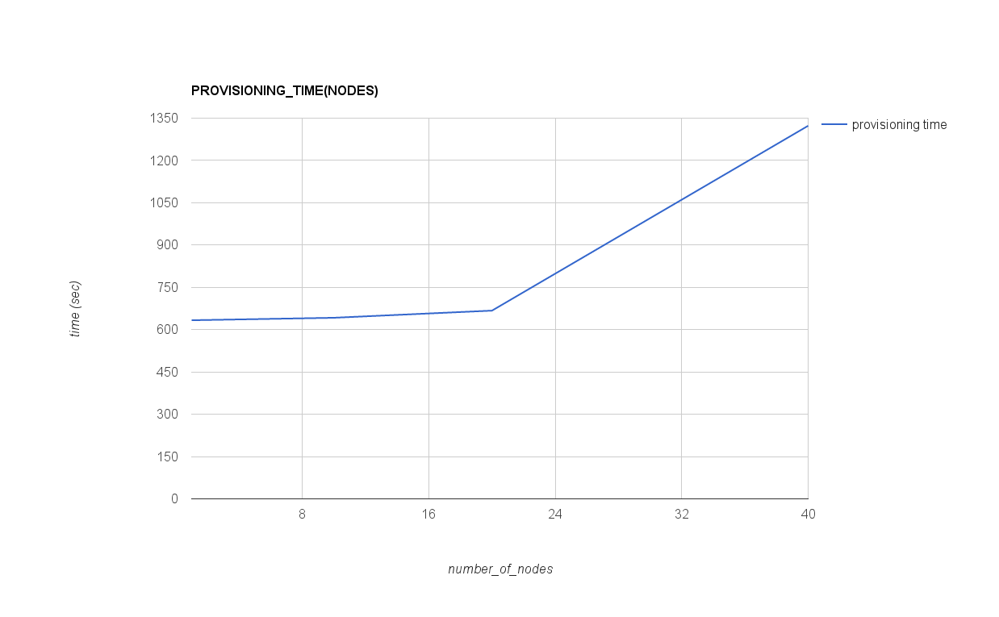
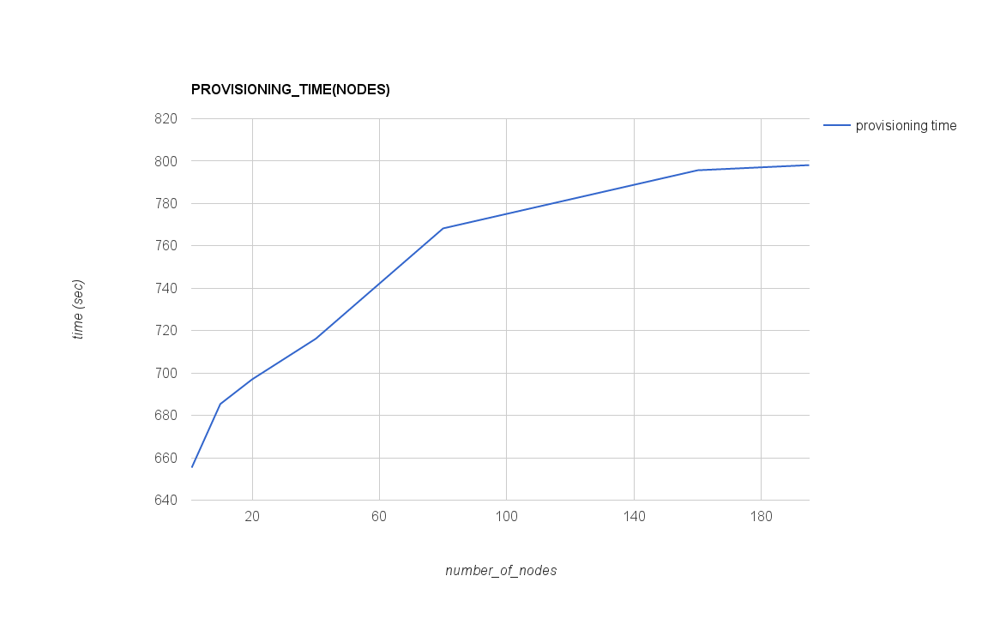
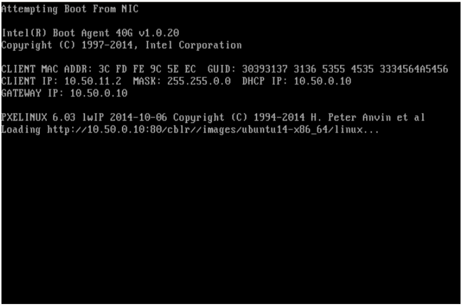

.. _Measuring_performance_of_Cobbler:

*******************************************
Results of measuring performance of Cobbler
*******************************************

:Abstract:

  This document includes performance test results of `Cobbler`_
  service as a provisioning system. All tests have been performed
  regarding :ref:`Measuring_performance_of_provisioning_systems`

Environment description
=======================
Hardware configuration of each server
-------------------------------------

.. table:: Description of servers hardware

  +-------+----------------+------------------------+------------------------+
  |server |name            |728983-comp-disk-242    |nodes-{1..195}          |
  |       +----------------+------------------------+------------------------+
  |       |role            |Cobbler                 |nodes to be provisioned |
  |       +----------------+------------------------+------------------------+
  |       |vendor,model    |HP,DL380 Gen9           |HP,DL380 Gen9           |
  |       +----------------+------------------------+------------------------+
  |       |operating_system| | 3.13.0-76-generic    | | 3.13.0-83-generic    |
  |       |                | | Ubuntu-trusty        | | Ubuntu-trusty        |
  |       |                | | x86_64               | | x86_64               |
  +-------+----------------+------------------------+------------------------+
  |CPU    |vendor,model    |Intel,E5-2680 v3        |Intel,E5-2680 v3        |
  |       +----------------+------------------------+------------------------+
  |       |processor_count |2                       |2                       |
  |       +----------------+------------------------+------------------------+
  |       |core_count      |12                      |12                      |
  |       +----------------+------------------------+------------------------+
  |       |frequency_MHz   |2500                    |2500                    |
  +-------+----------------+------------------------+------------------------+
  |RAM    |vendor,model    |HP,752369-081           |HP,752369-081           |
  |       +----------------+------------------------+------------------------+
  |       |amount_MB       |262144                  |262144                  |
  +-------+----------------+------------------------+------------------------+
  |NETWORK|interface_name  |p1p1                    |p1p1                    |
  |       +----------------+------------------------+------------------------+
  |       |vendor,model    |Intel,X710 Dual Port    |Intel,X710 Dual Port    |
  |       +----------------+------------------------+------------------------+
  |       |bandwidth       |10G                     |10G                     |
  +-------+----------------+------------------------+------------------------+
  |STORAGE|dev_name        |/dev/sda                |/dev/sda                |
  |       +----------------+------------------------+------------------------+
  |       |vendor,model    | | raid10 - HP P840     | | raid10 - HP P840     |
  |       |                | | 12 disks EH0600JEDHE | | 12 disks EH0600JEDHE |
  |       +----------------+------------------------+------------------------+
  |       |SSD/HDD         |HDD                     |HDD                     |
  |       +----------------+------------------------+------------------------+
  |       |size            | 3,6TB                  | 3,6TB                  |
  +-------+----------------+------------------------+------------------------+

Network scheme and part of configuration of hardware network switches
---------------------------------------------------------------------
Network scheme of the environment:

Here is the part of switch configuration for each switch port which connected to
p1p1 interface of a server:

.. code:: bash

   switchport mode trunk
   switchport trunk native vlan 600
   switchport trunk allowed vlan 600-602,630-649
   spanning-tree port type edge trunk
   spanning-tree bpduguard enable
   no snmp trap link-status

Software configuration of Cobbler service
-----------------------------------------
Installation of Cobbler:
^^^^^^^^^^^^^^^^^^^^^^^^
To install and configure Cobbler section
`Installation script and config files`_ has been used.

The nodes has Intel X710 NIC therefore we had to provide i40e driver to
Debian installer. The following steps was performed to do that:

.. code:: bash

  mkdir /var/www/html/ubuntu_custom_packages
  cd /var/www/html/ubuntu_custom_packages
  wget <address_to_builded_deb_package>
  dpkg-scanpackages . /dev/null | gzip -9c > Packages.gz

Cobbler has the following issue https://github.com/cobbler/cobbler/issues/1530.
Due the bug we can't add one more repository for provisioning step. Also we
need to allow root access via ssh after provisioning. Therefore:

.. code:: bash

  sed -i s/"\$SNIPPET('late_apt_repo_config')"/\
           "\$SNIPPET('late_apt_repo_config')\\n\
            echo \"deb http:\/\/\$server\/ubuntu_custom_packages\/ .\/\" \>\> \/etc\/apt\/sources.list\\n\
            apt\-get update \&\& apt\-get \-y \-\-force\-yes install i40e\-dkms\\n\
            sed \-i \'s\/PermitRootLogin\.\*\/PermitRootLogin yes\/g\' \/etc\/ssh\/sshd_config"/ \
          /var/lib/cobbler/scripts/preseed_late_default

.. table:: Versions of some software

  +---------------+------------------+
  |Software       |Version           |
  +===============+==================+
  |Ubuntu         |Ubuntu 14.04.3 LTS|
  +---------------+------------------+
  |Cobbler        |2.6.11            |
  +---------------+------------------+
  |Apache2        |2.4.7             |
  +---------------+------------------+
  |Bind9          |1:9.9.5           |
  +---------------+------------------+
  |tftpd-hpa      |5.2               |
  +---------------+------------------+
  |isc-dhcp-server|4.2.4             |
  +---------------+------------------+
  |syslinux       |6.03              |
  +---------------+------------------+

Test tool:
^^^^^^^^^^
`Script to start provisioning and collect metrics`_ was used to collect
performance metrics during the tests.

Operating system configuration:
^^^^^^^^^^^^^^^^^^^^^^^^^^^^^^^
You can find outputs of some commands and /etc folder in the following archive:
:download:`server_description_of_728983-comp-disk-242.tar.gz <configs/server_description_of_728983-comp-disk-242.tar.gz>`

Software configuration of provisioned nodes
-------------------------------------------

.. table:: Versions of some software

  +-----------+------------------+
  |Software   |Version           |
  +===========+==================+
  |Ubuntu     |Ubuntu 14.04.3 LTS|
  +-----------+------------------+

Operating system:
^^^^^^^^^^^^^^^^^
You can find outputs of some commands and /etc folder in the following archive:
:download:`server_description_of_728997-comp-disk-228.tar.gz <configs/server_description_of_728997-comp-disk-228.tar.gz>`

Testing process
===============
Preparation
-----------
1.
  Cobbler was installed on top of 728983-comp-disk-242 server as described in
  `Installation of Cobbler:`_ section.

2.
  systems.list file (with matching of server name, server ILO address and mac
  address of interface connected to Cobbler) was created:

.. code:: bash

  root@728983-comp-disk-242:~# tail -3 systems.list
  729691-comp-disk-201,10.15.242.170,68:05:ca:38:64:d4
  729692-comp-disk-200,10.15.242.171,3c:fd:fe:9c:62:30
  729693-comp-disk-199,10.15.242.172,3c:fd:fe:9c:68:3c

3.
  Cobbler systems was added using `Script to add cobbler systems`_.

Testing. Case when pxlinux downloads kernel via HTTP
----------------------------------------------------
During `Installation of Cobbler:`_ we copied
/etc/cobbler/pxe/pxesystem.template (:ref:`pxesystem_http`). It means that on
the step when pxelinux downloads kernel and initrd files via HTTP protocol.

1.
  Performed `Script to start provisioning and collect metrics`_ with option "1"
  to provision 1 server.

.. code:: bash

   bash -ex measure.sh 1

2. Save /var/log/results.csv file

.. code:: bash

   mv /var/log/results.csv /var/log/results-http-1.csv

3.
  The steps 1 and 2 was repeated with the following numbers of nodes:
  1,10,20,40

As a result of this part we got the following CSV files:

:download:`METRICS(NUMBER_OF_NODES=1) <./results/results-http-1.csv>`
:download:`METRICS(NUMBER_OF_NODES=10) <./results/results-http-10.csv>`
:download:`METRICS(NUMBER_OF_NODES=20) <./results/results-http-20.csv>`
:download:`METRICS(NUMBER_OF_NODES=40) <./results/results-http-40.csv>`

During the las test when we provisioned 40 nodes 2 nodes wasn't provisioned due
the issue `Linux kernel can't be downloaded by pxelinux via HTTP`_

Testing. Case when pxlinux downloads kernel via TFTP
----------------------------------------------------
During the following steps we change pxe configurations for all systems to
download kernel and initrd files via TFTP protocol.

1. Change pxe template

.. code:: bash

  sed -i s/"http:\/\/\$server:\$http_port\/cblr\/"// \
      /etc/cobbler/pxe/pxesystem.template

2.
  Performed `Script to start provisioning and collect metrics`_ with option "1"
  to provision 1 server.

.. code:: bash

  bash -ex measure.sh 1

3. Save /var/log/results.csv file

.. code:: bash

  mv /var/log/results.csv /var/log/results-http-1.csv

4.
  The steps 2 and 3 was repeated with the following numbers of nodes:
  1,10,20,40,80,160,195

As a result of this part we got the following CSV files:

:download:`METRICS(NUMBER_OF_NODES=1) <./results/results-tftp-1.csv>`
:download:`METRICS(NUMBER_OF_NODES=10) <./results/results-tftp-10.csv>`
:download:`METRICS(NUMBER_OF_NODES=20) <./results/results-tftp-20.csv>`
:download:`METRICS(NUMBER_OF_NODES=40) <./results/results-tftp-40.csv>`
:download:`METRICS(NUMBER_OF_NODES=80) <./results/results-tftp-80.csv>`
:download:`METRICS(NUMBER_OF_NODES=160) <./results/results-tftp-160.csv>`
:download:`METRICS(NUMBER_OF_NODES=195) <./results/results-tftp-195.csv>`

Results
=======
Case when pxlinux downloads kernel via HTTP
-------------------------------------------
After simple processing results the following plots for performance metrics
collected during provisioning of the nodes in depend on time created (click to
expand an image):

CPU(TIME), RAM(TIME)
^^^^^^^^^^^^^^^^^^^^

+---------+----------------------------------+----------------------------------+
|Number of|Plot CPU(TIME)                    |Plot RAM(TIME)                    |
|nodes    |                                  |                                  |
+=========+==================================+==================================+
|1        |.. image:: results/http-cpu-1.png |.. image:: results/http-ram-1.png |
|         |   :alt: CPU_USAGE(TIME, NODES=1) |   :alt: RAM_USAGE(TIME, NODES=1) |
|         |   :scale: 20                     |   :scale: 20                     |
+---------+----------------------------------+----------------------------------+
|10       |.. image:: results/http-cpu-10.png|.. image:: results/http-ram-10.png|
|         |   :alt: CPU_USAGE(TIME, NODES=10)|   :alt: RAM_USAGE(TIME, NODES=10)|
|         |   :scale: 20                     |   :scale: 20                     |
+---------+----------------------------------+----------------------------------+
|20       |.. image:: results/http-cpu-20.png|.. image:: results/http-ram-20.png|
|         |   :alt: CPU_USAGE(TIME, NODES=20)|   :alt: RAM_USAGE(TIME, NODES=20)|
|         |   :scale: 20                     |   :scale: 20                     |
+---------+----------------------------------+----------------------------------+
|40       |.. image:: results/http-cpu-40.png|.. image:: results/http-ram-40.png|
|         |   :alt: CPU_USAGE(TIME, NODES=40)|   :alt: RAM_USAGE(TIME, NODES=40)|
|         |   :scale: 20                     |   :scale: 20                     |
+---------+----------------------------------+----------------------------------+

NET(TIME), DISK(TIME)
^^^^^^^^^^^^^^^^^^^^^

+---------+----------------------------------+-----------------------------------+
|Number of|Plot NET(TIME)                    |Plot DISK(TIME)                    |
|nodes    |                                  |                                   |
+=========+==================================+===================================+
|1        |.. image:: results/http-net-1.png |.. image:: results/http-disk-1.png |
|         |   :alt: NET_USAGE(TIME, NODES=1) |   :alt: DISK_USAGE(TIME, NODES=1) |
|         |   :scale: 20                     |   :scale: 20                      |
+---------+----------------------------------+-----------------------------------+
|10       |.. image:: results/http-net-10.png|.. image:: results/http-disk-10.png|
|         |   :alt: NET_USAGE(TIME, NODES=10)|   :alt: DISK_USAGE(TIME, NODES=10)|
|         |   :scale: 20                     |   :scale: 20                      |
+---------+----------------------------------+-----------------------------------+
|20       |.. image:: results/http-net-20.png|.. image:: results/http-disk-20.png|
|         |   :alt: NET_USAGE(TIME, NODES=20)|   :alt: DISK_USAGE(TIME, NODES=20)|
|         |   :scale: 20                     |   :scale: 20                      |
+---------+----------------------------------+-----------------------------------+
|40       |.. image:: results/http-net-40.png|.. image:: results/http-disk-40.png|
|         |   :alt: NET_USAGE(TIME, NODES=40)|   :alt: DISK_USAGE(TIME, NODES=40)|
|         |   :scale: 20                     |   :scale: 20                      |
+---------+----------------------------------+-----------------------------------+

The following table and graphs show how performance metrics and provisioning
time parameters depend on numbers of nodes.

+----------------------+---------------+---------------+---------------+----------------+
|numbers of nodes      |1              |10             |20             |40              |
+======================+===============+===============+===============+================+
|provisioning time     |633.341015606  |642.138856745  |667.484074798  |1322.96068455   |
+----------------------+---------------+---------------+---------------+----------------+
|cpu_usage_max	       |1.228          |5.316          |9.954          |19.386          |
+----------------------+---------------+---------------+---------------+----------------+
|cpu_usage_min	       |0              |0              |0              |0               |
+----------------------+---------------+---------------+---------------+----------------+
|cpu_usage_average     |0.04806940063  |0.09161897356  |0.1349446108   |0.1451919879    |
+----------------------+---------------+---------------+---------------+----------------+
|cpu_usage_percentile  |0.083          |0.146          |0.25           |0.271           |
|90%                   |               |               |               |                |
+----------------------+---------------+---------------+---------------+----------------+
|ram_usage_max         |5200.3 	       |5305.52	       |5426.92	       |5672.05         |
+----------------------+---------------+---------------+---------------+----------------+
|ram_usage_min	       |5179.25	       |5165.86	       |5175.59	       |5183.7          |
+----------------------+---------------+---------------+---------------+----------------+
|ram_usage_average     |5183.245536    |5174.417621    |5191.933563    |5205.502789     |
+----------------------+---------------+---------------+---------------+----------------+
|ram_usage_percentile  |5185.981       |5177.15	       |5199.619       |5220.494        |
|90%                   |               |               |               |                |
+----------------------+---------------+---------------+---------------+----------------+
|net_recv_max          |4.922          |10.5239	       |19.0217	       |17.0064         |
+----------------------+---------------+---------------+---------------+----------------+
|net_recv_min          |0              |0              |0              |0               |
+----------------------+---------------+---------------+---------------+----------------+
|net_recv_average      |0.0235053613   |0.188453268    |0.3578001869   |0.35373526      |
+----------------------+---------------+---------------+---------------+----------------+
|net_recv_percentile   |0.0126724      |0.428462       |0.8075162      |0.9857374       |
|90%                   |               |               |               |                |
+----------------------+---------------+---------------+---------------+----------------+
|net_send_max          |491.92	       |1300.81	       |2184.08	       |1857.75         |
+----------------------+---------------+---------------+---------------+----------------+
|net_send_min          |0              |0              |0              |0               |
+----------------------+---------------+---------------+---------------+----------------+
|net_send_average      |3.658875403    |36.04228255    |69.38244342    |68.31148501     |
+----------------------+---------------+---------------+---------------+----------------+
|net_send_percentile   |0.01753312     |126.2174       |233.9985       |255.4942        |
|90%                   |               |               |               |                |
+----------------------+---------------+---------------+---------------+----------------+
|dsk_io_read_max       |0.074          |0.074          |0.074          |0.073           |
+----------------------+---------------+---------------+---------------+----------------+
|dsk_io_read_min       |0              |0              |0              |0               |
+----------------------+---------------+---------------+---------------+----------------+
|dsk_io_read_average   |0.0001167192429|0.0001150855365|0.0001107784431|0.00005517762661|
+----------------------+---------------+---------------+---------------+----------------+
|dsk_io_read_percentile|0              |0              |0              |0               |
|90%                   |               |               |               |                |
+----------------------+---------------+---------------+---------------+----------------+
|dsk_io_writ_max       |60             |104            |223            |265             |
+----------------------+---------------+---------------+---------------+----------------+
|dsk_io_writ_min       |0              |0              |0              |0               |
+----------------------+---------------+---------------+---------------+----------------+
|dsk_io_writ_average   |1.433591483    |1.735454121    |2.142062874    |1.789037793     |
+----------------------+---------------+---------------+---------------+----------------+
|dsk_io_writ_percentile|5              |4              |6              |5               |
|90%                   |               |               |               |                |
+----------------------+---------------+---------------+---------------+----------------+

PROVISIONING_TIME(NODES)
^^^^^^^^^^^^^^^^^^^^^^^^

CPU(NODES), RAM(NODES)
^^^^^^^^^^^^^^^^^^^^

+-------------------------------+-------------------------------+
|Plot CPU(NODES)                |Plot RAM(NODES)                |
+===============================+===============================+
|.. image:: results/http-cpu.png|.. image:: results/http-ram.png|
|   :alt: CPU_USAGE(NODES)      |   :alt: RAM_USAGE(NODES)      |
|   :scale: 25                  |   :scale: 25                  |
+-------------------------------+-------------------------------+

NET(NODES), DISK(NODES)
^^^^^^^^^^^^^^^^^^^^^^^

+-------------------------------+--------------------------------+
|Plot NET(NODES)                |Plot DISK(NODES)                |
+===============================+================================+
|.. image:: results/http-net.png|.. image:: results/http-disk.png|
|   :alt: NET_USAGE(NODES)      |   :alt: DISK_USAGE(NODES)      |
|   :scale: 25                  |   :scale: 25                   |
+-------------------------------+--------------------------------+

Case when pxlinux downloads kernel via TFTP
-------------------------------------------
After simple processing results the following plots for performance metrics
collected during provisioning of the nodes in depend on time created (click to
expand an image):

CPU(TIME), RAM(TIME)
^^^^^^^^^^^^^^^^^^^^

+---------+-----------------------------------+-----------------------------------+
|Number of|Plot CPU(TIME)                     |Plot RAM(TIME)                     |
|nodes    |                                   |                                   |
+=========+===================================+===================================+
|1        |.. image:: results/tftp-cpu-1.png  |.. image:: results/tftp-ram-1.png  |
|         |   :alt: CPU_USAGE(TIME, NODES=1)  |   :alt: RAM_USAGE(TIME, NODES=1)  |
|         |   :scale: 20                      |   :scale: 20                      |
+---------+-----------------------------------+-----------------------------------+
|10       |.. image:: results/tftp-cpu-10.png |.. image:: results/tftp-ram-10.png |
|         |   :alt: CPU_USAGE(TIME, NODES=10) |   :alt: RAM_USAGE(TIME, NODES=10) |
|         |   :scale: 20                      |   :scale: 20                      |
+---------+-----------------------------------+-----------------------------------+
|20       |.. image:: results/tftp-cpu-20.png |.. image:: results/tftp-ram-20.png |
|         |   :alt: CPU_USAGE(TIME, NODES=20) |   :alt: RAM_USAGE(TIME, NODES=20) |
|         |   :scale: 20                      |   :scale: 20                      |
+---------+-----------------------------------+-----------------------------------+
|40       |.. image:: results/tftp-cpu-40.png |.. image:: results/tftp-ram-40.png |
|         |   :alt: CPU_USAGE(TIME, NODES=40) |   :alt: RAM_USAGE(TIME, NODES=40) |
|         |   :scale: 20                      |   :scale: 20                      |
+---------+-----------------------------------+-----------------------------------+
|80       |.. image:: results/tftp-cpu-80.png |.. image:: results/tftp-ram-80.png |
|         |   :alt: CPU_USAGE(TIME, NODES=40) |   :alt: RAM_USAGE(TIME, NODES=40) |
|         |   :scale: 20                      |   :scale: 20                      |
+---------+-----------------------------------+-----------------------------------+
|160      |.. image:: results/tftp-cpu-160.png|.. image:: results/tftp-ram-160.png|
|         |   :alt: CPU_USAGE(TIME, NODES=40) |   :alt: RAM_USAGE(TIME, NODES=40) |
|         |   :scale: 20                      |   :scale: 20                      |
+---------+-----------------------------------+-----------------------------------+
|195      |.. image:: results/tftp-cpu-195.png|.. image:: results/tftp-ram-195.png|
|         |   :alt: CPU_USAGE(TIME, NODES=40) |   :alt: RAM_USAGE(TIME, NODES=40) |
|         |   :scale: 20                      |   :scale: 20                      |
+---------+-----------------------------------+-----------------------------------+

NET(TIME), DISK(TIME)
^^^^^^^^^^^^^^^^^^^^^

+---------+-----------------------------------+------------------------------------+
|Number of|Plot NET(TIME)                     |Plot DISK(TIME)                     |
|nodes    |                                   |                                    |
+=========+===================================+====================================+
|1        |.. image:: results/tftp-net-1.png  |.. image:: results/tftp-disk-1.png  |
|         |   :alt: NET_USAGE(TIME, NODES=1)  |   :alt: DISK_USAGE(TIME, NODES=1)  |
|         |   :scale: 20                      |   :scale: 20                       |
+---------+-----------------------------------+------------------------------------+
|10       |.. image:: results/tftp-net-10.png |.. image:: results/tftp-disk-10.png |
|         |   :alt: NET_USAGE(TIME, NODES=10) |   :alt: DISK_USAGE(TIME, NODES=10) |
|         |   :scale: 20                      |   :scale: 20                       |
+---------+-----------------------------------+------------------------------------+
|20       |.. image:: results/tftp-net-20.png |.. image:: results/tftp-disk-20.png |
|         |   :alt: NET_USAGE(TIME, NODES=20) |   :alt: DISK_USAGE(TIME, NODES=20) |
|         |   :scale: 20                      |   :scale: 20                       |
+---------+-----------------------------------+------------------------------------+
|40       |.. image:: results/tftp-net-40.png |.. image:: results/tftp-disk-40.png |
|         |   :alt: NET_USAGE(TIME, NODES=40) |   :alt: DISK_USAGE(TIME, NODES=40) |
|         |   :scale: 20                      |   :scale: 20                       |
+---------+-----------------------------------+------------------------------------+
|80       |.. image:: results/tftp-net-80.png |.. image:: results/tftp-disk-80.png |
|         |   :alt: NET_USAGE(TIME, NODES=80) |   :alt: DISK_USAGE(TIME, NODES=80) |
|         |   :scale: 20                      |   :scale: 20                       |
+---------+-----------------------------------+------------------------------------+
|160      |.. image:: results/tftp-net-160.png|.. image:: results/tftp-disk-160.png|
|         |   :alt: NET_USAGE(TIME, NODES=160)|   :alt: DISK_USAGE(TIME, NODES=160)|
|         |   :scale: 20                      |   :scale: 20                       |
+---------+-----------------------------------+------------------------------------+
|195      |.. image:: results/tftp-net-195.png|.. image:: results/tftp-disk-195.png|
|         |   :alt: NET_USAGE(TIME, NODES=195)|   :alt: DISK_USAGE(TIME, NODES=195)|
|         |   :scale: 20                      |   :scale: 20                       |
+---------+-----------------------------------+------------------------------------+

The following table and graphs show how performance metrics and provisioning
time parameters depend on numbers of nodes.

+----------------------+---------------+---------------+---------------+-------------+--------------+---------------+----------------+
|numbers of nodes      |1              |10             |20             |40           |80            |160            |195             |
+======================+===============+===============+===============+=============+==============+===============+================+
|provisioning time     |655.309167699  |685.366625243  |697.005017299  |716.179839426|768.240187372 |795.676431454  |798.103271441   |
+----------------------+---------------+---------------+---------------+-------------+--------------+---------------+----------------+
|cpu_usage_max         |1.271          |4.88           |6.857          |19.866       |38.46         |75.475         |85.182          |
+----------------------+---------------+---------------+---------------+-------------+--------------+---------------+----------------+
|cpu_usage_min         |0              |0              |0              |0            |0             |0              |0               |
+----------------------+---------------+---------------+---------------+-------------+--------------+---------------+----------------+
|cpu_usage_average     |0.04915091463  |0.09638921283  |0.1376284075   |0.2399679219 |0.3951248375  |0.7407713568   |0.9038723404    |
+----------------------+---------------+---------------+---------------+-------------+--------------+---------------+----------------+
|cpu_usage_percentile  |0.083          |0.167          |0.25           |0.488        |0.9172        |2.0905         |2.2302          |
|90%                   |               |               |               |             |              |               |                |
+----------------------+---------------+---------------+---------------+-------------+--------------+---------------+----------------+
|ram_usage_max         |5205.15        |5323.44        |5448.61        |5684.64      |6172.27       |7134.59        |7582.7          |
+----------------------+---------------+---------------+---------------+-------------+--------------+---------------+----------------+
|ram_usage_min         |5181.74        |5185.72        |5203.85        |5191.63      |5201.07       |5206.32        |5226.64         |
+----------------------+---------------+---------------+---------------+-------------+--------------+---------------+----------------+
|ram_usage_average     |5185.197835    |5194.588353    |5222.031549    |5218.299512  |5240.278635   |5276.185992    |5301.640676     |
+----------------------+---------------+---------------+---------------+-------------+--------------+---------------+----------------+
|ram_usage_percentile  |5186.965       |5197.37        |5228.904       |5228.812     |5249.982      |5280.4         |5280.912        |
|90%                   |               |               |               |             |              |               |                |
+----------------------+---------------+---------------+---------------+-------------+--------------+---------------+----------------+
|net_recv_max          |4.03802        |16.0916        |23.9195        |31.5682      |45.9824       |60.1388        |93.5101         |
+----------------------+---------------+---------------+---------------+-------------+--------------+---------------+----------------+
|net_recv_min          |0              |0              |0              |0            |0             |0              |0               |
+----------------------+---------------+---------------+---------------+-------------+--------------+---------------+----------------+
|net_recv_average      |0.02883827959  |0.2355115738   |0.4605028878   |0.8857573161 |1.643228416   |3.174715098    |3.858486644     |
+----------------------+---------------+---------------+---------------+-------------+--------------+---------------+----------------+
|net_recv_percentile   |0.01241305     |0.4111175      |0.9639786      |2.218254     |3.943012      |8.279855       |9.897108        |
|90%                   |               |               |               |             |              |               |                |
+----------------------+---------------+---------------+---------------+-------------+--------------+---------------+----------------+
|net_send_max          |370.962        |1535.99        |1815.63        |1987.61      |3184.7        |5157.32        |7434.88         |
+----------------------+---------------+---------------+---------------+-------------+--------------+---------------+----------------+
|net_send_min          |0              |0              |0              |0            |0             |0              |0               |
+----------------------+---------------+---------------+---------------+-------------+--------------+---------------+----------------+
|net_send_average      |3.53548533     |33.7695734     |66.46850655    |129.2245215  |240.9720221   |465.5923141    |565.352486      |
+----------------------+---------------+---------------+---------------+-------------+--------------+---------------+----------------+
|net_send_percentile   |0.01602555     |96.58555       |206.7048       |489.8658     |862.1248      |1643.095       |1964.3          |
|90%                   |               |               |               |             |              |               |                |
+----------------------+---------------+---------------+---------------+-------------+--------------+---------------+----------------+
|dsk_io_read_max       |0.072          |0.072          |0.072          |0.072        |1             |0.071          |0.07            |
+----------------------+---------------+---------------+---------------+-------------+--------------+---------------+----------------+
|dsk_io_read_min       |0              |0              |0              |0            |0             |0              |0               |
+----------------------+---------------+---------------+---------------+-------------+--------------+---------------+----------------+
|dsk_io_read_average   |0.0001097560976|0.0001049562682|0.0001032998565|0.00010041841|0.001394018205|0.0000891959799|0.00008760951189|
+----------------------+---------------+---------------+---------------+-------------+--------------+---------------+----------------+
|dsk_io_read_percentile|0              |0              |0              |0            |0             |0              |0               |
|90%                   |               |               |               |             |              |               |                |
+----------------------+---------------+---------------+---------------+-------------+--------------+---------------+----------------+
|dsk_io_writ_max       |61             |463            |427            |463          |55            |463            |428             |
+----------------------+---------------+---------------+---------------+-------------+--------------+---------------+----------------+
|dsk_io_writ_min       |0              |0              |0              |0            |0             |0              |0               |
+----------------------+---------------+---------------+---------------+-------------+--------------+---------------+----------------+
|dsk_io_writ_average   |1.321489329    |1.940080175    |2.288228121    |2.612129707  |1.923149545   |3.551388191    |3.694494368     |
+----------------------+---------------+---------------+---------------+-------------+--------------+---------------+----------------+
|dsk_io_writ_percentile|5              |3              |3              |6            |4             |9              |11              |
|90%                   |               |               |               |             |              |               |                |
+----------------------+---------------+---------------+---------------+-------------+--------------+---------------+----------------+

PROVISIONING_TIME(NODES)
^^^^^^^^^^^^^^^^^^^^^^^^

CPU(NODES), RAM(NODES)
^^^^^^^^^^^^^^^^^^^^

+-------------------------------+-------------------------------+
|Plot CPU(NODES)                |Plot RAM(NODES)                |
+===============================+===============================+
|.. image:: results/tftp-cpu.png|.. image:: results/tftp-ram.png|
|   :alt: CPU_USAGE(NODES)      |   :alt: RAM_USAGE(NODES)      |
|   :scale: 25                  |   :scale: 25                  |
+-------------------------------+-------------------------------+

NET(NODES), DISK(NODES)
^^^^^^^^^^^^^^^^^^^^^^^

+-------------------------------+--------------------------------+
|Plot NET(NODES)                |Plot DISK(NODES)                |
+===============================+================================+
|.. image:: results/tftp-net.png|.. image:: results/tftp-disk.png|
|   :alt: NET_USAGE(NODES)      |   :alt: DISK_USAGE(NODES)      |
|   :scale: 25                  |   :scale: 25                   |
+-------------------------------+--------------------------------+

Issues which have been found during the tests
=============================================
Linux kernel can't be downloaded by pxelinux via HTTP
-----------------------------------------------------
During testing the case when pxelinux downloads kernel via HTTP, we have found
that during provisioning numbers of nodes more then 20 some servers (2 for case
when we tries to provision 40 nodes and up to 7 when tries to provision 195
nodes) can be stacked on the downloading of ubuntu installer kernel. Here is
example of screen:

In Apache log files we can see the following lines

.. code::

  10.50.11.2 - - [29/Mar/2016:11:57:34 +0000] 300100342 "GET /cblr//images/ubuntu14-x86_64/linux HTTP/1.0" 200 102200 "-" "Syslinux/6.03"

It means that transferred data (linux file) is too small (102200 bytes).
Actually the size of the linux kernel was 5778968 bytes. Apache return 200 code
after "Timeout" parameter which specified in its configuration file.

Applications
============
Installation script and config files
------------------------------------
.. literalinclude:: installing/install_cobbler.sh
    :language: bash

Here you can find the configs for the script:

configs/etc/cobbler/settings:

.. literalinclude:: installing/configs/etc/cobbler/settings

configs/etc/cobbler/dhcp.template:

.. literalinclude:: installing/configs/etc/cobbler/dhcp.template

.. _pxesystem_http:

configs/etc/cobbler/pxe/pxesystem.template:

.. literalinclude:: installing/configs/etc/cobbler/pxe/pxesystem.template

configs/etc/cobbler/pxe/pxelocal.template:

.. literalinclude:: installing/configs/etc/cobbler/pxe/pxelocal.template

configs/var/lib/cobbler/kickstarts/sample.seed:

.. literalinclude:: installing/configs/var/lib/cobbler/kickstarts/sample.seed

Script to start provisioning and collect metrics
------------------------------------------------

.. literalinclude:: measure.sh
   :language: bash

Script to add cobbler systems
-----------------------------

.. literalinclude:: add_cobbler_systems.sh
   :language: bash

.. references:

.. _Cobbler: http://cobbler.github.io/
