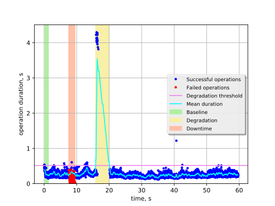
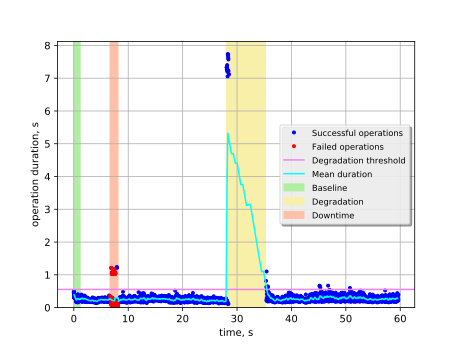
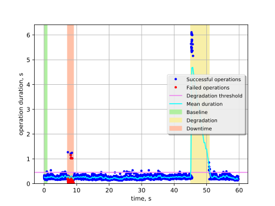
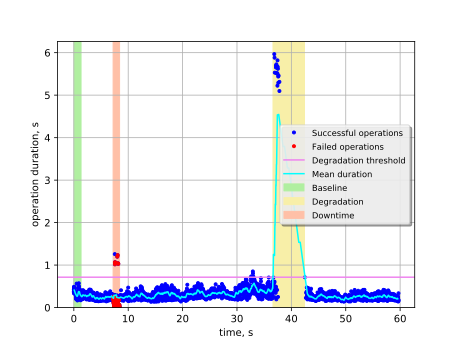
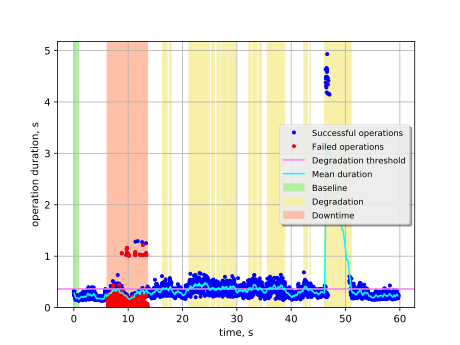

Keystone authentication with kill of Keystone on one node
=========================================================

This report is generated on results collected by execution of the following
Rally scenario:

.. code-block:: yaml

    ---
    
      Authenticate.keystone:
    
        -
          runner:
            type: "constant_for_duration"
            duration: 60
            concurrency: 20
          context:
            users:
              tenants: 1
              users_per_tenant: 1
          hooks:
            -
              name: fault_injection
              args:
                action: kill keystone service on one node
              trigger:
                name: event
                args:
                  unit: iteration
                  at: [100]
    
    

Summary
-------

+-----------------------+-----------+---------------------------------------+-------------------------------------------+
| Service downtime, s   | MTTR, s   | Absolute performance degradation, s   | Relative performance degradation, ratio   |
+=======================+===========+=======================================+===========================================+
| 2.8 ±1.1              | 8.3 ±2.4  | 3.10 ±0.23                            | 16.35 ±0.92                               |
+-----------------------+-----------+---------------------------------------+-------------------------------------------+

Metrics:
    * `Service downtime` is the time interval between the first and
      the last errors.
    * `MTTR` is the mean time to recover service performance after
      the fault.
    * `Absolute performance degradation` is an absolute difference between
      the mean of operation duration during recovery period and the baseline's.
    * `Relative performance degradation` is the ratio between the mean
      of operation duration during recovery period and the baseline's.

Details
-------

This section contains individual data for particular scenario runs.

Run #1
^^^^^^

Baseline
~~~~~~~~

Baseline samples are collected before the start of fault injection. They are
used to estimate service performance degradation after the fault.

+-----------+-------------+-----------+-----------+---------------------+
|   Samples |   Median, s |   Mean, s |   Std dev |   95% percentile, s |
+===========+=============+===========+===========+=====================+
|        75 |        0.25 |      0.26 |     0.064 |                 0.4 |
+-----------+-------------+-----------+-----------+---------------------+

Service downtime
~~~~~~~~~~~~~~~~

The tested service is not available during the following time period(s).

+-----+---------------+
|   # | Downtime, s   |
+=====+===============+
|   1 | 0.024 ±0.024  |
+-----+---------------+
|   2 | 1.830 ±0.010  |
+-----+---------------+

Service performance degradation
~~~~~~~~~~~~~~~~~~~~~~~~~~~~~~~

The tested service has measurable performance degradation during the
following time period(s).

+-----+----------------------+---------------------------+------------------------+
|   # | Time to recover, s   | Absolute degradation, s   | Relative degradation   |
+=====+======================+===========================+========================+
|   1 | 4.189 ±0.033         | 1.94 ±0.59                | 8.5 ±2.3               |
+-----+----------------------+---------------------------+------------------------+

Run #2
^^^^^^

Baseline
~~~~~~~~

Baseline samples are collected before the start of fault injection. They are
used to estimate service performance degradation after the fault.

+-----------+-------------+-----------+-----------+---------------------+
|   Samples |   Median, s |   Mean, s |   Std dev |   95% percentile, s |
+===========+=============+===========+===========+=====================+
|        75 |        0.26 |      0.27 |     0.071 |                0.41 |
+-----------+-------------+-----------+-----------+---------------------+

Service downtime
~~~~~~~~~~~~~~~~

The tested service is not available during the following time period(s).

+-----+----------------+
|   # | Downtime, s    |
+=====+================+
|   1 | 0.0015 ±0.0015 |
+-----+----------------+
|   2 | 1.3940 ±0.0024 |
+-----+----------------+

Service performance degradation
~~~~~~~~~~~~~~~~~~~~~~~~~~~~~~~

The tested service has measurable performance degradation during the
following time period(s).

+-----+----------------------+---------------------------+------------------------+
|   # | Time to recover, s   | Absolute degradation, s   | Relative degradation   |
+=====+======================+===========================+========================+
|   1 | 7.198 ±0.068         | 4.0 ±1.2                  | 15.7 ±4.4              |
+-----+----------------------+---------------------------+------------------------+

Run #3
^^^^^^

Baseline
~~~~~~~~

Baseline samples are collected before the start of fault injection. They are
used to estimate service performance degradation after the fault.

+-----------+-------------+-----------+-----------+---------------------+
|   Samples |   Median, s |   Mean, s |   Std dev |   95% percentile, s |
+===========+=============+===========+===========+=====================+
|        71 |        0.24 |      0.24 |     0.054 |                0.32 |
+-----------+-------------+-----------+-----------+---------------------+

Service downtime
~~~~~~~~~~~~~~~~

The tested service is not available during the following time period(s).

+-----+---------------+
|   # | Downtime, s   |
+=====+===============+
|   1 | 1.883 ±0.011  |
+-----+---------------+

Service performance degradation
~~~~~~~~~~~~~~~~~~~~~~~~~~~~~~~

The tested service has measurable performance degradation during the
following time period(s).

+-----+----------------------+---------------------------+------------------------+
|   # | Time to recover, s   | Absolute degradation, s   | Relative degradation   |
+=====+======================+===========================+========================+
|   1 | 5.762 ±0.047         | 2.46 ±0.79                | 11.2 ±3.2              |
+-----+----------------------+---------------------------+------------------------+

Run #4
^^^^^^

Baseline
~~~~~~~~

Baseline samples are collected before the start of fault injection. They are
used to estimate service performance degradation after the fault.

+-----------+-------------+-----------+-----------+---------------------+
|   Samples |   Median, s |   Mean, s |   Std dev |   95% percentile, s |
+===========+=============+===========+===========+=====================+
|        72 |        0.32 |      0.32 |     0.098 |                0.49 |
+-----------+-------------+-----------+-----------+---------------------+

Service downtime
~~~~~~~~~~~~~~~~

The tested service is not available during the following time period(s).

+-----+---------------+
|   # | Downtime, s   |
+=====+===============+
|   1 | 1.191 ±0.013  |
+-----+---------------+

Service performance degradation
~~~~~~~~~~~~~~~~~~~~~~~~~~~~~~~

The tested service has measurable performance degradation during the
following time period(s).

+-----+----------------------+---------------------------+------------------------+
|   # | Time to recover, s   | Absolute degradation, s   | Relative degradation   |
+=====+======================+===========================+========================+
|   1 | 5.796 ±0.042         | 2.61 ±0.80                | 9.0 ±2.5               |
+-----+----------------------+---------------------------+------------------------+

Run #5
^^^^^^

Baseline
~~~~~~~~

Baseline samples are collected before the start of fault injection. They are
used to estimate service performance degradation after the fault.

+-----------+-------------+-----------+-----------+---------------------+
|   Samples |   Median, s |   Mean, s |   Std dev |   95% percentile, s |
+===========+=============+===========+===========+=====================+
|        76 |        0.19 |       0.2 |     0.041 |                0.29 |
+-----------+-------------+-----------+-----------+---------------------+

Service downtime
~~~~~~~~~~~~~~~~

The tested service is not available during the following time period(s).

+-----+---------------+
|   # | Downtime, s   |
+=====+===============+
|   1 | 7.468 ±0.017  |
+-----+---------------+

Service performance degradation
~~~~~~~~~~~~~~~~~~~~~~~~~~~~~~~

The tested service has measurable performance degradation during the
following time period(s).

+-----+----------------------+---------------------------+------------------------+
|   # | Time to recover, s   | Absolute degradation, s   | Relative degradation   |
+=====+======================+===========================+========================+
|   1 | 0.8176 ±0.0016       | 0.176 ±0.024              | 1.88 ±0.12             |
+-----+----------------------+---------------------------+------------------------+
|   2 | 0.3703 ±0.0011       | 0.199 ±0.047              | 2.00 ±0.24             |
+-----+----------------------+---------------------------+------------------------+
|   3 | 3.7349 ±0.0019       | 0.228 ±0.018              | 2.145 ±0.090           |
+-----+----------------------+---------------------------+------------------------+
|   4 | 0.5604 ±0.0019       | 0.178 ±0.033              | 1.89 ±0.17             |
+-----+----------------------+---------------------------+------------------------+
|   5 | 0.5767 ±0.0012       | 0.175 ±0.026              | 1.88 ±0.13             |
+-----+----------------------+---------------------------+------------------------+
|   6 | 1.1616 ±0.0019       | 0.192 ±0.025              | 1.96 ±0.12             |
+-----+----------------------+---------------------------+------------------------+
|   7 | 1.1645 ±0.0019       | 0.200 ±0.024              | 2.01 ±0.12             |
+-----+----------------------+---------------------------+------------------------+
|   8 | 0.3467 ±0.0016       | 0.179 ±0.045              | 1.90 ±0.23             |
+-----+----------------------+---------------------------+------------------------+
|   9 | 0.8827 ±0.0014       | 0.218 ±0.033              | 2.09 ±0.16             |
+-----+----------------------+---------------------------+------------------------+
|  10 | 0.4818 ±0.0018       | 0.175 ±0.036              | 1.88 ±0.18             |
+-----+----------------------+---------------------------+------------------------+
|  11 | 2.9380 ±0.0013       | 0.193 ±0.018              | 1.967 ±0.091           |
+-----+----------------------+---------------------------+------------------------+
|  12 | 0.1112 ±0.0027       | 0.169 ±0.034              | 1.85 ±0.17             |
+-----+----------------------+---------------------------+------------------------+
|  13 | 0.6466 ±0.0015       | 0.205 ±0.032              | 2.03 ±0.16             |
+-----+----------------------+---------------------------+------------------------+
|  14 | 0.1132 ±0.0015       | 0.144 ±0.028              | 1.72 ±0.14             |
+-----+----------------------+---------------------------+------------------------+
|  15 | 4.886 ±0.039         | 1.82 ±0.57                | 10.1 ±2.9              |
+-----+----------------------+---------------------------+------------------------+

