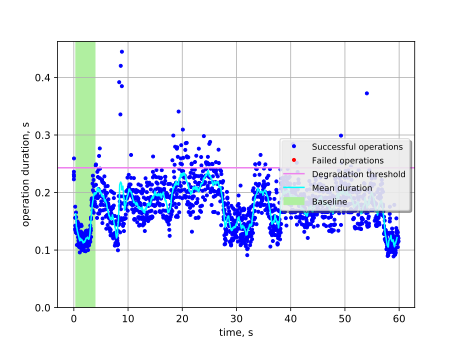

Keystone authentication with kill of MySQL on one node
======================================================

This report is generated on results collected by execution of the following
Rally scenario:

.. code-block:: yaml

    ---
      Authenticate.keystone:
        -
          runner:
            type: "constant_for_duration"
            duration: 60
            concurrency: 5
          context:
            users:
              tenants: 1
              users_per_tenant: 1
          hooks:
            -
              name: fault_injection
              args:
                action: kill mysql service on one node
              trigger:
                name: event
                args:
                  unit: iteration
                  at: [150]
    

Summary
-------

No errors nor performance degradation observed.

Details
-------

This section contains individual data for particular scenario runs.

Run #1
^^^^^^

Baseline
~~~~~~~~

Baseline samples are collected before the start of fault injection. They are
used to estimate service performance degradation after the fault.

+-----------+-------------+-----------+-----------+---------------------+
|   Samples |   Median, s |   Mean, s |   Std dev |   95% percentile, s |
+===========+=============+===========+===========+=====================+
|       134 |        0.12 |      0.13 |     0.028 |                0.19 |
+-----------+-------------+-----------+-----------+---------------------+

