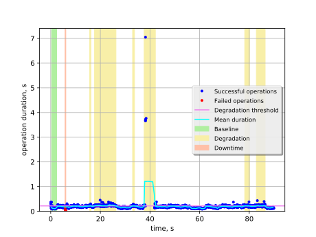
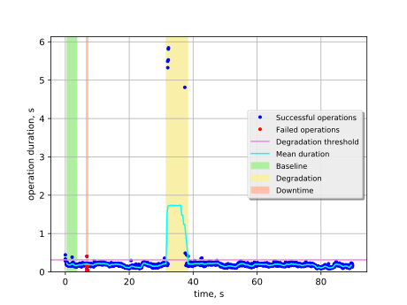
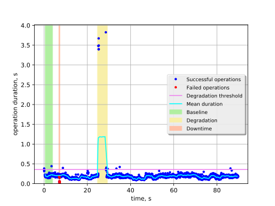
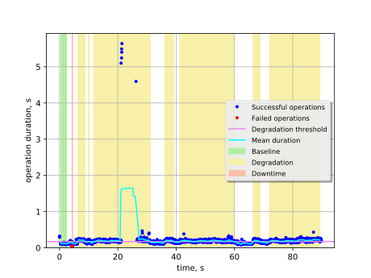
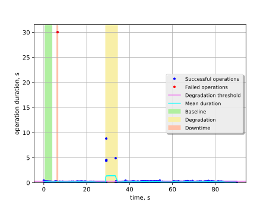

Keystone authentication with Keystone API restart on one node
=============================================================

This report is generated on results collected by execution of the following
Rally scenario:

.. code-block:: yaml

    ---
    
      Authenticate.keystone:
    
        -
          runner:
            type: "constant_for_duration"
            duration: 90
            concurrency: 5
          context:
            users:
              tenants: 1
              users_per_tenant: 1
          hooks:
            -
              name: fault_injection
              args:
                action: restart keystone service on one node
              trigger:
                name: event
                args:
                  unit: iteration
                  at: [100]
    
    

Summary
-------

+-----------------------+-----------+---------------------------------------+-------------------------------------------+
| Service downtime, s   | MTTR, s   | Absolute performance degradation, s   | Relative performance degradation, ratio   |
+=======================+===========+=======================================+===========================================+
| 0.39 ±0.19            | 20 ±10    | 1.11 ±0.20                            | 10.8 ±1.2                                 |
+-----------------------+-----------+---------------------------------------+-------------------------------------------+

Metrics:
    * `Service downtime` is the time interval between the first and
      the last errors.
    * `MTTR` is the mean time to recover service performance after
      the fault.
    * `Absolute performance degradation` is an absolute difference between
      the mean of operation duration during recovery period and the baseline's.
    * `Relative performance degradation` is the ratio between the mean
      of operation duration during recovery period and the baseline's.

Details
-------

This section contains individual data for particular scenario runs.

Run #1
^^^^^^

Baseline
~~~~~~~~

Baseline samples are collected before the start of fault injection. They are
used to estimate service performance degradation after the fault.

+-----------+-------------+-----------+-----------+---------------------+
|   Samples |   Median, s |   Mean, s |   Std dev |   95% percentile, s |
+===========+=============+===========+===========+=====================+
|        84 |        0.11 |      0.12 |     0.025 |                0.18 |
+-----------+-------------+-----------+-----------+---------------------+

Service downtime
~~~~~~~~~~~~~~~~

The tested service is not available during the following time period(s).

+-----+---------------+
|   # | Downtime, s   |
+=====+===============+
|   1 | 0.317 ±0.013  |
+-----+---------------+

Service performance degradation
~~~~~~~~~~~~~~~~~~~~~~~~~~~~~~~

The tested service has measurable performance degradation during the
following time period(s).

+-----+----------------------+---------------------------+------------------------+
|   # | Time to recover, s   | Absolute degradation, s   | Relative degradation   |
+=====+======================+===========================+========================+
|   1 | 0.4993 ±0.0026       | 0.108 ±0.018              | 1.91 ±0.15             |
+-----+----------------------+---------------------------+------------------------+
|   2 | 8.6845 ±0.0018       | 0.1185 ±0.0074            | 2.002 ±0.062           |
+-----+----------------------+---------------------------+------------------------+
|   3 | 0.7606 ±0.0015       | 0.104 ±0.016              | 1.88 ±0.14             |
+-----+----------------------+---------------------------+------------------------+
|   4 | 4.529 ±0.065         | 1.05 ±0.78                | 9.9 ±6.6               |
+-----+----------------------+---------------------------+------------------------+
|   5 | 1.9502 ±0.0014       | 0.106 ±0.012              | 1.895 ±0.099           |
+-----+----------------------+---------------------------+------------------------+
|   6 | 3.5471 ±0.0018       | 0.108 ±0.011              | 1.913 ±0.091           |
+-----+----------------------+---------------------------+------------------------+

Run #2
^^^^^^

Baseline
~~~~~~~~

Baseline samples are collected before the start of fault injection. They are
used to estimate service performance degradation after the fault.

+-----------+-------------+-----------+-----------+---------------------+
|   Samples |   Median, s |   Mean, s |   Std dev |   95% percentile, s |
+===========+=============+===========+===========+=====================+
|        85 |        0.18 |      0.18 |     0.033 |                0.22 |
+-----------+-------------+-----------+-----------+---------------------+

Service downtime
~~~~~~~~~~~~~~~~

The tested service is not available during the following time period(s).

+-----+---------------+
|   # | Downtime, s   |
+=====+===============+
|   1 | 0.466 ±0.046  |
+-----+---------------+

Service performance degradation
~~~~~~~~~~~~~~~~~~~~~~~~~~~~~~~

The tested service has measurable performance degradation during the
following time period(s).

+-----+----------------------+---------------------------+------------------------+
|   # | Time to recover, s   | Absolute degradation, s   | Relative degradation   |
+=====+======================+===========================+========================+
|   1 | 6.76 ±0.10           | 1.30 ±0.89                | 8.1 ±4.8               |
+-----+----------------------+---------------------------+------------------------+

Run #3
^^^^^^

Baseline
~~~~~~~~

Baseline samples are collected before the start of fault injection. They are
used to estimate service performance degradation after the fault.

+-----------+-------------+-----------+-----------+---------------------+
|   Samples |   Median, s |   Mean, s |   Std dev |   95% percentile, s |
+===========+=============+===========+===========+=====================+
|        84 |        0.19 |       0.2 |      0.04 |                0.25 |
+-----------+-------------+-----------+-----------+---------------------+

Service downtime
~~~~~~~~~~~~~~~~

The tested service is not available during the following time period(s).

+-----+---------------+
|   # | Downtime, s   |
+=====+===============+
|   1 | 0.388 ±0.030  |
+-----+---------------+

Service performance degradation
~~~~~~~~~~~~~~~~~~~~~~~~~~~~~~~

The tested service has measurable performance degradation during the
following time period(s).

+-----+----------------------+---------------------------+------------------------+
|   # | Time to recover, s   | Absolute degradation, s   | Relative degradation   |
+=====+======================+===========================+========================+
|   1 | 4.534 ±0.067         | 0.83 ±0.56                | 5.2 ±2.8               |
+-----+----------------------+---------------------------+------------------------+

Run #4
^^^^^^

Baseline
~~~~~~~~

Baseline samples are collected before the start of fault injection. They are
used to estimate service performance degradation after the fault.

+-----------+-------------+-----------+-----------+---------------------+
|   Samples |   Median, s |   Mean, s |   Std dev |   95% percentile, s |
+===========+=============+===========+===========+=====================+
|        85 |        0.11 |      0.12 |     0.014 |                0.15 |
+-----------+-------------+-----------+-----------+---------------------+

Service downtime
~~~~~~~~~~~~~~~~

The tested service is not available during the following time period(s).

+-----+---------------+
|   # | Downtime, s   |
+=====+===============+
|   1 | 0.236 ±0.018  |
+-----+---------------+

Service performance degradation
~~~~~~~~~~~~~~~~~~~~~~~~~~~~~~~

The tested service has measurable performance degradation during the
following time period(s).

+-----+----------------------+---------------------------+------------------------+
|   # | Time to recover, s   | Absolute degradation, s   | Relative degradation   |
+=====+======================+===========================+========================+
|   1 | 2.5420 ±0.0023       | 0.0977 ±0.0069            | 1.847 ±0.060           |
+-----+----------------------+---------------------------+------------------------+
|   2 | 0.3927 ±0.0018       | 0.055 ±0.015              | 1.47 ±0.13             |
+-----+----------------------+---------------------------+------------------------+
|   3 | 19.428 ±0.010        | 0.179 ±0.075              | 2.55 ±0.65             |
+-----+----------------------+---------------------------+------------------------+
|   4 | 3.1419 ±0.0024       | 0.0870 ±0.0070            | 1.754 ±0.061           |
+-----+----------------------+---------------------------+------------------------+
|   5 | 18.6237 ±0.0018      | 0.0767 ±0.0039            | 1.665 ±0.034           |
+-----+----------------------+---------------------------+------------------------+
|   6 | 2.3729 ±0.0018       | 0.0823 ±0.0074            | 1.714 ±0.064           |
+-----+----------------------+---------------------------+------------------------+
|   7 | 4.0139 ±0.0014       | 0.0776 ±0.0055            | 1.672 ±0.048           |
+-----+----------------------+---------------------------+------------------------+
|   8 | 12.9462 ±0.0019      | 0.0893 ±0.0048            | 1.774 ±0.042           |
+-----+----------------------+---------------------------+------------------------+

Run #5
^^^^^^

Baseline
~~~~~~~~

Baseline samples are collected before the start of fault injection. They are
used to estimate service performance degradation after the fault.

+-----------+-------------+-----------+-----------+---------------------+
|   Samples |   Median, s |   Mean, s |   Std dev |   95% percentile, s |
+===========+=============+===========+===========+=====================+
|        84 |        0.19 |      0.19 |     0.028 |                0.24 |
+-----------+-------------+-----------+-----------+---------------------+

Service downtime
~~~~~~~~~~~~~~~~

The tested service is not available during the following time period(s).

+-----+---------------+
|   # | Downtime, s   |
+=====+===============+
|   1 | 0.543 ±0.053  |
+-----+---------------+

Service performance degradation
~~~~~~~~~~~~~~~~~~~~~~~~~~~~~~~

The tested service has measurable performance degradation during the
following time period(s).

+-----+----------------------+---------------------------+------------------------+
|   # | Time to recover, s   | Absolute degradation, s   | Relative degradation   |
+=====+======================+===========================+========================+
|   1 | 5.570 ±0.093         | 1.05 ±0.92                | 6.6 ±4.9               |
+-----+----------------------+---------------------------+------------------------+

