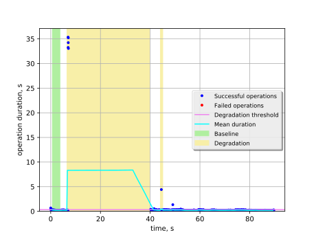
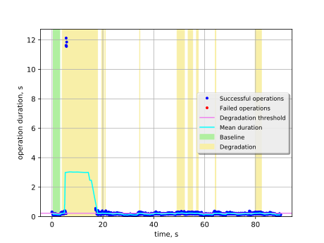
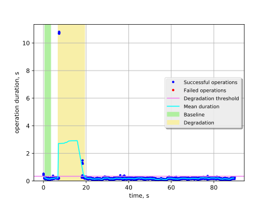

Keystone authentication with memcached restart on one node
==========================================================

This report is generated on results collected by execution of the following
Rally scenario:

.. code-block:: yaml

    ---
    
      Authenticate.keystone:
    
        -
          runner:
            type: "constant_for_duration"
            duration: 90
            concurrency: 5
          context:
            users:
              tenants: 1
              users_per_tenant: 1
          hooks:
            -
              name: fault_injection
              args:
                action: restart memcached service on one node
              trigger:
                name: event
                args:
                  unit: iteration
                  at: [100]
    
    

Summary
-------

+-----------------------+-----------+---------------------------------------+-------------------------------------------+
| Service downtime, s   | MTTR, s   | Absolute performance degradation, s   | Relative performance degradation, ratio   |
+=======================+===========+=======================================+===========================================+
| N/A                   | 19.2 ±3.9 | 4.6 ±1.2                              | 28.8 ±6.8                                 |
+-----------------------+-----------+---------------------------------------+-------------------------------------------+

Metrics:
    * `Service downtime` is the time interval between the first and
      the last errors.
    * `MTTR` is the mean time to recover service performance after
      the fault.
    * `Absolute performance degradation` is an absolute difference between
      the mean of operation duration during recovery period and the baseline's.
    * `Relative performance degradation` is the ratio between the mean
      of operation duration during recovery period and the baseline's.

Details
-------

This section contains individual data for particular scenario runs.

Run #1
^^^^^^

Baseline
~~~~~~~~

Baseline samples are collected before the start of fault injection. They are
used to estimate service performance degradation after the fault.

+-----------+-------------+-----------+-----------+---------------------+
|   Samples |   Median, s |   Mean, s |   Std dev |   95% percentile, s |
+===========+=============+===========+===========+=====================+
|        85 |        0.17 |      0.17 |     0.042 |                0.25 |
+-----------+-------------+-----------+-----------+---------------------+

Service performance degradation
~~~~~~~~~~~~~~~~~~~~~~~~~~~~~~~

The tested service has measurable performance degradation during the
following time period(s).

+-----+----------------------+---------------------------+------------------------+
|   # | Time to recover, s   | Absolute degradation, s   | Relative degradation   |
+=====+======================+===========================+========================+
|   1 | 33.18 ±0.63          | 11.4 ±8.2                 | 66 ±47                 |
+-----+----------------------+---------------------------+------------------------+
|   2 | 0.9594 ±0.0032       | 0.26 ±0.43                | 2.5 ±2.4               |
+-----+----------------------+---------------------------+------------------------+

Run #2
^^^^^^

Baseline
~~~~~~~~

Baseline samples are collected before the start of fault injection. They are
used to estimate service performance degradation after the fault.

+-----------+-------------+-----------+-----------+---------------------+
|   Samples |   Median, s |   Mean, s |   Std dev |   95% percentile, s |
+===========+=============+===========+===========+=====================+
|        85 |        0.19 |       0.2 |     0.043 |                0.25 |
+-----------+-------------+-----------+-----------+---------------------+

Service performance degradation
~~~~~~~~~~~~~~~~~~~~~~~~~~~~~~~

The tested service has measurable performance degradation during the
following time period(s).

+-----+----------------------+---------------------------+------------------------+
|   # | Time to recover, s   | Absolute degradation, s   | Relative degradation   |
+=====+======================+===========================+========================+
|   1 | 13.51 ±0.23          | 3.4 ±2.5                  | 18 ±12                 |
+-----+----------------------+---------------------------+------------------------+

Run #3
^^^^^^

.. image:: plot_3.svg

Baseline
~~~~~~~~

Baseline samples are collected before the start of fault injection. They are
used to estimate service performance degradation after the fault.

+-----------+-------------+-----------+-----------+---------------------+
|   Samples |   Median, s |   Mean, s |   Std dev |   95% percentile, s |
+===========+=============+===========+===========+=====================+
|        84 |        0.18 |      0.18 |     0.032 |                0.23 |
+-----------+-------------+-----------+-----------+---------------------+

Service performance degradation
~~~~~~~~~~~~~~~~~~~~~~~~~~~~~~~

The tested service has measurable performance degradation during the
following time period(s).

+-----+----------------------+---------------------------+------------------------+
|   # | Time to recover, s   | Absolute degradation, s   | Relative degradation   |
+=====+======================+===========================+========================+
|   1 | 12.35 ±0.22          | 3.8 ±2.8                  | 22 ±15                 |
+-----+----------------------+---------------------------+------------------------+

Run #4
^^^^^^

Baseline
~~~~~~~~

Baseline samples are collected before the start of fault injection. They are
used to estimate service performance degradation after the fault.

+-----------+-------------+-----------+-----------+---------------------+
|   Samples |   Median, s |   Mean, s |   Std dev |   95% percentile, s |
+===========+=============+===========+===========+=====================+
|        85 |        0.15 |      0.15 |      0.02 |                0.19 |
+-----------+-------------+-----------+-----------+---------------------+

Service performance degradation
~~~~~~~~~~~~~~~~~~~~~~~~~~~~~~~

The tested service has measurable performance degradation during the
following time period(s).

+-----+----------------------+---------------------------+------------------------+
|   # | Time to recover, s   | Absolute degradation, s   | Relative degradation   |
+=====+======================+===========================+========================+
|   1 | 13.97 ±0.12          | 1.3 ±1.0                  | 9.7 ±6.7               |
+-----+----------------------+---------------------------+------------------------+
|   2 | 0.7793 ±0.0024       | 0.103 ±0.028              | 1.67 ±0.18             |
+-----+----------------------+---------------------------+------------------------+
|   3 | 0.1890 ±0.0016       | 0.090 ±0.032              | 1.59 ±0.21             |
+-----+----------------------+---------------------------+------------------------+
|   4 | 0.1364 ±0.0016       | 0.056 ±0.070              | 1.36 ±0.46             |
+-----+----------------------+---------------------------+------------------------+
|   5 | 2.9459 ±0.0021       | 0.088 ±0.012              | 1.574 ±0.080           |
+-----+----------------------+---------------------------+------------------------+
|   6 | 1.8468 ±0.0014       | 0.087 ±0.014              | 1.568 ±0.091           |
+-----+----------------------+---------------------------+------------------------+
|   7 | 0.7156 ±0.0015       | 0.087 ±0.025              | 1.57 ±0.16             |
+-----+----------------------+---------------------------+------------------------+
|   8 | 0.2876 ±0.0020       | 0.066 ±0.029              | 1.43 ±0.19             |
+-----+----------------------+---------------------------+------------------------+
|   9 | 2.4745 ±0.0021       | 0.086 ±0.012              | 1.564 ±0.081           |
+-----+----------------------+---------------------------+------------------------+

Run #5
^^^^^^

Baseline
~~~~~~~~

Baseline samples are collected before the start of fault injection. They are
used to estimate service performance degradation after the fault.

+-----------+-------------+-----------+-----------+---------------------+
|   Samples |   Median, s |   Mean, s |   Std dev |   95% percentile, s |
+===========+=============+===========+===========+=====================+
|        84 |        0.16 |      0.16 |     0.044 |                0.24 |
+-----------+-------------+-----------+-----------+---------------------+

Service performance degradation
~~~~~~~~~~~~~~~~~~~~~~~~~~~~~~~

The tested service has measurable performance degradation during the
following time period(s).

+-----+----------------------+---------------------------+------------------------+
|   # | Time to recover, s   | Absolute degradation, s   | Relative degradation   |
+=====+======================+===========================+========================+
|   1 | 12.55 ±0.16          | 1.9 ±1.4                  | 12.8 ±8.5              |
+-----+----------------------+---------------------------+------------------------+

