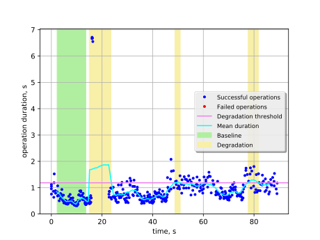
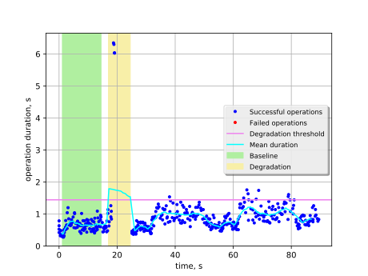
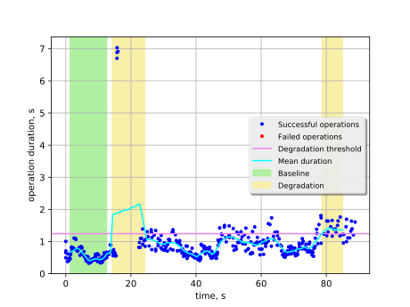

Create and list networks with kill of one of MySQL servers
==========================================================

This report is generated on results collected by execution of the following
Rally scenario:

.. code-block:: yaml

    ---
    
      NeutronNetworks.create_and_list_networks:
    
        -
          args:
            network_create_args: {}
          runner:
            type: "constant_for_duration"
            duration: 90
            concurrency: 4
          context:
            users:
              tenants: 1
              users_per_tenant: 1
            quotas:
              neutron:
                network: -1
          hooks:
            -
              name: fault_injection
              args:
                action: kill mysql service on one node
              trigger:
                name: event
                args:
                  unit: iteration
                  at: [100]
    
    

Summary
-------

+-----------------------+-----------+---------------------------------------+-------------------------------------------+
| Service downtime, s   | MTTR, s   | Absolute performance degradation, s   | Relative performance degradation, ratio   |
+=======================+===========+=======================================+===========================================+
| N/A                   | 13.0 ±2.3 | 2.50 ±0.72                            | 6.4 ±1.3                                  |
+-----------------------+-----------+---------------------------------------+-------------------------------------------+

Metrics:
    * `Service downtime` is the time interval between the first and
      the last errors.
    * `MTTR` is the mean time to recover service performance after
      the fault.
    * `Absolute performance degradation` is an absolute difference between
      the mean of operation duration during recovery period and the baseline's.
    * `Relative performance degradation` is the ratio between the mean
      of operation duration during recovery period and the baseline's.

Details
-------

This section contains individual data for particular scenario runs.

Run #1
^^^^^^

Baseline
~~~~~~~~

Baseline samples are collected before the start of fault injection. They are
used to estimate service performance degradation after the fault.

+-----------+-------------+-----------+-----------+---------------------+
|   Samples |   Median, s |   Mean, s |   Std dev |   95% percentile, s |
+===========+=============+===========+===========+=====================+
|        85 |        0.49 |      0.53 |      0.16 |                0.84 |
+-----------+-------------+-----------+-----------+---------------------+

Service performance degradation
~~~~~~~~~~~~~~~~~~~~~~~~~~~~~~~

The tested service has measurable performance degradation during the
following time period(s).

+-----+----------------------+---------------------------+------------------------+
|   # | Time to recover, s   | Absolute degradation, s   | Relative degradation   |
+=====+======================+===========================+========================+
|   1 | 8.59 ±0.13           | 1.4 ±1.2                  | 3.7 ±2.2               |
+-----+----------------------+---------------------------+------------------------+
|   2 | 2.106 ±0.010         | 0.61 ±0.12                | 2.15 ±0.22             |
+-----+----------------------+---------------------------+------------------------+
|   3 | 4.077 ±0.018         | 0.72 ±0.21                | 2.37 ±0.40             |
+-----+----------------------+---------------------------+------------------------+

Run #2
^^^^^^

Baseline
~~~~~~~~

Baseline samples are collected before the start of fault injection. They are
used to estimate service performance degradation after the fault.

+-----------+-------------+-----------+-----------+---------------------+
|   Samples |   Median, s |   Mean, s |   Std dev |   95% percentile, s |
+===========+=============+===========+===========+=====================+
|        85 |        0.64 |      0.64 |       0.2 |                   1 |
+-----------+-------------+-----------+-----------+---------------------+

Service performance degradation
~~~~~~~~~~~~~~~~~~~~~~~~~~~~~~~

The tested service has measurable performance degradation during the
following time period(s).

+-----+----------------------+---------------------------+------------------------+
|   # | Time to recover, s   | Absolute degradation, s   | Relative degradation   |
+=====+======================+===========================+========================+
|   1 | 7.55 ±0.12           | 2.4 ±1.6                  | 4.7 ±2.5               |
+-----+----------------------+---------------------------+------------------------+

Run #3
^^^^^^

Baseline
~~~~~~~~

Baseline samples are collected before the start of fault injection. They are
used to estimate service performance degradation after the fault.

+-----------+-------------+-----------+-----------+---------------------+
|   Samples |   Median, s |   Mean, s |   Std dev |   95% percentile, s |
+===========+=============+===========+===========+=====================+
|        85 |        0.47 |      0.54 |      0.18 |                0.83 |
+-----------+-------------+-----------+-----------+---------------------+

Service performance degradation
~~~~~~~~~~~~~~~~~~~~~~~~~~~~~~~

The tested service has measurable performance degradation during the
following time period(s).

+-----+----------------------+---------------------------+------------------------+
|   # | Time to recover, s   | Absolute degradation, s   | Relative degradation   |
+=====+======================+===========================+========================+
|   1 | 10.11 ±0.13          | 1.5 ±1.1                  | 3.8 ±2.0               |
+-----+----------------------+---------------------------+------------------------+
|   2 | 6.447 ±0.015         | 0.87 ±0.10                | 2.60 ±0.19             |
+-----+----------------------+---------------------------+------------------------+

