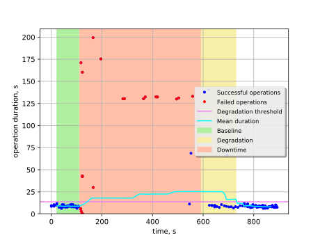

Boot and delete VM with reboot of one of controllers
====================================================

This report is generated on results collected by execution of the following
Rally scenario:

.. code-block:: yaml

    ---
      NovaServers.boot_and_delete_server:
        -
          args:
            flavor:
                name: "m1.tiny"
            image:
                name: "(^cirros.*uec$|TestVM|^cirros)"
            force_delete: false
          runner:
            type: "constant_for_duration"
            duration: 900
            concurrency: 4
          context:
            users:
              tenants: 200
              users_per_tenant: 1
          hooks:
            -
              name: fault_injection
              args:
                action: reboot one node with rabbitmq service
              trigger:
                name: event
                args:
                  unit: iteration
                  at: [50]
    

Summary
-------

+-----------------------+------------+---------------------------------------+-------------------------------------------+
| Service downtime, s   | MTTR, s    | Absolute performance degradation, s   | Relative performance degradation, ratio   |
+=======================+============+=======================================+===========================================+
| 477.8 ±5.9            | 570.3 ±2.8 | 18 ±17                                | 3.1 ±2.0                                  |
+-----------------------+------------+---------------------------------------+-------------------------------------------+

Metrics:
    * `Service downtime` is the time interval between the first and
      the last errors.
    * `MTTR` is the mean time to recover service performance after
      the fault.
    * `Absolute performance degradation` is an absolute difference between
      the mean of operation duration during recovery period and the baseline's.
    * `Relative performance degradation` is the ratio between the mean
      of operation duration during recovery period and the baseline's.

Details
-------

This section contains individual data for particular scenario runs.

Run #1
^^^^^^

Baseline
~~~~~~~~

Baseline samples are collected before the start of fault injection. They are
used to estimate service performance degradation after the fault.

+-----------+-------------+-----------+-----------+---------------------+
|   Samples |   Median, s |   Mean, s |   Std dev |   95% percentile, s |
+===========+=============+===========+===========+=====================+
|        36 |         8.6 |       8.8 |       1.2 |                  11 |
+-----------+-------------+-----------+-----------+---------------------+

Service downtime
~~~~~~~~~~~~~~~~

The tested service is not available during the following time period(s).

+-----+---------------+
|   # | Downtime, s   |
+=====+===============+
|   1 | 478 ±35       |
+-----+---------------+

Service performance degradation
~~~~~~~~~~~~~~~~~~~~~~~~~~~~~~~

The tested service has measurable performance degradation during the
following time period(s).

+-----+----------------------+---------------------------+------------------------+
|   # | Time to recover, s   | Absolute degradation, s   | Relative degradation   |
+=====+======================+===========================+========================+
|   1 | 570.3 ±7.6           | 18 ±17                    | 3.1 ±2.0               |
+-----+----------------------+---------------------------+------------------------+

