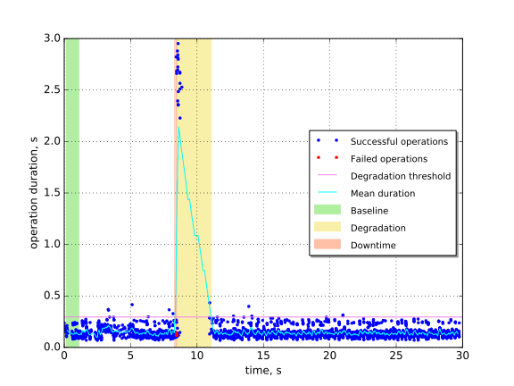
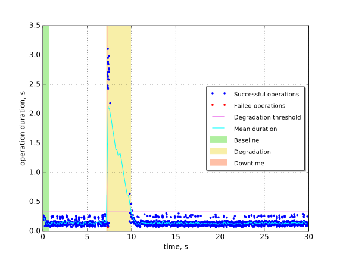
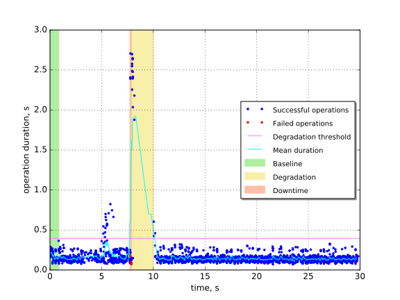
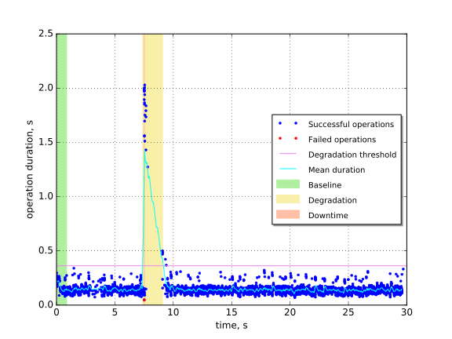
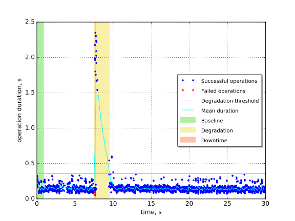

Keystone authentication with kill of Keystone on one node
=========================================================

This report is generated on results collected by execution of the following
Rally scenario:

.. code-block:: yaml

    ---
    
      Authenticate.keystone:
    
        -
          runner:
            type: "constant_for_duration"
            duration: 30
            concurrency: 20
          context:
            users:
              tenants: 1
              users_per_tenant: 1
          hooks:
            -
              name: fault_injection
              args:
                action: kill keystone service on one node
              trigger:
                name: event
                args:
                  unit: iteration
                  at: [100]
    
    

Summary
-------

In Fuel architecture Keystone is deployed behind Apache2, which in turn are
behind NGINX front-end. In this scenario we kill Keystone processes running
on one of controller nodes.

+-----------------------+------------+---------------------------------------+-------------------------------------------+
| Service downtime, s   | MTTR, s    | Absolute performance degradation, s   | Relative performance degradation, ratio   |
+=======================+============+=======================================+===========================================+
| 0.038 ±0.081          | 2.28 ±0.23 | 1.21 ±0.35                            | 9.1 ±2.3                                  |
+-----------------------+------------+---------------------------------------+-------------------------------------------+

Metrics:
    * `Service downtime` is the time interval between the first and
      the last errors.
    * `MTTR` is the mean time to recover service performance after
      the fault.
    * `Absolute performance degradation` is an absolute difference between
      the mean of operation duration during recovery period and the baseline's.
    * `Relative performance degradation` is the ratio between the mean
      of operation duration during recovery period and the baseline's.

Details
-------

This section contains individual data for particular scenario runs.

Run #1
^^^^^^

Baseline
~~~~~~~~

Baseline samples are collected before the start of fault injection. They are
used to estimate service performance degradation after the fault.

+-----------+-------------+-----------+-----------+---------------------+
|   Samples |   Median, s |   Mean, s |   Std dev |   95% percentile, s |
+===========+=============+===========+===========+=====================+
|        78 |        0.12 |      0.13 |     0.041 |                0.23 |
+-----------+-------------+-----------+-----------+---------------------+

Service downtime
~~~~~~~~~~~~~~~~

The tested service is not available during the following time period(s).

+-----+----------------+
|   # | Downtime, s    |
+=====+================+
|   1 | 0.0034 ±0.0034 |
+-----+----------------+
|   2 | 0.0282 ±0.0014 |
+-----+----------------+

Service performance degradation
~~~~~~~~~~~~~~~~~~~~~~~~~~~~~~~

The tested service has measurable performance degradation during the
following time period(s).

+-----+----------------------+---------------------------+------------------------+
|   # | Time to recover, s   | Absolute degradation, s   | Relative degradation   |
+=====+======================+===========================+========================+
|   1 | 2.711 ±0.023         | 1.30 ±0.39                | 10.8 ±3.0              |
+-----+----------------------+---------------------------+------------------------+

Run #2
^^^^^^

Baseline
~~~~~~~~

Baseline samples are collected before the start of fault injection. They are
used to estimate service performance degradation after the fault.

+-----------+-------------+-----------+-----------+---------------------+
|   Samples |   Median, s |   Mean, s |   Std dev |   95% percentile, s |
+===========+=============+===========+===========+=====================+
|        70 |        0.14 |      0.15 |     0.048 |                0.24 |
+-----------+-------------+-----------+-----------+---------------------+

Service downtime
~~~~~~~~~~~~~~~~

The tested service is not available during the following time period(s).

+-----+----------------+
|   # | Downtime, s    |
+=====+================+
|   1 | 0.0047 ±0.0047 |
+-----+----------------+

Service performance degradation
~~~~~~~~~~~~~~~~~~~~~~~~~~~~~~~

The tested service has measurable performance degradation during the
following time period(s).

+-----+----------------------+---------------------------+------------------------+
|   # | Time to recover, s   | Absolute degradation, s   | Relative degradation   |
+=====+======================+===========================+========================+
|   1 | 2.722 ±0.026         | 1.66 ±0.43                | 11.9 ±2.9              |
+-----+----------------------+---------------------------+------------------------+

Run #3
^^^^^^

Baseline
~~~~~~~~

Baseline samples are collected before the start of fault injection. They are
used to estimate service performance degradation after the fault.

+-----------+-------------+-----------+-----------+---------------------+
|   Samples |   Median, s |   Mean, s |   Std dev |   95% percentile, s |
+===========+=============+===========+===========+=====================+
|        84 |        0.15 |      0.16 |     0.058 |                0.27 |
+-----------+-------------+-----------+-----------+---------------------+

Service downtime
~~~~~~~~~~~~~~~~

The tested service is not available during the following time period(s).

+-----+----------------+
|   # | Downtime, s    |
+=====+================+
|   1 | 0.1147 ±0.0067 |
+-----+----------------+

Service performance degradation
~~~~~~~~~~~~~~~~~~~~~~~~~~~~~~~

The tested service has measurable performance degradation during the
following time period(s).

+-----+----------------------+---------------------------+------------------------+
|   # | Time to recover, s   | Absolute degradation, s   | Relative degradation   |
+=====+======================+===========================+========================+
|   1 | 2.317 ±0.019         | 1.07 ±0.35                | 7.5 ±2.1               |
+-----+----------------------+---------------------------+------------------------+

Run #4
^^^^^^

Baseline
~~~~~~~~

Baseline samples are collected before the start of fault injection. They are
used to estimate service performance degradation after the fault.

+-----------+-------------+-----------+-----------+---------------------+
|   Samples |   Median, s |   Mean, s |   Std dev |   95% percentile, s |
+===========+=============+===========+===========+=====================+
|        87 |        0.14 |      0.16 |     0.051 |                0.25 |
+-----------+-------------+-----------+-----------+---------------------+

Service downtime
~~~~~~~~~~~~~~~~

The tested service is not available during the following time period(s).

+-----+----------------+
|   # | Downtime, s    |
+=====+================+
|   1 | 0.0057 ±0.0057 |
+-----+----------------+

Service performance degradation
~~~~~~~~~~~~~~~~~~~~~~~~~~~~~~~

The tested service has measurable performance degradation during the
following time period(s).

+-----+----------------------+---------------------------+------------------------+
|   # | Time to recover, s   | Absolute degradation, s   | Relative degradation   |
+=====+======================+===========================+========================+
|   1 | 1.695 ±0.015         | 1.11 ±0.29                | 8.0 ±1.8               |
+-----+----------------------+---------------------------+------------------------+

Run #5
^^^^^^

Baseline
~~~~~~~~

Baseline samples are collected before the start of fault injection. They are
used to estimate service performance degradation after the fault.

+-----------+-------------+-----------+-----------+---------------------+
|   Samples |   Median, s |   Mean, s |   Std dev |   95% percentile, s |
+===========+=============+===========+===========+=====================+
|        87 |        0.14 |      0.15 |     0.051 |                0.26 |
+-----------+-------------+-----------+-----------+---------------------+

Service downtime
~~~~~~~~~~~~~~~~

The tested service is not available during the following time period(s).

+-----+----------------+
|   # | Downtime, s    |
+=====+================+
|   1 | 0.0166 ±0.0044 |
+-----+----------------+
|   2 | 0.0162 ±0.0044 |
+-----+----------------+

Service performance degradation
~~~~~~~~~~~~~~~~~~~~~~~~~~~~~~~

The tested service has measurable performance degradation during the
following time period(s).

+-----+----------------------+---------------------------+------------------------+
|   # | Time to recover, s   | Absolute degradation, s   | Relative degradation   |
+=====+======================+===========================+========================+
|   1 | 1.976 ±0.015         | 0.93 ±0.29                | 7.1 ±1.9               |
+-----+----------------------+---------------------------+------------------------+

