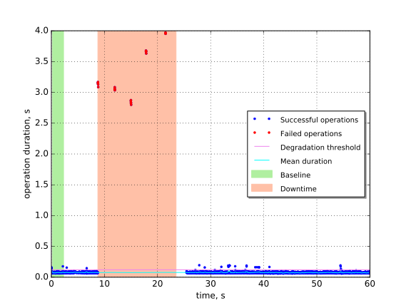

Keystone authentication with kill of MySQL on one node
======================================================

This report is generated on results collected by execution of the following
Rally scenario:

.. code-block:: yaml

    ---
      Authenticate.keystone:
        -
          runner:
            type: "constant_for_duration"
            duration: 60
            concurrency: 5
          context:
            users:
              tenants: 1
              users_per_tenant: 1
          hooks:
            -
              name: fault_injection
              args:
                action: kill mysql service on one node
              trigger:
                name: event
                args:
                  unit: iteration
                  at: [150]
    

Summary
-------

In this scenario we kill one of MySQL servers while working with Keystone API.
In Fuel architecture MySQL is deployed with Galera in active-active mode,
however Keystone looses connection to DB with the following traces::

    (_mysql_exceptions.OperationalError) (2013, "Lost connection to MySQL
    server at 'reading initial communication packet', system error: 0")

+-----------------------+-----------+---------------------------------------+-------------------------------------------+
| Service downtime, s   | MTTR, s   | Absolute performance degradation, s   | Relative performance degradation, ratio   |
+=======================+===========+=======================================+===========================================+
| 14.7 ±1.4             | N/A       | N/A                                   | N/A                                       |
+-----------------------+-----------+---------------------------------------+-------------------------------------------+

Metrics:
    * `Service downtime` is the time interval between the first and
      the last errors.
    * `MTTR` is the mean time to recover service performance after
      the fault.
    * `Absolute performance degradation` is an absolute difference between
      the mean of operation duration during recovery period and the baseline's.
    * `Relative performance degradation` is the ratio between the mean
      of operation duration during recovery period and the baseline's.

Details
-------

This section contains individual data for particular scenario runs.

Run #1
^^^^^^

Baseline
~~~~~~~~

Baseline samples are collected before the start of fault injection. They are
used to estimate service performance degradation after the fault.

+-----------+-------------+-----------+-----------+---------------------+
|   Samples |   Median, s |   Mean, s |   Std dev |   95% percentile, s |
+===========+=============+===========+===========+=====================+
|       135 |       0.071 |     0.074 |     0.012 |                0.09 |
+-----------+-------------+-----------+-----------+---------------------+

Service downtime
~~~~~~~~~~~~~~~~

The tested service is not available during the following time period(s).

+-----+---------------+
|   # | Downtime, s   |
+=====+===============+
|   1 | 14.7 ±2.0     |
+-----+---------------+

