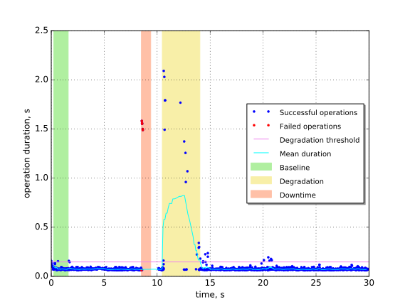
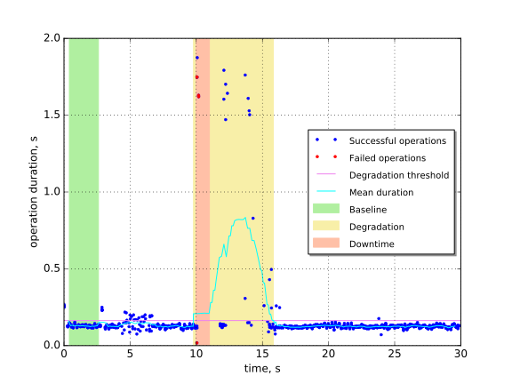
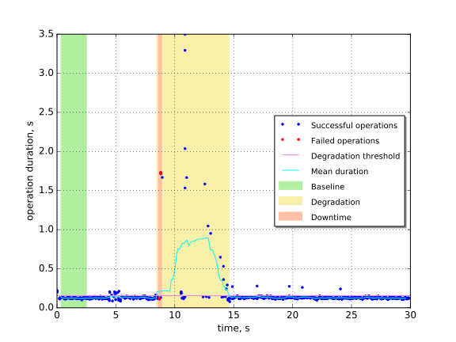
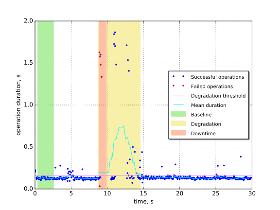
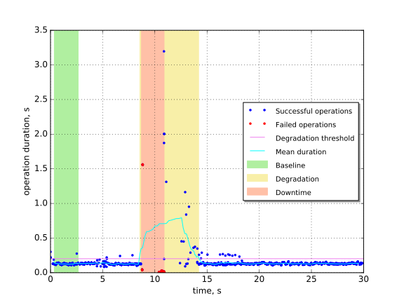

Keystone authentication with Keystone API restart on one node
=============================================================

This report is generated on results collected by execution of the following
Rally scenario:

.. code-block:: yaml

    ---
    
      Authenticate.keystone:
    
        -
          runner:
            type: "constant_for_duration"
            duration: 30
            concurrency: 5
          context:
            users:
              tenants: 1
              users_per_tenant: 1
          hooks:
            -
              name: fault_injection
              args:
                action: restart keystone service on one node
              trigger:
                name: event
                args:
                  unit: iteration
                  at: [100]
    
    

Summary
-------

In Fuel architecture Keystone is deployed behind Apache2, which in turn are
behind NGINX front-end. In this scenario we restart Apache2 service, as result
Keystone becomes unavailable on one of controller nodes.

+-----------------------+------------+---------------------------------------+-------------------------------------------+
| Service downtime, s   | MTTR, s    | Absolute performance degradation, s   | Relative performance degradation, ratio   |
+=======================+============+=======================================+===========================================+
| 1.07 ±0.76            | 5.44 ±0.47 | 0.41 ±0.22                            | 4.7 ±2.0                                  |
+-----------------------+------------+---------------------------------------+-------------------------------------------+

Metrics:
    * `Service downtime` is the time interval between the first and
      the last errors.
    * `MTTR` is the mean time to recover service performance after
      the fault.
    * `Absolute performance degradation` is an absolute difference between
      the mean of operation duration during recovery period and the baseline's.
    * `Relative performance degradation` is the ratio between the mean
      of operation duration during recovery period and the baseline's.

Details
-------

This section contains individual data for particular scenario runs.

Run #1
^^^^^^

Baseline
~~~~~~~~

Baseline samples are collected before the start of fault injection. They are
used to estimate service performance degradation after the fault.

+-----------+-------------+-----------+-----------+---------------------+
|   Samples |   Median, s |   Mean, s |   Std dev |   95% percentile, s |
+===========+=============+===========+===========+=====================+
|        84 |       0.071 |     0.077 |     0.017 |                0.13 |
+-----------+-------------+-----------+-----------+---------------------+

Service downtime
~~~~~~~~~~~~~~~~

The tested service is not available during the following time period(s).

+-----+---------------+
|   # | Downtime, s   |
+=====+===============+
|   1 | 0.88 ±0.75    |
+-----+---------------+

Service performance degradation
~~~~~~~~~~~~~~~~~~~~~~~~~~~~~~~

The tested service has measurable performance degradation during the
following time period(s).

+-----+----------------------+---------------------------+------------------------+
|   # | Time to recover, s   | Absolute degradation, s   | Relative degradation   |
+=====+======================+===========================+========================+
|   1 | 3.549 ±0.034         | 0.51 ±0.25                | 7.6 ±3.3               |
+-----+----------------------+---------------------------+------------------------+

Run #2
^^^^^^

Baseline
~~~~~~~~

Baseline samples are collected before the start of fault injection. They are
used to estimate service performance degradation after the fault.

+-----------+-------------+-----------+-----------+---------------------+
|   Samples |   Median, s |   Mean, s |   Std dev |   95% percentile, s |
+===========+=============+===========+===========+=====================+
|        84 |        0.13 |      0.13 |    0.0086 |                0.14 |
+-----------+-------------+-----------+-----------+---------------------+

Service downtime
~~~~~~~~~~~~~~~~

The tested service is not available during the following time period(s).

+-----+---------------+
|   # | Downtime, s   |
+=====+===============+
|   1 | 1.00 ±0.87    |
+-----+---------------+

Service performance degradation
~~~~~~~~~~~~~~~~~~~~~~~~~~~~~~~

The tested service has measurable performance degradation during the
following time period(s).

+-----+----------------------+---------------------------+------------------------+
|   # | Time to recover, s   | Absolute degradation, s   | Relative degradation   |
+=====+======================+===========================+========================+
|   1 | 6.038 ±0.034         | 0.35 ±0.17                | 3.7 ±1.3               |
+-----+----------------------+---------------------------+------------------------+

Run #3
^^^^^^

Baseline
~~~~~~~~

Baseline samples are collected before the start of fault injection. They are
used to estimate service performance degradation after the fault.

+-----------+-------------+-----------+-----------+---------------------+
|   Samples |   Median, s |   Mean, s |   Std dev |   95% percentile, s |
+===========+=============+===========+===========+=====================+
|        84 |        0.13 |      0.12 |    0.0077 |                0.14 |
+-----------+-------------+-----------+-----------+---------------------+

Service downtime
~~~~~~~~~~~~~~~~

The tested service is not available during the following time period(s).

+-----+---------------+
|   # | Downtime, s   |
+=====+===============+
|   1 | 0.26 ±0.12    |
+-----+---------------+

Service performance degradation
~~~~~~~~~~~~~~~~~~~~~~~~~~~~~~~

The tested service has measurable performance degradation during the
following time period(s).

+-----+----------------------+---------------------------+------------------------+
|   # | Time to recover, s   | Absolute degradation, s   | Relative degradation   |
+=====+======================+===========================+========================+
|   1 | 6.123 ±0.037         | 0.43 ±0.25                | 4.4 ±2.0               |
+-----+----------------------+---------------------------+------------------------+

Run #4
^^^^^^

Baseline
~~~~~~~~

Baseline samples are collected before the start of fault injection. They are
used to estimate service performance degradation after the fault.

+-----------+-------------+-----------+-----------+---------------------+
|   Samples |   Median, s |   Mean, s |   Std dev |   95% percentile, s |
+===========+=============+===========+===========+=====================+
|        84 |        0.13 |      0.13 |    0.0089 |                0.14 |
+-----------+-------------+-----------+-----------+---------------------+

Service downtime
~~~~~~~~~~~~~~~~

The tested service is not available during the following time period(s).

+-----+---------------+
|   # | Downtime, s   |
+=====+===============+
|   1 | 1.02 ±0.73    |
+-----+---------------+

Service performance degradation
~~~~~~~~~~~~~~~~~~~~~~~~~~~~~~~

The tested service has measurable performance degradation during the
following time period(s).

+-----+----------------------+---------------------------+------------------------+
|   # | Time to recover, s   | Absolute degradation, s   | Relative degradation   |
+=====+======================+===========================+========================+
|   1 | 5.860 ±0.027         | 0.25 ±0.13                | 2.9 ±1.1               |
+-----+----------------------+---------------------------+------------------------+

Run #5
^^^^^^

Baseline
~~~~~~~~

Baseline samples are collected before the start of fault injection. They are
used to estimate service performance degradation after the fault.

+-----------+-------------+-----------+-----------+---------------------+
|   Samples |   Median, s |   Mean, s |   Std dev |   95% percentile, s |
+===========+=============+===========+===========+=====================+
|        87 |        0.13 |      0.13 |     0.019 |                0.14 |
+-----------+-------------+-----------+-----------+---------------------+

Service downtime
~~~~~~~~~~~~~~~~

The tested service is not available during the following time period(s).

+-----+---------------+
|   # | Downtime, s   |
+=====+===============+
|   1 | 2.173 ±0.067  |
+-----+---------------+

Service performance degradation
~~~~~~~~~~~~~~~~~~~~~~~~~~~~~~~

The tested service has measurable performance degradation during the
following time period(s).

+-----+----------------------+---------------------------+------------------------+
|   # | Time to recover, s   | Absolute degradation, s   | Relative degradation   |
+=====+======================+===========================+========================+
|   1 | 5.630 ±0.048         | 0.52 ±0.30                | 5.0 ±2.3               |
+-----+----------------------+---------------------------+------------------------+

