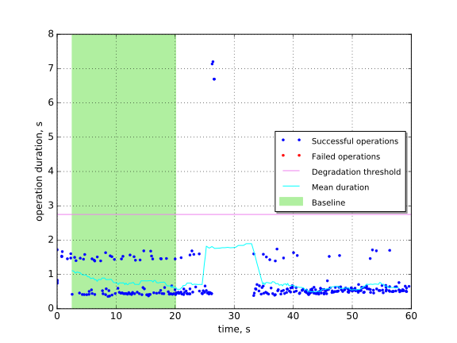
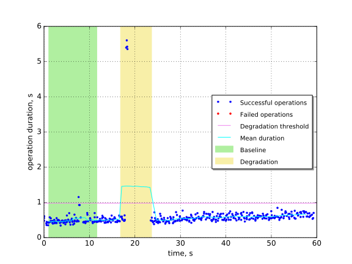
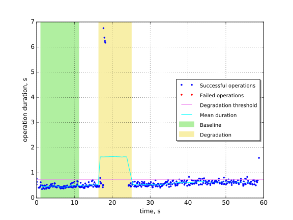

Create and list networks with kill of one of MySQL servers
==========================================================

This report is generated on results collected by execution of the following
Rally scenario:

.. code-block:: yaml

    ---
    
      NeutronNetworks.create_and_list_networks:
    
        -
          args:
            network_create_args: {}
          runner:
            type: "constant_for_duration"
            duration: 60
            concurrency: 4
          context:
            users:
              tenants: 1
              users_per_tenant: 1
            quotas:
              neutron:
                network: -1
          hooks:
            -
              name: fault_injection
              args:
                action: kill mysql service on one node
              trigger:
                name: event
                args:
                  unit: iteration
                  at: [100]
    
    

Summary
-------

In this scenario we kill one of MySQL servers while working with Neutron API.
In Fuel architecture MySQL is deployed with Galera in active-active mode, thus
no dramatic impact should occur.

+-----------------------+------------+---------------------------------------+-------------------------------------------+
| Service downtime, s   | MTTR, s    | Absolute performance degradation, s   | Relative performance degradation, ratio   |
+=======================+============+=======================================+===========================================+
| N/A                   | 7.73 ±0.72 | 1.4 ±1.1                              | 3.8 ±2.3                                  |
+-----------------------+------------+---------------------------------------+-------------------------------------------+

Metrics:
    * `Service downtime` is the time interval between the first and
      the last errors.
    * `MTTR` is the mean time to recover service performance after
      the fault.
    * `Absolute performance degradation` is an absolute difference between
      the mean of operation duration during recovery period and the baseline's.
    * `Relative performance degradation` is the ratio between the mean
      of operation duration during recovery period and the baseline's.

Details
-------

This section contains individual data for particular scenario runs.

Run #1
^^^^^^

Baseline
~~~~~~~~

Baseline samples are collected before the start of fault injection. They are
used to estimate service performance degradation after the fault.

+-----------+-------------+-----------+-----------+---------------------+
|   Samples |   Median, s |   Mean, s |   Std dev |   95% percentile, s |
+===========+=============+===========+===========+=====================+
|        86 |        0.48 |       0.8 |      0.49 |                 1.6 |
+-----------+-------------+-----------+-----------+---------------------+

Run #2
^^^^^^

Baseline
~~~~~~~~

Baseline samples are collected before the start of fault injection. They are
used to estimate service performance degradation after the fault.

+-----------+-------------+-----------+-----------+---------------------+
|   Samples |   Median, s |   Mean, s |   Std dev |   95% percentile, s |
+===========+=============+===========+===========+=====================+
|        85 |        0.46 |       0.5 |      0.12 |                 0.7 |
+-----------+-------------+-----------+-----------+---------------------+

Service performance degradation
~~~~~~~~~~~~~~~~~~~~~~~~~~~~~~~

The tested service has measurable performance degradation during the
following time period(s).

+-----+----------------------+---------------------------+------------------------+
|   # | Time to recover, s   | Absolute degradation, s   | Relative degradation   |
+=====+======================+===========================+========================+
|   1 | 6.824 ±0.093         | 1.5 ±1.2                  | 4.1 ±2.5               |
+-----+----------------------+---------------------------+------------------------+

Run #3
^^^^^^

Baseline
~~~~~~~~

Baseline samples are collected before the start of fault injection. They are
used to estimate service performance degradation after the fault.

+-----------+-------------+-----------+-----------+---------------------+
|   Samples |   Median, s |   Mean, s |   Std dev |   95% percentile, s |
+===========+=============+===========+===========+=====================+
|        85 |        0.45 |      0.47 |     0.065 |                0.61 |
+-----------+-------------+-----------+-----------+---------------------+

Service performance degradation
~~~~~~~~~~~~~~~~~~~~~~~~~~~~~~~

The tested service has measurable performance degradation during the
following time period(s).

+-----+----------------------+---------------------------+------------------------+
|   # | Time to recover, s   | Absolute degradation, s   | Relative degradation   |
+=====+======================+===========================+========================+
|   1 | 8.63 ±0.12           | 1.18 ±1.00                | 3.5 ±2.1               |
+-----+----------------------+---------------------------+------------------------+

