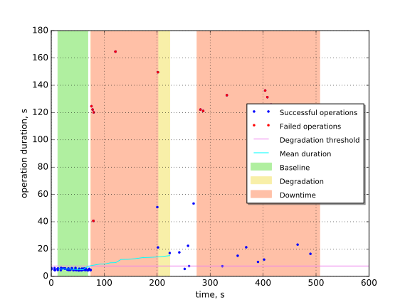

Boot and delete VM with disabling management network on one of controllers
==========================================================================

This report is generated on results collected by execution of the following
Rally scenario:

.. code-block:: yaml

    ---
      NovaServers.boot_and_delete_server:
        -
          args:
            flavor:
                name: "m1.micro"
            image:
                name: "(^cirros.*uec$|TestVM)"
            force_delete: false
          runner:
            type: "constant_for_duration"
            duration: 600
            concurrency: 4
          context:
            users:
              tenants: 1
              users_per_tenant: 1
          hooks:
            -
              name: fault_injection
              args:
                action: disconnect management network on one node with nova-scheduler service
              trigger:
                name: event
                args:
                  unit: iteration
                  at: [50]
    

Summary
-------

In this scenario we disable management network interface on one of controllers
(in Fuel architecture controller runs DB, MQ, API services, scheduler).
This emulates the case with networking outage (network port failure on machine
or switch).

The outage causes all services to become unreachable from outside. Moreover,
the cluster remains broken even 10 minutes after the fault.

+-----------------------+------------+---------------------------------------+-------------------------------------------+
| Service downtime, s   | MTTR, s    | Absolute performance degradation, s   | Relative performance degradation, ratio   |
+=======================+============+=======================================+===========================================+
| 358.0 ±2.7            | 149.0 ±2.1 | 24 ±17                                | 5.7 ±3.4                                  |
+-----------------------+------------+---------------------------------------+-------------------------------------------+

Metrics:
    * `Service downtime` is the time interval between the first and
      the last errors.
    * `MTTR` is the mean time to recover service performance after
      the fault.
    * `Absolute performance degradation` is an absolute difference between
      the mean of operation duration during recovery period and the baseline's.
    * `Relative performance degradation` is the ratio between the mean
      of operation duration during recovery period and the baseline's.

Details
-------

This section contains individual data for particular scenario runs.

Run #1
^^^^^^

Baseline
~~~~~~~~

Baseline samples are collected before the start of fault injection. They are
used to estimate service performance degradation after the fault.

+-----------+-------------+-----------+-----------+---------------------+
|   Samples |   Median, s |   Mean, s |   Std dev |   95% percentile, s |
+===========+=============+===========+===========+=====================+
|        36 |         5.5 |       5.2 |       0.6 |                   6 |
+-----------+-------------+-----------+-----------+---------------------+

Service downtime
~~~~~~~~~~~~~~~~

The tested service is not available during the following time period(s).

+-----+---------------+
|   # | Downtime, s   |
+=====+===============+
|   1 | 126.32 ±0.82  |
+-----+---------------+
|   2 | 231.7 ±6.5    |
+-----+---------------+

Service performance degradation
~~~~~~~~~~~~~~~~~~~~~~~~~~~~~~~

The tested service has measurable performance degradation during the
following time period(s).

+-----+----------------------+---------------------------+------------------------+
|   # | Time to recover, s   | Absolute degradation, s   | Relative degradation   |
+=====+======================+===========================+========================+
|   1 | 149.0 ±4.6           | 24 ±17                    | 5.7 ±3.4               |
+-----+----------------------+---------------------------+------------------------+

