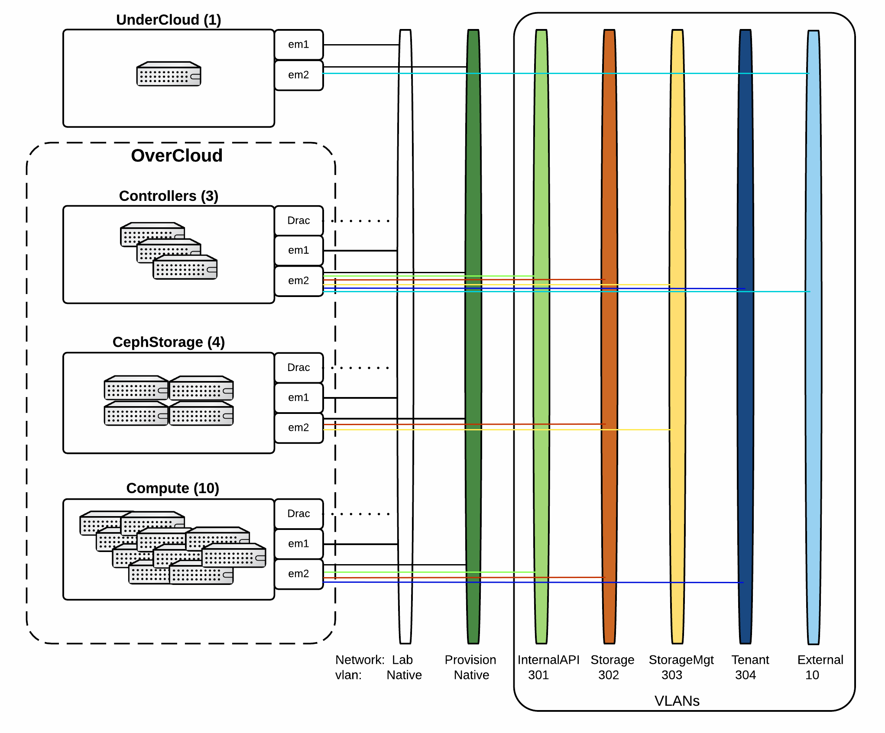
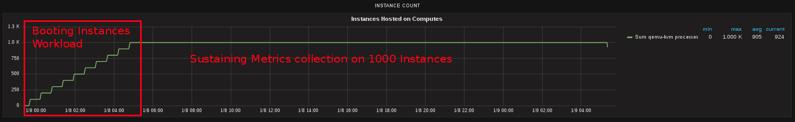
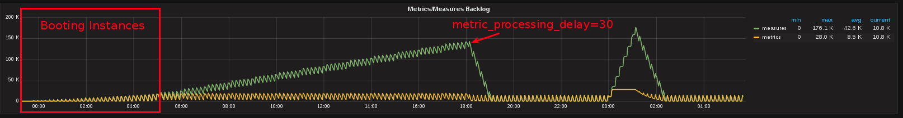
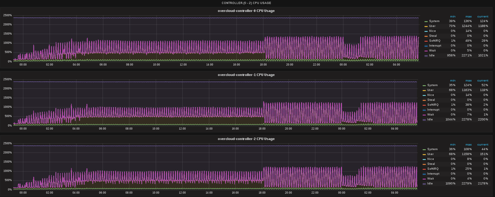
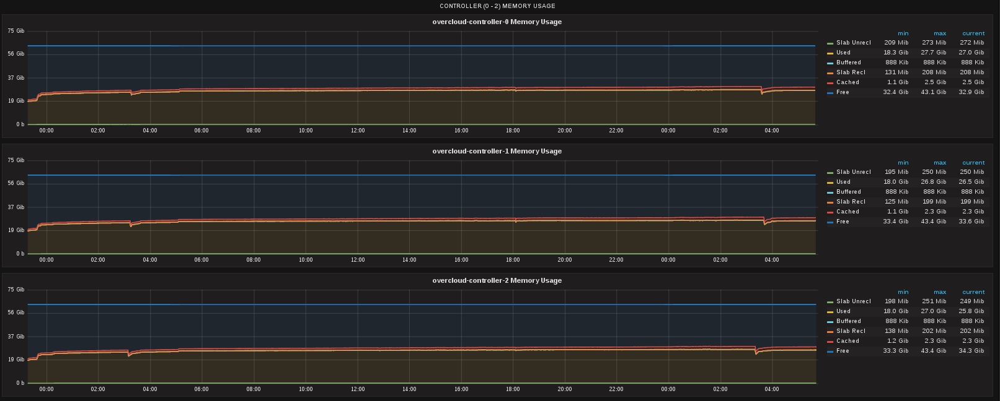
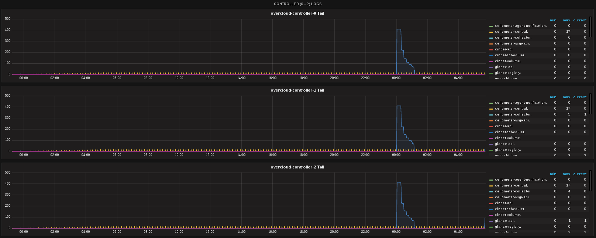
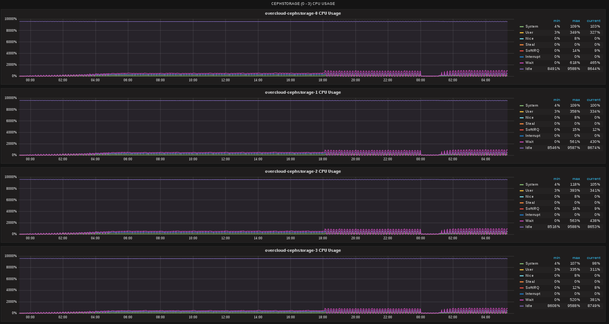
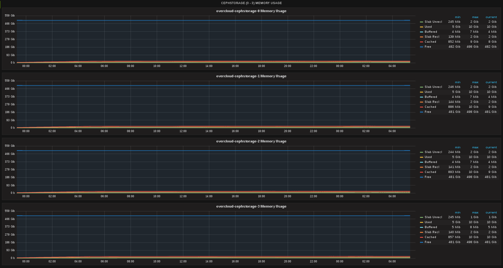
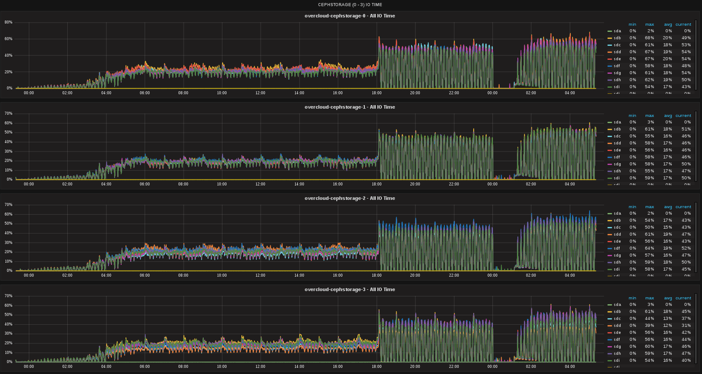

.. _telemetry_gnocchi_with_ceph_report_1k_instances:

===================================================================================================
Telemetry Services resource consumption/scalability test results on Gnocchi with CephStorage driver
===================================================================================================

This report is generated for :ref:`telemetry_scale` test plan.

Test Environment
----------------

Environment description
^^^^^^^^^^^^^^^^^^^^^^^
The environment description includes hardware specs, software versions, tunings
and configuration of the OpenStack Cloud under test.

Hardware
~~~~~~~~
Deployment node (Undercloud) (1 Machine)

+-----------+------------------------------------------------------------+
| Parameter | Value                                                      |
+-----------+------------------------------------------------------------+
| model     | Dell PowerEdge r620                                        |
+-----------+------------------------------------------------------------+
| CPU       | 2xIntel(R) Xeon(R) E5-2620v2 @ 2.10GHz (12Cores/24Threads) |
+-----------+------------------------------------------------------------+
| Memory    | 8x8192MiB - 64GiB (@1333MHz)                               |
+-----------+------------------------------------------------------------+
| RAID Cont | PERC H710 Mini Embedded (512MB Cache)                      |
+-----------+------------------------------------------------------------+
| Disk      | 2 x 1TB 7.2K SATA Drive in RAID 1                          |
+-----------+------------------------------------------------------------+
| Network   | 2x1Gb/s Integrated(Offline), 2x10Gb/s Intel x520           |
+-----------+------------------------------------------------------------+

Controller (3 Machines)

+-----------+------------------------------------------------------------+
| Parameter | Value                                                      |
+-----------+------------------------------------------------------------+
| model     | Dell PowerEdge r620                                        |
+-----------+------------------------------------------------------------+
| CPU       | 2xIntel(R) Xeon(R) E5-2620 @ 2.00GHz (12Cores/24Threads)   |
+-----------+------------------------------------------------------------+
| Memory    | 8x8192MiB - 64GiB (@1333MHz)                               |
+-----------+------------------------------------------------------------+
| RAID Cont | PERC H710 Mini Embedded (1024MB Cache)                     |
+-----------+------------------------------------------------------------+
| Disk      | 2 x 1TB 7.2K SATA Drive in RAID 1                          |
+-----------+------------------------------------------------------------+
| Network   | 2x1Gb/s Integrated(Offline), 2x10Gb/s Intel x520           |
+-----------+------------------------------------------------------------+

Compute (10 Machines)

+-----------+------------------------------------------------------------+
| Parameter | Value                                                      |
+-----------+------------------------------------------------------------+
| model     | Dell PowerEdge r620                                        |
+-----------+------------------------------------------------------------+
| CPU       | 2xIntel(R) Xeon(R) E5-2620 @ 2.00GHz (12Cores/24Threads)   |
+-----------+------------------------------------------------------------+
| Memory    | 8x8192MiB - 64GiB (@1333MHz)                               |
+-----------+------------------------------------------------------------+
| RAID Cont | PERC H710 Mini Embedded (1024MB Cache)                     |
+-----------+------------------------------------------------------------+
| Disk      | 2 x 1TB 7.2K SATA Drive in RAID 1                          |
+-----------+------------------------------------------------------------+
| Network   | 2x1Gb/s Integrated(Offline), 2x10Gb/s Intel x520           |
+-----------+------------------------------------------------------------+

CephStorage (4 Machines)

+-----------+------------------------------------------------------------+
| Parameter | Value                                                      |
+-----------+------------------------------------------------------------+
| model     | Dell PowerEdge r930                                        |
+-----------+------------------------------------------------------------+
| CPU       | 4xIntel(R) Xeon(R) E7-4830v3 @ 2.10GHz (48Cores/96Threads) |
+-----------+------------------------------------------------------------+
| Memory    | 32x16384MiB - 512GiB (@1333MHz)                            |
+-----------+------------------------------------------------------------+
| RAID Cont | PERC H730P Adapter (2048MB Cache)                          |
+-----------+------------------------------------------------------------+
| Disk      | 9 x 300GB 10K SAS Drives each in Single RAID 0 (JBOD)      |
|           | 1xOS Disk, 7xOSDs with co-hosted journal                   |
+-----------+------------------------------------------------------------+
| Network   | 2x1Gb/s Integrated(Offline), 2x10Gb/s Intel x520 Integrated|
|           | 2x10Gb/s Intel x520 Adapter                                |
+-----------+------------------------------------------------------------+

Additional Hardware for testing/monitoring/results

- Performance Monitoring Host (Carbon/Graphite/Grafana)

Software
~~~~~~~~

Versions:

- ceph-base-10.2.3-13.el7cp.x86_64
- ceph-common-10.2.3-13.el7cp.x86_64
- ceph-mon-10.2.3-13.el7cp.x86_64
- ceph-osd-10.2.3-13.el7cp.x86_64
- ceph-radosgw-10.2.3-13.el7cp.x86_64
- ceph-selinux-10.2.3-13.el7cp.x86_64
- libcephfs1-10.2.3-13.el7cp.x86_64
- openstack-ceilometer-api-7.0.0-4.el7ost.noarch
- openstack-ceilometer-central-7.0.0-4.el7ost.noarch
- openstack-ceilometer-collector-7.0.0-4.el7ost.noarch
- openstack-ceilometer-common-7.0.0-4.el7ost.noarch
- openstack-ceilometer-compute-7.0.0-4.el7ost.noarch
- openstack-ceilometer-notification-7.0.0-4.el7ost.noarch
- openstack-ceilometer-polling-7.0.0-4.el7ost.noarch
- openstack-cinder-9.0.0-13.el7ost.noarch
- openstack-glance-13.0.0-1.el7ost.noarch
- openstack-gnocchi-api-3.0.2-1.el7ost.noarch
- openstack-gnocchi-carbonara-3.0.2-1.el7ost.noarch
- openstack-gnocchi-common-3.0.2-1.el7ost.noarch
- openstack-gnocchi-indexer-sqlalchemy-3.0.2-1.el7ost.noarch
- openstack-gnocchi-metricd-3.0.2-1.el7ost.noarch
- openstack-gnocchi-statsd-3.0.2-1.el7ost.noarch
- openstack-heat-api-7.0.0-7.el7ost.noarch
- openstack-heat-api-cfn-7.0.0-7.el7ost.noarch
- openstack-heat-api-cloudwatch-7.0.0-7.el7ost.noarch
- openstack-heat-common-7.0.0-7.el7ost.noarch
- openstack-heat-engine-7.0.0-7.el7ost.noarch
- openstack-keystone-10.0.0-3.el7ost.noarch
- openstack-neutron-9.1.0-7.el7ost.noarch
- openstack-neutron-bigswitch-agent-9.40.0-1.1.el7ost.noarch
- openstack-neutron-bigswitch-lldp-9.40.0-1.1.el7ost.noarch
- openstack-neutron-common-9.1.0-7.el7ost.noarch
- openstack-neutron-lbaas-9.1.0-1.el7ost.noarch
- openstack-neutron-metering-agent-9.1.0-7.el7ost.noarch
- openstack-neutron-ml2-9.1.0-7.el7ost.noarch
- openstack-neutron-openvswitch-9.1.0-7.el7ost.noarch
- openstack-neutron-sriov-nic-agent-9.1.0-7.el7ost.noarch
- openstack-nova-api-14.0.2-7.el7ost.noarch
- openstack-nova-cert-14.0.2-7.el7ost.noarch
- openstack-nova-common-14.0.2-7.el7ost.noarch
- openstack-nova-compute-14.0.2-7.el7ost.noarch
- openstack-nova-conductor-14.0.2-7.el7ost.noarch
- openstack-nova-console-14.0.2-7.el7ost.noarch
- openstack-nova-novncproxy-14.0.2-7.el7ost.noarch
- openstack-nova-scheduler-14.0.2-7.el7ost.noarch
- openstack-swift-plugin-swift3-1.11.0-2.el7ost.noarch
- openstack-swift-proxy-2.10.0-6.el7ost.noarch
- openstack-swift-container-2.10.0-6.el7ost.noarch
- openstack-swift-object-2.10.0-6.el7ost.noarch
- openstack-swift-account-2.10.0-6.el7ost.noarch

Tuning/Configuration
~~~~~~~~~~~~~~~~~~~~

+---------------------------+--------------------------------------------+
| Parameter                 | Value                                      |
+---------------------------+--------------------------------------------+
| Gnocchi Metricd Processes | 6 (Default)                                |
+---------------------------+--------------------------------------------+
| Gnocchi API Deployment    | Deployed in httpd                          |
+---------------------------+--------------------------------------------+
| Gnocchi API Process Count | 6 processes (Default)                      |
+---------------------------+--------------------------------------------+
| Gnocchi API Thread Count  | 1 thread per process (Default)             |
+---------------------------+--------------------------------------------+
| Gnocchi Storage Driver    | Ceph                                       |
+---------------------------+--------------------------------------------+
| Gnocchi Other             | metric_processing_delay = 60 (Default)     |
|                           | aggregation_workers_number = 1 (Default)   |
+---------------------------+--------------------------------------------+
| Ceilometer Dispatcher     | meter_dispatchers=gnocchi                  |
|                           | archive_policy=low                         |
+---------------------------+--------------------------------------------+
| Ceilometer Polling        | 600s (Default)                             |
+---------------------------+--------------------------------------------+
| Ceilometer Processes      | 1 ceilometer-agent-notification            |
|                           | 1 ceilometer-collector                     |
|                           | 1 ceilometer-polling                       |
+---------------------------+--------------------------------------------+
| Keystone Processes        | 24 admin, 24 main (Single thread/process)  |
+---------------------------+--------------------------------------------+
| Nova Processes            | 48 api, 24 conductor, 1 scheduler          |
+---------------------------+--------------------------------------------+
| Neutron Processes         | 24 api, 24 rpc, 24 metadata, 1 l3, 1 dhcp  |
+---------------------------+--------------------------------------------+
| Cinder Processes          | 24 api, 1 scheduler, 1 volume              |
+---------------------------+--------------------------------------------+
| Heat Processes            | 24 api, 24 cfn, 24 cloudwatch, 24 engine   |
+---------------------------+--------------------------------------------+
| Glance Processes          | 24 api, 24 registry                        |
+---------------------------+--------------------------------------------+
| Swift Processes           | 1 proxy, account, container, object server |
|                           | 1 for all other swift processes            |
+---------------------------+--------------------------------------------+
| Aodh Processes            | 1 evaluator, 1 listener, 1 notifier        |
+---------------------------+--------------------------------------------+

System Performance Monitoring
~~~~~~~~~~~~~~~~~~~~~~~~~~~~~
System performance metrics were recorded into a separate metrics
collection/storage/analysis system. Carbon, Graphite, and Grafana with
dashboards for monitoring system resource utilization was provided via
Browbeat.  Gnocchi's backlog was monitored using a collectd plugin to
query Gnocchi's status api. The plugin is available here
(https://github.com/akrzos/gnocchi-status-collectd)

Test Diagram
~~~~~~~~~~~~

Test Case 1
-----------

Description
^^^^^^^^^^^
Boot 100 persisting instances every 1800 seconds until 1000 instances booted
and running in OpenStack cloud.

Parameters

#. Amount of Instances to boot per period: 100 (5 concurrency at a time)
#. Amount of time to wait between booting periods: 1800s
#. Maximum number of instances: 1000

Stopping/Failure Conditions

- Max number of instances achieved
- Failure to boot instances
- Failure for Telemetry Services to consume metrics
- Other service failures/errors
- System out of Resources (ex. CPU 100% utilized)

Setup
^^^^^^^^

#. Deploy OpenStack Cloud
#. Install testing and monitoring tooling
#. Gather metadata on Cloud
#. Run test
#. Tune if necessary/possible

Analysis/Results
^^^^^^^^^^^^^^^^

Gnocchi with a Ceph Storage driver sustained collecting and processing metrics
on 1000 instances with tuning several parameters.

- Gnocchi - 48 metricd workers on each controller
- Gnocchi - metric_processing_delay = 30
- Ceph - 512 pgs for metrics pool (32 OSDs)

Through several experiments, the Gnocchi Metricd worker count was tuned at
deployment/installation rather than during or post workload initation.  At the
top end of the workload it was noticed just a little bit more processing
capacity was needed thus metric_processing_delay was decreased from 60s to 30s.
This improved the capacity and the backlog dropped quickly.  Ceph's pgs
were also tuned during the deployment timeframe and pgcalc was used to
determine the number of pgs for the given number of OSDs.  PGcalc is available
at http://ceph.com/pgcalc/

Resource Utilization Graphs

Instances

Gnocchi Status

CPU Utilization On Controllers

Memory Utilization on Controllers

Disk IO Utilization on Controllers

.. image:: content/controllers_disk.png
    :width: 600px

Error Logs on Controllers

CPU Utilization On CephStorage Nodes

Memory Utilization on CephStorage Nodes

Disk IO Utilization on CephStorage Nodes

Post running the test, it was found at exactly 00:00 UTC, Gnocchi is
performing additional work which caused its backlog to grow again. During this
timeframe there is less cpu utilization on the controllers and less disk IO
utilization on the Ceph storage nodes. Eventually it catchs back up but more
analysis will need to be done to determine exactly what Gnocchi was doing that
caused its backlog to grow at that specific timeframe.
